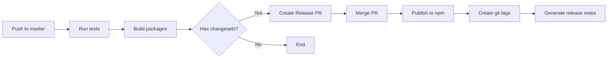

# npm 包发布指南

> **AIX 组件库 npm 发布完整指南**

## 📚 目录

- [发布前准备](#发布前准备)
- [发布流程](#发布流程)
- [版本管理](#版本管理)
- [npm Registry 配置](#npm-registry-配置)
- [CI/CD 自动化发布](#cicd-自动化发布)
- [发布后验证](#发布后验证)
- [回滚策略](#回滚策略)
- [常见问题](#常见问题)

---

## 发布前准备

### 1. 检查清单

在发布前，确保完成以下检查：

| 检查项 | 命令 | 说明 |
|--------|------|------|
| **代码检查** | `pnpm lint` | ESLint 检查通过 |
| **类型检查** | `pnpm type-check` | TypeScript 类型检查通过 |
| **测试** | `pnpm test` | 所有测试通过 |
| **测试覆盖率** | `pnpm test:coverage` | 覆盖率达到 80% 以上 |
| **构建** | `pnpm build` | 构建成功，无报错 |
| **文档** | `pnpm docs:build` | 文档构建成功 |
| **Changeset** | `pnpm changeset status` | 有待发布的 changesets |
| **Git 状态** | `git status` | 工作区干净，无未提交的修改 |

**一键检查脚本** (scripts/pre-publish.sh):

```bash
#!/bin/bash

echo "🔍 Running pre-publish checks..."

# 1. Lint 检查
echo "📝 Running lint..."
pnpm lint || { echo "❌ Lint failed"; exit 1; }

# 2. 类型检查
echo "🔍 Running type check..."
pnpm type-check || { echo "❌ Type check failed"; exit 1; }

# 3. 运行测试
echo "🧪 Running tests..."
pnpm test || { echo "❌ Tests failed"; exit 1; }

# 4. 检查测试覆盖率
echo "📊 Checking test coverage..."
pnpm test:coverage || { echo "❌ Coverage check failed"; exit 1; }

# 5. 构建
echo "🏗️ Building packages..."
pnpm build || { echo "❌ Build failed"; exit 1; }

# 6. 检查 Git 状态
echo "🔍 Checking git status..."
if [ -n "$(git status --porcelain)" ]; then
  echo "❌ Working directory is not clean"
  exit 1
fi

echo "✅ All pre-publish checks passed!"
```

### 2. npm 账号设置

```bash
# 登录 npm
npm login

# 查看当前登录用户
npm whoami

# 查看登录信息
npm config get registry
npm config get //registry.npmjs.org/:_authToken
```

### 3. 包访问权限

```bash
# 设置包为公开（组件库通常是公开的）
npm access public @aix/button

# 查看包的访问权限
npm access ls-packages @aix

# 为组织添加成员（需要 owner 权限）
npm owner add <username> @aix/button
```

---

## 发布流程

### 方法 1: Changesets 工作流（推荐）

**完整流程**:

```bash
# 步骤 1: 开发完成后，添加 changeset
pnpm changeset

# 交互式选择要发布的包和变更类型
? Which packages would you like to include?
  ◉ @aix/button
  ◯ @aix/input

? What kind of change is this for @aix/button?
  ◯ major (1.0.0 -> 2.0.0) - Breaking change
  ◉ minor (1.0.0 -> 1.1.0) - New feature
  ◯ patch (1.0.0 -> 1.0.1) - Bug fix

? Please enter a summary for this change:
  Add loading state support

# 步骤 2: 提交 changeset
git add .changeset/
git commit -m "chore: add changeset for button loading state"
git push

# 步骤 3: 版本提升（通常在发布分支或主分支）
pnpm changeset version

# 这会：
# - 更新 packages/button/package.json 版本号
# - 生成 packages/button/CHANGELOG.md
# - 删除 .changeset/*.md 文件

# 步骤 4: 提交版本变更
git add .
git commit -m "chore: release @aix/button@1.1.0"
git push

# 步骤 5: 构建所有包
pnpm build

# 步骤 6: 发布到 npm
pnpm changeset publish

# 步骤 7: 推送 git tags
git push --follow-tags
```

### 方法 2: 手动发布

```bash
# 步骤 1: 更新版本号
cd packages/button
npm version patch  # 或 minor, major

# 步骤 2: 构建
pnpm build

# 步骤 3: 发布
npm publish --access public

# 步骤 4: 推送 git tags
git push --follow-tags
```

### 发布单个包

```bash
# 使用 Changesets
pnpm changeset publish --filter @aix/button

# 手动发布
cd packages/button
npm publish --access public
```

### 发布多个包

```bash
# Changesets 会自动发布所有有变更的包
pnpm changeset publish

# 手动发布多个包
cd packages/button && npm publish --access public
cd packages/input && npm publish --access public
```

---

## 版本管理

### 语义化版本 (SemVer)

**格式**: `MAJOR.MINOR.PATCH` (例如: `1.2.3`)

| 版本类型 | 说明 | 示例 | 何时使用 |
|---------|------|------|---------|
| **Major** | 不兼容的 API 变更 | `1.0.0 -> 2.0.0` | 删除 API、修改 API 签名、Breaking Change |
| **Minor** | 向后兼容的新功能 | `1.0.0 -> 1.1.0` | 添加新 API、新功能、新 Props |
| **Patch** | 向后兼容的问题修复 | `1.0.0 -> 1.0.1` | Bug 修复、性能优化、文档更新 |

### Breaking Change 示例

```typescript
// ❌ Breaking Change (Major)
// v1.0.0
interface ButtonProps {
  type?: 'primary' | 'default';
}

// v2.0.0 - 删除了 'default' 类型
interface ButtonProps {
  type?: 'primary' | 'danger';  // Breaking!
}

// ✅ 非 Breaking Change (Minor)
// v1.0.0
interface ButtonProps {
  type?: 'primary' | 'default';
}

// v1.1.0 - 添加新类型
interface ButtonProps {
  type?: 'primary' | 'default' | 'danger';  // 向后兼容
}
```

### 版本发布策略

#### 1. 稳定版本 (Stable Release)

```bash
# 当前版本: 1.0.0
pnpm changeset version  # -> 1.1.0 (minor)
pnpm changeset publish
```

#### 2. 预发布版本 (Pre-release)

```bash
# 进入 pre-release 模式
pnpm changeset pre enter alpha

# 添加 changeset
pnpm changeset

# 版本提升
pnpm changeset version  # -> 1.1.0-alpha.0

# 发布预发布版本
pnpm changeset publish --tag alpha

# 退出 pre-release 模式
pnpm changeset pre exit
```

**预发布标签**:

| 标签 | 说明 | 使用场景 |
|------|------|---------|
| **alpha** | 内部测试版本 | 开发阶段，功能未完成 |
| **beta** | 公开测试版本 | 功能完成，需要广泛测试 |
| **rc** | 发布候选版本 | 准备正式发布，最后的测试 |

#### 3. 版本锁定 (Version Pinning)

```json
// 使用精确版本（不推荐，除非有特殊原因）
{
  "dependencies": {
    "@aix/button": "1.0.0"
  }
}

// 使用范围版本（推荐）
{
  "dependencies": {
    "@aix/button": "^1.0.0"  // 允许 1.x.x 的任何版本
  }
}
```

---

## npm Registry 配置

### 1. 默认 Registry

```bash
# 查看当前 registry
npm config get registry

# 设置为 npm 官方 registry
npm config set registry https://registry.npmjs.org/

# 设置为淘宝镜像（不用于发布）
npm config set registry https://registry.npmmirror.com/
```

### 2. Scoped Packages

```bash
# 为 @aix scope 设置 registry
npm config set @aix:registry https://registry.npmjs.org/

# 查看 scope registry
npm config get @aix:registry
```

### 3. 认证配置

**.npmrc** (项目根目录):

```ini
# 设置 registry
registry=https://registry.npmjs.org/

# 认证 token（不要提交到 Git）
//registry.npmjs.org/:_authToken=${NPM_TOKEN}

# Scoped packages
@aix:registry=https://registry.npmjs.org/

# 访问权限
access=public
```

**.npmrc** (用户目录 ~/.npmrc):

```ini
# 个人认证信息
//registry.npmjs.org/:_authToken=npm_xxxxxxxxxxxxx
```

### 4. 发布配置

**package.json**:

```json
{
  "name": "@aix/button",
  "version": "0.0.0",
  "publishConfig": {
    "access": "public",
    "registry": "https://registry.npmjs.org/"
  }
}
```

---

## CI/CD 自动化发布

### GitHub Actions 工作流

**.github/workflows/release.yml**:

```yaml
name: Release

on:
  push:
    branches:
      - master

concurrency: ${{ github.workflow }}-${{ github.ref }}

jobs:
  release:
    runs-on: ubuntu-latest
    steps:
      - name: Checkout
        uses: actions/checkout@v3
        with:
          fetch-depth: 0

      - name: Setup pnpm
        uses: pnpm/action-setup@v2
        with:
          version: 8

      - name: Setup Node.js
        uses: actions/setup-node@v3
        with:
          node-version: 18
          cache: 'pnpm'

      - name: Install dependencies
        run: pnpm install --frozen-lockfile

      - name: Run tests
        run: pnpm test

      - name: Build packages
        run: pnpm build

      - name: Create Release Pull Request or Publish
        id: changesets
        uses: changesets/action@v1
        with:
          publish: pnpm changeset publish
          version: pnpm changeset version
          commit: 'chore: release packages'
          title: 'chore: release packages'
        env:
          GITHUB_TOKEN: ${{ secrets.GITHUB_TOKEN }}
          NPM_TOKEN: ${{ secrets.NPM_TOKEN }}
```

### 工作流程



### 配置 GitHub Secrets

```bash
# 1. 生成 npm token
npm token create --read-only=false

# 2. 在 GitHub 仓库设置中添加 Secret
# Settings -> Secrets and variables -> Actions -> New repository secret
# Name: NPM_TOKEN
# Value: npm_xxxxxxxxxxxxxxxxxxxxxxxx
```

### 手动触发发布

**.github/workflows/manual-release.yml**:

```yaml
name: Manual Release

on:
  workflow_dispatch:
    inputs:
      package:
        description: 'Package to release (e.g., @aix/button)'
        required: true
      version:
        description: 'Version type (major, minor, patch)'
        required: true
        default: 'patch'

jobs:
  release:
    runs-on: ubuntu-latest
    steps:
      - uses: actions/checkout@v3

      - uses: pnpm/action-setup@v2
        with:
          version: 8

      - uses: actions/setup-node@v3
        with:
          node-version: 18
          cache: 'pnpm'

      - run: pnpm install --frozen-lockfile

      - run: pnpm build

      - name: Release package
        run: |
          cd packages/$(echo ${{ github.event.inputs.package }} | sed 's/@aix\///')
          npm version ${{ github.event.inputs.version }}
          npm publish --access public
        env:
          NODE_AUTH_TOKEN: ${{ secrets.NPM_TOKEN }}
```

---

## 发布后验证

### 1. 检查 npm 包

```bash
# 查看包信息
npm view @aix/button

# 查看包的所有版本
npm view @aix/button versions

# 查看最新版本
npm view @aix/button version

# 查看包的依赖
npm view @aix/button dependencies

# 下载包到本地查看
npm pack @aix/button
tar -xzf aix-button-1.0.0.tgz
```

### 2. 安装验证

```bash
# 在新项目中安装
mkdir test-install && cd test-install
npm init -y
npm install @aix/button

# 验证包内容
ls node_modules/@aix/button/

# 验证类型定义
cat node_modules/@aix/button/dist/index.d.ts
```

### 3. 功能验证

**创建测试项目** (test-app/):

```vue
<!-- test-app/src/App.vue -->
<template>
  <div>
    <AixButton type="primary" @click="handleClick">
      Click Me
    </AixButton>
  </div>
</template>

<script setup lang="ts">
import { AixButton } from '@aix/button';
import '@aix/button/style.css';

function handleClick() {
  console.log('Button clicked!');
}
</script>
```

```bash
# 运行测试项目
cd test-app
pnpm dev
```

### 4. 文档验证

```bash
# 访问 npm 包页面
https://www.npmjs.com/package/@aix/button

# 验证：
# - README 显示正常
# - 版本号正确
# - 依赖列表正确
# - 文件列表完整
```

### 5. 发布报告

**自动生成发布报告** (scripts/publish-report.sh):

```bash
#!/bin/bash

PACKAGE=$1
VERSION=$(npm view $PACKAGE version)

echo "📦 Package: $PACKAGE"
echo "📌 Version: $VERSION"
echo ""
echo "🔗 Links:"
echo "  npm: https://www.npmjs.com/package/$PACKAGE"
echo "  unpkg: https://unpkg.com/$PACKAGE@$VERSION/"
echo ""
echo "📊 Stats:"
echo "  Size: $(npm view $PACKAGE dist.unpackedSize | numfmt --to=iec)"
echo "  Dependencies: $(npm view $PACKAGE dependencies | wc -l)"
echo ""
echo "✅ Published successfully!"
```

---

## 回滚策略

### 1. 撤销发布（不推荐）

```bash
# ⚠️ 只能在发布后 24 小时内撤销
npm unpublish @aix/button@1.0.0

# ⚠️ 撤销整个包（慎用！）
npm unpublish @aix/button --force
```

**注意事项**:
- npm 不推荐使用 unpublish
- 只能在发布后 24 小时内撤销
- 撤销后无法再发布相同版本
- 影响已经安装该版本的用户

### 2. 发布修复版本（推荐）

```bash
# 步骤 1: 修复问题
# 编辑代码，修复 bug

# 步骤 2: 添加 changeset
pnpm changeset
# 选择 patch 类型

# 步骤 3: 版本提升
pnpm changeset version  # 1.0.0 -> 1.0.1

# 步骤 4: 发布修复版本
pnpm build
pnpm changeset publish
```

### 3. 废弃版本

```bash
# 标记版本为废弃（不删除）
npm deprecate @aix/button@1.0.0 "This version has a critical bug, please upgrade to 1.0.1"

# 废弃所有版本
npm deprecate @aix/button "Package is no longer maintained"

# 取消废弃
npm deprecate @aix/button@1.0.0 ""
```

### 4. 回退到上一个版本

**用户侧操作**:

```bash
# 安装上一个稳定版本
npm install @aix/button@1.0.0

# 锁定版本
{
  "dependencies": {
    "@aix/button": "1.0.0"
  }
}
```

### 5. 紧急修复流程

```bash
# 步骤 1: 创建 hotfix 分支
git checkout -b hotfix/button-critical-bug

# 步骤 2: 修复问题
# 编辑代码

# 步骤 3: 测试
pnpm test

# 步骤 4: 提交
git commit -m "fix(button): fix critical bug"

# 步骤 5: 合并到 master
git checkout master
git merge hotfix/button-critical-bug

# 步骤 6: 发布修复版本
pnpm changeset
pnpm changeset version
pnpm build
pnpm changeset publish

# 步骤 7: 通知用户
# 在 GitHub Release、社交媒体、官网发布公告
```

---

## 常见问题

### Q1: 发布失败：权限不足

**错误信息**:
```
npm ERR! code E403
npm ERR! 403 Forbidden - PUT https://registry.npmjs.org/@aix%2fbutton
```

**解决方案**:

```bash
# 1. 检查登录状态
npm whoami

# 2. 重新登录
npm logout
npm login

# 3. 检查包的访问权限
npm access ls-packages @aix

# 4. 设置包为公开
npm access public @aix/button

# 5. 确认有发布权限
npm owner ls @aix/button
```

### Q2: 版本号已存在

**错误信息**:
```
npm ERR! code E409
npm ERR! 409 Conflict - PUT https://registry.npmjs.org/@aix%2fbutton
npm ERR! Cannot publish over existing version.
```

**解决方案**:

```bash
# 1. 查看当前版本
npm view @aix/button version

# 2. 更新版本号
npm version patch  # 或 minor, major

# 3. 重新发布
npm publish
```

### Q3: 包含敏感信息

**问题**: 不小心发布了包含敏感信息（API key、密码）的版本。

**解决方案**:

```bash
# 1. 立即撤销发布（24 小时内）
npm unpublish @aix/button@1.0.0

# 2. 删除敏感信息
# 编辑代码，删除敏感信息

# 3. 更新 .gitignore 和 .npmignore
echo ".env" >> .gitignore
echo ".env" >> .npmignore

# 4. 发布新版本
npm version patch
npm publish

# 5. 撤销 Git 历史中的敏感信息
git filter-branch --force --index-filter \
  "git rm --cached --ignore-unmatch .env" \
  --prune-empty --tag-name-filter cat -- --all
```

### Q4: 发布后无法安装

**问题**: 发布成功，但 `npm install` 失败。

**检查清单**:

```bash
# 1. 检查包是否存在
npm view @aix/button

# 2. 检查 package.json 中的 main 和 module 字段
{
  "main": "./dist/index.cjs.js",  // 确保文件存在
  "module": "./dist/index.esm.js"
}

# 3. 检查 files 字段
{
  "files": ["dist", "README.md"]  // 确保包含必要文件
}

# 4. 检查依赖是否正确
{
  "peerDependencies": {
    "vue": "^3.3.0"  // 确保版本范围合理
  }
}

# 5. 本地测试
npm pack
tar -tzf aix-button-1.0.0.tgz  # 查看打包内容
```

### Q5: Changesets 未检测到变更

**问题**: 运行 `pnpm changeset version` 没有更新版本。

**解决方案**:

```bash
# 1. 检查是否有 changeset 文件
ls .changeset/

# 2. 手动添加 changeset
pnpm changeset

# 3. 检查 changeset 状态
pnpm changeset status

# 4. 如果没有变更，确认代码已提交
git status
git add .
git commit -m "feat: add new feature"
```

### Q6: 如何发布 Monorepo 中的单个包？

**A:**

```bash
# 方法 1: 使用 Changesets（推荐）
pnpm changeset
# 只选择要发布的包

pnpm changeset version
pnpm changeset publish

# 方法 2: 手动发布
cd packages/button
npm version patch
npm publish --access public

# 方法 3: 使用 --filter
pnpm --filter @aix/button exec npm publish --access public
```

### Q7: 如何处理跨包依赖的发布顺序？

**A:**

Changesets 会自动处理依赖顺序：

```bash
# 假设依赖关系：
# @aix/button depends on @aix/hooks

# Changesets 会按顺序发布：
# 1. @aix/hooks@1.1.0
# 2. @aix/button@1.0.1 (自动更新依赖为 @aix/hooks@^1.1.0)

pnpm changeset publish
```

### Q8: 发布后如何生成 GitHub Release？

**A:**

```bash
# 方法 1: 使用 GitHub CLI
gh release create v1.0.0 \
  --title "Release v1.0.0" \
  --notes "$(cat CHANGELOG.md)"

# 方法 2: 使用 GitHub Actions
# .github/workflows/release.yml
- name: Create GitHub Release
  uses: actions/create-release@v1
  env:
    GITHUB_TOKEN: ${{ secrets.GITHUB_TOKEN }}
  with:
    tag_name: v${{ steps.changeset.outputs.publishedVersion }}
    release_name: Release v${{ steps.changeset.outputs.publishedVersion }}
    body: ${{ steps.changeset.outputs.changelog }}
```

---

## 最佳实践

### 1. 发布前检查

- ✅ **运行完整测试**: 确保所有测试通过
- ✅ **检查构建产物**: 确保构建输出正确
- ✅ **Review Changelog**: 确保 changelog 准确描述变更
- ✅ **本地安装测试**: 使用 `npm pack` 本地测试

### 2. 版本管理

- ✅ **遵循 SemVer**: 严格遵循语义化版本规范
- ✅ **使用 Changesets**: 自动化版本管理和 changelog
- ✅ **预发布测试**: 重要变更先发布预发布版本
- ✅ **版本锁定**: 锁定关键依赖的版本

### 3. 安全性

- ✅ **检查敏感信息**: 确保不包含 .env、私钥等
- ✅ **使用 .npmignore**: 排除不必要的文件
- ✅ **审查依赖**: 定期审查和更新依赖
- ✅ **双因素认证**: 为 npm 账号启用 2FA

### 4. 自动化

- ✅ **CI/CD 集成**: 使用 GitHub Actions 自动发布
- ✅ **自动化测试**: 发布前自动运行测试
- ✅ **发布通知**: 发布成功后自动通知团队
- ✅ **文档同步**: 发布后自动更新文档网站

### 5. 回滚准备

- ✅ **保留历史版本**: 不轻易删除旧版本
- ✅ **标记废弃**: 使用 `npm deprecate` 而不是 `unpublish`
- ✅ **快速修复流程**: 建立紧急修复和发布流程
- ✅ **通知用户**: 重大问题及时通知用户

---

## 相关文档

- [npm 发布文档](https://docs.npmjs.com/cli/v9/commands/npm-publish)
- [Changesets 文档](https://github.com/changesets/changesets)
- [语义化版本规范](https://semver.org/lang/zh-CN/)
- [.claude/commands/release.md](../commands/release.md) - 发布命令
- [.claude/agents/project-structure.md](./project-structure.md) - 项目结构和 Monorepo 管理
