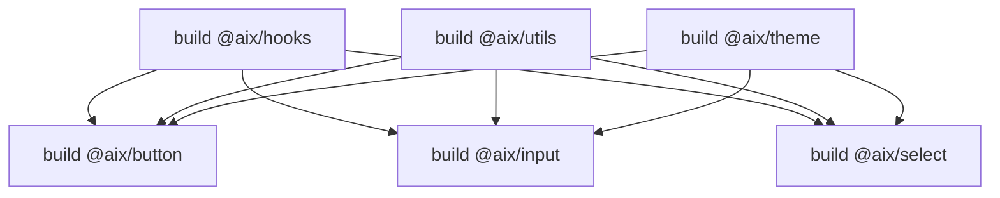

# AIX 组件库项目结构

> **AIX 组件库 Monorepo 架构管理完整指南**

## 📚 目录

- [项目结构概览](#项目结构概览)
- [pnpm Workspaces](#pnpm-workspaces)
- [Turborepo 构建系统](#turborepo-构建系统)
- [包管理](#包管理)
- [依赖管理](#依赖管理)
- [构建优化](#构建优化)
- [版本管理](#版本管理)
- [常见问题](#常见问题)

---

## 项目结构概览

### 📁 目录结构

```
aix/
├── .changeset/              # Changesets 配置
├── .claude/                 # Claude Code 配置
├── .husky/                  # Git hooks
├── .storybook/              # Storybook 全局配置
├── docs/                    # VitePress 文档
│   ├── .vitepress/         # VitePress 配置
│   └── components/         # 组件文档
├── internal/                # 内部工具包（不发布）
│   ├── eslint-config/      # ESLint 共享配置
│   ├── stylelint-config/   # Stylelint 共享配置
│   └── typescript-config/  # TypeScript 共享配置
├── packages/                # 组件包（发布）
│   ├── button/             # 组件包示例
│   ├── theme/              # 主题包（CSS 变量）
│   └── hooks/              # Hooks 包
├── scripts/                 # 构建脚本
├── package.json             # 根 package.json
├── pnpm-workspace.yaml      # pnpm workspace 配置
├── turbo.json               # Turborepo 配置
├── rollup.config.js         # Rollup 共享配置
├── vitest.config.ts         # Vitest 配置
└── tsconfig.json            # TypeScript 根配置
```

### 📦 包分类

| 类型 | 目录 | 包名前缀 | 发布 | 说明 |
|------|------|---------|------|------|
| **组件包** | `packages/button/` | `@aix/` | ✅ | 单个 UI 组件 |
| **工具包** | `packages/hooks/` | `@aix/` | ✅ | Composables、工具函数、指令 |
| **主题包** | `packages/theme/` | `@aix/` | ✅ | CSS 变量、主题样式 |
| **内部包** | `internal/eslint-config/` | `@kit/` | ❌ | ESLint、TypeScript、Stylelint 配置 |
| **文档** | `docs/` | - | ❌ | VitePress 文档站点 |
| **示例** | `examples/` | - | ❌ | 示例项目 |

### 📦 标准包结构

每个组件包遵循统一结构：

```
packages/button/
├── src/
│   ├── Button.vue          # 组件文件
│   ├── types.ts            # 类型定义
│   └── index.ts            # 导出文件
├── stories/
│   └── Button.stories.ts   # Storybook story
├── __tests__/
│   └── Button.test.ts      # 单元测试
├── package.json
├── tsconfig.json
└── rollup.config.js
```

### 🎨 特殊包

#### theme 包

提供 CSS 变量和样式基础：

```
packages/theme/
├── src/
│   ├── index.css           # 主入口
│   ├── variables.css       # CSS 变量定义
│   └── reset.css           # 样式重置
└── package.json
```

#### hooks 包

可复用的 Vue Composition API：

```
packages/hooks/
├── src/
│   ├── useClickOutside.ts
│   ├── useDebounce.ts
│   └── index.ts
└── package.json
```

### 📊 包依赖关系

```
theme (无依赖)
  ↑
  ├── button (依赖 theme)
  ├── select (依赖 theme)
  └── dialog (依赖 theme)

hooks (无依赖)
  ↑
  └── select (依赖 hooks)
```

**依赖原则：**
- theme 包无依赖（只提供 CSS）
- hooks 包无 UI 依赖（只依赖 Vue）
- 组件包可依赖 theme 和 hooks
- 避免循环依赖

---

## pnpm Workspaces

### 配置文件

**pnpm-workspace.yaml**:

```yaml
packages:
  # 所有发布的包
  - 'packages/*'
  # 内部工具包
  - 'internal/*'
  # 文档和示例（不发布）
  - 'docs'
  - 'examples/*'
```

### 常用命令

#### 1. 安装依赖

```bash
# 安装所有包的依赖
pnpm install

# 只安装根目录依赖
pnpm install --filter . eslint

# 为指定包安装依赖
pnpm --filter @aix/button add vue

# 为所有组件包安装依赖
pnpm --filter "@aix/*" add -D vitest
```

#### 2. 运行脚本

```bash
# 运行单个包的脚本
pnpm --filter @aix/button dev
pnpm --filter @aix/button build
pnpm --filter @aix/button test

# 运行多个包的脚本
pnpm --filter "@aix/{button,input}" build

# 运行所有包的脚本
pnpm -r build                    # 递归运行所有包
pnpm --parallel -r test          # 并行运行所有包的测试
```

#### 3. 包之间的依赖

```bash
# 添加 workspace 依赖
pnpm --filter @aix/select add @aix/input@workspace:*
pnpm --filter @aix/button add @aix/hooks@workspace:*

# 查看包依赖关系
pnpm list --depth 0
pnpm --filter @aix/button list
```

#### 4. 清理

```bash
# 清理所有 node_modules
pnpm -r exec rm -rf node_modules
pnpm install

# 清理构建产物
pnpm -r exec rm -rf dist

# 清理测试覆盖率
pnpm -r exec rm -rf coverage
```

### workspace 协议

**使用 `workspace:*` 引用内部包**:

```json
// packages/button/package.json
{
  "name": "@aix/button",
  "dependencies": {
    "@aix/hooks": "workspace:*",
    "@aix/utils": "workspace:*",
    "@aix/theme": "workspace:*"
  }
}
```

**发布时自动替换**:

```json
// 发布后自动替换为具体版本
{
  "name": "@aix/button",
  "dependencies": {
    "@aix/hooks": "^1.0.0",
    "@aix/utils": "^1.0.0",
    "@aix/theme": "^1.0.0"
  }
}
```

---

## Turborepo 构建系统

### 配置文件

**turbo.json**:

```json
{
  "$schema": "https://turbo.build/schema.json",
  "globalDependencies": [".env"],
  "pipeline": {
    "build": {
      "dependsOn": ["^build"],
      "outputs": ["dist/**"]
    },
    "test": {
      "dependsOn": ["build"],
      "outputs": ["coverage/**"]
    },
    "lint": {
      "outputs": []
    },
    "type-check": {
      "outputs": []
    },
    "dev": {
      "cache": false,
      "persistent": true
    }
  }
}
```

### 任务依赖



**`^build` 表示先构建依赖包**:

```json
{
  "pipeline": {
    "build": {
      "dependsOn": ["^build"],  // 先构建依赖包
      "outputs": ["dist/**"]
    }
  }
}
```

### 常用命令

```bash
# 构建所有包（按依赖顺序）
pnpm build

# 构建指定包及其依赖
pnpm --filter @aix/button build

# 并行运行测试
pnpm test

# 类型检查
pnpm type-check

# Lint 检查
pnpm lint

# 清除 Turbo 缓存
pnpm turbo clean
```

### 缓存机制

Turborepo 会缓存任务输出，加速构建：

```bash
# 首次构建（慢）
$ pnpm build
>>> @aix/hooks:build: cache miss, executing...
>>> @aix/button:build: cache miss, executing...
Time: 15s

# 再次构建（快）
$ pnpm build
>>> @aix/hooks:build: cache hit, replaying output...
>>> @aix/button:build: cache hit, replaying output...
Time: 0.5s
```

**禁用缓存**:

```bash
# 强制重新构建
pnpm build --force

# 配置中禁用缓存
{
  "pipeline": {
    "dev": {
      "cache": false  // 开发模式不缓存
    }
  }
}
```

---

## 包管理

### 创建新包

#### 1. 使用脚本创建

```bash
# 创建新的组件包
pnpm create:package tooltip

# 生成的结构
packages/tooltip/
├── src/
│   ├── Tooltip.vue
│   ├── types.ts
│   └── index.ts
├── __tests__/
│   └── Tooltip.test.ts
├── stories/
│   └── Tooltip.stories.ts
├── package.json
├── tsconfig.json
├── vite.config.ts
└── README.md
```

#### 2. 手动创建

**package.json 模板**:

```json
{
  "name": "@aix/tooltip",
  "version": "0.0.0",
  "description": "Tooltip component for AIX",
  "type": "module",
  "main": "./dist/index.cjs.js",
  "module": "./dist/index.esm.js",
  "types": "./dist/index.d.ts",
  "exports": {
    ".": {
      "import": "./dist/index.esm.js",
      "require": "./dist/index.cjs.js",
      "types": "./dist/index.d.ts"
    },
    "./style.css": "./dist/style.css"
  },
  "files": [
    "dist",
    "README.md"
  ],
  "scripts": {
    "dev": "vite",
    "build": "vite build && vue-tsc --declaration --emitDeclarationOnly --outDir dist",
    "test": "vitest",
    "test:coverage": "vitest --coverage"
  },
  "keywords": ["vue", "component", "tooltip", "aix"],
  "license": "MIT",
  "peerDependencies": {
    "vue": "^3.5.28"
  },
  "dependencies": {
    "@aix/hooks": "workspace:*",
    "@aix/utils": "workspace:*",
    "@aix/theme": "workspace:*"
  },
  "devDependencies": {
    "@vitejs/plugin-vue": "^5.0.0",
    "vite": "^5.0.0",
    "vitest": "^1.0.0",
    "vue-tsc": "^1.8.0"
  }
}
```

### 删除包

```bash
# 1. 删除包目录
rm -rf packages/tooltip

# 2. 更新依赖它的包
# 在其他包的 package.json 中移除 @aix/tooltip

# 3. 重新安装依赖
pnpm install

# 4. 重新构建
pnpm build
```

### 重命名包

```bash
# 1. 更新 package.json 的 name 字段
# packages/tooltip/package.json
{
  "name": "@aix/popover"  // 修改包名
}

# 2. 更新所有引用该包的地方
# 搜索并替换 "@aix/tooltip" → "@aix/popover"

# 3. 重新安装依赖
pnpm install

# 4. 重新构建
pnpm build
```

---

## 依赖管理

### 依赖类型

| 类型 | 字段 | 说明 | 示例 |
|------|------|------|------|
| **生产依赖** | `dependencies` | 运行时必需 | `vue`, `@aix/hooks` |
| **开发依赖** | `devDependencies` | 开发时必需 | `vite`, `vitest` |
| **对等依赖** | `peerDependencies` | 宿主项目提供 | `vue`, `react` |
| **可选依赖** | `optionalDependencies` | 可选安装 | 很少使用 |

### 依赖原则

#### 1. 组件包依赖

```json
{
  "name": "@aix/button",
  "peerDependencies": {
    "vue": "^3.5.28"  // Vue 由宿主项目提供
  },
  "dependencies": {
    "@aix/hooks": "workspace:*",  // 内部依赖
    "@aix/utils": "workspace:*",
    "@aix/theme": "workspace:*"
  },
  "devDependencies": {
    "vue": "^3.5.28",       // 开发时需要 Vue
    "vite": "^5.0.0",      // 构建工具
    "vitest": "^1.0.0"     // 测试工具
  }
}
```

#### 2. 工具包依赖

```json
{
  "name": "@aix/hooks",
  "peerDependencies": {
    "vue": "^3.5.28"
  },
  "dependencies": {
    // 通常没有依赖
  },
  "devDependencies": {
    "vue": "^3.5.28",
    "vite": "^5.0.0",
    "vitest": "^1.0.0"
  }
}
```

#### 3. 主题包依赖

```json
{
  "name": "@aix/theme",
  "dependencies": {
    // 纯 CSS 包，通常没有依赖
  },
  "devDependencies": {
    "vite": "^5.0.0"  // 构建 CSS
  }
}
```

### 依赖版本管理

#### 统一版本

**根 package.json 管理公共依赖**:

```json
{
  "devDependencies": {
    "vue": "^3.5.28",
    "vite": "^5.0.0",
    "vitest": "^1.0.0",
    "typescript": "^5.3.0"
  }
}
```

#### 版本范围

```json
{
  "dependencies": {
    "vue": "^3.5.28",      // 主版本锁定，允许次版本和补丁版本更新
    "lodash": "~4.17.0",  // 次版本锁定，只允许补丁版本更新
    "dayjs": "1.11.10"    // 精确版本，不允许更新
  }
}
```

### 依赖检查

```bash
# 检查过期依赖
pnpm outdated

# 检查过期依赖（递归）
pnpm -r outdated

# 更新依赖
pnpm update

# 更新依赖（递归）
pnpm -r update
```

---

## 构建优化

### Rollup 配置

**根配置（共享）**:

```javascript
// rollup.config.js
export function createRollupConfig(dirname) {
  return {
    input: `${dirname}/src/index.ts`,
    output: [
      { file: `${dirname}/dist/index.esm.js`, format: 'esm' },
      { file: `${dirname}/dist/index.cjs.js`, format: 'cjs' },
    ],
    external: ['vue'],
    plugins: [vue(), typescript(), postcss()],
  };
}
```

**包配置（引用）**:

```javascript
// packages/button/rollup.config.js
import { createRollupConfig } from '../../rollup.config.js';
export default createRollupConfig(import.meta.dirname);
```

### 并行构建

```bash
# Turborepo 自动并行构建（依赖包先构建）
pnpm build

# 手动控制并行度
pnpm build --concurrency=4
```

### 增量构建

```bash
# 只构建修改的包及其依赖者
pnpm --filter @aix/button build
```

### 构建产物

每个包的构建产物:

```
packages/button/dist/
├── index.esm.js         # ESM 格式 (import)
├── index.cjs.js         # CJS 格式 (require)
├── index.d.ts           # TypeScript 类型定义
├── style.css            # 样式文件
└── Button.vue.d.ts      # 组件类型定义
```

### 类型生成

```bash
# 生成类型定义
pnpm --filter @aix/button exec vue-tsc --declaration --emitDeclarationOnly

# 自动化类型生成（在 package.json 中）
{
  "scripts": {
    "build": "vite build && vue-tsc --declaration --emitDeclarationOnly --outDir dist"
  }
}
```

---

## 版本管理

### Changesets 工作流

AIX 使用 Changesets 管理版本和 changelog。

#### 1. 添加 Changeset

```bash
# 当你修改了代码后，添加 changeset
pnpm changeset

# 交互式选择
? Which packages would you like to include?
  ◉ @aix/button
  ◯ @aix/input
  ◯ @aix/select

? What kind of change is this for @aix/button?
  ◯ major (1.0.0 -> 2.0.0) - Breaking change
  ◉ minor (1.0.0 -> 1.1.0) - New feature
  ◯ patch (1.0.0 -> 1.0.1) - Bug fix

? Please enter a summary for this change:
  Add loading state support
```

#### 2. 生成 Changeset 文件

```markdown
<!-- .changeset/cool-lions-jump.md -->
---
'@aix/button': minor
---

Add loading state support
```

#### 3. 版本提升

```bash
# 应用所有 changesets，更新版本号和 CHANGELOG
pnpm changeset version

# 结果：
# - 更新 packages/button/package.json 版本号
# - 生成 packages/button/CHANGELOG.md
# - 删除 .changeset/*.md 文件
```

#### 4. 发布

```bash
# 构建所有包
pnpm build

# 发布到 npm
pnpm changeset publish

# 推送 git tags
git push --follow-tags
```

### 版本策略

| 变更类型 | 版本提升 | 示例 |
|---------|---------|------|
| **Breaking Change** | Major | `1.0.0 -> 2.0.0` |
| **New Feature** | Minor | `1.0.0 -> 1.1.0` |
| **Bug Fix** | Patch | `1.0.0 -> 1.0.1` |

### 预发布版本

```bash
# 进入 pre-release 模式
pnpm changeset pre enter alpha

# 添加 changeset
pnpm changeset

# 版本提升（生成 1.0.0-alpha.0）
pnpm changeset version

# 发布预发布版本
pnpm changeset publish --tag alpha

# 退出 pre-release 模式
pnpm changeset pre exit
```

---

## 常见问题

### Q1: 如何添加新的组件包？

```bash
# 方法 1: 使用脚本（推荐）
pnpm create:package tooltip

# 方法 2: 手动创建
# 1. 创建目录 packages/tooltip/
# 2. 添加 package.json、src/、__tests__/ 等
# 3. 运行 pnpm install
```

### Q2: 如何解决依赖冲突？

```bash
# 1. 查看依赖树
pnpm list vue

# 2. 统一版本（在根 package.json）
{
  "pnpm": {
    "overrides": {
      "vue": "^3.5.28"
    }
  }
}

# 3. 重新安装
pnpm install
```

### Q3: 如何调试依赖包？

```bash
# 方法 1: 使用 pnpm link
cd packages/hooks
pnpm link --global

cd packages/button
pnpm link --global @aix/hooks

# 方法 2: 使用 pnpm --filter 在 dev 模式
pnpm --filter @aix/button dev
pnpm --filter @aix/hooks dev  # 在另一个终端
```

### Q4: 如何处理循环依赖？

```bash
# 检测循环依赖
pnpm list --depth Infinity | grep -E "deduped"

# 解决方案：
# 1. 提取公共代码到独立包
# 2. 使用 devDependencies 而不是 dependencies
# 3. 重新设计包结构

# 示例：
# ❌ 错误
@aix/button depends on @aix/input
@aix/input depends on @aix/button

# ✅ 正确
@aix/button depends on @aix/hooks
@aix/input depends on @aix/hooks
```

### Q5: 构建缓存不更新怎么办？

```bash
# 清除 Turborepo 缓存
pnpm turbo clean

# 清除所有构建产物
pnpm -r exec rm -rf dist

# 强制重新构建
pnpm build --force

# 清除 node_modules 并重新安装
pnpm -r exec rm -rf node_modules
pnpm install
```

### Q6: 如何优化安装速度？

```bash
# 1. 使用 pnpm store 缓存
pnpm config set store-dir ~/.pnpm-store

# 2. 使用 --frozen-lockfile（CI 环境）
pnpm install --frozen-lockfile

# 3. 使用 --prefer-offline
pnpm install --prefer-offline

# 4. 配置 .npmrc
# .npmrc
shamefully-hoist=true
strict-peer-dependencies=false
```

### Q7: 如何跨包共享配置？

```bash
# 1. 创建内部配置包
internal/tsconfig/
├── base.json
├── vue.json
└── package.json

# 2. 子包继承配置
// packages/button/tsconfig.json
{
  "extends": "@kit/typescript-config/vue.json",
  "compilerOptions": {
    "rootDir": "./src",
    "outDir": "./dist"
  }
}
```

---

## 最佳实践

### 1. 包设计原则

- ✅ **单一职责**: 每个包只做一件事
- ✅ **最小依赖**: 尽量减少依赖数量
- ✅ **独立构建**: 每个包可以独立构建和测试
- ✅ **按需加载**: 支持 Tree-shaking

### 2. 依赖管理原则

- ✅ **使用 workspace:***: 内部包使用 workspace 协议
- ✅ **统一版本**: 公共依赖在根 package.json 统一管理
- ✅ **对等依赖**: Vue、React 等框架使用 peerDependencies
- ❌ **避免重复**: 不在多个包中重复安装相同依赖

### 3. 构建优化原则

- ✅ **增量构建**: 只构建修改的包
- ✅ **并行构建**: 利用 Turborepo 并行能力
- ✅ **缓存利用**: 充分利用 Turborepo 缓存
- ✅ **按需引入**: 支持按需引入和 Tree-shaking

### 4. 版本管理原则

- ✅ **语义化版本**: 严格遵循 SemVer
- ✅ **Changelog**: 使用 Changesets 自动生成
- ✅ **原子提交**: 每个 changeset 对应一个功能或修复
- ✅ **CI/CD**: 自动化版本发布流程

---

## 📚 相关文档

- [pnpm Workspaces 文档](https://pnpm.io/workspaces)
- [Turborepo 文档](https://turbo.build/repo/docs)
- [Changesets 文档](https://github.com/changesets/changesets)
- [component-design.md](./component-design.md) - 组件设计规范
- [npm-publishing.md](./npm-publishing.md) - npm 发布流程
