# 架构设计

## 一、项目概述

**AIX** 是一套基于 Vue 3 的企业级组件库，采用 **Monorepo** 架构，以 `@aix/*` scope 发布到私有 npm registry。项目强调**类型安全**、**样式隔离**、**Tree-shaking** 和**工程规范**。

| 维度 | 技术选型 |
|------|---------|
| 框架 | Vue 3 (Composition API + `<script setup>`) |
| 语言 | TypeScript 5.9 (严格模式) |
| 构建 | Rollup (ESM / CJS 双格式) + Turbo (任务编排) |
| 测试 | Vitest + Vue Test Utils (jsdom) |
| 样式 | Sass + PostCSS + CSS Variables |
| 文档 | Storybook 10 + VitePress |
| 包管理 | pnpm 10 (workspace 协议) |
| 代码质量 | ESLint 10 + Stylelint 17 + Prettier 3 + CSpell + Commitlint |
| CI/CD | GitLab CI → GitLab Pages |
| Node | >= 22 |

---

## 二、整体架构图

### Monorepo 全景

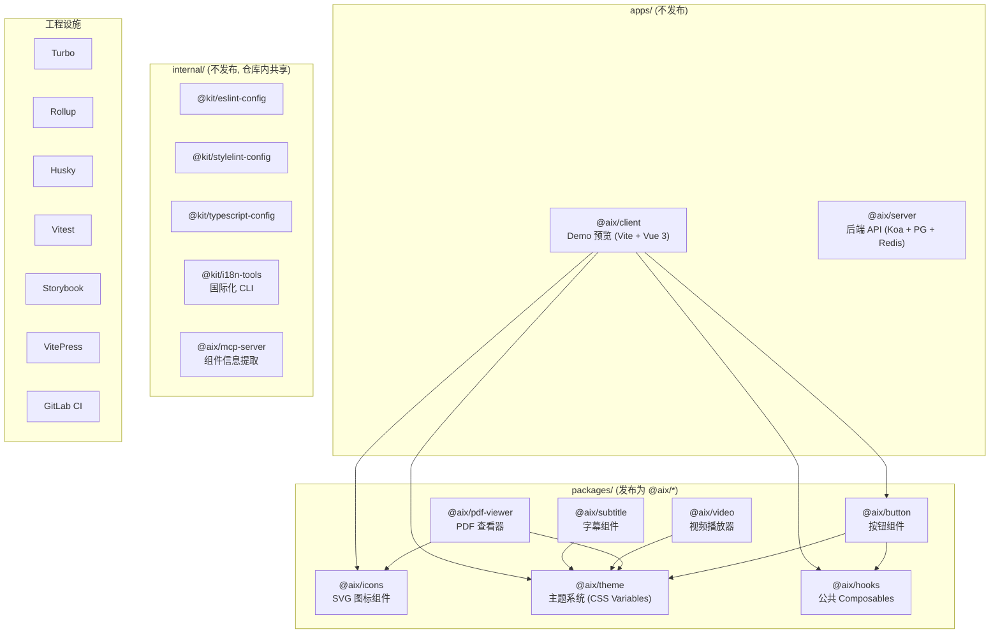

### 包依赖关系

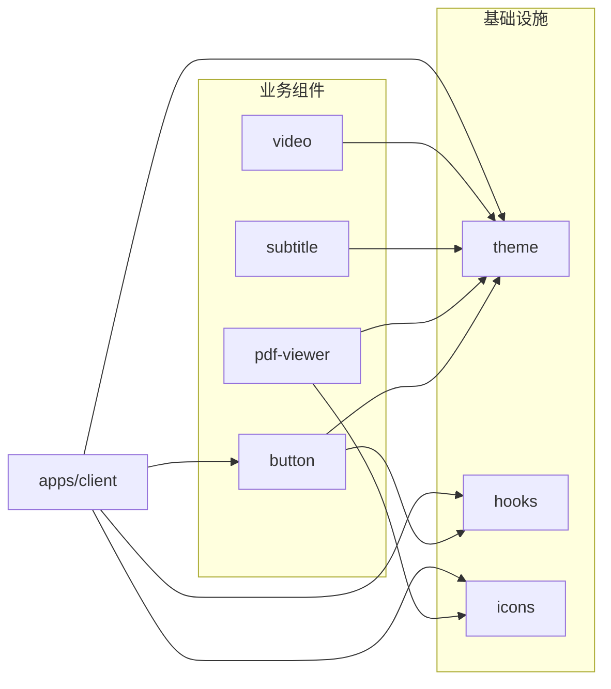

---

## 三、目录结构

```
aix/
├── packages/                  # 组件包 (发布为 @aix/*)
│   ├── button/                #   按钮组件
│   ├── hooks/                 #   公共 Composables (useLocale 等)
│   ├── icons/                 #   SVG 图标组件 (1000+ 图标)
│   ├── pdf-viewer/            #   PDF 查看器 (pdfjs-dist)
│   ├── subtitle/              #   字幕组件 (VTT/SRT/JSON/SBV/ASS)
│   ├── theme/                 #   主题系统 (CSS Variables + TS API)
│   └── video/                 #   视频播放器 (HLS/FLV/DASH/RTSP/WebRTC)
│
├── apps/                      # 应用 (不发布)
│   ├── client/                #   组件 Demo 预览 (Vite + Vue 3)
│   └── server/                #   后端 API (Koa + PostgreSQL + Redis)
│
├── internal/                  # 内部共享包 (不发布)
│   ├── eslint-config/         #   ESLint 规则 (@kit/eslint-config)
│   ├── stylelint-config/      #   Stylelint 规则 (@kit/stylelint-config)
│   ├── typescript-config/     #   TSConfig 预设 (@kit/typescript-config)
│   ├── i18n-tools/            #   国际化自动化工具 (CLI)
│   └── mcp-server/            #   MCP 服务 (组件信息提取)
│
├── scripts/                   # 工程脚本
│   ├── gen.ts                 #   组件包脚手架生成器
│   ├── publish/               #   npm 发布自动化
│   ├── link/                  #   Yalc 本地联调
│   ├── husky/                 #   Git Hooks 实现
│   └── docs/                  #   文档生成 & 同步
│
├── docs/                      # VitePress 文档站点
├── .storybook/                # Storybook 配置
├── .claude/                   # AI 辅助开发配置
│
├── rollup.config.js           # 共享 Rollup 配置工厂
├── turbo.json                 # Turbo 任务编排
├── vitest.config.ts           # 测试配置
├── commitlint.config.ts       # 提交信息规范
├── prettier.config.js         # 代码格式化
├── eslint.config.ts           # ESLint 入口
├── stylelint.config.mjs       # Stylelint 入口
├── tsconfig.json              # 根 TypeScript 配置
├── pnpm-workspace.yaml        # pnpm 工作空间
└── .gitlab-ci.yml             # CI/CD 流水线
```

### 组件包标准结构

每个 `packages/<name>/` 遵循统一目录规范：

```
packages/<name>/
├── src/
│   ├── index.ts               # 导出入口
│   ├── <Name>.vue             # 组件主文件
│   ├── types.ts               # Props / Emits 类型定义
│   └── locale/                # 国际化文本 (可选)
│       ├── index.ts
│       ├── zh-CN.ts
│       └── en-US.ts
├── __test__/                  # 单元测试 (Vitest)
├── stories/                   # Storybook Stories
├── rollup.config.js           # 构建配置 (继承根配置)
├── tsconfig.json              # TS 配置 (继承 internal/)
├── eslint.config.ts           # ESLint (继承 internal/)
└── package.json               # 包描述 + 脚本
```

---

## 四、主题系统架构

### 4.1 三层 Token 体系

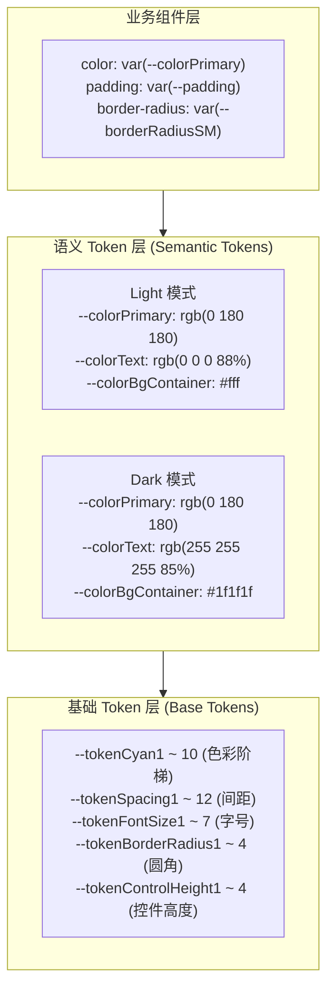

### 4.2 CSS Cascade Layers

```css
@layer theme.base, theme.semantic-light, theme.semantic-dark;

@import './base-tokens.css'           layer(theme.base);
@import './semantic-tokens-light.css' layer(theme.semantic-light);
@import './semantic-tokens-dark.css'  layer(theme.semantic-dark);
```

- 避免 CSS 优先级冲突
- Dark 模式通过 `:root[data-theme='dark']` 选择器自动覆盖 Light 变量
- 组件无需任何暗色模式逻辑

### 4.3 运行时架构

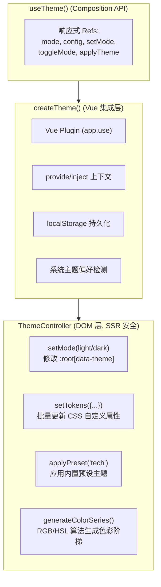

### 4.4 内置预设

| 预设 | 主色 | 用途 |
|------|------|------|
| default | Cyan 系 | 默认品牌色 |
| tech | Blue | 科技感 |
| nature | Green | 自然清新 |
| sunset | Orange | 温暖活力 |
| purple | Purple | 高端雅致 |

---

## 五、构建体系

### 5.1 构建格式与产物

| 格式 | 输出目录 | 用途 | 特点 |
|------|---------|------|------|
| **ESM** | `es/` | Vite / Webpack 现代打包 | 保留模块结构, 支持 Tree-shaking |
| **CJS** | `lib/` | Node.js / 传统工具 | CommonJS 兼容 |
| **UMD** | `dist/` | CDN / 浏览器直引 | 单文件 + 压缩 (仅部分包) |

类型声明由 `vue-tsc` 生成 `.d.ts` 到 `es/` 目录。

### 5.2 Rollup 配置工厂

根目录 `rollup.config.js` 导出 `createRollupConfig(dir, formats)` 工厂函数：

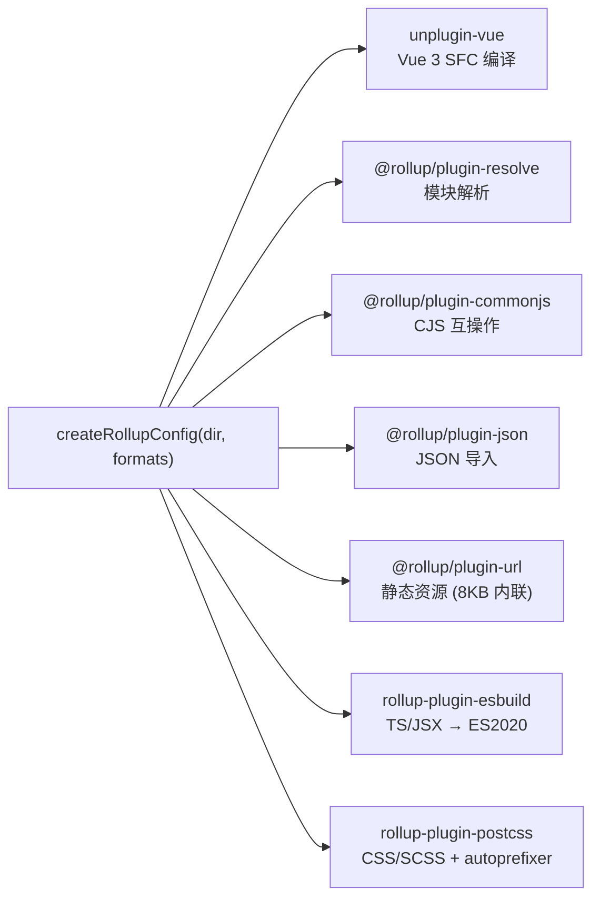

各组件包继承根配置，通常只需一行：

```js
export default createRollupConfig(import.meta.dirname, ['esm', 'cjs']);
```

### 5.3 Turbo 任务编排

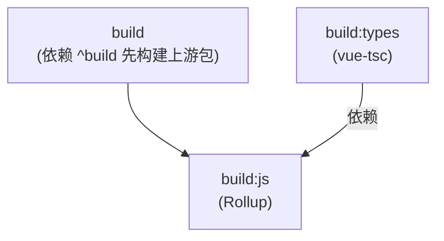

| 任务 | 输入 | 输出 | 缓存 |
|------|------|------|------|
| `build` | 源码 + 配置 | `dist/`, `lib/`, `es/` | 禁用 |
| `build:js` | TS/Vue/SCSS | `dist/`, `lib/`, `es/` | 禁用 |
| `build:types` | TS/Vue | `es/**/*.d.ts` | 禁用 |
| `lint` | 源码 + ESLint 配置 | — | 禁用 |
| `test` | 源码 + 测试文件 | `coverage/` | 禁用 |
| `dev` | — | — | 持久进程 |

---

## 六、样式隔离策略

### BEM + 命名空间

所有组件使用 `.aix-<component>` 前缀，**不使用 `scoped`**：

```scss
// BEM + 命名空间
.aix-button {
  color: var(--colorText);

  &__content { /* Element */ }
  &__loading-icon { /* Element */ }

  &--primary { /* Modifier: 类型 */ }
  &--small { /* Modifier: 尺寸 */ }
  &--disabled { /* Modifier: 状态 */ }
}
```

**禁止事项：**

- 硬编码颜色值 (如 `color: #1890ff`)
- 标签选择器 (如 `button { }`)
- `<style scoped>`

---

## 七、TypeScript 配置体系

### 三层继承

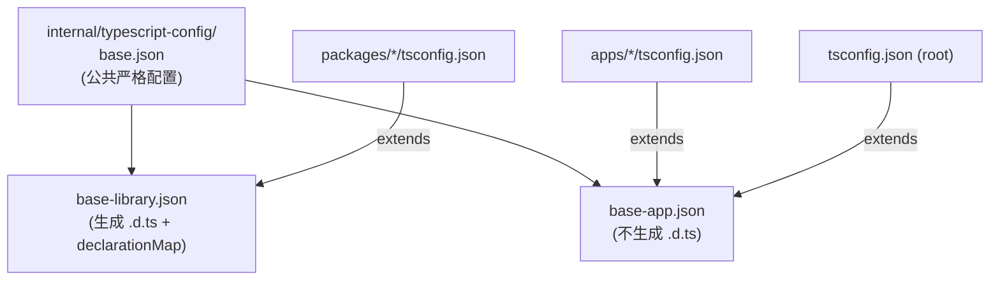

### 关键编译选项

| 选项 | 值 | 说明 |
|------|------|------|
| `strict` | true | 全量严格检查 |
| `module` | ESNext | 现代模块语法 |
| `moduleResolution` | bundler | 适配 Vite/Rollup |
| `isolatedModules` | true | esbuild 兼容 |
| `target` | ES2015 | 编译目标 |
| `noUncheckedIndexedAccess` | true | 索引访问安全检查 |
| `declaration` + `declarationMap` | true (lib) | 组件包生成类型声明 |

---

## 八、代码质量工具链

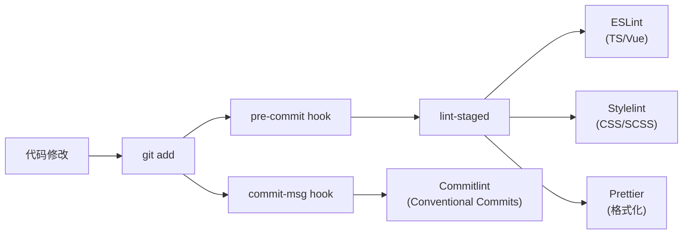

### 工具职责

| 工具 | 配置包 | 职责 |
|------|--------|------|
| **ESLint 10** | `@kit/eslint-config` | JS/TS/Vue 代码规范 |
| **Stylelint 17** | `@kit/stylelint-config` | CSS/SCSS 样式规范 (SMACSS 属性排序) |
| **Prettier 3** | `prettier.config.js` | 格式化 (单引号, 分号, 尾逗号) |
| **CSpell** | `.cspell.json` | 拼写检查 (89 个自定义词) |
| **Commitlint** | `commitlint.config.ts` | 提交信息规范 (Conventional Commits) |
| **czg** | 内嵌 commitlint | 交互式提交 (中文提示) |

### ESLint 配置层级

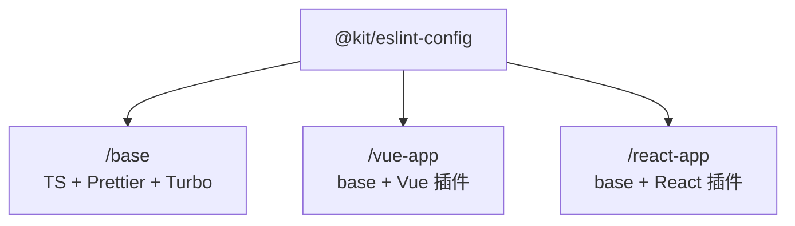

---

## 九、测试策略

| 维度 | 配置 |
|------|------|
| 框架 | Vitest |
| 环境 | jsdom (浏览器模拟) |
| 覆盖率 | v8 provider, text + json + html 报告 |
| 范围 | `packages/**/__test__/*.{test,spec}.*` |
| Setup | mock fetch, mock localStorage, 过滤 console warn/error |

```bash
pnpm test                          # 全量测试 (Turbo 编排)
pnpm test -- --filter=@aix/button  # 单包测试
```

---

## 十、文档体系

### 双文档系统

| 系统 | 用途 | 部署地址 |
|------|------|---------|
| **Storybook 10** | 组件交互文档 + 实时预览 | `/storybook` (GitLab Pages) |
| **VitePress** | 使用指南 + API 文档 | `/docs` (GitLab Pages) |

### Storybook 配置

- 框架: `@storybook/vue3-vite`
- Stories: `packages/**/*.stories.{ts,tsx,mdx}`
- Vite alias 映射到组件源码，支持 HMR
- 全局装饰器: 国际化切换 (中/英) + 主题切换 (Light/Dark)

### VitePress 配置

- 中文文档站 (`lang: 'zh-CN'`)
- 侧边栏: 指南 / 组件 / 示例
- 本地搜索
- Markdown: GitHub 主题 + 行号

---

## 十一、CI/CD 流水线

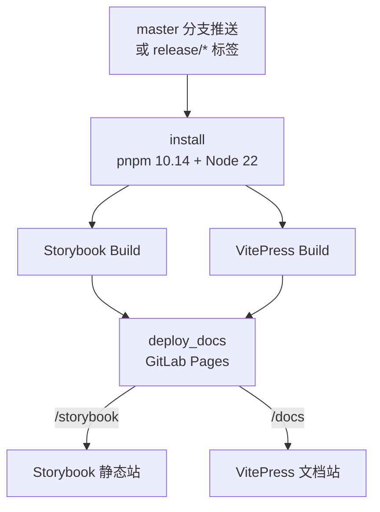

- Docker: `node:22-alpine`
- 缓存: `.pnpm-store/` + `node_modules/`

---

## 十二、本地开发工作流

### 12.1 日常开发

```bash
# 启动开发服务
pnpm dev                     # Turbo 并行启动所有包 watch 模式
pnpm storybook:dev           # Storybook (port 6006)

# 质量检查
pnpm lint                    # ESLint
pnpm type-check              # TypeScript 类型检查
pnpm cspell                  # 拼写检查
pnpm test                    # 单元测试
```

### 12.2 新建组件包

```bash
pnpm gen <component-name>    # 交互式脚手架
```

自动生成完整目录结构：`src/` + `__test__/` + `stories/` + 配置文件。

### 12.3 本地联调 (Yalc)

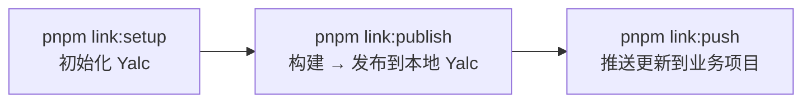

`apps/client` 支持两种联调模式:

- **Source 模式** (默认): Vite alias 直接指向包源码，支持 HMR
- **Yalc 模式**: 使用预构建产物，模拟真实 npm 安装

### 12.4 构建与发布

```bash
pnpm build                   # 全量构建 (Turbo 编排)
pnpm build:filter -- --filter=@aix/<name>  # 单包构建
pnpm pre                     # 预发布流程
pnpm commit                  # 交互式规范化提交 (czg)
```

---

## 十三、npm 发布配置

| 配置项 | 值 |
|--------|------|
| scope | `@aix/*` |
| registry | `http://npm-registry.zhihuishu.com:4873/` (私有) |
| exports | ESM (`./es/`) + CJS (`./lib/`) + Types (`./es/*.d.ts`) |
| sideEffects | CSS 文件标记为有副作用 (防 Tree-shaking 误删) |

每个组件包的 `package.json` 标准 exports：

```json
{
  "main": "./lib/index.js",
  "module": "./es/index.js",
  "types": "./es/index.d.ts",
  "exports": {
    ".": {
      "types": "./es/index.d.ts",
      "import": "./es/index.js",
      "require": "./lib/index.js"
    },
    "./style": "./es/index.css"
  }
}
```

---

## 十四、关键约束与禁忌

### 禁止

| 禁止操作 | 说明 |
|---------|------|
| 修改 `es/`、`lib/`、`dist/` | 构建产物，自动生成 |
| 硬编码颜色值 | 必须使用 CSS Variables |
| 组件间直接引用源码 | 必须通过 `workspace:*` 依赖引用 |
| 跳过类型定义 | Props/Emits 必须有完整 TypeScript 类型 |
| 使用标签选择器 | 组件样式必须使用 `.aix-` 前缀的 class |
| 在组件中使用 `scoped` | 使用 BEM + 命名空间隔离 |

### 必须遵守

| 规范 | 说明 |
|------|------|
| Props/Emits 类型定义 | 在 `types.ts` 中定义完整的 TypeScript 接口 |
| 样式命名空间 | 所有 class 使用 `.aix-<component>` 前缀 |
| CSS Variables | 颜色/间距/圆角等使用 `var(--aix-*)` |
| 导出规范 | `index.ts` 统一导出组件和类型 |
| 测试覆盖 | 新组件必须编写单元测试 |
| Story 文档 | 新组件必须编写 Storybook Story |
