# AIX 组件库架构设计文档

## 1. 概述

### 1.1 项目背景

AIX 是面向企业级应用的 Vue 3 组件库，采用 Monorepo 架构管理多个独立发布的组件包。项目旨在提供高质量、可定制、类型安全的 UI 组件，服务于内部多个业务线的前端开发需求。

组件库的核心价值在于：
- **统一设计语言**：确保各业务线 UI 风格一致
- **提升开发效率**：避免重复造轮子，专注业务逻辑
- **降低维护成本**：集中维护，统一升级

### 1.2 设计目标

在技术选型和架构设计时，我们确立了以下核心目标：

| 目标 | 说明 |
|------|------|
| **类型安全** | 完整的 TypeScript 类型定义，编译时错误检查 |
| **按需加载** | 支持 Tree-shaking，只打包使用的组件 |
| **主题定制** | 基于 CSS Variables 的三层 Token 体系 |
| **开发体验** | 完善的文档、测试、Lint 工具链 |
| **独立发布** | 各组件包独立版本管理，按需安装 |

### 1.3 技术栈

技术选型遵循"主流、稳定、生态完善"的原则。Vue 3 提供了 Composition API 和更好的 TypeScript 支持；Rollup 专注于库打包，输出体积更小；Turbo 解决了 Monorepo 场景下的构建编排问题。

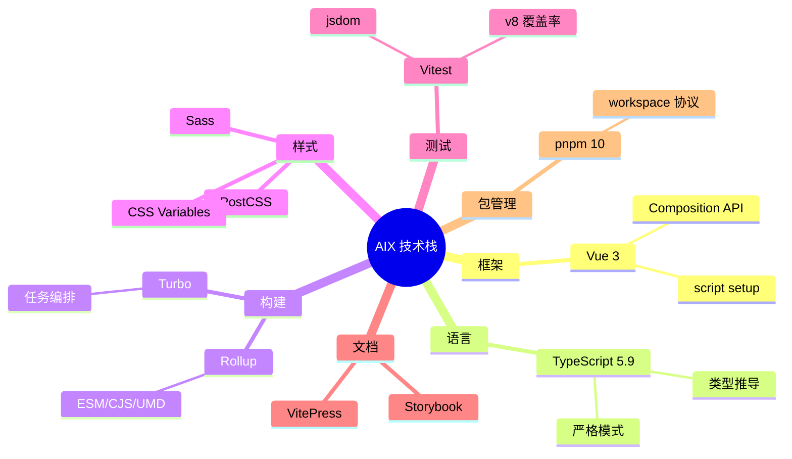

---

## 2. 架构原则

### 2.1 设计原则

良好的架构需要遵循一定的设计原则，这些原则指导我们做出一致的技术决策：

1. **单一职责**：每个包只做一件事，组件包只包含组件，配置包只包含配置。这样便于独立发布、独立升级，降低包之间的耦合。

2. **依赖倒置**：组件依赖抽象（CSS Variables），不依赖具体值。这使得主题切换成为可能，业务方可以通过修改变量值来定制样式。

3. **开闭原则**：通过 Props/Slots 扩展功能，不修改组件源码。组件对扩展开放，对修改关闭，保证稳定性。

4. **最小依赖**：避免不必要的外部依赖，减小包体积。每引入一个依赖都需要评估其必要性和体积影响。

### 2.2 技术约束

基于当前技术栈和未来演进方向，我们确立了以下技术约束：

| 约束 | 原因 |
|------|------|
| Node >= 22 | 使用最新 ESM 特性，享受性能提升 |
| Vue >= 3.5 | 依赖 `defineModel`、泛型组件等新特性 |
| 不使用 scoped 样式 | 保证样式可被外部覆盖，支持深度定制 |
| 禁止硬编码颜色值 | 确保主题系统生效，支持暗色模式 |

### 2.3 非功能性需求

除了功能正确性，我们还关注以下非功能性指标：

| 维度 | 要求 | 说明 |
|------|------|------|
| 包体积 | 单组件 gzip < 10KB | 控制首屏加载时间 |
| 首屏性能 | 支持 Tree-shaking | 只加载使用的代码 |
| 浏览器兼容 | 现代浏览器最近 2 个版本 | 不支持 IE |
| 无障碍 | WCAG 2.1 AA 级别 | 支持键盘导航、屏幕阅读器 |

### 2.4 关键技术决策

以下是项目中的关键技术选型及其原因：

| 决策点 | 选择 | 备选方案 | 选择原因 |
|-------|------|---------|---------|
| 打包工具 | Rollup | Vite / esbuild | 专为库设计，Tree-shaking 更彻底，输出体积更小 |
| 样式方案 | CSS Variables | CSS-in-JS / Tailwind | 零运行时开销，易于覆盖，原生支持暗色模式 |
| Monorepo 工具 | Turbo | Lerna / Nx | 增量构建快，远程缓存好，配置简单 |
| 不用 scoped | BEM + 命名空间 | Vue scoped | 允许业务方深度定制样式，避免 `::v-deep` 穿透 |
| 类型生成 | vue-tsc | tsc | 支持 Vue SFC 的类型提取，生成更准确的 `.d.ts` |

---

## 3. 系统架构

### 3.1 Monorepo 结构

项目采用 Monorepo 架构，所有代码集中在一个仓库中管理。这种架构的优势在于：
- **代码共享**：公共配置、工具函数可以直接复用
- **原子提交**：跨包修改可以在一次提交中完成
- **统一工具链**：ESLint、TypeScript 等配置只需维护一份

整个仓库分为三个主要目录：`packages/` 存放对外发布的组件包，`internal/` 存放仓库内共享的配置包，`apps/` 存放开发调试用的应用。

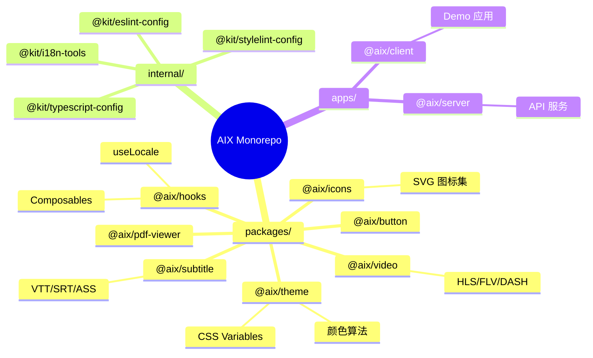

### 3.2 分层架构

从垂直视角看，整个系统分为四层。上层依赖下层，下层不依赖上层，形成清晰的依赖方向。

- **应用层**：业务项目，是组件库的最终消费者
- **组件层**：UI 组件，提供可复用的界面元素
- **基础设施层**：主题、Hooks、图标等基础能力
- **工程配置层**：ESLint、Stylelint、TSConfig 等开发时配置

这种分层设计确保了关注点分离，每层只需关心自己的职责。

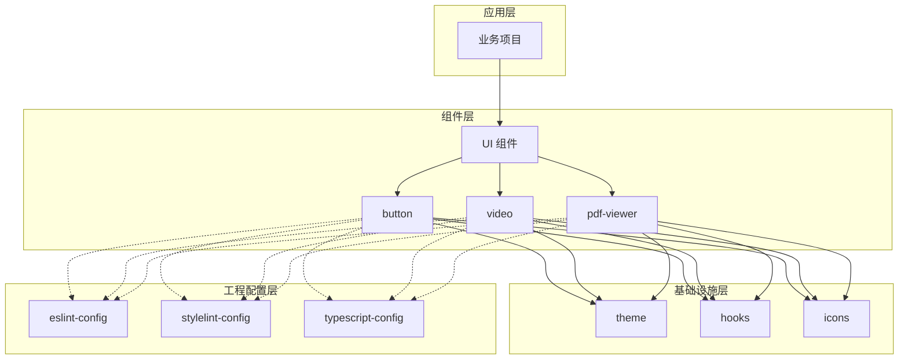

### 3.3 包依赖关系

组件包之间存在明确的依赖关系。所有 UI 组件都依赖 `@aix/theme` 获取样式变量，部分组件依赖 `@aix/hooks` 获取通用逻辑，媒体类组件依赖 `@aix/icons` 获取图标。

这种依赖结构的好处是：修改主题变量可以影响所有组件，而修改某个组件不会影响其他组件。

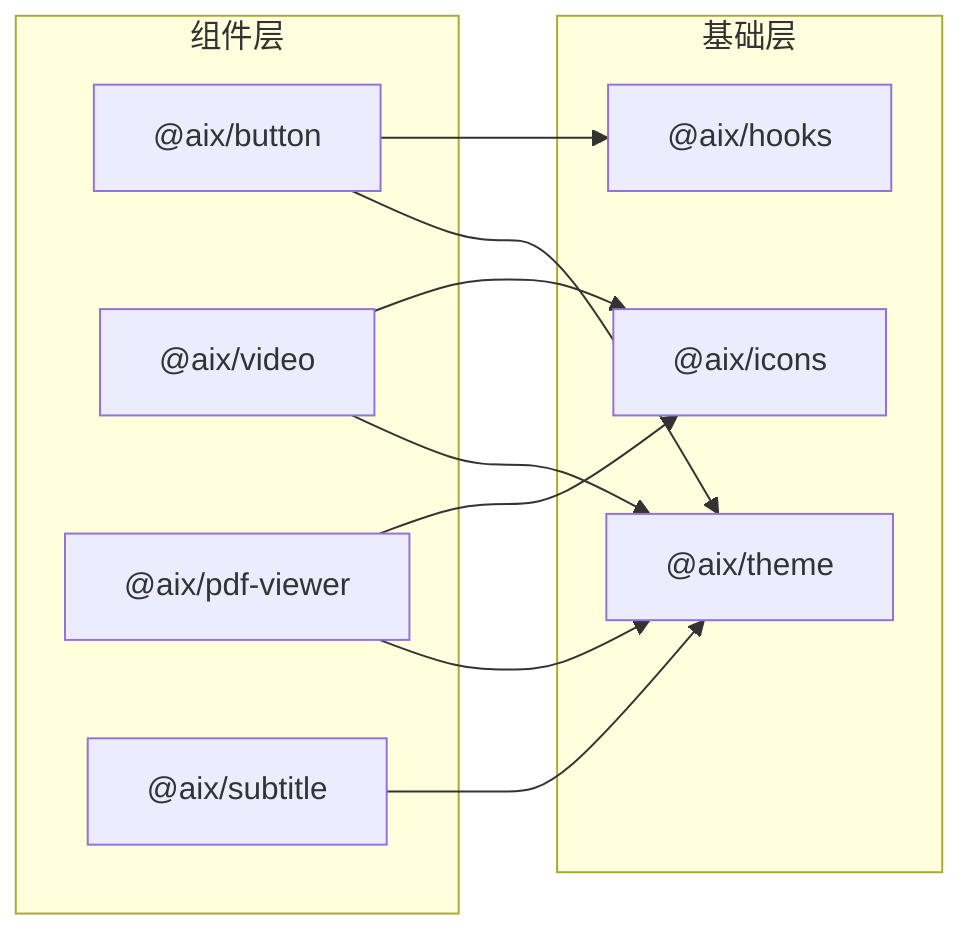

### 3.4 包职责划分

每个包有明确的职责边界，避免功能重叠。以下是各包的详细职责说明：

| 包 | 职责 | 发布 |
|------|------|:----:|
| `@aix/theme` | CSS Variables 主题系统、颜色算法、Vue 集成 | ✓ |
| `@aix/hooks` | 通用 Composables (useLocale 等) | ✓ |
| `@aix/icons` | SVG 图标组件集合 | ✓ |
| `@aix/button` | 按钮组件 | ✓ |
| `@aix/video` | 视频播放器 (HLS/FLV/DASH) | ✓ |
| `@aix/pdf-viewer` | PDF 预览组件 | ✓ |
| `@aix/subtitle` | 字幕组件 (VTT/SRT/ASS) | ✓ |
| `@kit/eslint-config` | ESLint 规则集 | ✗ |
| `@kit/stylelint-config` | Stylelint 规则集 | ✗ |
| `@kit/typescript-config` | TSConfig 预设 | ✗ |

`@aix/*` 包发布到 npm，供外部项目安装使用；`@kit/*` 包仅在仓库内共享，不对外发布。

---

## 4. 目录结构

### 4.1 项目根目录

项目根目录的组织遵循"按职能划分"的原则。源代码、配置文件、脚本、文档各有其位置，便于快速定位。

```
aix/
├── packages/               # 组件包 (发布到 npm)
├── internal/               # 内部配置包 (不发布)
├── apps/                   # 开发应用
├── docs/                   # VitePress 文档
├── scripts/                # 工程脚本
├── .storybook/             # Storybook 配置
├── .claude/                # AI 辅助配置
├── turbo.json              # Turbo 任务配置
├── rollup.config.js        # 共享构建配置
├── vitest.config.ts        # 测试配置
├── commitlint.config.ts    # 提交规范
└── pnpm-workspace.yaml     # 工作空间定义
```

### 4.2 组件包结构

每个组件包遵循统一的目录结构，降低认知负担，便于快速上手开发新组件。

- `src/` 目录存放源代码，包括组件实现、类型定义、导出入口
- `__test__/` 目录存放单元测试
- `stories/` 目录存放 Storybook Stories
- 根目录存放构建配置和包描述文件

```
packages/<name>/
├── src/
│   ├── index.ts            # 导出入口
│   ├── types.ts            # Props/Emits 类型
│   ├── <Name>.vue          # 组件实现
│   └── locale/             # 国际化 (可选)
├── __test__/               # 单元测试
├── stories/                # Storybook Stories
├── rollup.config.js        # 构建配置
├── tsconfig.json           # TS 配置
└── package.json            # 包描述
```

### 4.3 命名规范

统一的命名规范有助于保持代码一致性，降低沟通成本：

| 类型 | 规范 | 示例 |
|------|------|------|
| 包名 | `@aix/<kebab-case>` | `@aix/pdf-viewer` |
| 组件名 | PascalCase | `PdfViewer` |
| CSS 类名 | `.aix-<component>` | `.aix-button` |
| CSS 变量 | `--aix-<camelCase>` | `--aix-colorPrimary` |
| 文件名 | PascalCase (组件) / kebab-case (其他) | `Button.vue` / `use-locale.ts` |

---

## 5. 核心模块设计

### 5.1 主题系统

主题系统是组件库的核心基础设施，负责管理所有视觉相关的变量，包括颜色、字号、间距、圆角等。

#### 三层 Token 架构

我们采用业界流行的三层 Token 架构，参考了 Ant Design 5.0 的设计思路：

- **Seed Tokens（种子）**：最基础的设计变量，如品牌色、基础字号。数量少，约 10-20 个。
- **Map Tokens（派生）**：由种子通过算法派生，如 hover 态颜色、背景色。数量中等，约 50-100 个。
- **Alias Tokens（语义）**：具有语义含义的变量，如链接色、成功色。数量较多，约 100-200 个。

这种分层的好处是：业务方只需修改少量种子变量，即可实现整套主题的定制。

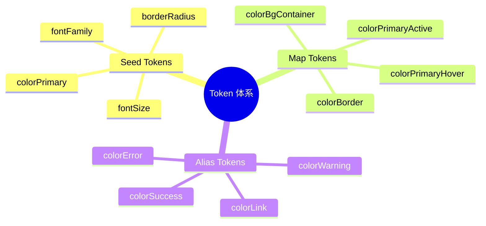

#### Token 派生流程

Token 的派生是自动化的。开发者只需定义 Seed Tokens，Map Tokens 和 Alias Tokens 会通过颜色算法自动生成。这保证了色彩的协调性和一致性。


#### 主题切换原理

主题切换（如暗色模式）通过 CSS 属性选择器实现，无需 JavaScript 运行时切换类名。浏览器原生支持，性能最优。

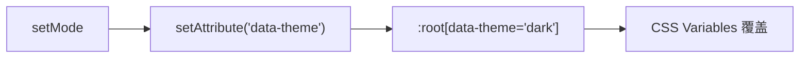

#### 组件运行时交互

下图展示了组件在运行时如何与主题系统协作。业务代码使用组件时，组件内部通过 CSS Variables 读取主题值，而这些变量由 `@aix/theme` 包注入到页面根节点。

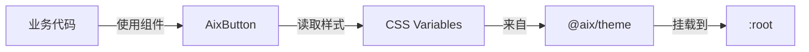

这种设计的好处是：
- **解耦**：组件不直接依赖具体颜色值，只依赖变量名
- **可定制**：业务方可通过覆盖 CSS Variables 实现主题定制
- **性能好**：CSS Variables 由浏览器原生处理，无 JavaScript 运行时开销

#### CSS Cascade Layers

为避免 CSS 优先级冲突，主题系统使用 CSS Cascade Layers 组织样式层级：

```css
@layer theme.base, theme.semantic-light, theme.semantic-dark;

@import './base-tokens.css'           layer(theme.base);
@import './semantic-tokens-light.css' layer(theme.semantic-light);
@import './semantic-tokens-dark.css'  layer(theme.semantic-dark);
```

- 基础 Token 层定义色彩阶梯、间距、字号等原子变量
- 语义 Token 层将原子变量映射为有意义的名称（如 `colorPrimary`）
- Dark 模式通过 `:root[data-theme='dark']` 选择器自动覆盖 Light 变量
- 组件无需任何暗色模式逻辑，自动适配

#### 内置预设主题

主题系统提供多套开箱即用的预设，可通过 `applyPreset()` 一键切换：

| 预设 | 主色 | 用途 |
|------|------|------|
| default | Cyan | 默认品牌色 |
| tech | Blue | 科技感 |
| nature | Green | 自然清新 |
| sunset | Orange | 温暖活力 |
| purple | Purple | 高端雅致 |

### 5.2 构建系统

构建系统负责将源代码转换为可发布的产物。我们使用 Rollup 作为打包工具，Turbo 作为任务编排工具。

#### 构建流程

整个构建流程由 Turbo 编排。Turbo 会分析包之间的依赖关系，确保上游包先构建完成，再构建下游包。这避免了手动管理构建顺序的麻烦。

每个包的构建分为两个阶段：`build:js` 使用 Rollup 生成 JavaScript 产物，`build:types` 使用 vue-tsc 生成类型声明文件。

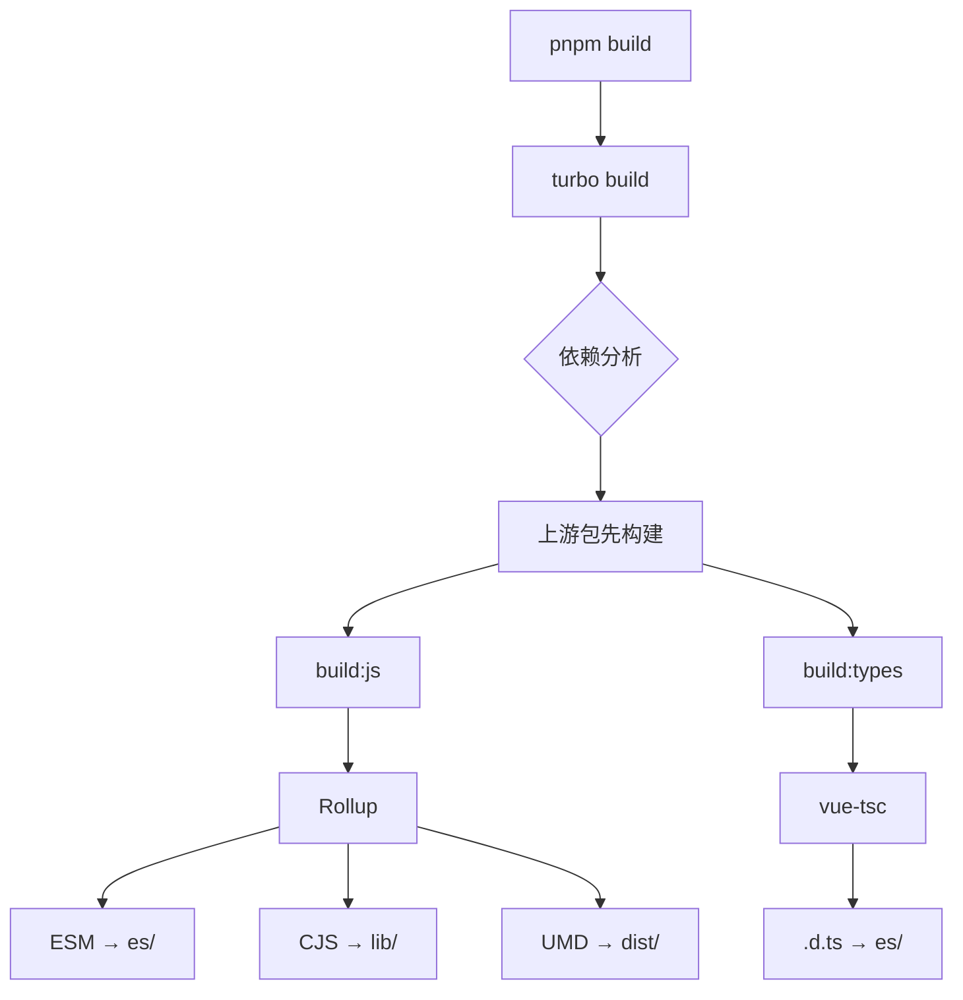

#### Rollup 插件链

Rollup 的强大之处在于其插件系统。我们使用了一系列插件来处理不同类型的文件：

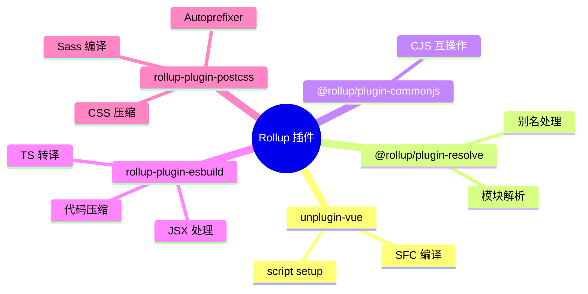

#### 输出格式

我们为每个组件包生成三种格式的产物，满足不同使用场景：

| 格式 | 目录 | 特点 | 使用场景 |
|------|------|------|----------|
| ESM | `es/` | 保留模块结构，支持 Tree-shaking | Vite/Webpack 5+ |
| CJS | `lib/` | CommonJS 格式 | Node.js/旧版打包器 |
| UMD | `dist/` | 单文件，已压缩 | CDN 直接引用 |

### 5.3 依赖管理

#### Workspace 协议

pnpm 的 workspace 协议允许我们在 Monorepo 中引用本地包，而无需发布到 npm。开发时，`workspace:*` 会链接到本地源码；发布时，会自动替换为实际版本号。

```json
{
  "dependencies": {
    "@aix/theme": "workspace:*",
    "@aix/hooks": "workspace:*"
  }
}
```

这种机制带来的好处：
- 开发时修改依赖包，无需重新安装即可生效
- 发布时自动处理版本号，无需手动维护

---

## 6. 开发规范

### 6.1 组件开发规范

组件开发遵循 Vue 3 Composition API 风格，使用 `<script setup>` 语法。Props 和 Emits 必须有完整的 TypeScript 类型定义。

#### Props 定义

所有 Props 都在 `types.ts` 中定义接口，包含完整的 JSDoc 注释。这些注释会被 Storybook 提取，自动生成文档。

```typescript
// types.ts
export interface ButtonProps {
  /** 按钮类型 */
  type?: 'primary' | 'default' | 'dashed' | 'text' | 'link';
  /** 按钮尺寸 */
  size?: 'small' | 'medium' | 'large';
  /** 是否禁用 */
  disabled?: boolean;
}
```

#### 样式规范

组件样式使用 BEM 命名规范 + `aix-` 命名空间前缀，避免与业务样式冲突。所有颜色、间距、圆角等值都必须使用 CSS Variables，禁止硬编码。

```scss
// 使用 BEM + 命名空间
.aix-button {
  // 使用 CSS Variables，不要硬编码
  color: var(--aix-colorText);
  border-radius: var(--aix-borderRadiusSM);

  // Element（元素）
  &__icon { }
  &__content { }

  // Modifier（修饰符）
  &--primary { }
  &--disabled { }
}
```

### 6.2 提交规范

Git 提交信息遵循 Conventional Commits 规范，便于自动生成 CHANGELOG 和语义化版本管理。

```
<type>(<scope>): <subject>

type: feat | fix | docs | style | refactor | perf | test | build | ci | chore
scope: 可选，影响范围 (button | theme | hooks)
subject: 简短描述，推荐使用中文
```

示例：
- `feat(button): 新增 loading 状态`
- `fix(theme): 修复暗色模式切换闪烁`
- `docs: 更新安装文档`

### 6.3 禁止事项

以下行为在代码审查中会被拒绝：

| 禁止 | 原因 |
|------|------|
| 修改 `es/` `lib/` `dist/` | 构建产物由 CI 自动生成 |
| 硬编码颜色值 | 破坏主题系统，无法支持暗色模式 |
| `<style scoped>` | 阻止业务方覆盖样式 |
| 标签选择器 | 影响全局样式，造成样式污染 |
| 跳过类型定义 | 破坏类型安全，降低开发体验 |

---

## 7. 质量保障

### 7.1 代码检查流程

我们在多个环节设置了自动化检查，确保代码质量：

- **pre-commit**：提交前检查，运行 ESLint、Stylelint、Prettier
- **commit-msg**：提交信息检查，确保符合规范
- **CI**：推送后检查，运行类型检查、单元测试、构建

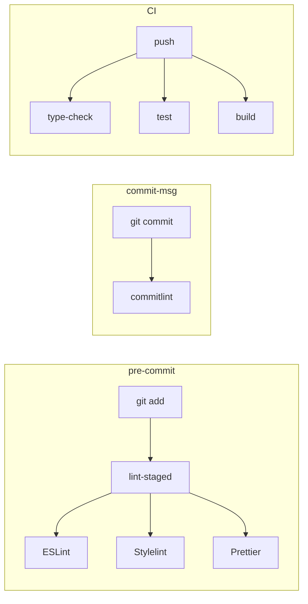

### 7.2 测试策略

测试分为三个层次，覆盖不同的验证场景：

| 层级 | 工具 | 覆盖范围 |
|------|------|----------|
| 单元测试 | Vitest | Props/Emits/Slots 行为验证 |
| 组件测试 | Vue Test Utils | DOM 渲染、用户交互模拟 |
| 可视化测试 | Storybook | UI 回归、样式变化检测 |

测试覆盖率目标为 80%，重点覆盖核心逻辑和边界情况。

### 7.3 配置包体系

工程配置集中在 `internal/` 目录，各组件包通过继承复用，保证一致性。

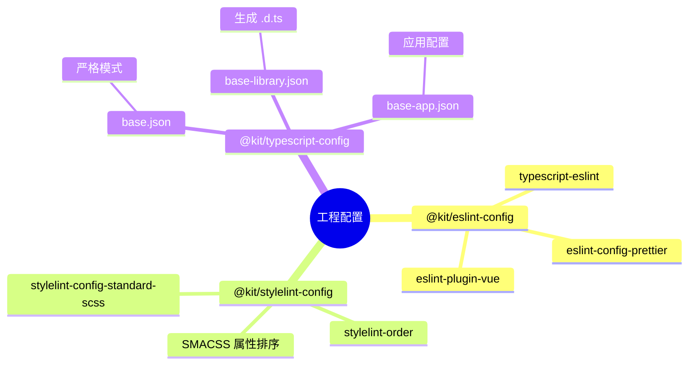

#### TypeScript 三层继承

TypeScript 配置采用三层继承结构，确保一致性的同时满足不同场景需求：

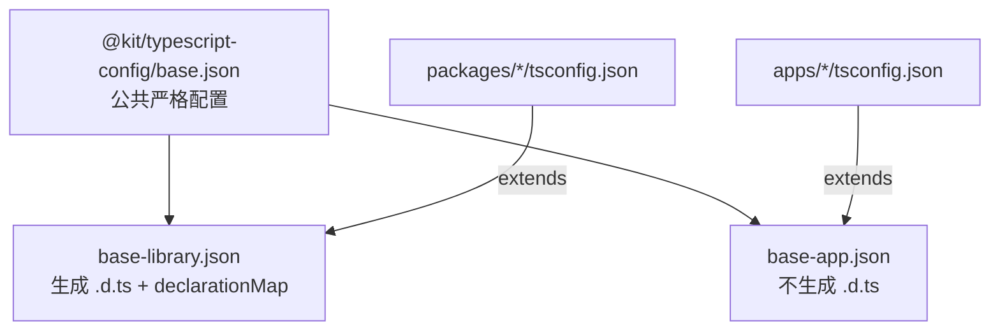

**关键编译选项：**

| 选项 | 值 | 说明 |
|------|------|------|
| `strict` | true | 全量严格检查 |
| `module` | ESNext | 现代模块语法 |
| `moduleResolution` | bundler | 适配 Vite/Rollup |
| `isolatedModules` | true | esbuild 兼容 |
| `noUncheckedIndexedAccess` | true | 索引访问安全检查 |
| `declaration` | true (lib) | 组件包生成类型声明 |

#### ESLint 配置层级

ESLint 配置同样采用分层设计，支持不同框架场景：

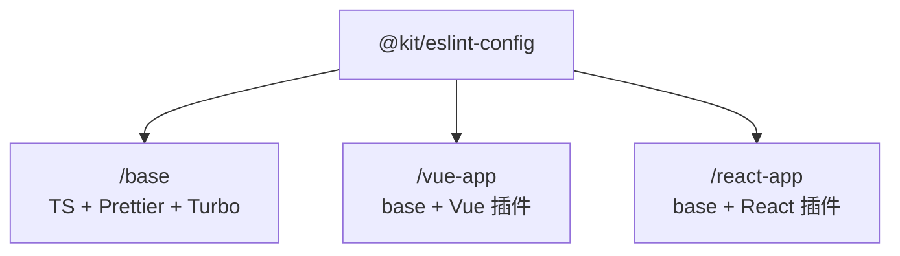

---

## 8. 构建与发布

### 8.1 构建命令

日常开发和发布常用的构建命令：

| 命令 | 说明 |
|------|------|
| `pnpm build` | 全量构建，Turbo 自动处理依赖顺序 |
| `pnpm build:filter -- --filter=@aix/button` | 只构建指定包及其依赖 |
| `pnpm dev` | 启动 watch 模式，文件变化自动重新构建 |

### 8.2 发布流程

发布流程使用 Changeset 管理，它提供了版本管理、CHANGELOG 生成、npm 发布的完整解决方案。

整个流程分为三步：
1. **创建变更**：运行 `pnpm changeset`，描述本次变更影响的包和变更类型
2. **更新版本**：运行 `pnpm changeset version`，自动更新版本号和 CHANGELOG
3. **发布**：运行 `pnpm pre`，构建并发布到 npm

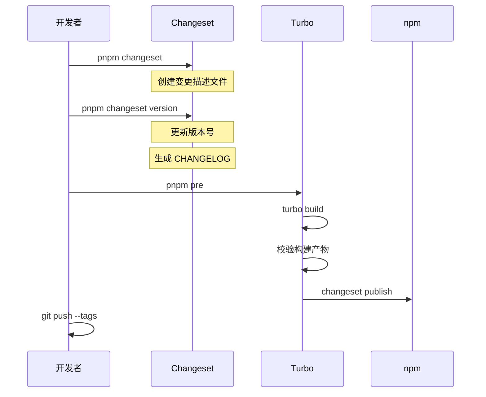

### 8.3 版本策略

我们支持三种发布模式，满足不同阶段的需求：

| 模式 | Tag | 版本格式 | 用途 |
|------|-----|----------|------|
| release | latest | `1.0.0` | 正式版本，面向生产环境 |
| beta | beta | `1.0.0-beta.0` | 测试版本，面向内部测试 |
| alpha | alpha | `1.0.0-alpha.0` | 早期预览，面向尝鲜用户 |

### 8.4 CI/CD 流水线

项目使用 GitLab CI 实现自动化构建和部署。当代码推送到 master 分支或创建 release 标签时，流水线自动触发：

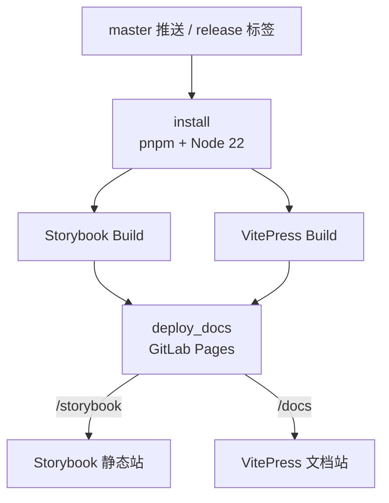

**CI 环境配置：**
- Docker 镜像：`node:22-alpine`
- 缓存：`.pnpm-store/` + `node_modules/`
- 并行构建 Storybook 和 VitePress，提升效率

### 8.5 npm 发布配置

组件包发布到私有 npm registry，每个包的 `package.json` 需遵循标准 exports 配置：

```json
{
  "name": "@aix/button",
  "main": "./lib/index.js",
  "module": "./es/index.js",
  "types": "./es/index.d.ts",
  "exports": {
    ".": {
      "types": "./es/index.d.ts",
      "import": "./es/index.js",
      "require": "./lib/index.js"
    },
    "./style": "./es/index.css"
  },
  "sideEffects": ["*.css", "*.scss"]
}
```

**关键配置说明：**

| 字段 | 说明 |
|------|------|
| `main` | CJS 入口，兼容 Node.js |
| `module` | ESM 入口，支持 Tree-shaking |
| `types` | TypeScript 类型声明入口 |
| `exports` | 现代打包器的模块解析配置 |
| `sideEffects` | 标记 CSS 文件有副作用，防止被 Tree-shaking 误删 |

---

## 9. 文档系统

### 9.1 双文档架构

我们维护两套文档系统，各有侧重：

- **Storybook**：组件级文档，展示组件的各种状态和变体，支持交互式调试
- **VitePress**：项目级文档，包含使用指南、API 参考、最佳实践

两套文档都部署到 GitLab Pages，分别位于 `/storybook` 和 `/docs` 路径。

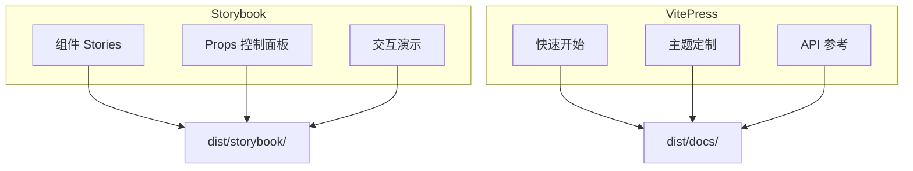

### 9.2 文档职责

| 系统 | 职责 | 受众 |
|------|------|------|
| Storybook | 组件可视化、交互测试、设计稿对照 | 开发者、设计师 |
| VitePress | 使用指南、API 文档、最佳实践 | 开发者 |

---

## 10. 扩展指南

### 10.1 新增组件包

新增组件包的标准流程如下。脚手架工具会生成完整的目录结构和配置文件，开发者只需专注于组件实现。

```bash
# 1. 生成脚手架
pnpm gen <component-name>

# 2. 实现组件
# - src/types.ts      定义 Props/Emits 类型
# - src/<Name>.vue    实现组件逻辑和模板
# - src/index.ts      导出组件和类型

# 3. 编写测试
# - __test__/<name>.test.ts

# 4. 编写文档
# - stories/<Name>.stories.ts
```

### 10.2 本地联调

开发过程中，经常需要在业务项目中调试组件库的修改。我们使用 Yalc 实现本地联调，避免频繁发布 npm 包。

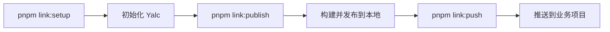

联调步骤：
1. 在组件库运行 `pnpm link:setup` 初始化
2. 修改代码后运行 `pnpm link:publish` 构建并发布到本地 Yalc
3. 在业务项目运行 `yalc add @aix/button` 安装
4. 后续修改只需运行 `pnpm link:push` 即可同步

---

## 11. 附录

### 11.1 关键配置文件

| 文件 | 说明 |
|------|------|
| `turbo.json` | 定义任务依赖关系和缓存策略 |
| `rollup.config.js` | 导出 `createRollupConfig()` 工厂函数 |
| `vitest.config.ts` | 配置测试环境和覆盖率报告 |
| `commitlint.config.ts` | 定义提交信息规则 |
| `.changeset/config.json` | 配置版本管理策略 |

### 11.2 常用命令速查

```bash
# 开发
pnpm dev                # 启动 watch 模式
pnpm storybook:dev      # 启动 Storybook 预览
pnpm docs:dev           # 启动 VitePress 文档

# 质量检查
pnpm lint               # 运行 ESLint
pnpm type-check         # 运行 TypeScript 类型检查
pnpm test               # 运行单元测试
pnpm cspell             # 运行拼写检查

# 构建发布
pnpm build              # 全量构建
pnpm pre                # 执行发布流程
pnpm commit             # 交互式提交（带规范检查）
```
