# AIX 组件库架构设计文档

## 1. 概述

### 1.1 项目背景

AIX 是面向企业级应用的 Vue 3 组件库，采用 Monorepo 架构管理多个独立发布的组件包。项目旨在提供高质量、可定制、类型安全的 UI 组件，服务于内部多个业务线的前端开发需求。

组件库的核心价值在于：
- **统一设计语言**：确保各业务线 UI 风格一致
- **提升开发效率**：避免重复造轮子，专注业务逻辑
- **降低维护成本**：集中维护，统一升级

### 1.2 设计目标

| 目标 | 说明 |
|------|------|
| **类型安全** | 完整的 TypeScript 类型定义，编译时错误检查 |
| **按需加载** | 支持 Tree-shaking，只打包使用的组件 |
| **主题定制** | 基于 CSS Variables 的三层 Token 体系 |
| **开发体验** | 完善的文档、测试、Lint 工具链 |
| **独立发布** | 各组件包独立版本管理，按需安装 |

### 1.3 技术栈

技术选型遵循"主流、稳定、生态完善"的原则。

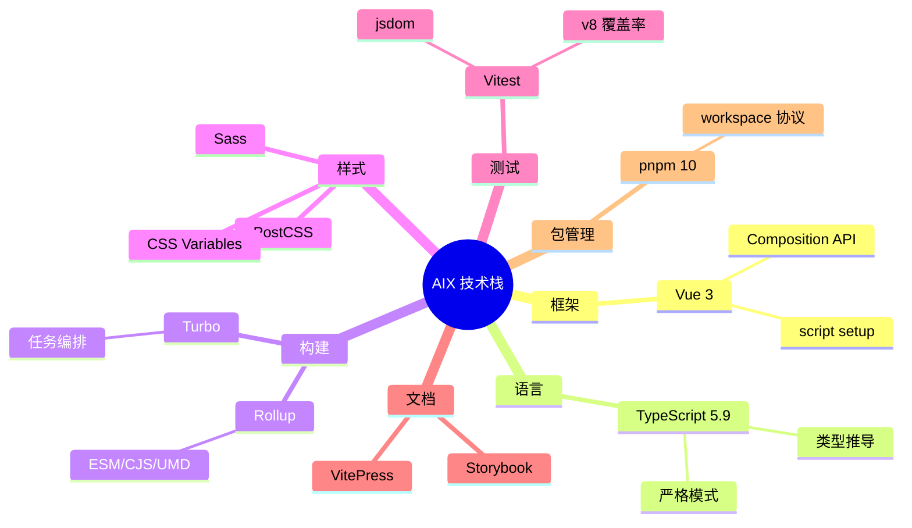

---

## 2. 架构约束与决策

### 2.1 设计原则

1. **单一职责**：每个包只做一件事。组件包只包含组件，配置包只包含配置，便于独立发布和升级。

2. **依赖倒置**：组件依赖抽象（CSS Variables），不依赖具体值。业务方可通过覆盖变量值定制样式。

3. **开闭原则**：通过 Props/Slots 扩展功能，不修改组件源码。组件对扩展开放，对修改关闭。

4. **最小依赖**：避免不必要的外部依赖，减小包体积。每引入一个依赖都需要评估其必要性和体积影响。

### 2.2 技术约束

| 约束 | 原因 |
|------|------|
| Node >= 22 | 使用最新 ESM 特性，享受性能提升 |
| Vue >= 3.5 | 依赖 `defineModel`、泛型组件等新特性 |
| 不使用 scoped 样式 | 保证样式可被外部覆盖，支持深度定制 |
| 禁止硬编码颜色值 | 确保主题系统生效，支持暗色模式 |

### 2.3 非功能性需求

| 维度 | 要求 | 验证手段 |
|------|------|----------|
| 包体积 | 单组件 gzip < 10KB | CI 中 `size-limit` 检查，超标阻断构建 |
| 首屏性能 | 支持 Tree-shaking | `sideEffects: false` + ESM `preserveModules` 输出 |
| 浏览器兼容 | 现代浏览器最近 2 个版本 | CSS `@layer` 需 Chrome 99+ / Safari 15.4+，提供 compat 回退 |
| 无障碍 | WCAG 2.1 AA 级别 | `a11y-checker` 自动化检测 + Storybook a11y 插件 |
| 测试覆盖 | 核心逻辑 >= 80% | Vitest v8 覆盖率报告，CI 阻断低于阈值的提交 |

### 2.4 关键技术决策记录

> 以 ADR（Architecture Decision Record）简化形式记录。

| # | 决策点 | 选择 | 备选方案 | 选择原因 | 状态 |
|---|-------|------|---------|---------|------|
| 1 | 打包工具 | Rollup | Vite lib mode / esbuild | 专为库设计，`preserveModules` 保留模块结构，Tree-shaking 更彻底 | 已采纳 |
| 2 | 样式方案 | CSS Variables + `@layer` | CSS-in-JS / Tailwind | 零运行时开销，原生暗色模式，Cascade Layers 避免优先级冲突 | 已采纳 |
| 3 | Monorepo 工具 | Turbo | Lerna / Nx | 增量构建快，远程缓存好，`dependsOn` 声明式依赖编排 | 已采纳 |
| 4 | 样式隔离 | BEM + `aix-` 命名空间 | Vue scoped | 允许业务方深度定制样式，避免 `::v-deep` 穿透 | 已采纳 |
| 5 | 类型生成 | vue-tsc | tsc | 支持 Vue SFC 的类型提取，生成更准确的 `.d.ts` | 已采纳 |
| 6 | CSS 层级管理 | `@layer` + compat 回退 | 纯 specificity 管理 | 彻底解决主题 Token 优先级问题，compat 模式兜底旧浏览器 | 已采纳 |
| 7 | 国际化方案 | 轻量 `useLocale` composable | vue-i18n | 组件库只需少量文案，vue-i18n 过重；provide/inject 无外部依赖 | 已采纳 |

---

## 3. 系统架构

### 3.1 Monorepo 结构

项目采用 Monorepo 架构，所有代码集中在一个仓库中管理：
- **代码共享**：公共配置、工具函数直接复用
- **原子提交**：跨包修改在一次提交中完成
- **统一工具链**：ESLint、TypeScript 等配置只需维护一份

仓库分为三个主要目录：

```
aix/
├── packages/               # 组件包 (发布到 npm @aix/*)
│   ├── <name>/             #   各组件独立目录 (见下方包职责表)
├── internal/               # 基础配置与工具包
│   ├── eslint-config/      #   ESLint 规则集
│   ├── stylelint-config/   #   Stylelint 规则集
│   ├── typescript-config/  #   TSConfig 预设
│   ├── mcp-server/         #   MCP Server 工具
│   └── i18n-tools/         #   国际化自动化工具
├── apps/                   # 开发应用 (不发布)
│   ├── client/             #   Demo 预览
│   └── server/             #   API 服务
├── rollup.config.js        # 共享 Rollup 配置 (createRollupConfig)
├── turbo.json              # Turbo 任务编排
└── pnpm-workspace.yaml     # 工作空间定义
```

组件包遵循统一的内部结构：

```
packages/<name>/
├── src/
│   ├── index.ts            # 导出入口
│   ├── types.ts            # Props/Emits 类型
│   ├── <Name>.vue          # 组件实现
│   └── locale/             # 国际化 (可选)
├── __test__/               # 单元测试
├── stories/                # Storybook Stories
├── rollup.config.js        # 构建配置 (继承根配置)
├── tsconfig.json           # TS 配置 (extends base-library)
└── package.json            # 包描述
```

### 3.2 分层架构

从垂直视角看，整个系统分为四层。上层依赖下层，下层不依赖上层，形成清晰的依赖方向。

- **应用层**：业务项目和 Demo 应用，是组件库的最终消费者
- **组件层**：UI 组件，提供可复用的界面元素
- **基础设施层**：主题、Hooks、图标等基础能力
- **工程配置与工具层**：ESLint、Stylelint、TSConfig 规则集和 MCP Server、i18n-tools 等工具

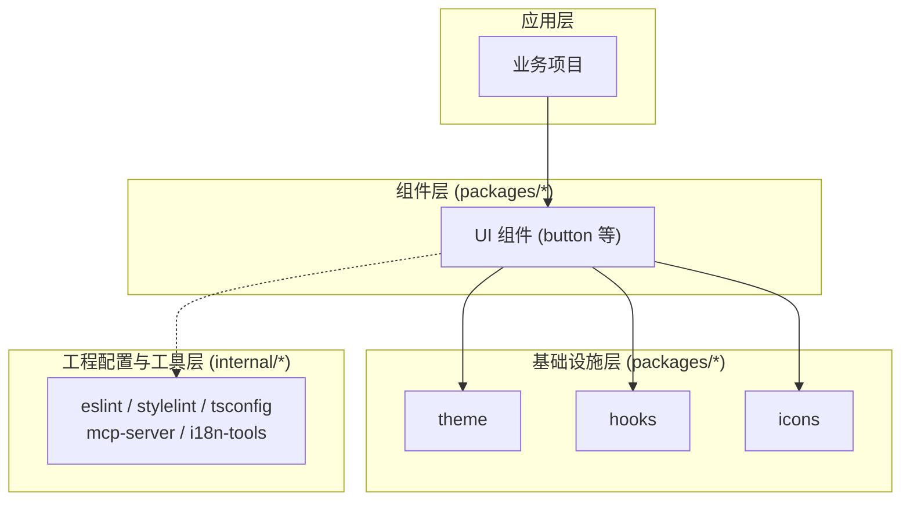

### 3.3 包依赖关系

组件包之间存在明确的依赖关系。主题 CSS Variables 由应用层全局引入（`import '@aix/theme/vars'`），组件通过 `var(--aix-*)` 隐式消费主题变量。以 `@aix/pdf-viewer` 为例：

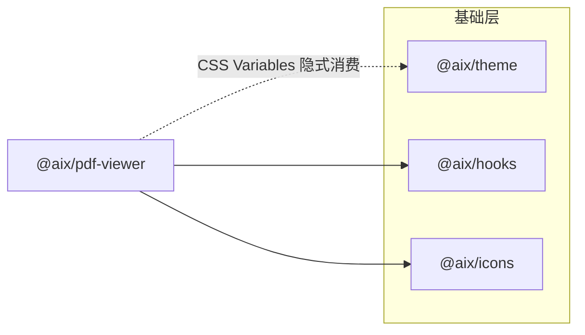

各组件的具体依赖关系见下方包职责表。

#### 外部依赖

所有组件的 peerDependency 为 `vue ^3.5`。部分组件有额外的运行时依赖，如 `@aix/pdf-viewer` 依赖 `pdfjs-dist`，`@aix/video` 依赖 `video.js`、`hls.js`、`flv.js`、`dashjs` 等流媒体库。具体版本见各包 `package.json`。

### 3.4 包职责划分

**基础设施层**（`packages/` 下，发布到 npm）：

| 包 | 职责 |
|------|------|
| `@aix/theme` | 三层 Token 体系、颜色算法、Vue 集成（createTheme/useTheme）、SSR 支持 |
| `@aix/hooks` | 通用 Composables：useLocale（国际化）、createLocale（全局上下文） |
| `@aix/icons` | SVG 图标 Vue 组件集合（~600+ 图标，10 个分类），构建时自动生成 |

**组件层**（`packages/` 下，发布到 npm）：各 UI 组件独立成包。

**工程配置与工具层**（`internal/` 下，发布到 npm）：

| 包 | 职责 |
|------|------|
| `@kit/eslint-config` | ESLint 规则集（base + vue-app 两套预设） |
| `@kit/stylelint-config` | Stylelint 规则集（SMACSS 属性排序） |
| `@kit/typescript-config` | TSConfig 预设（base / base-library / base-app） |
| `@aix/mcp-server` | MCP Server，提供组件库数据查询和工具调用 |
| `@kit/i18n-tools` | 国际化自动化工具（翻译文件生成、校验） |

---

## 4. 运行时视图

### 4.1 应用初始化流程

下图展示业务项目引入 AIX 组件库后，从应用启动到组件渲染的完整时序。

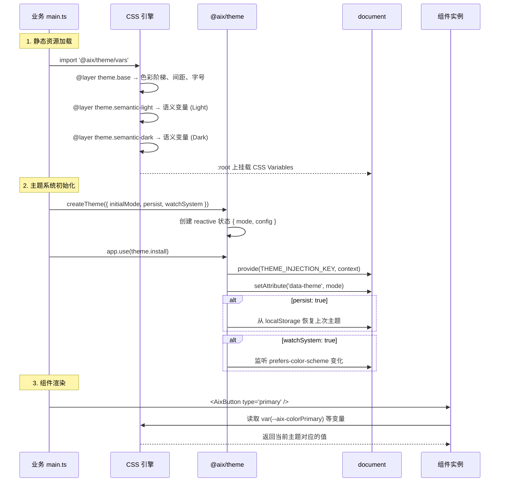

### 4.2 主题切换机制

主题切换通过修改 `:root` 的 `data-theme` 属性触发 CSS 选择器匹配，**零 JavaScript 运行时计算**。

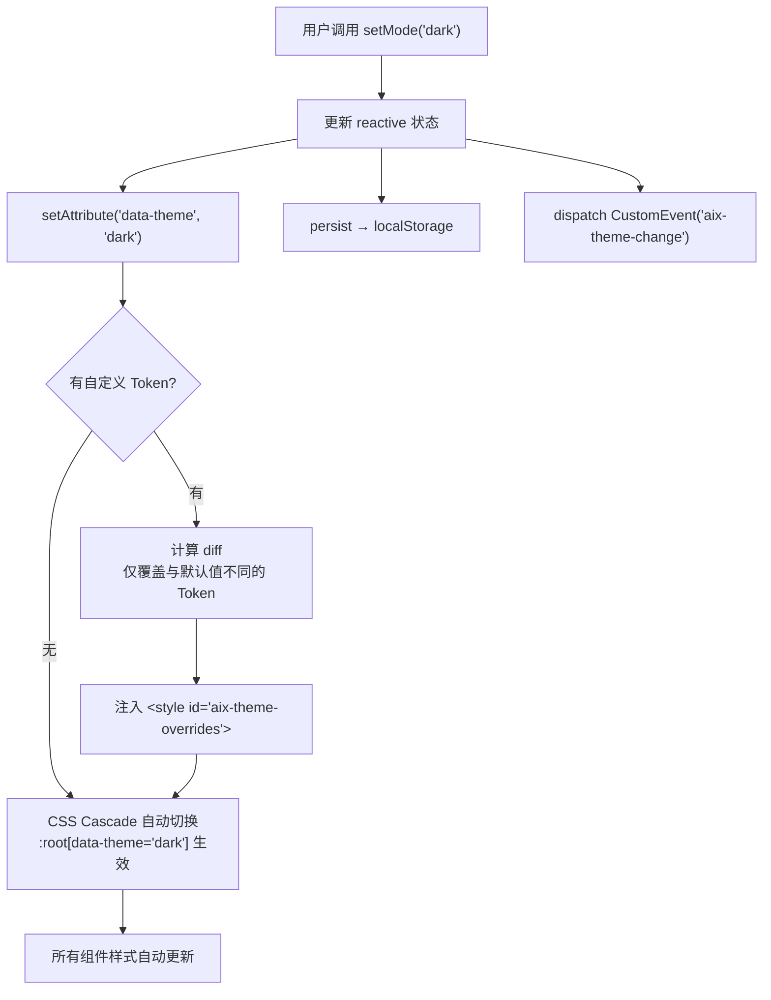

**关键设计**：
- **Diff-based 注入**：`syncToDOM()` 对比当前 Token 与基准 Token，仅注入差异部分，未自定义的变量零开销
- **双选择器兼容**：`:root[data-theme='dark']` 和 `.dark` 同时生效，兼容 Element Plus 等第三方库
- **Scoped Theme**：通过 `ThemeScope` 组件可创建局部主题域，生成独立 `<style>` 标签

### 4.3 Tree-shaking 与按需加载

组件库的按需加载依赖 ESM 模块结构和打包器的静态分析能力。

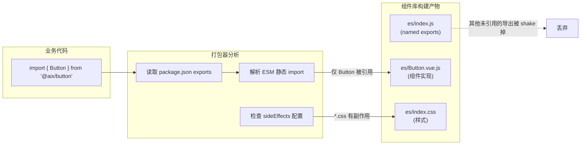

**保障 Tree-shaking 的关键配置**：

| 配置项 | 值 | 作用 |
|--------|-----|------|
| Rollup `preserveModules` | `true` | 每个源文件保留为独立模块，不合并 |
| Rollup `exports` | `'named'` | 使用命名导出，便于静态分析 |
| package.json `sideEffects` | `["*.css", "*.scss"]` | 仅 CSS 标记为有副作用，JS 可安全 shake |
| package.json `exports` | 多入口配置 | 为 types/import/require 提供独立入口 |

### 4.4 国际化运行时

国际化采用 Vue provide/inject 机制，无外部依赖。

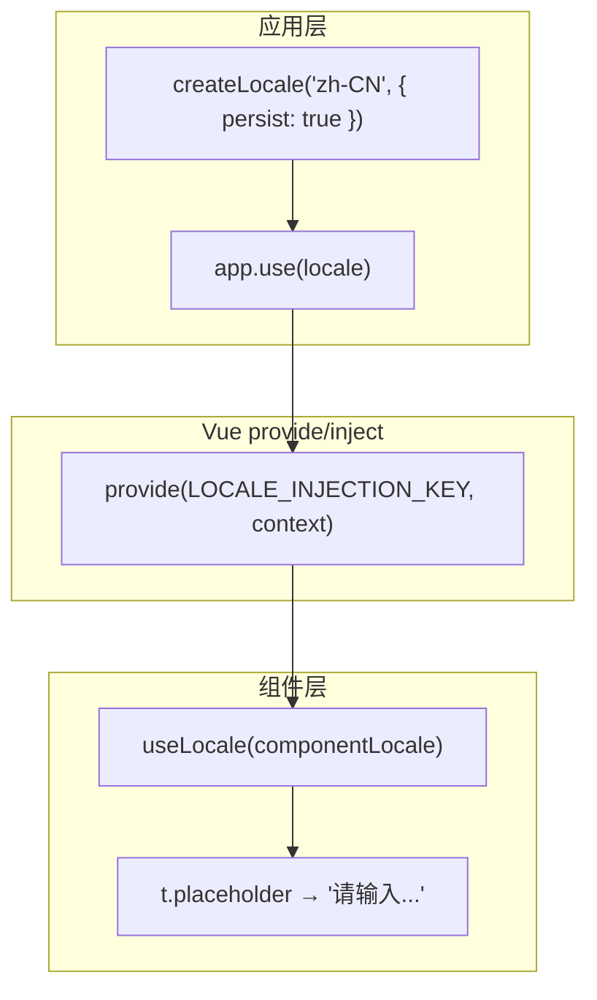

**工作流程**：
1. 应用层通过 `createLocale()` 创建全局语言上下文，注入 Vue 应用
2. 组件内部调用 `useLocale(componentLocale)` 获取当前语言的翻译文本
3. 每个组件在 `locale/` 目录定义自己的翻译文件（`zh-CN.ts`、`en-US.ts`）
4. 语言切换时，`computed` 自动重新计算翻译文本，组件无需额外处理

**当前覆盖**：支持 `zh-CN`（默认）和 `en-US`，仅 `@aix/pdf-viewer` 包含完整国际化文案。

---

## 5. 核心模块设计

### 5.1 主题系统

主题系统是组件库的核心基础设施，负责管理所有视觉相关的变量。

#### 三层 Token 架构

参考 Ant Design 5.0 的设计思路，采用三层 Token 分层：

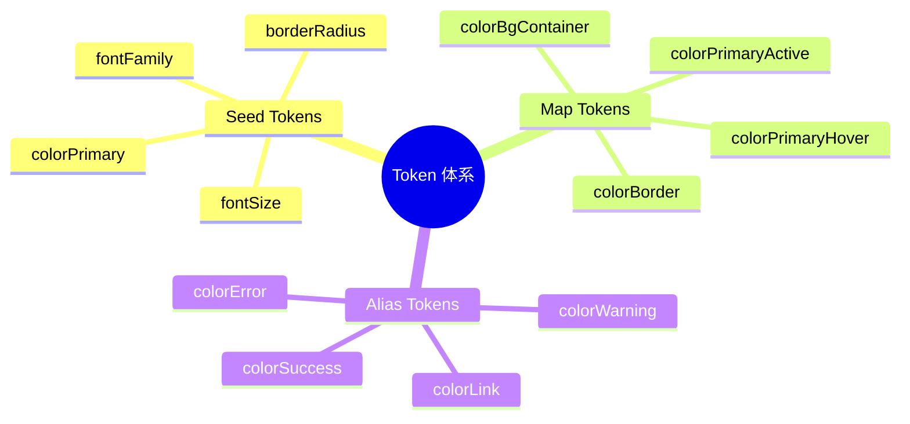

- **Seed Tokens（种子）**：最基础的设计变量（品牌色、字号），约 10-20 个。业务方只需修改种子即可定制整套主题。
- **Map Tokens（派生）**：由种子通过颜色算法自动生成（hover 态、active 态），约 50-100 个。
- **Alias Tokens（语义）**：具有语义含义的变量（链接色、成功色），约 100-200 个。

#### Token 派生流程

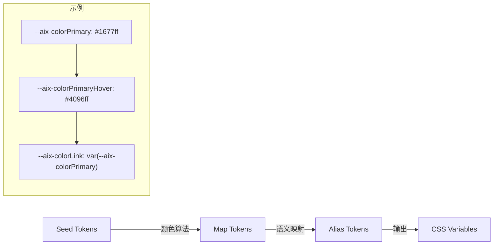

#### CSS Cascade Layers

主题 CSS 通过 `@layer` 分层管理，避免优先级冲突：

```css
@layer theme.base, theme.semantic-light, theme.semantic-dark;

@import './base-tokens.css'           layer(theme.base);
@import './semantic-tokens-light.css' layer(theme.semantic-light);
@import './semantic-tokens-dark.css'  layer(theme.semantic-dark);
```

| 层 | 内容 | 优先级 |
|----|------|--------|
| `theme.base` | 色彩阶梯（tokenCyan1-10）、间距、字号等原子变量 | 最低 |
| `theme.semantic-light` | 语义变量 Light 模式值 | 中 |
| `theme.semantic-dark` | 语义变量 Dark 模式值（`:root[data-theme='dark']`） | 最高 |
| 无 layer（transition.css） | 主题切换过渡动画，使用 `:where()` 降低优先级 | 层外 |

对不支持 `@layer` 的浏览器，提供 `@aix/theme/vars` 的 compat 入口（`index.compat.css`），回退为普通 CSS 级联。

#### Vue 集成 API

| API | 用途 |
|-----|------|
| `createTheme(options)` | 创建主题实例，返回 Vue 插件 |
| `useTheme()` | 组件内获取主题上下文（mode、setMode、toggleMode） |
| `ThemeScope` | 局部主题域组件，支持嵌套不同主题 |
| `cssVar.*` | Proxy 代理，`cssVar.colorPrimary` → `var(--aix-colorPrimary)` |
| `generateSSRInitScript()` | SSR 场景防闪烁脚本 |

#### 内置预设主题

| 预设 | 主色 | 用途 |
|------|------|------|
| default | Cyan | 默认品牌色 |
| tech | Blue | 科技感 |
| nature | Green | 自然清新 |
| sunset | Orange | 温暖活力 |
| purple | Purple | 高端雅致 |

### 5.2 国际化系统

国际化系统由 `@aix/hooks` 包提供，设计目标是**轻量、无外部依赖、按组件隔离**。

#### 架构决策

组件库只有少量 UI 文案（工具栏标签、提示文字），不需要 vue-i18n 的完整能力（复数、日期格式化等）。因此采用自建的 provide/inject 方案：

```
createLocale() → app.provide(LOCALE_INJECTION_KEY, context)
                      ↓
               useLocale(componentLocale) → { locale, t }
```

#### 组件接入模式

每个需要国际化的组件在 `locale/` 目录定义翻译：

```
packages/pdf-viewer/src/locale/
├── types.ts        # PdfViewerLocaleText 接口
├── index.ts        # ComponentLocale 定义
├── zh-CN.ts        # 中文翻译
└── en-US.ts        # 英文翻译
```

组件内部通过 `useLocale(locale)` 获取响应式翻译对象 `t`，语言切换自动生效。

### 5.3 图标系统

`@aix/icons` 包采用**构建时生成**策略：SVG 源文件 → 自动生成 Vue 组件 → Rollup 编译。

#### 生成流水线

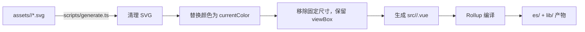

**设计要点**：
- 10 个图标分类（Apps、Device、Editor、File、General、Image、Map、Notification、Video 等），共 600+ 图标
- 每个图标导出为独立 Vue 组件，支持 Tree-shaking（`import { Add } from '@aix/icons'`）
- 接受 `width`、`height`、`color` props，默认使用 `currentColor` 继承父元素颜色
- 处理 HTML 保留字命名冲突（如 `Input` → `IconInput`）

---

## 6. 构建与部署

### 6.1 构建流程

整个构建流程由 Turbo 编排，自动分析包间依赖关系确保构建顺序。

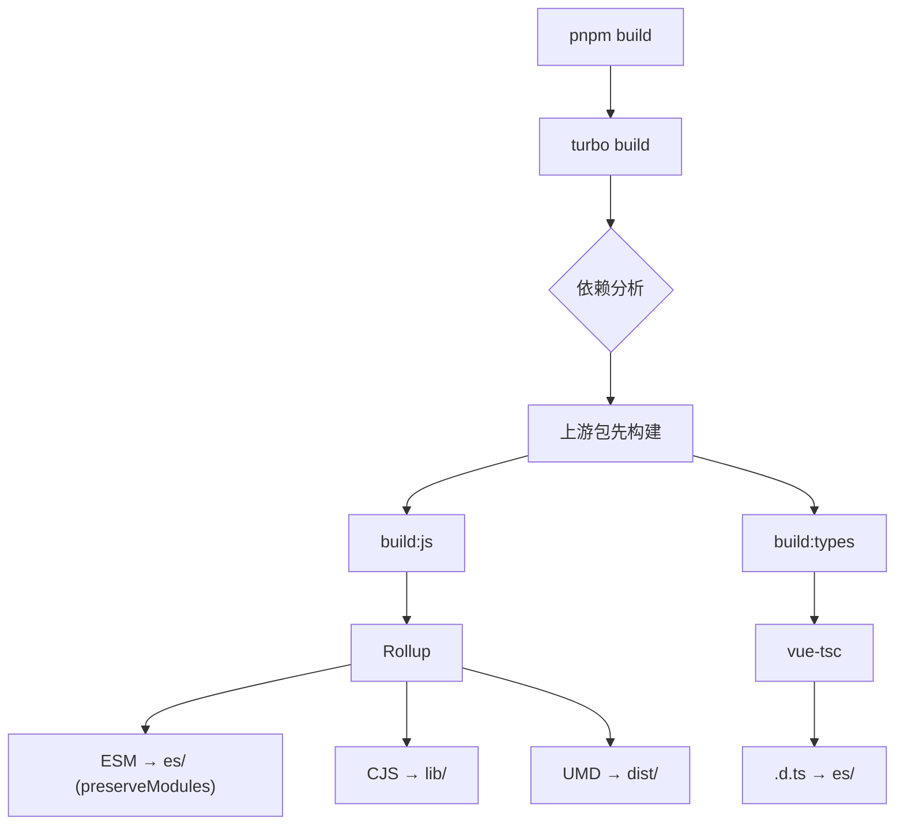

#### Rollup 插件链


#### 输出格式

| 格式 | 目录 | 特点 | 使用场景 |
|------|------|------|----------|
| ESM | `es/` | `preserveModules` 保留模块结构，支持 Tree-shaking | Vite/Webpack 5+ |
| CJS | `lib/` | CommonJS 格式 | Node.js/旧版打包器 |
| UMD | `dist/` | 单文件，已压缩 | CDN 直接引用 |

### 6.2 依赖管理

`workspace:*` 是 pnpm 的本地链接协议，**仅用于开发阶段**。`apps/client` 通过 `workspace:*` 引用所有组件包进行本地联调预览。

发布到 npm 时，组件包的 `package.json` 中 `@aix/*` 依赖必须替换为具体版本号（如 `"@aix/hooks": "^1.0.0"`），确保外部消费者能正确安装。

```json
// 开发时 (apps/client/package.json)
{
  "dependencies": {
    "@aix/button": "workspace:*",
    "@aix/theme": "workspace:*"
  }
}

// 发布时 (packages/button/package.json)
{
  "dependencies": {
    "@aix/theme": "^1.0.0",
    "@aix/hooks": "^1.0.0"
  }
}
```

### 6.3 npm 发布配置

组件包发布到私有 npm registry，遵循标准 exports 配置：

```json
{
  "name": "@aix/button",
  "main": "./lib/index.js",
  "module": "./es/index.js",
  "types": "./es/index.d.ts",
  "exports": {
    ".": {
      "types": "./es/index.d.ts",
      "import": "./es/index.js",
      "require": "./lib/index.js"
    },
    "./style": "./es/index.css"
  },
  "sideEffects": ["*.css", "*.scss"]
}
```

### 6.4 发布流程

发布使用 Changeset 管理版本、CHANGELOG 和 npm 发布：

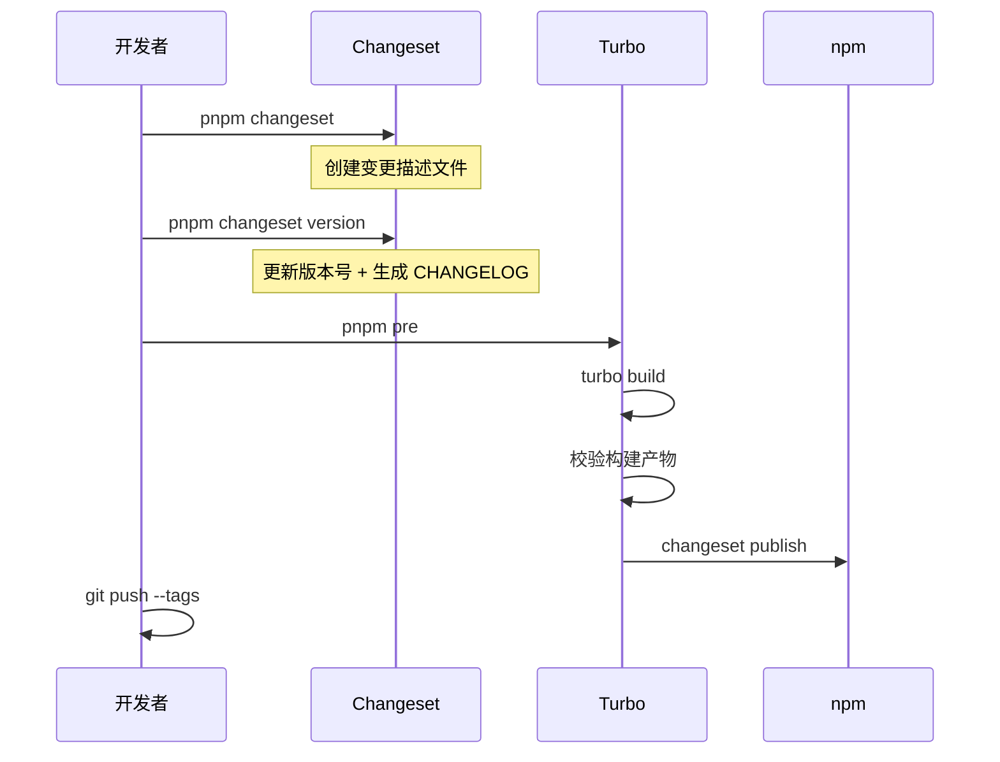

| 发布模式 | Tag | 版本格式 | 用途 |
|---------|-----|----------|------|
| release | latest | `1.0.0` | 正式版本 |
| beta | beta | `1.0.0-beta.0` | 内部测试 |
| alpha | alpha | `1.0.0-alpha.0` | 早期预览 |

### 6.5 CI/CD 流水线

GitLab CI 在 master 推送或 release 标签时自动触发：

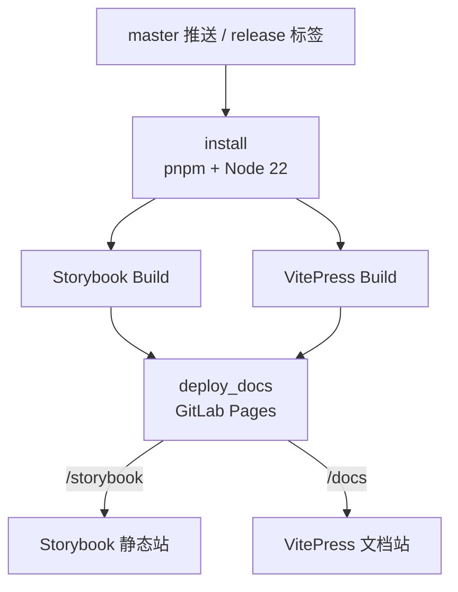

- Docker 镜像：`node:22-alpine`
- 缓存：`.pnpm-store/` + `node_modules/`
- Storybook 和 VitePress 并行构建

---

## 7. 质量保障

### 7.1 自动化检查流水线

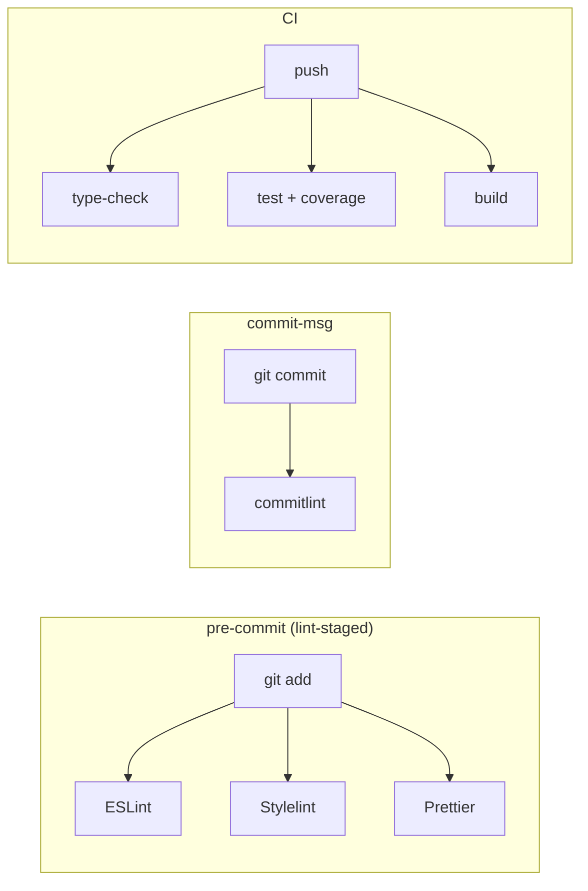

### 7.2 测试策略

| 层级 | 工具 | 覆盖范围 | 目标 |
|------|------|----------|------|
| 单元测试 | Vitest | Props/Emits/Slots 行为验证 | >= 80% |
| 组件测试 | Vue Test Utils | DOM 渲染、用户交互模拟 | 关键交互路径 |
| 可视化测试 | Storybook | UI 回归、样式变化检测 | 每个组件至少一个 Story |

### 7.3 工程配置体系

工程配置集中在 `internal/` 目录，各组件包通过继承复用。

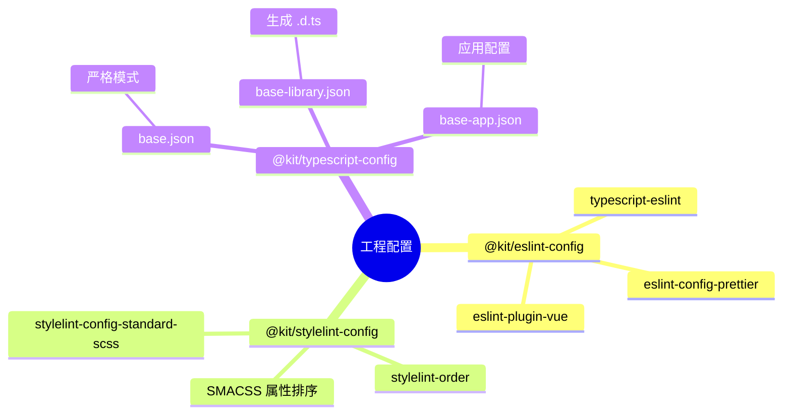

#### TypeScript 三层继承

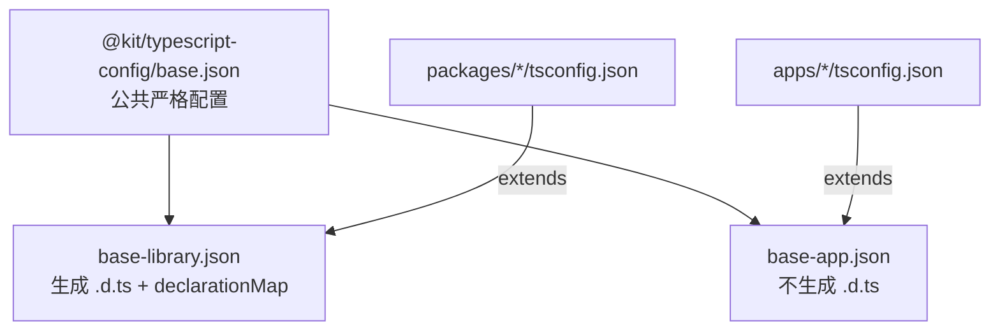

**关键编译选项**：

| 选项 | 值 | 说明 |
|------|------|------|
| `strict` | true | 全量严格检查 |
| `module` | ESNext | 现代模块语法 |
| `moduleResolution` | bundler | 适配 Vite/Rollup |
| `isolatedModules` | true | esbuild 兼容 |
| `noUncheckedIndexedAccess` | true | 索引访问安全检查 |
| `declaration` | true (lib) | 组件包生成类型声明 |

---

## 8. 扩展指南

### 新增组件包

```bash
# 1. 生成脚手架
pnpm gen <component-name>

# 2. 实现组件
# - src/types.ts      定义 Props/Emits 类型
# - src/<Name>.vue    实现组件逻辑和模板
# - src/index.ts      导出组件和类型

# 3. 编写测试
# - __test__/<name>.test.ts

# 4. 编写文档
# - stories/<Name>.stories.ts
```

生成后包含完整的目录结构：`src/`、`__test__/`、`stories/`、`package.json`、`tsconfig.json`、`rollup.config.js`。

---

## 9. 附录

### 9.1 术语表

| 术语 | 定义 |
|------|------|
| **Seed Token** | 最基础的设计变量（品牌色、基础字号），数量少，是整套主题的"种子" |
| **Map Token** | 由 Seed 通过颜色算法自动派生的变量（hover 态、active 态） |
| **Alias Token** | 具有语义含义的变量（`colorLink`、`colorSuccess`），组件直接引用 |
| **CSS Cascade Layer** | CSS `@layer` 规则，控制样式层级优先级，避免 specificity 冲突 |
| **Workspace 协议** | pnpm 的 `workspace:*` 语法，仅用于开发阶段链接本地包，发布时需替换为具体版本号 |
| **preserveModules** | Rollup 配置项，保留源文件模块结构，支持打包器 Tree-shaking |
| **ComponentLocale** | 组件级国际化定义，包含各语言的翻译键值对 |

### 9.2 关键配置文件

| 文件 | 说明 |
|------|------|
| `turbo.json` | 定义任务依赖关系和缓存策略 |
| `rollup.config.js` | 导出 `createRollupConfig()` 工厂函数 |
| `vitest.config.ts` | 配置测试环境和覆盖率报告 |
| `commitlint.config.ts` | 定义提交信息规则 |
| `.changeset/config.json` | 配置版本管理策略 |

### 9.3 常用命令速查

```bash
# 开发
pnpm dev                # 启动 watch 模式
pnpm storybook:dev      # 启动 Storybook 预览
pnpm docs:dev           # 启动 VitePress 文档

# 质量检查
pnpm lint               # ESLint
pnpm type-check         # TypeScript 类型检查
pnpm test               # 单元测试
pnpm cspell             # 拼写检查

# 构建发布
pnpm build              # 全量构建
pnpm build:filter -- --filter=@aix/button  # 单包构建
pnpm pre                # 执行发布流程
```
