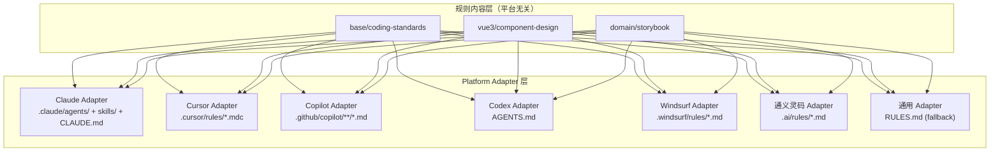
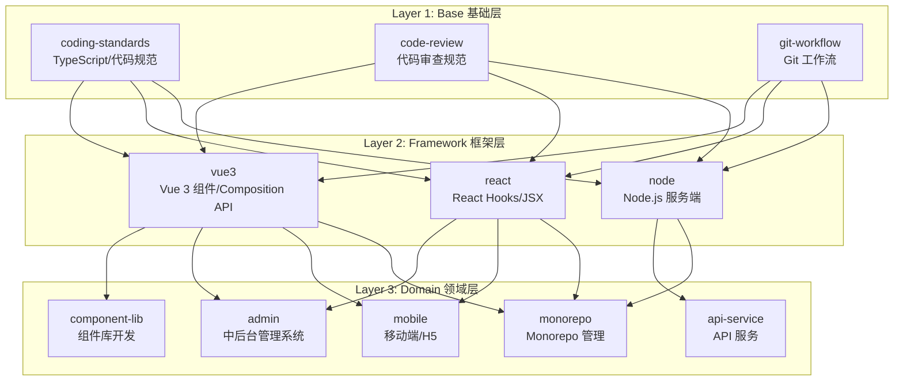
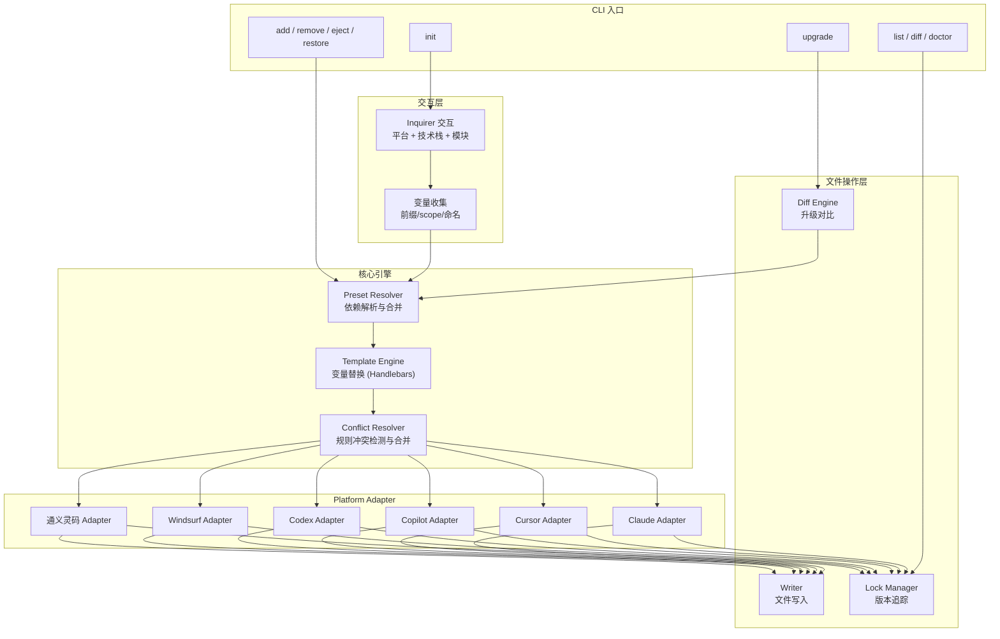
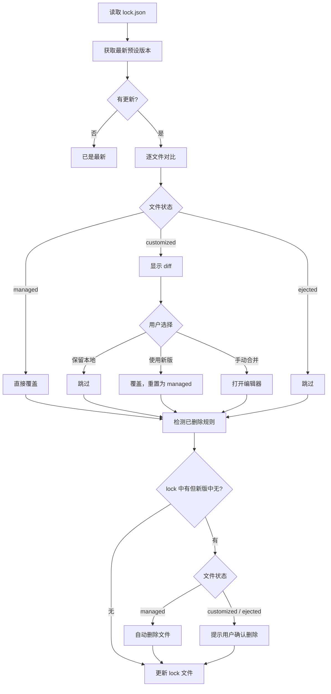

# AI 编码规范预设系统 (@kit/ai-preset)

> **状态**: 已完成
> **作者**: AIX Team
> **位置**: `kit/ai-preset/`

## 概述

跨 AI 平台的编码规范管理 CLI，通过统一的规则源文件格式编写一次规范内容，编译输出到 Claude Code、Cursor、GitHub Copilot、Windsurf、通义灵码等多个 AI 编码工具的配置目录。支持交互式选配技术栈预设、版本追踪升级、用户自定义规则。

## 动机

### 背景

AIX 组件库已建立完整的 Claude Code 规范体系（13 个 Agents、9 个 Skills、6 个 Commands、4 个 Hooks），显著提升了 AI 辅助编码的质量和一致性。但存在以下问题：

- **规范局限在单一仓库**：无法复用到团队其他业务仓库（中后台、Node 服务、移动端等）
- **绑定单一 AI 平台**：团队成员使用不同 AI 工具（Claude Code、Cursor、Copilot 等），相同的编码规范需要为每个平台重复编写
- **新仓库从零开始**：每个新项目都要手写规范文件，重复劳动且质量参差不齐
- **无法统一更新**：修正了规范措辞或新增规则，需人工同步到所有仓库
- **技术栈差异处理困难**：Vue 和 React、前端和后端需要不同规范组合，但基础规范是通用的

### 为什么需要这个方案

将 AI 编码规范作为独立工具发布，可以实现：

- **一行命令初始化**：`npx @kit/ai-preset init`，交互选择后即可使用
- **Write Once, Run Everywhere**：规则内容与平台格式解耦，一份规范同时输出到多个 AI 工具
- **按技术栈选配**：Vue 组件库、React 中后台、Node.js 服务等不同预设
- **可追踪的升级**：记录每个文件的来源版本，`upgrade` 命令自动更新未修改的文件
- **用户可深度自定义**：排除/追加规则、自定义规则目录、覆盖预设变量

## 目标与非目标

### 目标

| 优先级 | 目标 | 说明 |
|--------|------|------|
| P0 | 交互式 CLI 初始化 | 选择技术栈、AI 平台和模块后，生成完整配置 |
| P0 | 多 AI 平台支持 | 统一规则格式 + Platform Adapter，编译到各平台配置 |
| P0 | 预设分层体系 | base（通用）+ framework（框架）+ domain（领域）三层预设 |
| P0 | 版本追踪与升级 | `.ai-preset/lock.json` 追踪文件来源和修改状态，支持增量更新 |
| P1 | 用户自定义规则 | `.ai-preset/` 目录支持 exclude / include / 覆盖 |
| P1 | 模块粒度选配 | 追加/排除/弹出单个规则 |
| P1 | 自定义变量替换 | 安装时替换 CSS 前缀、包 scope 等项目变量 |
| P2 | 自定义预设发布 | 团队发布私有预设包 `@myteam/ai-preset-xxx` |
| P2 | 平台自动检测 | 扫描项目目录自动推荐 AI 工具 |

### 非目标

- 不替代任何 AI 工具自身的功能（不是 IDE 插件）
- 不强制规范（安装后业务方可自由修改任何文件）
- 不提供运行时能力（纯静态文件生成工具）
- 不管理 MCP Server 的安装和运行（仅生成配置模板）

## 核心概念

### 规则内容与平台格式解耦

这是整个系统的核心架构决策：



**编写一次，输出多处**：规范内容使用统一中间格式编写，各 Adapter 编译为平台特定文件。

### 各平台配置格式对比

| 平台 | 配置位置 | 规则格式 | 特有能力 |
|------|---------|---------|---------|
| **Claude Code** | `.claude/agents/`, `.claude/skills/`, `CLAUDE.md` | Markdown (frontmatter) | Agents、Skills、Commands、Hooks |
| **Cursor** | `.cursor/rules/*.mdc` | MDC (Markdown + frontmatter) | `globs` 文件匹配、`alwaysApply` |
| **GitHub Copilot** | `.github/copilot-instructions.md`, `.github/copilot/**/*.md` | Markdown | 多文件指令（2025+ 支持目录模式） |
| **OpenAI Codex** | `AGENTS.md`, `agents/*.md` | Markdown | Agent 定义文件 |
| **Windsurf** | `.windsurf/rules/*.md` | Markdown | `trigger` 触发条件 |
| **通义灵码** | `.ai/rules/*.md`, `project.rule.json` | Markdown + JSON | 角色指令、知识库 |

### 平台能力矩阵

| 能力 | Claude | Cursor | Copilot | Codex | Windsurf | 通义灵码 |
|------|--------|--------|---------|-------|----------|---------|
| **规则文档** | ✅ agents/ | ✅ rules/ | ✅ 多文件指令 | ✅ agents/ | ✅ rules/ | ✅ rules/ |
| **代码生成工具** | ✅ skills/ | ❌ | ❌ | ❌ | ❌ | ❌ |
| **快速命令** | ✅ commands/ | ❌ | ❌ | ❌ | ❌ | ❌ |
| **自动化钩子** | ✅ hooks | ❌ | ❌ | ❌ | ❌ | ❌ |
| **文件匹配** | 自动 | ✅ globs | ❌ | ❌ | ✅ trigger | ❌ |
| **MCP 协议** | ✅ | ✅ | ❌ | ❌ | ❌ | ❌ |

**处理策略**：
- **规则文档**：多平台编译（核心能力）
- **Skills / Commands / Hooks**：仅在 Claude Code 上生成（平台专属能力）
- **globs / trigger**：仅在支持的平台上写入 frontmatter

### 三层预设体系



| 层级 | 说明 | 是否必选 | 示例 |
|------|------|---------|------|
| **Base** | 与框架无关的通用规范 | 始终包含 | TypeScript 规范、代码审查、Git 工作流 |
| **Framework** | 框架特定的编码规范 | 必选其一 | Vue 3 / React / Node.js |
| **Domain** | 业务领域特定的规范和工具 | 可选多个 | 组件库、中后台、移动端、API 服务 |

### 文件分类与升级策略

| 类型 | 说明 | 多平台支持 | 升级策略 |
|------|------|-----------|---------|
| **Rule** | 编码规范文档 | ✅ 全平台编译 | 未修改则覆盖，已修改则提示 diff |
| **Skill** | 代码生成工具 | 仅 Claude | 同上 |
| **Command** | 快速提示清单 | 仅 Claude | 同上 |
| **Hook** | 自动化事件规则 | 仅 Claude | 合并策略（不覆盖已有 hooks） |
| **Template** | 项目根说明文件 | 按平台生成 | 仅首次生成，后续不更新 |

## 系统架构

### 架构图



### 包结构

```
kit/ai-preset/
├── src/
│   ├── index.ts                    # CLI 入口
│   ├── types.ts                    # 公共类型定义
│   │
│   ├── commands/                   # CLI 命令
│   │   ├── init.ts                 # 初始化
│   │   ├── upgrade.ts              # 升级
│   │   ├── add.ts                  # 追加模块/规则
│   │   ├── remove.ts               # 移除模块/规则
│   │   ├── eject.ts                # 弹出为自定义
│   │   ├── list.ts                 # 查看已安装
│   │   ├── diff.ts                 # 查看变更
│   │   └── doctor.ts               # 健康检查
│   │
│   ├── core/
│   │   ├── resolver.ts             # 预设解析与合并
│   │   ├── template.ts             # 模板引擎 (Handlebars)
│   │   ├── writer.ts               # 文件写入
│   │   ├── lock.ts                 # lock 文件管理
│   │   ├── diff.ts                 # diff 对比引擎
│   │   ├── detector.ts             # AI 平台自动检测
│   │   └── conflict.ts             # 规则冲突处理
│   │
│   ├── adapters/                   # 平台适配器
│   │   ├── types.ts                # 适配器接口
│   │   ├── claude.ts               # Claude Code 适配器
│   │   ├── cursor.ts               # Cursor 适配器
│   │   ├── copilot.ts              # GitHub Copilot 适配器
│   │   ├── codex.ts                # OpenAI Codex 适配器
│   │   ├── windsurf.ts             # Windsurf 适配器
│   │   ├── tongyi.ts               # 通义灵码适配器
│   │   └── generic.ts              # 通用 RULES.md 适配器
│   │
│   └── presets/                    # 预设文件（随包发布）
│       ├── base/                   # 基础层
│       │   ├── preset.json
│       │   ├── rules/
│       │   │   ├── coding-standards.md
│       │   │   ├── code-review.md
│       │   │   └── git-workflow.md
│       │   ├── commands/           # Claude 专属
│       │   │   └── review-pr.md
│       │   ├── hooks.json          # Claude 专属
│       │   └── templates/
│       │       ├── CLAUDE.md.hbs
│       │       └── cursor-rules.md.hbs
│       │
│       ├── frameworks/
│       │   ├── vue3/
│       │   │   ├── preset.json
│       │   │   ├── rules/
│       │   │   │   ├── component-design.md
│       │   │   │   └── vue-coding-standards.md
│       │   │   ├── skills/         # Claude 专属
│       │   │   │   ├── component-generator/
│       │   │   │   └── test-generator/
│       │   │   └── commands/       # Claude 专属
│       │   │       └── component.md
│       │   ├── react/
│       │   └── node/
│       │
│       └── domains/
│           ├── component-lib/
│           ├── admin/
│           ├── mobile/
│           ├── api-service/
│           ├── monorepo/
│           └── team/
│
├── package.json
├── tsconfig.json
└── README.md
```

## 详细设计

### 统一规则源文件格式

所有规则使用统一的 Markdown + frontmatter 格式编写，适配器负责编译为各平台格式：

```markdown
---
id: vue-component-design
name: Vue 组件设计规范
category: framework/vue3
priority: high
globs: ["**/*.vue", "**/*.ts"]
alwaysApply: false
tags: [vue, component, props, emits]
platforms:
  claude:
    type: agent                       # 输出为 agent 文件
  cursor:
    alwaysApply: false                # Cursor 特定属性
  copilot:
    merge: true                       # 合并到单一指令文件
---

## Props 设计规范

- 布尔类型使用 `is/has/show` 前缀（如 `isActive`, `showIcon`）
- 数组类型使用复数命名（如 `options`, `columns`）
- 命名风格使用 camelCase
- 默认值设为最常用的值

## Emits 设计规范

- 事件名使用动词原型 + kebab-case（`change`, `update:modelValue`）
- 事件参数类型完整，明确参数含义
...
```

**frontmatter 字段说明**：

| 字段 | 类型 | 必填 | 说明 |
|------|------|------|------|
| `id` | string | 是 | 规则唯一标识，用于引用和覆盖 |
| `name` | string | 是 | 规则名称 |
| `category` | string | 是 | 所属分类（`base/xxx`, `framework/vue3`, `domain/component-lib`） |
| `priority` | enum | 否 | 优先级：`high` / `medium` / `low`，影响编译排序 |
| `globs` | string[] | 否 | 适用文件（Cursor/Windsurf 使用），默认不限制 |
| `alwaysApply` | boolean | 否 | 是否始终生效（Cursor 使用），默认 `false` |
| `tags` | string[] | 否 | 搜索标签 |
| `platforms` | object | 否 | 平台特定配置覆盖，不指定则全平台 |

### 适配器编译规则

同一份规则文件，各适配器的输出对比：

```
输入: rules/component-design.md (统一格式)

→ Claude:   .claude/agents/component-design.md
            (添加 Claude agent frontmatter: name, description, tools)

→ Cursor:   .cursor/rules/component-design.mdc
            (添加 Cursor frontmatter: globs, alwaysApply)

→ Copilot:  .github/copilot-instructions.md (入口)
            .github/copilot/component-design.md (子文件)

→ Codex:    AGENTS.md
            (所有规则合并为 ## 章节)

→ Windsurf: .windsurf/rules/component-design.md
            (添加 Windsurf frontmatter: trigger)

→ 通义灵码:  .ai/rules/component-design.md
            (添加角色指令头)
```

适配器接口定义：

```typescript
interface PlatformAdapter {
  /** 平台标识 */
  id: string;
  /** 检测项目是否使用该平台 */
  detect(projectRoot: string): boolean;
  /** 将规则编译为平台特定格式 */
  compileRule(rule: RuleFile, variables: Variables): CompiledFile[];
  /** 编译平台专属能力（skills/commands/hooks 等） */
  compileExtras(preset: Preset, variables: Variables): CompiledFile[];
  /** 生成平台入口文件（CLAUDE.md / .cursorrules 等） */
  compileEntryFile(presets: Preset[], variables: Variables): CompiledFile | null;
  /** 合并配置（hooks 等） */
  mergeConfig(existing: object, incoming: object): object;
}
```

### 预设清单文件 (preset.json)

每个预设模块包含一个 `preset.json` 描述自身的元信息。

**Framework 层示例**（vue3）：

```jsonc
{
  "name": "vue3",
  "layer": "framework",
  "displayName": "Vue 3",
  "description": "Vue 3 Composition API + TypeScript 编码规范",
  "requires": ["base"],
  "conflicts": ["react"],
  "variables": [
    {
      "key": "componentPrefix",
      "prompt": "组件 CSS 类名前缀",
      "default": "app",
      "validate": "^[a-z][a-z0-9-]*$"
    },
    {
      "key": "packageScope",
      "prompt": "npm 包 scope（如 @myteam）",
      "default": "",
      "validate": "^(@[a-z0-9-]+)?$"
    }
  ],
  "files": [
    {
      "src": "rules/component-design.md",
      "type": "rule",
      "template": true,
      "platforms": ["claude", "cursor", "copilot", "windsurf", "tongyi"]
    },
    {
      "src": "skills/component-generator/SKILL.md",
      "type": "skill",
      "template": true,
      "platforms": ["claude"]
    },
    {
      "src": "commands/component.md",
      "type": "command",
      "platforms": ["claude"]
    }
  ],
  "hooks": {
    "PostToolUse": [
      {
        "matcher": "Write|Edit",
        "hooks": [{ "type": "command", "command": "printf '✅ %s\\n' \"$CLAUDE_FILE_PATH\"", "timeout": 5 }]
      }
    ]
  },
  "entrySection": {
    "title": "## Vue 3 开发规范",
    "template": "templates/vue-section.md.hbs"
  }
}
```

**Domain 层示例**（component-lib）：

```jsonc
{
  "name": "component-lib",
  "layer": "domain",
  "displayName": "组件库开发",
  "description": "组件库开发规范、Storybook、无障碍、发布流程",
  "requires": ["vue3"],              // domain 层必须声明所依赖的 framework 层
  "conflicts": [],
  "variables": [],
  "files": [
    { "src": "rules/storybook-development.md", "type": "rule", "platforms": ["claude", "cursor", "copilot", "windsurf", "tongyi"] },
    { "src": "rules/accessibility.md", "type": "rule", "platforms": ["claude", "cursor", "copilot", "windsurf", "tongyi"] },
    { "src": "skills/story-generator/SKILL.md", "type": "skill", "platforms": ["claude"] }
  ]
}
```

> **注意**：`requires` 字段在所有层级均生效。Resolver 在安装时校验依赖是否满足，`remove` 时校验反向依赖。

### Lock 文件 (.ai-preset/lock.json)

```jsonc
{
  "version": "1.0.0",                       // lock 格式版本
  "installedAt": "2026-03-29T10:00:00Z",
  "updatedAt": "2026-03-29T10:00:00Z",
  "presets": {                               // 各预设模块独立版本追踪
    "base": { "version": "1.0.0" },
    "vue3": { "version": "1.2.0" },
    "component-lib": { "version": "1.1.0" },
    "monorepo": { "version": "1.0.0" }
  },
  "platforms": ["claude", "cursor"],
  "variables": {
    "componentPrefix": "aix",
    "packageScope": "@aix"
  },
  "files": {
    ".claude/agents/coding-standards.md": {
      "source": "base/coding-standards",
      "platform": "claude",
      "hash": "sha256:a1b2c3d4...",
      "status": "managed"
    },
    ".cursor/rules/coding-standards.mdc": {
      "source": "base/coding-standards",
      "platform": "cursor",
      "hash": "sha256:e5f6g7h8...",
      "status": "managed"
    },
    ".claude/agents/component-design.md": {
      "source": "vue3/component-design",
      "platform": "claude",
      "hash": "sha256:i9j0k1l2...",
      "status": "customized"
    },
    ".claude/skills/component-generator/SKILL.md": {
      "source": "vue3/component-generator",
      "platform": "claude",
      "hash": "sha256:m3n4o5p6...",
      "status": "managed"
    }
  }
}
```

**文件状态**：

| 状态 | 含义 | 升级行为 | 恢复方式 |
|------|------|---------|---------|
| `managed` | 用户未修改，hash 与安装时一致 | 直接覆盖为新版本 | — |
| `customized` | 用户已修改 | 提示 diff，用户选择保留/覆盖/合并 | `restore` 重置为预设版本 |
| `ejected` | 用户主动弹出 | 不再参与升级 | `restore` 重置为预设版本 |

### 用户自定义配置

用户在项目根目录创建 `.ai-preset/config.json` 进行深度自定义：

```jsonc
// .ai-preset/config.json
{
  // 预设组合（等效于 init 时的选择）
  "presets": ["base", "vue3", "component-lib"],

  // 目标平台
  "platforms": ["claude", "cursor"],

  // 排除不需要的规则
  "exclude": [
    "base/git-workflow",
    "component-lib/npm-publishing"
  ],

  // 追加自定义规则文件（相同格式）
  "include": [
    "./custom-rules/our-api-convention.md",
    "./custom-rules/naming-rules.md"
  ],

  // 变量
  "variables": {
    "componentPrefix": "aix",
    "packageScope": "@aix"
  },

  // 平台特定配置
  "platformOptions": {
    "claude": {
      "skills": true,
      "commands": true,
      "hooks": true
    },
    "cursor": {
      "alwaysApplyRules": ["base/coding-standards"]
    }
  }
}
```

自定义规则目录结构：

```
.ai-preset/
├── config.json               # 配置文件
├── custom-rules/             # 自定义规则（统一格式）
│   ├── our-api-convention.md
│   └── naming-rules.md
└── lock.json                 # 版本追踪（自动生成）
```

### CLI 命令设计

#### `init` — 初始化

```bash
npx @kit/ai-preset init
```

交互流程：

```
┌─────────────────────────────────────────────┐
│  🤖 AI Preset 初始化                        │
├─────────────────────────────────────────────┤
│                                             │
│  ? 选择 AI 工具 (可多选)                    │
│    ☑ Claude Code (.claude/)                 │
│    ☐ Cursor (.cursor/rules/)                │
│    ☐ GitHub Copilot (.github/)              │
│    ☐ Windsurf (.windsurf/)                  │
│    ☐ 通义灵码 (.ai/)                        │
│                                             │
│  ? 选择框架 (必选一个)                      │
│    ● Vue 3                                  │
│    ○ React                                  │
│    ○ Node.js                                │
│    ○ Vue 3 + Node.js (全栈)                 │
│    ○ React + Node.js (全栈)                 │
│                                             │
│  ? 选择领域模块 (可多选)                    │
│    ◻ 组件库开发                              │
│    ◻ 中后台管理系统                          │
│    ◻ 移动端 / H5                            │
│    ◻ API 服务                               │
│    ◻ Monorepo 管理                           │
│    ◻ Team 多 Agent 协作                      │
│                                             │
│  ? 组件 CSS 类名前缀: aix                   │
│  ? npm 包 scope (@xxx): @aix                │
│                                             │
│  📋 将安装以下模块:                         │
│     base + vue3 + component-lib + monorepo  │
│                                             │
│  📁 将生成以下文件:                         │
│     Claude Code:                            │
│       .claude/agents/        8 个文件       │
│       .claude/skills/        6 个目录       │
│       .claude/commands/      5 个文件       │
│       .claude/settings.json  hooks 配置     │
│       CLAUDE.md              项目说明       │
│     Cursor:                                 │
│       .cursor/rules/         8 个文件       │
│     配置:                                   │
│       .ai-preset/config.json               │
│       .ai-preset/lock.json                 │
│                                             │
│  ? 确认安装? (Y/n)                          │
└─────────────────────────────────────────────┘
```

**已有文件处理策略**：

如果项目中已存在目标文件（如 `.claude/agents/coding-standards.md`），`init` 按以下策略处理：

| 场景 | 处理方式 |
|------|---------|
| 目标文件不存在 | 直接生成 |
| 目标文件已存在且内容与预设一致 | 跳过，标记为 `managed` |
| 目标文件已存在且内容不同 | 交互提示：覆盖 / 保留（标记为 `customized`）/ 查看 diff |
| `--force` 模式 | 全部覆盖，已有文件标记为 `managed` |

非交互模式：

```bash
npx @kit/ai-preset init \
  --platform claude,cursor \
  --framework vue3 \
  --domain component-lib,monorepo \
  --prefix aix \
  --scope @aix \
  --yes

# 强制覆盖已有文件
npx @kit/ai-preset init --force

# 自动检测项目使用的 AI 工具
npx @kit/ai-preset init --detect
```

#### `upgrade` — 升级

```bash
npx @kit/ai-preset upgrade
```



**已删除规则处理**：upgrade 在完成文件更新后，反向对比 lock 中记录的文件与新版本的文件列表。对于新版本中已移除的规则，managed 文件自动清理，customized / ejected 文件提示用户确认。

**自动备份**：每次 `upgrade` 前，自动将即将被修改的文件备份到 `.ai-preset/backup/`（仅保留最近一次），确保误操作可恢复。

```bash
# 预览（dry-run）
npx @kit/ai-preset upgrade --dry-run

# 强制覆盖所有（包括 customized）
npx @kit/ai-preset upgrade --force

# 仅升级特定平台
npx @kit/ai-preset upgrade --platform claude

# 仅升级规则文件（不动 skills/commands）
npx @kit/ai-preset upgrade --only rules

# 从备份恢复上一次 upgrade 前的状态
npx @kit/ai-preset upgrade --rollback
```

#### `add` — 追加

```bash
# 追加领域模块
npx @kit/ai-preset add mobile

# 追加单个规则
npx @kit/ai-preset add --rule accessibility

# 追加单个 skill（Claude 专属）
npx @kit/ai-preset add --skill a11y-checker

# 追加新平台
npx @kit/ai-preset add --platform cursor

# 追加自定义本地规则
npx @kit/ai-preset add --local ./my-rules/custom-rule.md
```

#### `remove` — 移除

```bash
# 移除领域模块
npx @kit/ai-preset remove mobile

# 移除单个规则
npx @kit/ai-preset remove --rule accessibility

# 移除平台
npx @kit/ai-preset remove --platform windsurf
```

**依赖检查**：remove 前自动扫描反向依赖。如果被移除的模块被其他已安装模块依赖（如 `component-lib` 的 `requires` 包含 `vue3`），交互提示用户：

```
⚠️  以下已安装模块依赖 vue3:
  - component-lib (requires: vue3)

? 如何处理?
  ● 同时移除 component-lib 和 vue3
  ○ 取消操作
```

#### `eject` — 弹出

将 managed 文件标记为 ejected，不再参与自动升级：

```bash
# 弹出特定文件，后续自行维护
npx @kit/ai-preset eject .claude/agents/component-design.md

# 弹出整个模块
npx @kit/ai-preset eject --module component-lib
```

#### `restore` — 恢复托管

将 ejected 或 customized 文件重置为最新预设版本，状态改回 managed：

```bash
# 恢复单个文件为预设版本
npx @kit/ai-preset restore .claude/agents/component-design.md

# 恢复整个模块
npx @kit/ai-preset restore --module component-lib

# 预览将恢复哪些文件
npx @kit/ai-preset restore --dry-run
```

#### `list` — 查看状态

```bash
npx @kit/ai-preset list
```

输出：

```
📦 AI Preset v1.2.0
  预设: base, vue3, component-lib, monorepo
  平台: claude, cursor
  变量: prefix=aix, scope=@aix

📁 Claude Code (21 files):
  Rules → Agents (8):
    ✅ coding-standards.md        managed
    ✏️  component-design.md       customized
    🔓 accessibility.md           ejected
    ...
  Skills (6):  ✅ 全部 managed
  Commands (5): ✅ 全部 managed

📁 Cursor (8 files):
  Rules (8):
    ✅ coding-standards.mdc       managed
    ✏️  component-design.mdc      customized
    ...

📁 自定义规则 (2 files):
    our-api-convention.md
    naming-rules.md
```

#### `diff` — 查看变更

```bash
# 查看所有本地修改
npx @kit/ai-preset diff

# 查看特定文件
npx @kit/ai-preset diff .claude/agents/component-design.md
```

#### `doctor` — 健康检查

```bash
npx @kit/ai-preset doctor
```

输出：

```
🔍 AI Preset 健康检查

✅ lock.json 完整
✅ 预设依赖关系正确
⚠️  component-design.md: Claude 和 Cursor 内容不同步（Cursor 缺少本地修改）
⚠️  ai-preset 有新版本可用 (1.2.0 → 1.3.0)
❌ 规则冲突: base/coding-standards 和 vue3/vue-coding-standards 有重叠内容

建议:
  运行 npx @kit/ai-preset upgrade 升级到最新版本
  component-design.md 跨平台不同步: 建议 eject 该文件或编辑源规则后重新 init
```

### 规则冲突处理

多个预设可能对同一主题给出规则（如 base 和 vue3 都有 coding-standards），合并策略：

```jsonc
// preset.json 中的文件声明
{
  "files": [
    {
      "src": "rules/vue-coding-standards.md",
      "type": "rule",
      "merge": "append",                    // replace | append | prepend
      "mergeTarget": "base/coding-standards" // 使用规则 id（category/name），确保全局唯一
    }
  ]
}
```

| 策略 | 说明 | 适用场景 |
|------|------|---------|
| `standalone` | 独立文件，不合并（默认） | 大多数规则 |
| `append` | 追加到目标规则末尾 | 框架层补充基础层 |
| `prepend` | 前置到目标规则开头 | 高优先级覆盖 |
| `replace` | 完全替换目标规则 | 框架层重写基础层 |

### Hooks 合并策略

```typescript
function getHookKey(hook: HookRule): string {
  // 按 matcher + command 组合键去重，避免 JSON.stringify 的 key 顺序问题
  return `${hook.matcher ?? '*'}::${hook.hooks.map((h) => h.command).join('|')}`;
}

function mergeHooks(existing: Settings, incoming: HooksConfig): Settings {
  for (const [event, rules] of Object.entries(incoming)) {
    if (!existing.hooks[event]) {
      existing.hooks[event] = rules;
    } else {
      const existingKeys = new Set(existing.hooks[event].map(getHookKey));
      for (const rule of rules) {
        if (!existingKeys.has(getHookKey(rule))) {
          existing.hooks[event].push(rule);
        }
      }
    }
  }
  return existing;
}
```

**关键原则**：
- 不覆盖用户已有的 hooks（追加模式）
- 相同 matcher 的 hook 不重复添加
- `settings.json` 中的 `permissions` 和 `mcpServers` 不被 preset 管理

### 模板变量系统

模板文件使用 Handlebars 语法：

```markdown
<!-- rules/component-design.md.hbs -->
## 样式命名规范

所有组件 CSS 类名使用 `.{{componentPrefix}}-` 前缀：

```scss
.{{componentPrefix}}-button {
  color: var(--{{componentPrefix}}-color-primary);
}
```
```

**内置变量**：

| 变量名 | 说明 | 示例 |
|--------|------|------|
| `componentPrefix` | CSS 类名前缀 | `aix`, `ant`, `el` |
| `packageScope` | npm scope | `@aix`, `@myteam` |
| `projectName` | 项目名称 | `my-component-lib` |
| `framework` | 框架名 | `vue3`, `react`, `node` |
| `year` | 当前年份 | `2026` |
| `platforms` | 已选平台列表 | `["claude", "cursor"]` |

### 入口文件生成策略

各平台的"总入口文件"生成规则：

| 平台 | 入口文件 | 生成方式 | 升级行为 |
|------|---------|---------|---------|
| Claude | `CLAUDE.md` | 多预设章节拼装 | 标记区域内可增量更新 |
| Cursor | `.cursorrules` (可选) | 引用 rules 目录 | 仅首次生成 |
| Copilot | `.github/copilot-instructions.md` + `.github/copilot/**/*.md` | 入口文件 + 按规则拆分为子文件 | 未修改则覆盖 |
| Codex | `AGENTS.md` | 所有规则合并为单文件 | 未修改则覆盖 |
| Windsurf | `.windsurfrules` (可选) | 引用 rules 目录 | 仅首次生成 |

**入口文件增量更新**：

入口文件（如 `CLAUDE.md`）采用标记区域策略，支持 `add` / `remove` 后增量更新预设章节，同时保留用户自由编辑的内容：

```markdown
# 项目说明

这里是用户自己写的内容，不会被 ai-preset 修改。

<!-- ai-preset:start -->
## 核心技术栈
（由 base 预设生成）

## Vue 3 开发规范
（由 vue3 预设生成）

## 组件库开发规范
（由 component-lib 预设生成）
<!-- ai-preset:end -->

## 其他说明

这里也是用户自己写的内容，同样不会被修改。
```

- `<!-- ai-preset:start/end -->` 标记区域内的内容由 preset 管理，`add` / `remove` / `upgrade` 会更新此区域
- 标记区域外的内容完全由用户控制，任何命令都不会修改
- 首次 `init` 时生成完整文件并插入标记区域；如果入口文件已存在且无标记，则追加到文件末尾

## 预设内容规划

### Base 层（始终包含）

| 类型 | 文件 | 说明 | 平台 |
|------|------|------|------|
| Rule | `coding-standards.md` | TypeScript 编码规范 | 全平台 |
| Rule | `code-review.md` | 代码审查清单与分级 | 全平台 |
| Rule | `git-workflow.md` | 分支策略、Commit 规范 | 全平台 |
| Rule | `testing-standards.md` | 测试通用规范（命名、AAA 模式、Mock 原则） | 全平台 |
| Command | `review-pr.md` | PR 审查快速清单 | Claude |
| Hook | `SessionStart` | 显示仓库概览 | Claude |
| Hook | `UserPromptSubmit` | 显示 Git 状态 | Claude |

### Vue 3 框架层

| 类型 | 文件 | 说明 | 平台 |
|------|------|------|------|
| Rule | `component-design.md` | Props/Emits/Slots 设计规范 | 全平台 |
| Rule | `vue-coding-standards.md` | `<script setup>` 组织顺序 | 全平台 |
| Skill | `component-generator/` | Vue 组件代码生成 | Claude |
| Skill | `test-generator/` | Vue 组件测试生成 | Claude |
| Command | `component.md` | 组件开发检查清单 | Claude |
| Command | `test.md` | 测试编写检查清单 | Claude |

### React 框架层

| 类型 | 文件 | 说明 | 平台 |
|------|------|------|------|
| Rule | `component-design.md` | Props/Hooks/样式方案 | 全平台 |
| Rule | `react-coding-standards.md` | FC 顺序、Hooks 规则 | 全平台 |
| Skill | `component-generator/` | React 组件代码生成 | Claude |
| Skill | `test-generator/` | React 组件测试生成 | Claude |

### Node.js 框架层

| 类型 | 文件 | 说明 | 平台 |
|------|------|------|------|
| Rule | `api-design.md` | RESTful / GraphQL API 规范 | 全平台 |
| Rule | `error-handling.md` | 错误分类、统一响应格式 | 全平台 |
| Rule | `node-coding-standards.md` | 异步模式、中间件 | 全平台 |
| Skill | `api-generator/` | 接口 CRUD 代码生成 | Claude |

### 组件库领域层 (component-lib)

| 类型 | 文件 | 说明 | 平台 |
|------|------|------|------|
| Rule | `storybook-development.md` | Story 编写、交互测试 | 全平台 |
| Rule | `npm-publishing.md` | 版本管理、发布流程 | 全平台 |
| Rule | `accessibility.md` | ARIA、键盘导航、焦点管理 | 全平台 |
| Rule | `performance.md` | 渲染优化、包体积优化 | 全平台 |
| Skill | `story-generator/` | Storybook Story 生成 | Claude |
| Skill | `docs-generator/` | API 文档生成 | Claude |
| Skill | `a11y-checker/` | 无障碍检查 | Claude |
| Skill | `coverage-analyzer/` | 覆盖率分析 | Claude |
| Skill | `code-optimizer/` | 代码优化建议 | Claude |
| Rule | `figma-extraction-guide.md` | Figma 设计稿数据提取规范 | 全平台 |
| Skill | `figma-to-component/` | 设计稿转组件代码生成 | Claude |
| Command | `story.md` / `release.md` | 快速清单 | Claude |

### 中后台领域层 (admin)

| 类型 | 文件 | 说明 | 平台 |
|------|------|------|------|
| Rule | `page-design.md` | 页面布局规范、路由设计 | 全平台 |
| Rule | `form-table-pattern.md` | 表单 / 表格最佳实践 | 全平台 |
| Skill | `page-generator/` | CRUD 页面脚手架生成 | Claude |
| Skill | `api-integration/` | API 接口对接代码生成 | Claude |

### 移动端领域层 (mobile)

| 类型 | 文件 | 说明 | 平台 |
|------|------|------|------|
| Rule | `responsive-design.md` | 响应式 / 自适应布局 | 全平台 |
| Rule | `touch-interaction.md` | 手势交互、虚拟滚动 | 全平台 |
| Rule | `mobile-performance.md` | 首屏优化、图片懒加载 | 全平台 |

### API 服务领域层 (api-service)

| 类型 | 文件 | 说明 | 平台 |
|------|------|------|------|
| Rule | `database-pattern.md` | ORM、查询优化、事务 | 全平台 |
| Rule | `auth-security.md` | 认证授权、安全防护 | 全平台 |
| Rule | `logging-monitoring.md` | 日志规范、监控告警 | 全平台 |
| Skill | `migration-generator/` | 数据库迁移脚本生成 | Claude |

### Monorepo 领域层

| 类型 | 文件 | 说明 | 平台 |
|------|------|------|------|
| Rule | `project-structure.md` | 包划分、依赖管理 | 全平台 |
| Skill | `package-creator/` | 新建子包脚手架 | Claude |
| Command | `monorepo.md` | Monorepo 操作清单 | Claude |

### Team 协作领域层

> Team Agents 依赖 Claude Code 的 Agent 文件所有权隔离和 Plan 模式等专属能力，不适用于其他平台。

| 类型 | 文件 | 说明 | 平台 |
|------|------|------|------|
| Agent | `team-designer.md` | 架构师角色（Plan 模式，只读） | Claude |
| Agent | `team-tester.md` | 测试工程师角色（文件所有权: `__test__/`） | Claude |
| Agent | `team-storyteller.md` | 文档工程师角色（文件所有权: `stories/`） | Claude |

## Git 提交策略

`init` 后生成的文件应提交到 Git，供团队共享：

| 路径 | 是否提交 | 说明 |
|------|---------|------|
| `.ai-preset/config.json` | ✅ 提交 | 团队共享配置（预设选择、变量、exclude/include） |
| `.ai-preset/lock.json` | ✅ 提交 | 团队共享版本状态，保证一致性 |
| `.ai-preset/custom-rules/` | ✅ 提交 | 团队自定义规则 |
| `.claude/` | ✅ 提交 | Claude Code 实际生效的配置 |
| `.cursor/rules/` | ✅ 提交 | Cursor 实际生效的配置 |
| `.github/copilot*/` | ✅ 提交 | Copilot 实际生效的配置 |
| `.windsurf/rules/` | ✅ 提交 | Windsurf 实际生效的配置 |
| `.claude/settings.local.json` | ❌ 不提交 | 个人本地设置（已在默认 .gitignore 中） |

`init` 命令会自动检查 `.gitignore`，确保 `settings.local.json` 等个人文件被排除。

## 常见预设组合

| 场景 | 命令 | 预设 | 预计文件数 (Claude + Cursor) |
|------|------|------|-----|
| Vue 组件库 | `--framework vue3 --domain component-lib,monorepo` | base + vue3 + component-lib + monorepo | ~25 + ~10 |
| React 中后台 | `--framework react --domain admin` | base + react + admin | ~12 + ~6 |
| Vue 中后台 | `--framework vue3 --domain admin` | base + vue3 + admin | ~14 + ~7 |
| Node API 服务 | `--framework node --domain api-service` | base + node + api-service | ~12 + ~6 |
| 全栈 Monorepo | `--framework vue3,node --domain admin,api-service,monorepo` | 全组合 | ~28 + ~12 |

## 自定义预设发布

团队可发布私有预设包，扩展内置预设：

```jsonc
// @myteam/ai-preset-erp/package.json
{
  "name": "@myteam/ai-preset-erp",
  "ai-preset": {
    "extends": ["vue3", "admin"],
    "presets": {
      "erp": {
        "path": "./presets/erp"
      }
    }
  }
}
```

使用：

```bash
npx @kit/ai-preset init --extend @myteam/ai-preset-erp
```

## 缺点与风险

| 风险 | 说明 | 缓解措施 |
|------|------|---------|
| **多平台维护成本** | 适配器需要跟踪各 AI 工具的配置格式变化 | 适配器独立版本管理，社区贡献 |
| **平台格式差异** | 各工具对规则的理解深度不同（如 Copilot 只支持单文件） | 适配器做最佳近似转换，不追求 100% 功能对等 |
| **内容维护成本** | 预设内容需要持续更新，覆盖多个框架工作量大 | 优先 Vue 3，其他框架后续迭代 |
| **版本碎片化** | 不同仓库使用不同版本 | lock 文件 + `upgrade` 命令 + `doctor` 检查 |
| **规则冲突** | 多预设叠加可能产生冲突或重复 | merge 策略声明 + `doctor` 冲突检测 |
| **模板灵活性不足** | Handlebars 无法覆盖所有自定义需求 | `eject` 命令 + 自定义规则目录 |

## 备选方案

### 方案 A: 单平台方案（仅 Claude Code）

只为 Claude Code 生成配置，其他平台不管。

**放弃原因**：团队使用多种 AI 工具，规范内容本质相同，只写一份是正确的架构决策。

### 方案 B: 纯 Eject 模式

一次性生成文件后不再管理。

**放弃原因**：无法升级，规范随时间分裂。

### 方案 C: 纯继承模式

通过符号链接引用 `node_modules` 中的文件。

**放弃原因**：Claude Code / Cursor 均不支持 extends 机制，符号链接对 Git 和 Windows 不友好。

### 为什么选择当前方案

**Eject + 版本追踪 + 多平台适配器**：
- 文件在本地可见、可编辑、可调试
- lock 文件提供版本追踪和升级能力
- 适配器层解耦规则内容与平台格式，一份规范多处输出
- 参考了 `degit`（拉取）+ `renovate`（升级）+ `postcss`（多目标编译）的设计思路

## 实施路线

### Phase 1 — MVP（2 周）

- CLI 脚手架（init / list / doctor）
- 统一规则源文件格式定义
- Claude Adapter（第一个适配器）
- base 层完整内容
- Vue 3 框架层完整内容
- Lock 文件生成
- CLAUDE.md 模板

### Phase 2 — 升级与自定义（2 周）

- `upgrade` / `add` / `remove` / `eject` / `restore` 命令
- `upgrade --rollback` 自动备份与恢复
- 用户自定义配置（`.ai-preset/config.json`）
- exclude / include 机制
- component-lib / monorepo 领域层
- 变量替换引擎

### Phase 3 — 多平台 + 全栈（3 周）

- Cursor Adapter
- Copilot Adapter
- React / Node.js 框架层
- admin / api-service 领域层

### Phase 4 — 生态（2 周）

- Windsurf / 通义灵码 Adapter
- mobile / team 领域层
- 自定义预设发布机制
- `diff` 命令可视化 + 跨平台对比
- 平台自动检测（`--detect`）

## 附录

### 技术依赖

| 依赖 | 版本 | 用途 |
|------|------|------|
| `commander` | ^14.x | CLI 命令解析 |
| `inquirer` | ^13.x | 交互式问答 |
| `handlebars` | ^4.x | 模板引擎（选择 Handlebars 而非项目已有的 Eta，因其 partial/helper 生态更成熟，适合规则模板中可能出现的条件渲染和组合复用场景） |
| `chalk` | ^5.x | 终端着色 |
| `diff` | ^7.x | 文件差异对比 |
| `glob` | ^13.x | 文件匹配 |
| `gray-matter` | ^4.x | frontmatter 解析 |

### 相关文档

- [Claude Code 官方文档](https://docs.anthropic.com/en/docs/claude-code)
- [Cursor Rules 文档](https://docs.cursor.com/context/rules)
- [GitHub Copilot Instructions](https://docs.github.com/en/copilot/customizing-copilot)
