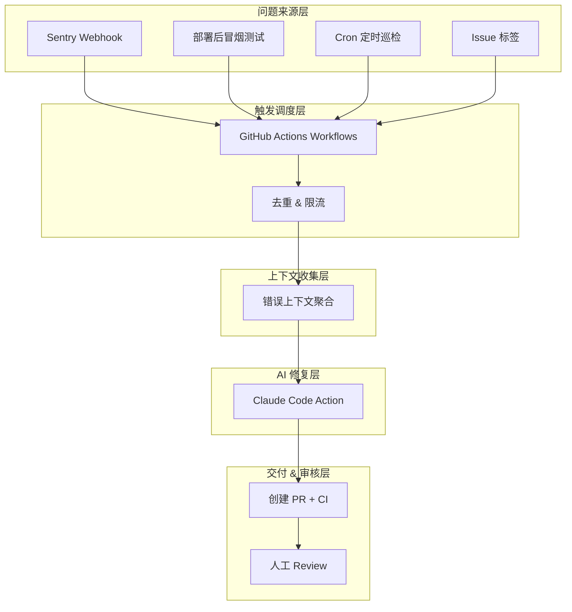
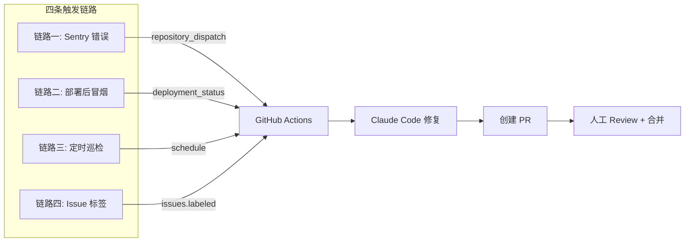
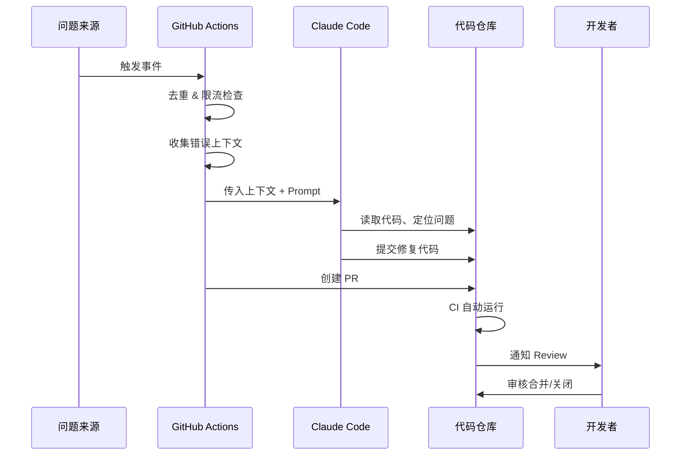
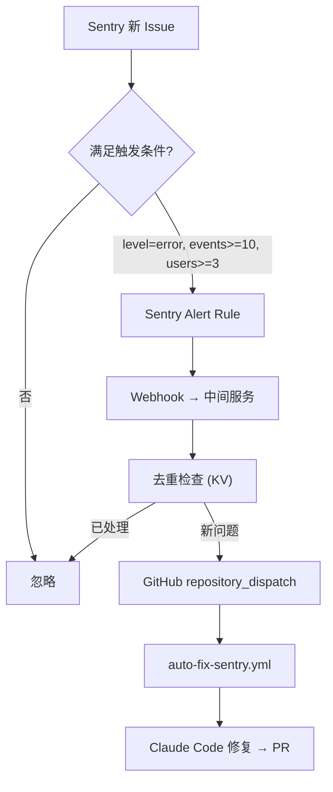

# AI 自动修复系统 (auto-fix)

> **状态**: Draft
> **作者**: AIX Team
> **适用范围**: 业务仓库（GitHub）
> **定位**: 通用方案模板，托管于 aix 仓库统一管理，各业务仓库按需接入

## 概述

基于 Sentry 监控、部署后冒烟测试、定时巡检和 Issue 标签四种触发源，结合 Claude Code Action 实现「发现问题 → AI 分析修复 → 创建 PR → 人工审核合并」的自动化闭环系统。

**核心原则**：

| 原则 | 说明 |
|------|------|
| **AI 修，人审核** | AI 只负责创建 PR，合并权始终在人 |
| **最小改动** | 每次修复只改必要的代码，不做额外重构 |
| **可观测** | 修复过程全程可追溯，失败有通知 |
| **可降级** | 一键关闭，不影响正常开发流程 |

## 动机

### 背景

业务仓库部署上线后，问题发现和修复依赖人工：

- **响应慢**：线上报错需要开发人员手动查看 Sentry → 分析 → 定位 → 修复 → 提 PR
- **发现晚**：部署后回归问题可能数小时后才被用户反馈发现
- **长期忽视**：依赖漏洞、代码质量退化等慢性问题容易积累

### 为什么需要这个方案

现有工作流的不足：

- **纯人工**：从发现到修复全靠人力，无法做到 7×24 响应
- **上下文丢失**：Sentry 错误信息与代码修复在不同平台，上下文切换成本高
- **缺乏闭环**：发现问题后没有自动化的修复和追踪机制

通过 AI 自动修复，可以将「问题发现 → PR 创建」从小时级缩短到分钟级，开发者只需 Review 和合并。

## 目标与非目标

### 目标

| 优先级 | 目标 | 说明 |
|--------|------|------|
| P0 | Issue 标签触发修复 | 开发者打 `auto-fix` 标签即触发 AI 修复 |
| P0 | 部署后冒烟测试修复 | 部署成功后自动跑 E2E，失败触发修复 |
| P0 | 安全防护 | 权限控制、限流、降级开关 |
| P1 | Sentry 错误联动 | 线上错误超阈值自动触发修复 |
| P1 | 定时质量巡检 | 每日 Cron 跑 lint/type-check/test/audit |
| P2 | 可观测性 | 修复效果 Dashboard、通知策略、周报 |

### 非目标

- 不替代人工 Code Review
- 不自动合并 PR 到主分支
- 不处理需求变更类任务（只处理 bug 修复和质量问题）
- 不处理需要跨仓库协调的问题

## 系统架构

### 整体架构图



### 触发链路概览



### 数据流转



### 上下文收集策略

不同触发源收集不同上下文：

| 触发源 | 收集内容 |
|--------|---------|
| **Sentry** | 错误标题、堆栈、影响用户数、首次/末次出现时间、Sentry 链接 |
| **冒烟测试** | 测试报告 JSON、失败截图、控制台日志 |
| **定时巡检** | lint 报告、type-check 报告、audit 报告 |
| **Issue** | Issue 标题、描述、评论、关联信息 |

### 技术选型

| 组件 | 选型 | 说明 |
|------|------|------|
| CI/CD | GitHub Actions | 已有基础设施 |
| AI 引擎 | `anthropics/claude-code-action@v1` | 官方 GitHub Action，支持代码读写和 PR 创建 |
| 错误监控 | Sentry | 线上运行时错误捕获 |
| 通知 | GitHub Notifications + 飞书/钉钉 Webhook | 修复 PR 创建后通知 |
| 中间服务 | Cloudflare Worker / Vercel Serverless | Sentry → GitHub dispatch 的转发层 |

## 详细设计

### 链路一：Sentry 错误 → 自动修复

**触发条件**: Sentry 新 Issue 产生且满足阈值

#### 流程图



#### Sentry Alert Rule 配置

```
条件:
  - 事件级别: error 或 fatal
  - 事件数: >= 10 次（1小时内）
  - 影响用户: >= 3 人
  - 首次出现（避免重复触发旧问题）

动作:
  - 发送 Webhook 到中间服务
```

#### 中间服务（Sentry → GitHub 转发）

```typescript
// Cloudflare Worker / Vercel Edge Function
export default async function handler(req: Request) {
  const payload = await req.json()

  // 验证 Sentry 签名
  const signature = req.headers.get('sentry-hook-signature')
  if (!verifySignature(signature, payload)) {
    return new Response('Unauthorized', { status: 401 })
  }

  // 去重检查（同一 Issue 24h 内只触发一次）
  const issueId = payload.data.issue.id
  const cacheKey = `sentry-fix:${issueId}`
  const cached = await KV.get(cacheKey)
  if (cached) {
    return new Response('Duplicate, skipped', { status: 200 })
  }
  await KV.put(cacheKey, '1', { expirationTtl: 86400 })

  // 通过 Sentry API 获取解析后的堆栈（webhook payload 中的堆栈可能是 minified 的）
  const resolvedStacktrace = await fetchResolvedStacktrace(
    payload.data.issue.id
  )

  // 提取上下文
  const context = {
    title: payload.data.issue.title,
    culprit: payload.data.issue.culprit,
    // 生成安全的去重 key，避免特殊字符影响 GitHub Actions concurrency group
    safe_key: createHash('md5')
      .update(payload.data.issue.culprit || '')
      .digest('hex')
      .slice(0, 8),
    level: payload.data.issue.level,
    count: payload.data.issue.count,
    users_affected: payload.data.issue.userCount,
    first_seen: payload.data.issue.firstSeen,
    permalink: payload.data.issue.permalink,
    stacktrace: resolvedStacktrace || extractStacktrace(payload),
  }

  // 触发 GitHub Actions
  await fetch(
    `https://api.github.com/repos/${OWNER}/${REPO}/dispatches`,
    {
      method: 'POST',
      headers: {
        Authorization: `token ${GITHUB_TOKEN}`,
        Accept: 'application/vnd.github.v3+json',
      },
      body: JSON.stringify({
        event_type: 'sentry-issue',
        client_payload: context,
      }),
    }
  )

  return new Response('OK', { status: 200 })
}

// 通过 Sentry API 获取已解析的堆栈（source-mapped）
async function fetchResolvedStacktrace(issueId: string): Promise<string | null> {
  try {
    const res = await fetch(
      `https://sentry.io/api/0/issues/${issueId}/events/latest/`,
      {
        headers: { Authorization: `Bearer ${SENTRY_AUTH_TOKEN}` },
      }
    )
    if (!res.ok) return null
    const event = await res.json()
    // 提取已解析的堆栈帧
    const frames = event.entries
      ?.find((e: any) => e.type === 'exception')
      ?.data?.values?.[0]?.stacktrace?.frames
    if (!frames) return null
    return frames
      .filter((f: any) => f.inApp)
      .map((f: any) => `  at ${f.function} (${f.filename}:${f.lineNo}:${f.colNo})`)
      .reverse()
      .join('\n')
  } catch {
    return null
  }
}
```

#### GitHub Actions Workflow

```yaml
# .github/workflows/auto-fix-sentry.yml
name: "Auto Fix: Sentry Error"

on:
  repository_dispatch:
    types: [sentry-issue]

concurrency:
  # 使用中间服务生成的 safe_key（MD5 hash），避免 culprit 中特殊字符导致问题
  group: auto-fix-sentry-${{ github.event.client_payload.safe_key || github.run_id }}
  cancel-in-progress: false

jobs:
  auto-fix:
    if: ${{ vars.AUTO_FIX_ENABLED != 'false' }}
    runs-on: ubuntu-latest
    timeout-minutes: 15
    permissions:
      contents: write
      pull-requests: write
      issues: write

    steps:
      - uses: actions/checkout@v4
        with:
          fetch-depth: 0

      - name: Check daily PR limit
        env:
          GH_TOKEN: ${{ secrets.GITHUB_TOKEN }}
        run: |
          count=$(gh pr list --label auto-fix --state open \
            --json createdAt \
            --jq '[.[] | select(.createdAt > (now - 86400 | todate))] | length')
          if [ "$count" -ge 10 ]; then
            echo "::warning::Daily auto-fix PR limit reached ($count/10), skipping."
            exit 1
          fi
          echo "Current daily PR count: $count/10"

      - name: Check duplicate PR
        id: dedup
        env:
          GH_TOKEN: ${{ secrets.GITHUB_TOKEN }}
        run: |
          # 检查是否已有针对同一 culprit 的开放 PR
          # 使用 jq --arg 安全传参，避免 culprit 中的特殊字符破坏查询
          CULPRIT="${{ github.event.client_payload.culprit }}"
          existing=$(gh pr list --label auto-fix --state open \
            --json title \
            --jq --arg c "$CULPRIT" '[.[] | select(.title | contains($c))] | length')
          if [ "$existing" -gt 0 ]; then
            echo "::warning::Duplicate PR exists for: $CULPRIT, skipping."
            echo "skip=true" >> $GITHUB_OUTPUT
            exit 0
          fi
          echo "skip=false" >> $GITHUB_OUTPUT

      - name: Prepare error context
        if: steps.dedup.outputs.skip != 'true'
        id: context
        run: |
          echo "branch_name=auto-fix/sentry-$(date +%Y%m%d%H%M%S)" >> $GITHUB_OUTPUT

          # 将上下文存入 GITHUB_OUTPUT（解决 YAML prompt 中 $(cat) 不会被 shell 展开的问题）
          {
            echo "error_context<<CONTEXT_EOF"
            echo "## Sentry Error Report"
            echo ""
            echo "| 字段 | 值 |"
            echo "|------|-----|"
            echo "| **标题** | ${{ github.event.client_payload.title }} |"
            echo "| **问题函数** | ${{ github.event.client_payload.culprit }} |"
            echo "| **级别** | ${{ github.event.client_payload.level }} |"
            echo "| **触发次数** | ${{ github.event.client_payload.count }} |"
            echo "| **影响用户数** | ${{ github.event.client_payload.users_affected }} |"
            echo "| **首次出现** | ${{ github.event.client_payload.first_seen }} |"
            echo "| **Sentry 链接** | ${{ github.event.client_payload.permalink }} |"
            echo ""
            echo "## Stack Trace"
            echo '```'
            echo '${{ github.event.client_payload.stacktrace }}'
            echo '```'
            echo "CONTEXT_EOF"
          } >> $GITHUB_OUTPUT

      - name: Claude Code Auto Fix
        if: steps.dedup.outputs.skip != 'true'
        id: claude
        uses: anthropics/claude-code-action@v1
        with:
          anthropic_api_key: ${{ secrets.ANTHROPIC_API_KEY }}
          model: claude-sonnet-4-6
          max_turns: 20
          prompt: |
            你是一个自动修复机器人，负责修复线上 Sentry 报出的错误。

            ## 错误信息
            ${{ steps.context.outputs.error_context }}

            ## 修复要求
            1. 根据 stack trace 定位问题代码文件和行号
            2. 分析错误根因（不要只处理表面症状）
            3. 用最小改动修复问题
            4. 修复后确保不引入新的类型错误

            ## 约束
            - 只允许修改 src/ 目录下的文件
            - 单次最多修改 5 个文件
            - 不允许删除或修改测试文件
            - 不允许修改配置文件
            - 如果无法确定修复方案，请输出分析报告，不要强行修改代码

            ## 输出
            修复完成后，用以下格式输出摘要：
            ---
            **根因分析**: <一句话描述根因>
            **修复方案**: <一句话描述改了什么>
            **影响范围**: <列出修改的文件>
            **风险评估**: 低/中/高
            ---

      # 注意：需确认 claude-code-action 实际暴露的 outputs 字段名
      # 若 action 本身支持创建 PR，可考虑直接使用其内置能力而非 create-pull-request
      - name: Check for changes
        if: steps.dedup.outputs.skip != 'true'
        id: changes
        run: |
          if [ -n "$(git status --porcelain)" ]; then
            echo "has_changes=true" >> $GITHUB_OUTPUT
          else
            echo "has_changes=false" >> $GITHUB_OUTPUT
            echo "::notice::Claude 未修改代码，跳过创建 PR"
          fi

      - name: Create Pull Request
        if: steps.changes.outputs.has_changes == 'true'
        uses: peter-evans/create-pull-request@v6
        with:
          token: ${{ secrets.GITHUB_TOKEN }}
          branch: ${{ steps.context.outputs.branch_name }}
          title: "fix: 自动修复 Sentry 错误 - ${{ github.event.client_payload.title }}"
          body: |
            ## AI 自动修复

            本 PR 由自动修复系统根据 Sentry 错误报告生成。

            ### Sentry Issue
            - **错误**: ${{ github.event.client_payload.title }}
            - **位置**: `${{ github.event.client_payload.culprit }}`
            - **影响**: ${{ github.event.client_payload.count }} 次触发, ${{ github.event.client_payload.users_affected }} 用户受影响
            - **链接**: ${{ github.event.client_payload.permalink }}

            ### 错误上下文
            ${{ steps.context.outputs.error_context }}

            ### Review 清单
            - [ ] 根因分析是否正确
            - [ ] 修复方案是否合理
            - [ ] 是否有潜在的副作用
            - [ ] CI 是否全部通过

            ---
            > 此 PR 由 AI 自动生成，请务必人工 Review 后再合并。
          labels: |
            auto-fix
            bot
          reviewers: ${{ vars.AUTO_FIX_REVIEWERS }}

      - name: Notify on failure
        if: failure()
        run: |
          # 可接入飞书/钉钉 Webhook 通知
          echo "Auto fix failed for: ${{ github.event.client_payload.title }}"
```

### 链路二：部署后冒烟测试 → 自动修复

**触发条件**: 生产环境部署成功后自动运行

```yaml
# .github/workflows/auto-fix-post-deploy.yml
name: "Auto Fix: Post-Deploy Smoke Test"

on:
  deployment_status:
  workflow_run:
    workflows: ["Deploy Production"]
    types: [completed]
  workflow_dispatch:
    inputs:
      environment_url:
        description: '目标环境 URL'
        required: true
        default: 'https://your-app.com'

jobs:
  smoke-test:
    if: >
      vars.AUTO_FIX_ENABLED != 'false' && (
      github.event_name == 'workflow_dispatch' ||
      (github.event_name == 'deployment_status' && github.event.deployment_status.state == 'success') ||
      (github.event_name == 'workflow_run' && github.event.workflow_run.conclusion == 'success'))
    runs-on: ubuntu-latest
    timeout-minutes: 20
    permissions:
      contents: write
      pull-requests: write

    steps:
      - uses: actions/checkout@v4

      - uses: pnpm/action-setup@v4
      - uses: actions/setup-node@v4
        with:
          node-version: 20
          cache: 'pnpm'

      - run: pnpm install

      - name: Install Playwright browsers
        run: pnpm exec playwright install --with-deps chromium

      - name: Run smoke tests
        id: smoke
        continue-on-error: true
        run: |
          mkdir -p test-results
          set +e
          pnpm test:e2e:smoke \
            --reporter=json \
            --output-file=test-results/report.json \
            2>&1 | tee test-results/output.log
          echo "exit_code=$?" >> $GITHUB_OUTPUT
          set -e
        env:
          BASE_URL: ${{ github.event.inputs.environment_url || github.event.deployment_status.target_url }}

      - name: Prepare test context
        if: steps.smoke.outputs.exit_code != '0'
        id: test-context
        run: |
          # 将测试结果存入 step output（YAML prompt 中 $(cat) 不会被 shell 展开）
          {
            echo "test_output<<TEST_EOF"
            head -500 test-results/output.log 2>/dev/null || echo "无测试日志"
            echo "TEST_EOF"
          } >> $GITHUB_OUTPUT

          {
            echo "test_report<<REPORT_EOF"
            cat test-results/report.json 2>/dev/null || echo "无 JSON 报告"
            echo "REPORT_EOF"
          } >> $GITHUB_OUTPUT

          {
            echo "fail_summary<<FAIL_EOF"
            grep -E "FAIL|Error" test-results/output.log 2>/dev/null | head -20 || echo "无匹配"
            echo "FAIL_EOF"
          } >> $GITHUB_OUTPUT

      - name: Skip if tests pass
        if: steps.smoke.outputs.exit_code == '0'
        run: echo "All smoke tests passed, no fix needed."

      - name: Claude Code Auto Fix
        if: steps.smoke.outputs.exit_code != '0'
        uses: anthropics/claude-code-action@v1
        with:
          anthropic_api_key: ${{ secrets.ANTHROPIC_API_KEY }}
          model: claude-sonnet-4-6
          max_turns: 25
          prompt: |
            部署后冒烟测试失败了，请分析并修复。

            ## 测试输出日志
            ${{ steps.test-context.outputs.test_output }}

            ## 测试报告（如存在）
            ${{ steps.test-context.outputs.test_report }}

            ## 修复要求
            1. 分析哪些测试用例失败了
            2. 区分问题类型：是业务代码 bug 还是环境/配置问题
            3. 只修复业务代码 bug，不要修改测试用例
            4. 如果是环境问题，只输出分析报告

            ## 约束
            - 只修改 src/ 目录
            - 不修改测试文件、配置文件
            - 最小化改动

      # 仅在 Claude 实际修改了代码时才创建 PR（避免环境问题时创建空 PR）
      - name: Check for changes
        if: steps.smoke.outputs.exit_code != '0'
        id: changes
        run: |
          if [ -n "$(git status --porcelain)" ]; then
            echo "has_changes=true" >> $GITHUB_OUTPUT
          else
            echo "has_changes=false" >> $GITHUB_OUTPUT
            echo "::notice::Claude 未修改代码（可能是环境问题），跳过创建 PR"
          fi

      - name: Create Pull Request
        if: steps.changes.outputs.has_changes == 'true'
        uses: peter-evans/create-pull-request@v6
        with:
          token: ${{ secrets.GITHUB_TOKEN }}
          branch: "auto-fix/post-deploy-${{ github.run_id }}"
          title: "fix: 自动修复部署后冒烟测试失败"
          body: |
            ## AI 自动修复 - 部署后测试失败

            部署后冒烟测试发现问题，AI 已自动生成修复方案。

            ### 失败测试
            ```
            ${{ steps.test-context.outputs.fail_summary }}
            ```

            ### Review 清单
            - [ ] 确认修复方案正确
            - [ ] 确认未引入新问题
            - [ ] CI 全部通过

            ---
            > 此 PR 由 AI 自动生成，请务必人工 Review 后再合并。
          labels: |
            auto-fix
            post-deploy
            urgent
```

### 链路三：定时质量巡检

**触发条件**: 工作日定时执行

```yaml
# .github/workflows/auto-fix-scheduled.yml
name: "Auto Fix: Scheduled Quality Check"

on:
  schedule:
    - cron: '0 18 * * 0-4'  # UTC 18:00 = 北京时间次日凌晨 2:00（周一至周五）
  workflow_dispatch:

jobs:
  quality-check:
    if: ${{ vars.AUTO_FIX_ENABLED != 'false' }}
    runs-on: ubuntu-latest
    timeout-minutes: 30
    permissions:
      contents: write
      pull-requests: write

    steps:
      - uses: actions/checkout@v4

      - uses: pnpm/action-setup@v4
      - uses: actions/setup-node@v4
        with:
          node-version: 20
          cache: 'pnpm'

      - run: pnpm install

      - name: Prepare reports directory
        run: mkdir -p reports

      - name: Run lint
        id: lint
        continue-on-error: true
        run: |
          set +e
          pnpm lint 2>&1 | tee reports/lint.txt
          echo "exit=$?" >> $GITHUB_OUTPUT

      - name: Run type check
        id: typecheck
        continue-on-error: true
        run: |
          set +e
          pnpm type-check 2>&1 | tee reports/typecheck.txt
          echo "exit=$?" >> $GITHUB_OUTPUT

      - name: Run tests
        id: test
        continue-on-error: true
        run: |
          set +e
          pnpm test 2>&1 | tee reports/test.txt
          echo "exit=$?" >> $GITHUB_OUTPUT

      - name: Security audit
        id: audit
        continue-on-error: true
        run: |
          set +e
          pnpm audit 2>&1 | tee reports/audit.txt
          echo "exit=$?" >> $GITHUB_OUTPUT

      - name: Summarize results
        id: summary
        run: |
          has_issues=false
          {
            echo "## 质量巡检报告 - $(date +%Y-%m-%d)"
            echo ""

            if [ "${{ steps.lint.outputs.exit }}" != "0" ]; then
              echo "### Lint 检查失败"
              echo '```'
              tail -50 reports/lint.txt
              echo '```'
              has_issues=true
            else
              echo "### Lint 检查通过"
            fi

            if [ "${{ steps.typecheck.outputs.exit }}" != "0" ]; then
              echo "### 类型检查失败"
              echo '```'
              tail -50 reports/typecheck.txt
              echo '```'
              has_issues=true
            else
              echo "### 类型检查通过"
            fi

            if [ "${{ steps.test.outputs.exit }}" != "0" ]; then
              echo "### 单元测试失败"
              echo '```'
              tail -50 reports/test.txt
              echo '```'
              has_issues=true
            else
              echo "### 单元测试通过"
            fi

            if [ "${{ steps.audit.outputs.exit }}" != "0" ]; then
              echo "### 安全审计发现问题"
              echo '```'
              tail -30 reports/audit.txt
              echo '```'
              has_issues=true
            else
              echo "### 安全审计通过"
            fi
          } > /tmp/report.md

          echo "has_issues=$has_issues" >> $GITHUB_OUTPUT

          # 将报告内容存入 step output（YAML 中 $(cat) 不会被 shell 展开）
          {
            echo "report<<REPORT_EOF"
            cat /tmp/report.md
            echo "REPORT_EOF"
          } >> $GITHUB_OUTPUT

          # 生成日期标签
          echo "date_tag=$(date +%Y%m%d)" >> $GITHUB_OUTPUT
          echo "date_display=$(date +%Y-%m-%d)" >> $GITHUB_OUTPUT

      - name: Claude Code Auto Fix
        if: steps.summary.outputs.has_issues == 'true'
        uses: anthropics/claude-code-action@v1
        with:
          anthropic_api_key: ${{ secrets.ANTHROPIC_API_KEY }}
          model: claude-sonnet-4-6
          max_turns: 30
          prompt: |
            以下是每日质量巡检的结果，请修复发现的问题。

            ${{ steps.summary.outputs.report }}

            ## 修复优先级
            1. 类型错误（可能导致运行时问题）
            2. 单元测试失败（回归 bug）
            3. Lint 错误（代码质量）
            4. 安全漏洞（依赖升级）

            ## 约束
            - Lint 问题优先使用 --fix 自动修复
            - 依赖升级只做 patch 版本升级，minor/major 升级请标注让人工决策
            - 如果某个问题你不确定怎么修，跳过并在报告中说明

      - name: Check for changes
        if: steps.summary.outputs.has_issues == 'true'
        id: changes
        run: |
          if [ -n "$(git status --porcelain)" ]; then
            echo "has_changes=true" >> $GITHUB_OUTPUT
          else
            echo "has_changes=false" >> $GITHUB_OUTPUT
            echo "::notice::Claude 未修改代码，跳过创建 PR"
          fi

      - name: Create Pull Request
        if: steps.changes.outputs.has_changes == 'true'
        uses: peter-evans/create-pull-request@v6
        with:
          token: ${{ secrets.GITHUB_TOKEN }}
          branch: "auto-fix/scheduled-${{ steps.summary.outputs.date_tag }}"
          title: "chore: 每日质量巡检自动修复 (${{ steps.summary.outputs.date_display }})"
          body: |
            ## 每日质量巡检

            ${{ steps.summary.outputs.report }}

            ---
            > 此 PR 由 AI 自动生成，请务必人工 Review 后再合并。
          labels: |
            auto-fix
            maintenance
```

### 链路四：Issue 标签触发（人机协同）

**触发条件**: 开发者在 Issue 上打 `auto-fix` 标签

> **安全注意**: `auto-fix` 标签应通过 GitHub 权限设置限制为 Collaborator 及以上角色才能添加，防止外部用户通过 Issue 内容进行 Prompt 注入。

```yaml
# .github/workflows/auto-fix-issue.yml
name: "Auto Fix: From Issue"

on:
  issues:
    types: [labeled]

jobs:
  auto-fix:
    if: github.event.label.name == 'auto-fix' && vars.AUTO_FIX_ENABLED != 'false'
    runs-on: ubuntu-latest
    timeout-minutes: 15
    permissions:
      contents: write
      pull-requests: write
      issues: write

    steps:
      - uses: actions/checkout@v4
        with:
          fetch-depth: 0

      - name: Comment on issue - start
        uses: peter-evans/create-or-update-comment@v4
        with:
          issue-number: ${{ github.event.issue.number }}
          body: |
            **自动修复已触发**

            正在分析 Issue 并生成修复方案，预计 5-10 分钟完成。
            完成后会自动创建 PR 并关联此 Issue。

      - name: Claude Code Auto Fix
        id: claude
        uses: anthropics/claude-code-action@v1
        with:
          anthropic_api_key: ${{ secrets.ANTHROPIC_API_KEY }}
          model: claude-sonnet-4-6
          max_turns: 25
          prompt: |
            请根据以下 GitHub Issue 修复代码：

            ## Issue #${{ github.event.issue.number }}
            **标题**: ${{ github.event.issue.title }}

            **描述**:
            ${{ github.event.issue.body }}

            ## 要求
            1. 仔细理解 Issue 描述的问题
            2. 在代码中定位相关文件
            3. 实现修复（最小改动原则）
            4. 确保修复后类型检查和 lint 通过

      # 硬检查：确保 AI 没有修改白名单以外的文件（防止 Prompt 注入绕过 CLAUDE.md 软约束）
      # 注意：claude-code-action 可能直接 commit 代码，需同时检查未暂存和已提交的变更
      - name: Validate changed files
        id: validate
        run: |
          # 收集所有变更文件（未暂存 + 已暂存 + 已提交但未 push）
          CHANGED_FILES=$(
            {
              git diff --name-only 2>/dev/null
              git diff --cached --name-only 2>/dev/null
              git diff HEAD~1 --name-only 2>/dev/null
            } | sort -u
          )

          if [ -z "$CHANGED_FILES" ]; then
            echo "has_changes=false" >> $GITHUB_OUTPUT
            exit 0
          fi

          FORBIDDEN=$(echo "$CHANGED_FILES" | grep -vE '^src/|^styles/' || true)
          if [ -n "$FORBIDDEN" ]; then
            echo "::error::AI 修改了白名单以外的文件，拒绝创建 PR:"
            echo "$FORBIDDEN"
            exit 1
          fi

          echo "has_changes=true" >> $GITHUB_OUTPUT

      - name: Create Pull Request
        if: steps.validate.outputs.has_changes == 'true'
        id: pr
        uses: peter-evans/create-pull-request@v6
        with:
          token: ${{ secrets.GITHUB_TOKEN }}
          branch: "auto-fix/issue-${{ github.event.issue.number }}"
          title: "fix: 自动修复 #${{ github.event.issue.number }} - ${{ github.event.issue.title }}"
          body: |
            ## AI 自动修复

            Closes #${{ github.event.issue.number }}

            ### 修复说明
            根据 Issue 描述自动生成的修复方案。

            ### Review 清单
            - [ ] 修复方案是否正确
            - [ ] 是否有潜在的副作用
            - [ ] CI 是否全部通过

            ---
            > 此 PR 由 AI 自动生成，请务必人工 Review 后再合并。
          labels: |
            auto-fix
            bot

      - name: Comment on issue - no changes
        if: steps.validate.outputs.has_changes == 'false'
        uses: peter-evans/create-or-update-comment@v4
        with:
          issue-number: ${{ github.event.issue.number }}
          body: |
            **自动修复完成，但未产生代码变更**

            AI 分析了此 Issue，但未找到需要修改的代码。可能需要人工介入。

      - name: Comment on issue - done
        if: steps.pr.outputs.pull-request-number
        uses: peter-evans/create-or-update-comment@v4
        with:
          issue-number: ${{ github.event.issue.number }}
          body: |
            **修复 PR 已创建**: #${{ steps.pr.outputs.pull-request-number }}

            请 Review 后合并。

      - name: Comment on issue - failed
        if: failure()
        uses: peter-evans/create-or-update-comment@v4
        with:
          issue-number: ${{ github.event.issue.number }}
          body: |
            **自动修复失败**

            AI 无法自动修复此问题，需要人工介入。
            Workflow 日志: ${{ github.server_url }}/${{ github.repository }}/actions/runs/${{ github.run_id }}
```

### CLAUDE.md 修复规范

在业务仓库的 `CLAUDE.md` 中需要添加 auto-fix 相关约束，作为 AI 修复行为的「护栏」：

```markdown
# Auto Fix 规范（供 CI 中的 Claude Code 使用）

## 修复原则
- 最小改动原则：只改必要的代码
- 不做额外重构、不添加新功能
- 不修改测试用例来让测试通过
- 不确定时宁可不改，输出分析报告

## 文件权限
- 允许修改: src/**
- 允许修改: styles/**
- 禁止修改: tests/**, __tests__/**
- 禁止修改: *.config.*, .env*
- 禁止修改: package.json (依赖变更需人工决策)
- 禁止修改: .github/workflows/**

## 修复质量要求
- 修复后代码必须通过 TypeScript 类型检查
- 不引入 any 类型来绕过类型错误
- 保持现有代码风格一致
- 添加必要的注释说明修复原因
```

### 安全防护

#### 权限控制

```yaml
# 最小权限原则
permissions:
  contents: write        # 创建分支和提交
  pull-requests: write   # 创建 PR
  issues: write          # 评论 Issue
  # 不给 admin 权限，不给 deployments 权限
```

#### 分支保护规则

main 分支必须开启以下保护：

| 规则 | 配置 |
|------|------|
| Require pull request before merging | 开启 |
| Require approvals | >= 1 人审批 |
| Require status checks to pass | 开启 |
| Require branches to be up to date | 开启 |
| Allow auto-merge | 关闭 |

#### 限流机制

| 维度 | 限制 | 实现方式 |
|------|------|---------|
| 同一错误去重 | 24 小时内同一 Sentry Issue 只触发 1 次 | 中间服务 KV 存储 |
| 并发控制 | 同一触发源内串行执行 | `concurrency` group（按链路隔离，非全局限制） |
| 重复 PR 检测 | 已有同类开放 PR 时跳过 | workflow 中 `gh pr list` 检查 |
| 每日上限 | 单日最多创建 10 个修复 PR | workflow 中 `gh pr list` 统计当日数量 |
| 成本控制 | 单次修复 max_turns <= 30 | Claude Code Action 参数 |

#### 降级开关

通过 GitHub Repository Variable `AUTO_FIX_ENABLED` 一键控制：

```yaml
jobs:
  auto-fix:
    if: ${{ vars.AUTO_FIX_ENABLED != 'false' }}
```

紧急情况设置 `AUTO_FIX_ENABLED=false` 即可关闭所有自动修复。

### 可观测性

#### 修复效果指标

| 指标 | 说明 | 目标 |
|------|------|------|
| 修复成功率 | 创建的 PR 中被合并的比例 | > 60% |
| 平均修复时间 | 从错误发生到 PR 创建 | < 30 min |
| 误报率 | 创建了 PR 但修复不正确被关闭 | < 30% |
| CI 通过率 | 自动修复 PR 的 CI 通过比例 | > 80% |

#### 通知策略

| 事件 | 通知渠道 | 接收人 |
|------|---------|--------|
| 修复 PR 创建 | GitHub Notification + IM | 对应模块 Owner |
| 修复失败 | IM 告警 | 值班人员 |
| 每日巡检报告 | 邮件/IM | 全组 |
| 周报汇总 | 邮件 | Tech Lead |

## 缺点与风险

| 风险 | 影响 | 缓解措施 |
|------|------|----------|
| **AI 修复引入新 bug** | 高 | 强制 CI 通过 + 人工 Review，禁止自动合并 |
| **过度触发浪费资源** | 中 | 去重 + 限流 + 阈值调优 + 每日上限 |
| **Prompt 注入** | 中 | Issue 内容可能包含恶意指令；三层防护：(1) 标签权限限制为 Collaborator+，(2) CLAUDE.md 软约束文件权限，(3) PR 创建前 diff 白名单硬检查 |
| **API Key 泄露** | 高 | 使用 GitHub Secrets 存储，最小权限原则 |
| **修复质量低，团队不信任** | 中 | 先从简单问题开始，逐步证明价值 |
| **API 成本失控** | 中 | max_turns 限制 + 每日上限 + 降级开关 + 月度预算告警 |

## 待解决问题

以下问题需要在实施前确认：

| # | 问题 | 影响 | 建议 |
|---|------|------|------|
| 1 | **`claude-code-action` 的 outputs schema** | 当前假设存在 `has_changes`、`summary` 等输出字段，需对照官方文档确认实际字段名 | Phase 1 启动前验证，必要时调整 workflow |
| 2 | **`claude-code-action` 与 `create-pull-request` 的职责划分** | action 本身可能支持创建 PR，与 `create-pull-request` 共用可能产生分支/commit 冲突 | 确认 action 的 PR 创建能力，二选一 |
| 3 | **step output 的大小限制** | `GITHUB_OUTPUT` 有 ~1MB 限制，大型测试报告或 stacktrace 可能超限 | 对输出做截断（如 `head -500`），或改用 artifact 传递 |
| 4 | **冒烟测试套件就绪度** | 链路二依赖 `pnpm test:e2e:smoke`，各业务仓库的 E2E 测试成熟度不一 | Phase 2 前先评估各仓库 E2E 覆盖率 |
| 5 | **修复失败后的重试策略** | 当前修复失败仅发通知，无自动重试机制 | MVP 阶段不重试，后续根据失败原因分类（瞬态 vs 永久）决定是否引入 |

## 备选方案

### 方案 A：基于 Dependabot / Renovate

仅使用 Dependabot 或 Renovate 处理依赖更新和安全漏洞。

**放弃原因**：
- 只能处理依赖问题，无法修复业务代码 bug
- 无法与 Sentry 联动
- 无法处理运行时错误

### 方案 B：基于 GitHub Copilot Workspace

使用 GitHub Copilot Workspace 从 Issue 自动生成修复 PR。

**放弃原因**：
- 功能尚在预览阶段，不够成熟
- 无法自定义触发链路（Sentry、部署后测试等）
- 缺乏 CLAUDE.md 类似的行为约束机制

### 方案 C：自建 Agent 服务

部署一个长期运行的 Agent 服务，轮询 Sentry 和 CI 状态。

**放弃原因**：
- 运维成本高，需要维护服务器
- GitHub Actions 已提供事件驱动能力，无需轮询
- Claude Code Action 开箱即用，无需自建

### 为什么选择当前方案

- **事件驱动**：利用 GitHub Actions 原生事件机制，无需维护额外服务
- **行为可控**：CLAUDE.md 约束 + 文件权限限制 + 分支保护
- **渐进可达**：四条链路独立，可逐步上线
- **成本可控**：按触发次数付费，有多层限流保障

## 采用策略

### Phase 1: MVP

**目标**: 跑通链路四（Issue 标签触发），验证 Claude Code Action 基本能力

- [ ] 业务仓库 CLAUDE.md 添加修复规范
- [ ] 配置 `auto-fix-issue.yml` workflow
- [ ] 配置 GitHub Secrets（ANTHROPIC_API_KEY）
- [ ] 手动创建 3-5 个已知 bug 的 Issue，测试修复效果
- [ ] 评估修复质量，调优 prompt

### Phase 2: 部署后检测

**目标**: 接入部署后冒烟测试自动修复

- [ ] 确保已有可用的冒烟测试套件（E2E 或 API 测试）
- [ ] 配置 `auto-fix-post-deploy.yml` workflow
- [ ] 在 staging 环境先行验证
- [ ] 灰度到生产环境

### Phase 3: Sentry 联动

**目标**: 线上错误自动修复

- [ ] 部署中间服务（Cloudflare Worker）
- [ ] 配置 Sentry Alert Rule + Webhook
- [ ] 配置 `auto-fix-sentry.yml` workflow
- [ ] 调优触发阈值（避免过度触发）
- [ ] 生产试运行，观察效果

### Phase 4: 定时巡检 + 可观测

**目标**: 完整闭环 + 效果可度量

- [ ] 配置 `auto-fix-scheduled.yml` workflow
- [ ] 接入 IM 通知（飞书/钉钉）
- [ ] 搭建修复效果 Dashboard
- [ ] 建立周报机制
- [ ] 根据数据持续调优

## 附录

### 成本预估

| 项目 | 预估成本 | 说明 |
|------|---------|------|
| Claude API | ~$50-200/月 | 取决于触发频率，Sonnet 模型性价比高 |
| GitHub Actions | 包含在现有 Plan | 使用 GitHub-hosted runners |
| 中间服务 | ~$0-5/月 | Cloudflare Worker 免费额度通常够用 |
| 人工 Review | ~2-4 小时/周 | Review AI 生成的 PR |

### FAQ

**Q: 自动修复的 PR 谁来 Review？**

根据修改文件的 CODEOWNERS 自动指定 Reviewer，如未配置则指定 `AUTO_FIX_REVIEWERS` 变量中的人员。

**Q: 如果 AI 修错了怎么办？**

直接关闭 PR 即可。所有修复都在独立分支，不影响主分支。PR 被关闭的数据会进入误报率统计，用于持续调优。

**Q: 如何防止同一个问题反复创建 PR？**

三层防护：(1) Sentry 侧去重 24h，(2) GitHub concurrency group 防止同一问题并发，(3) 创建 PR 前检查是否已有同类 PR 开放。

**Q: 可以自动合并吗？**

不建议。MVP 阶段必须人工 Review。后续如果修复成功率稳定 > 90%，可以考虑对特定类型（如纯 lint fix）开启 auto-merge。

**Q: 费用会不会失控？**

通过 max_turns 限制 + 每日上限 + 降级开关三重保障。建议初期设置 Anthropic API 的月度用量预算告警。

### 技术依赖

| 依赖 | 用途 |
|------|------|
| `anthropics/claude-code-action@v1` | AI 代码修复 |
| `peter-evans/create-pull-request@v6` | 自动创建 PR |
| `peter-evans/create-or-update-comment@v4` | Issue 评论通知 |
| `actions/checkout@v4` | 代码检出 |
| Sentry SDK | 线上错误监控 |
| Cloudflare Workers / Vercel | Webhook 中间服务 |
