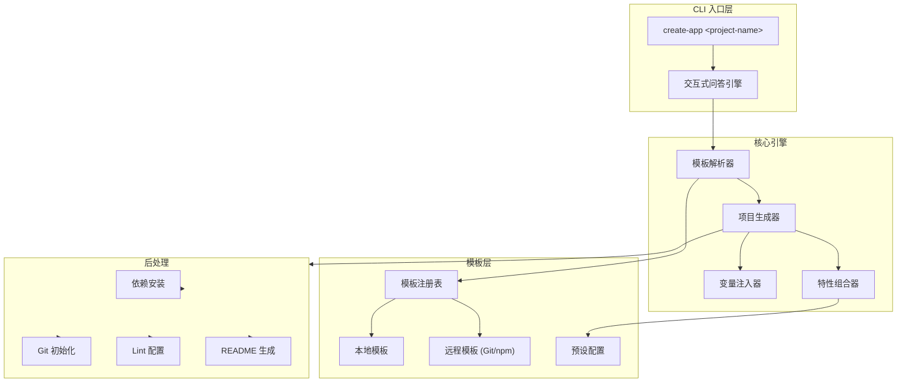
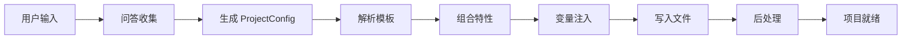
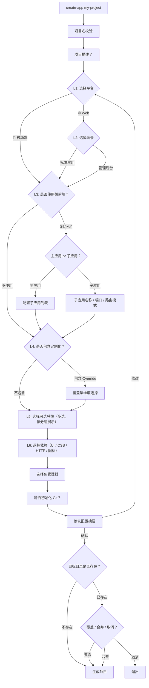
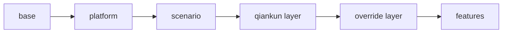

# 项目脚手架工具 (@kit/create-app)

> **状态**: Draft
> **作者**: AIX Team
> **位置**: `internal/create-app/`

## 概述

统一的 CLI 脚手架工具，通过交互式问答引导用户创建不同类型的前端项目（Web 应用、移动端应用、微前端主/子应用等），并根据选择自动拉取对应模板仓库、安装依赖、初始化配置，实现「一条命令创建标准化项目」的开发体验。

## 动机

### 背景

团队目前有多个项目模板仓库（如 `sysu-chemistry-app` 等），新项目创建流程碎片化：

1. **手动 fork/clone 模板** — 开发者需要记住不同模板的仓库地址，手动 clone 后删除 `.git` 目录、修改 `package.json` 信息
2. **依赖配置不一致** — 不同项目手动选装依赖（qiankun、i18n、状态管理等），版本和配置各不相同
3. **微前端配置复杂** — qiankun 主应用和子应用的配置差异大，新手容易出错（生命周期导出、publicPath、路由模式等）
4. **初始化步骤繁琐** — 修改项目名、配置代理地址、选择 UI 框架版本、初始化 Git 等重复性工作

### 为什么需要这个方案

| 现状问题 | 脚手架解决方案 |
|---------|--------------|
| 不知道该用哪个模板 | 交互式选择项目类型，自动匹配模板 |
| 手动修改 package.json 等元信息 | 自动注入项目名、描述、作者等 |
| 微前端配置容易出错 | 内置 qiankun 主/子应用预设，自动生成配置 |
| 依赖版本不统一 | 统一管理依赖版本，确保团队一致性 |
| 重复的初始化流程 | 一条命令完成全部初始化 |

## 决策模型

脚手架的核心理念是 **分层决策**，用户按以下维度逐步缩小范围：

```
平台 → 场景 → 微前端 → 定制化 → 特性 → 依赖
```

每一层都是独立的维度，互不耦合，可自由组合：

| 决策层 | 维度 | 选项 | 说明 |
|--------|------|------|------|
| L1 | **平台** | Web / 移动端 | 决定基础技术栈和 UI 框架候选 |
| L2 | **场景** | 标准应用 / 管理后台 | Web 独有，影响布局和路由模式 |
| L3 | **微前端** | 不使用 / qiankun 主应用 / qiankun 子应用 | 可选叠加层，影响入口文件和构建配置 |
| L4 | **定制化** | 不包含 / 包含 Override 系统 | 决定是否生成 `src/overrides/` 和覆盖层代码 |
| L5 | **特性** | 多选：i18n、权限、Mock、Docker 等 | 按需叠加的独立功能模块 |
| L6 | **依赖** | UI 框架 / CSS 方案 / HTTP 客户端等 | 具体技术选型 |

### 组合示例

| 场景 | 平台 | 场景 | 微前端 | 定制化 | 典型特性 |
|------|------|------|--------|--------|---------|
| 标准 Web 项目 | Web | 标准应用 | - | - | i18n, mock |
| 带定制化的管理后台 | Web | 管理后台 | - | Override | i18n, 权限, API 生成 |
| 微前端子应用 | Web | 标准应用 | qiankun 子应用 | - | 权限 |
| 可定制的微前端主应用 | Web | 管理后台 | qiankun 主应用 | Override | i18n, 权限, 骨架屏 |
| 移动端 H5 | 移动端 | - | - | - | i18n, 埋点 |
| 可定制的移动端 | 移动端 | - | - | Override | i18n, 主题切换 |

## 目标与非目标

### 目标

| 优先级 | 目标 | 说明 |
|--------|------|------|
| P0 | 交互式项目创建 | 分层决策问答，用户按需选择 |
| P0 | 双平台支持 | Web 应用 / 移动端（H5/Hybrid） |
| P0 | 可选微前端 | qiankun 主应用 / 子应用作为可选叠加层 |
| P0 | 可选定制化系统 | Override 系统独立开关，生成覆盖层骨架 |
| P0 | 模板变量注入 | 项目名、描述、端口等自动替换 |
| P1 | 可选特性系统 | 按需选择 i18n、权限、Mock、Docker 等特性 |
| P1 | 自定义依赖选择 | UI 框架、HTTP 客户端、状态管理等可选 |
| P1 | 代码质量工具链 | ESLint + Stylelint + Prettier + Husky 一键配置 |
| P1 | 远程模板源（Git） | 支持从 Git 仓库拉取模板 |
| P1 | 模板版本管理 | 模板支持版本标签，可指定版本创建 |
| P2 | 远程模板源（npm） | 支持从 npm 拉取模板 |
| P2 | 插件机制 | 第三方可扩展新的模板类型和特性 |
| P2 | 项目升级能力 | 已有项目升级到新版模板 |
| P2 | GUI 模式 | Web 界面选择配置（类似 Vue UI） |

### 非目标

- **不做运行时框架** — 只负责项目初始化，不提供运行时能力
- **不替代构建工具** — 不重新封装 Vite/Webpack，模板内自带构建配置
- **不做部署工具** — 不负责 CI/CD 和部署流程
- **不维护业务代码** — 模板只提供骨架，业务逻辑由项目自行开发

## 系统架构

### 架构图



### 目录结构

```
internal/create-app/
├── src/
│   ├── index.ts                 # CLI 入口
│   ├── cli.ts                   # 命令行参数解析
│   ├── prompts/                 # 交互式问答（按决策层组织）
│   │   ├── index.ts             # 问答流程编排
│   │   ├── project.ts           # 项目基本信息（名称、描述）
│   │   ├── platform.ts          # L1: 平台选择
│   │   ├── scenario.ts          # L2: 场景选择
│   │   ├── qiankun.ts           # L3: 微前端选择 + 配置
│   │   ├── override.ts          # L4: 定制化选择 + 维度配置
│   │   ├── features.ts          # L5: 特性多选（按分组过滤）
│   │   └── dependencies.ts      # L6: 依赖选择（按平台过滤）
│   ├── core/                    # 核心引擎
│   │   ├── generator.ts         # 项目生成器
│   │   ├── resolver.ts          # 模板解析器
│   │   ├── injector.ts          # 变量注入器（EJS 渲染）
│   │   ├── feature-composer.ts  # 特性组合器
│   │   └── override-scaffold.ts # Override 目录骨架生成
│   ├── templates/               # 模板注册与管理
│   │   ├── registry.ts          # 模板注册表
│   │   ├── loader.ts            # 模板加载器（本地/远程）
│   │   └── presets/             # 预设配置
│   │       ├── web-standard.ts  # Web 标准应用预设
│   │       ├── web-admin.ts     # Web 管理后台预设
│   │       ├── mobile.ts        # 移动端预设
│   │       ├── qiankun-main.ts  # qiankun 主应用叠加层
│   │       └── qiankun-sub.ts   # qiankun 子应用叠加层
│   ├── features/                # 可选特性（每个特性独立模块）
│   │   ├── types.ts             # 特性类型定义 + 注册表
│   │   ├── core/                # 核心功能组
│   │   │   ├── i18n.ts
│   │   │   ├── permission.ts
│   │   │   ├── skeleton.ts
│   │   │   ├── error-boundary.ts
│   │   │   ├── theme-switch.ts
│   │   │   └── analytics.ts
│   │   ├── devtools/            # 开发工具组
│   │   │   ├── lint-suite.ts
│   │   │   ├── auto-import.ts
│   │   │   ├── mock.ts
│   │   │   ├── api-gen.ts
│   │   │   ├── https-dev.ts
│   │   │   ├── proxy-config.ts
│   │   │   ├── env-config.ts
│   │   │   └── ai-dev.ts
│   │   └── deploy/              # 部署相关组
│   │       ├── docker.ts
│   │       ├── error-monitor.ts
│   │       └── pwa.ts
│   ├── layers/                  # 叠加层（qiankun、override）
│   │   ├── qiankun-main.ts      # 主应用叠加逻辑
│   │   ├── qiankun-sub.ts       # 子应用叠加逻辑
│   │   └── override.ts          # Override 系统叠加逻辑
│   ├── utils/
│   │   ├── git.ts               # Git 操作
│   │   ├── pkg.ts               # package.json 操作
│   │   ├── file.ts              # 文件操作
│   │   └── logger.ts            # 日志输出
│   └── types.ts                 # 全局类型定义
├── templates/                   # 内置模板文件（EJS 模板）
│   ├── base/                    # 基础模板（所有项目共用）
│   │   ├── _package.json.ejs
│   │   ├── _tsconfig.json.ejs
│   │   ├── _vite.config.ts.ejs
│   │   ├── _index.html.ejs
│   │   └── _README.md.ejs
│   ├── web-standard/            # Web 标准应用模板
│   ├── web-admin/               # Web 管理后台模板（含 Layout）
│   ├── mobile/                  # 移动端模板
│   ├── layers/                  # 叠加层模板
│   │   ├── qiankun-main/        # qiankun 主应用增量文件
│   │   ├── qiankun-sub/         # qiankun 子应用增量文件
│   │   └── override/            # Override 系统增量文件
│   └── features/                # 特性增量文件
│       ├── i18n/
│       ├── permission/
│       ├── docker/
│       ├── lint-suite/
│       └── ...
├── __test__/
│   ├── generator.test.ts
│   ├── resolver.test.ts
│   ├── prompts.test.ts
│   └── combinations.test.ts     # 关键组合矩阵测试
├── package.json
├── tsconfig.json
└── rollup.config.js
```

### 数据流



## 详细设计

### 核心类型定义

```typescript
/** 平台类型 */
type Platform = 'web' | 'mobile';

/** 场景类型（仅 Web 平台有效） */
type WebScenario = 'standard' | 'admin';

/** 微前端模式 */
type QiankunMode = 'none' | 'main' | 'sub';

/** 项目配置 — 交互问答的最终产物 */
interface ProjectConfig {
  /** 项目名称（英文，kebab-case） */
  name: string;
  /** 项目描述 */
  description: string;

  // ---- L1: 平台 ----
  /** 平台 */
  platform: Platform;
  /** Web 场景（仅 platform=web 时有效） */
  webScenario?: WebScenario;

  // ---- L3: 微前端 ----
  /** 微前端模式 */
  qiankunMode: QiankunMode;
  /** 微前端详细配置（qiankunMode !== 'none' 时有效） */
  qiankun?: QiankunConfig;

  // ---- L4: 定制化 ----
  /** 是否包含 Override 定制化系统 */
  enableOverride: boolean;
  /** 覆盖层维度（enableOverride=true 时有效） */
  overrideLayers?: OverrideLayerKey[];

  // ---- L5: 特性 ----
  /** 选择的特性列表 */
  features: FeatureId[];

  // ---- L6: 依赖 ----
  /** 依赖选择 */
  dependencies: DependencyChoice;

  /** 输出目录 */
  outputDir: string;
  /** 模板来源 */
  templateSource: TemplateSource;
  /** 额外变量（用于模板注入） */
  variables: Record<string, string>;
}

/** 依赖选择 */
interface DependencyChoice {
  /** UI 框架 — 候选项根据平台动态过滤 */
  ui: 'element-plus' | 'ant-design-vue' | 'vant' | 'nutui' | 'none';
  /** HTTP 客户端 */
  http: 'axios' | 'ky' | 'ofetch';
  /** 状态管理 */
  store: 'pinia' | 'none';
  /** CSS 方案 */
  css: 'scss' | 'less' | 'unocss' | 'tailwind';
  /** 包管理器 */
  packageManager: 'pnpm' | 'npm' | 'yarn';
  /** 图标方案 */
  icons: 'unplugin-icons' | 'svg-sprite' | 'none';
}

/** 微前端配置 */
interface QiankunConfig {
  /** 角色：主应用 / 子应用 */
  role: 'main' | 'sub';
  /** 子应用名称（子应用必填，用于生命周期注册和路由前缀） */
  appName?: string;
  /** 主应用注册的子应用列表（主应用使用） */
  subApps?: SubAppEntry[];
  /** 子应用独立运行端口 */
  devPort?: number;
  /** 路由模式 — 子应用通常用 hash 避免冲突 */
  routerMode: 'hash' | 'history';
  /** 沙箱模式 */
  sandbox: 'strict' | 'experimentalStyleIsolation' | false;
  /** 共享依赖列表 */
  shared?: string[];
}

interface SubAppEntry {
  name: string;
  entry: string;
  activeRule: string;
  container: string;
}

/** 覆盖层维度 */
type OverrideLayerKey =
  | 'components'   // 组件覆盖
  | 'router'       // 路由覆盖
  | 'layout'       // 布局覆盖
  | 'store'        // 状态覆盖
  | 'api'          // API 覆盖
  | 'locale'       // 语言包覆盖
  | 'constants';   // 常量覆盖

/** 模板来源 */
type TemplateSource =
  | { type: 'builtin'; name: string }
  | { type: 'git'; url: string; branch?: string; tag?: string }
  | { type: 'npm'; package: string; version?: string }
  | { type: 'local'; path: string };
```

### 平台与依赖联动规则

不同平台/场景下，依赖候选项会动态过滤：

| 依赖维度 | Web 标准应用 | Web 管理后台 | 移动端 |
|---------|-------------|-------------|--------|
| UI 框架 | Element Plus, Ant Design Vue, 不使用 | Element Plus, Ant Design Vue | Vant, NutUI, 不使用 |
| CSS 方案 | 全部可选 | SCSS（推荐）, 全部可选 | SCSS, UnoCSS |
| 图标方案 | unplugin-icons, SVG Sprite | unplugin-icons, SVG Sprite | SVG Sprite |
| 状态管理 | Pinia, 不使用 | Pinia（推荐） | Pinia, 不使用 |

```typescript
/** 根据平台过滤 UI 框架候选 */
function getUIOptions(platform: Platform): UIOption[] {
  if (platform === 'mobile') {
    return [
      { value: 'vant', label: 'Vant', description: '有赞移动端 UI 组件库' },
      { value: 'nutui', label: 'NutUI', description: '京东移动端 UI 组件库' },
      { value: 'none', label: '不使用 UI 框架' },
    ];
  }
  return [
    { value: 'element-plus', label: 'Element Plus', description: '企业级 Vue 3 UI 库' },
    { value: 'ant-design-vue', label: 'Ant Design Vue', description: 'Ant Design 的 Vue 实现' },
    { value: 'none', label: '不使用 UI 框架' },
  ];
}
```

### 可选特性系统

```typescript
/** 特性 ID — 注意 override 已提升为独立决策层（L4），不再是普通特性 */
type FeatureId =
  | 'i18n'            // 国际化（vue-i18n + 语言包骨架）
  | 'permission'      // 权限系统（路由守卫 + 指令 + Composable）
  | 'mock'            // Mock 数据（vite-plugin-mock-dev-server）
  | 'docker'          // Docker 部署（Dockerfile + nginx.conf + docker-compose）
  | 'api-gen'         // API 自动生成（Orval + OpenAPI）
  | 'skeleton'        // 骨架屏（路由级 + 组件级 Skeleton）
  | 'error-boundary'  // 错误边界（全局错误处理 + ErrorBoundary 组件）
  | 'analytics'       // 埋点采集（@aix/tracker 适配器模式，需私有 registry 或 npm link）
  | 'theme-switch'    // 主题切换（亮色/暗色 + CSS Variables）
  | 'https-dev'       // HTTPS 开发服务器（mkcert 自签证书）
  | 'lint-suite'      // 代码质量套件（ESLint + Stylelint + Prettier + Husky + lint-staged + commitlint）
  | 'auto-import'     // 自动导入（unplugin-auto-import + unplugin-vue-components）
  | 'env-config'      // 多环境配置（.env.development / .env.production / .env.local 模板）
  | 'proxy-config'    // 开发代理配置（config/proxy.ts + host.ts）
  | 'error-monitor'   // 错误监控（Sentry 集成）
  | 'pwa'             // PWA 支持（vite-plugin-pwa）
  | 'ai-dev';         // AI 开发辅助（.claude/ + CLAUDE.md + .cursor/ 配置）

/** 特性定义 */
interface FeatureDefinition {
  id: FeatureId;
  /** 展示名称 */
  label: string;
  /** 描述 */
  description: string;
  /** 特性分组（用于交互界面分类展示） */
  group: 'core' | 'devtools' | 'deploy' | 'enhance';
  /** 适用的平台（空数组表示全部适用） */
  platforms: Platform[];
  /** 适用的场景（空数组表示全部适用） */
  scenarios: WebScenario[];
  /** 依赖的其他特性 */
  dependsOn?: FeatureId[];
  /** 与哪些特性互斥 */
  conflicts?: FeatureId[];
  /** 该特性需要添加的依赖 */
  packages: {
    dependencies?: Record<string, string>;
    devDependencies?: Record<string, string>;
  };
  /** 需要生成/修改的文件列表 */
  files: FeatureFile[];
  /** 需要向模板注入的代码片段 */
  injections?: CodeInjection[];
}

/** 特性文件 */
interface FeatureFile {
  templatePath: string;
  outputPath: string;
  condition?: (config: ProjectConfig) => boolean;
}

/** 代码注入 */
interface CodeInjection {
  targetFile: string;
  /** 注入锚点标记（模板中预留的 `// @inject:feature-name` 注释） */
  anchor: string;
  content: string;
}
```

### 特性适配矩阵

特性按分组展示，用户选择时只看到当前平台/场景适用的特性：

#### 核心功能 (core)

| 特性 | Web 标准 | Web 管理后台 | 移动端 | 与微前端兼容 | 说明 |
|------|:-------:|:----------:|:-----:|:----------:|------|
| i18n | ✓ | ✓ | ✓ | ✓ | vue-i18n + 语言包目录 |
| permission | ✓ | ✓（推荐） | ✓ | ✓ | 路由守卫 + v-role 指令（依赖 Pinia，选择时自动启用 `store: 'pinia'`） |
| skeleton | ✓ | ✓ | ✓ | ✓ | 路由级骨架屏 |
| error-boundary | ✓ | ✓ | ✓ | ✓ | 全局错误兜底 |
| theme-switch | ✓ | ✓ | ✓ | ✓ | 亮暗主题切换 |
| analytics | ✓ | ✓ | ✓ | ✓ | @aix/tracker 埋点（需配置 npm 私有 registry 或使用 `npm link` 本地联调，详见包发布说明） |

#### 开发工具 (devtools)

| 特性 | Web 标准 | Web 管理后台 | 移动端 | 说明 |
|------|:-------:|:----------:|:-----:|------|
| lint-suite | ✓ | ✓ | ✓ | ESLint + Stylelint + Prettier + Husky + commitlint 全家桶 |
| auto-import | ✓ | ✓ | ✓ | unplugin-auto-import + unplugin-vue-components |
| mock | ✓ | ✓ | ✓ | Vite Mock 插件 |
| api-gen | ✓ | ✓ | ✓ | Orval 从 OpenAPI 生成类型安全 API |
| https-dev | ✓ | ✓ | ✓ | mkcert 自签 HTTPS |
| proxy-config | ✓ | ✓ | ✓ | 开发环境代理配置模板 |
| env-config | ✓ | ✓ | ✓ | 多环境 .env 文件模板 |
| ai-dev | ✓ | ✓ | ✓ | CLAUDE.md + .claude/ + .cursor/ |

#### 部署相关 (deploy)

| 特性 | Web 标准 | Web 管理后台 | 移动端 | 说明 |
|------|:-------:|:----------:|:-----:|------|
| docker | ✓ | ✓ | - | Dockerfile + nginx.conf + docker-compose |
| error-monitor | ✓ | ✓ | ✓ | Sentry SDK 集成 |
| pwa | ✓ | ✓ | ✓ | vite-plugin-pwa |

### 交互式问答流程



#### 目标目录冲突处理

当目标目录已存在时，CLI 会提示用户选择处理方式：

| 选项 | 行为 | 说明 |
|------|------|------|
| **覆盖（Overwrite）** | 清空目录后重新生成 | 适用于重新创建 |
| **合并（Merge）** | 保留现有文件，仅写入不存在的文件 | 适用于补充配置 |
| **取消（Cancel）** | 退出 CLI，不做任何操作 | 默认选项 |

非交互模式下通过 `--force` 参数跳过确认直接覆盖。

### 项目名校验规则

CLI 在接收到项目名后立即校验，不通过则提示重新输入：

| 校验项 | 规则 | 错误提示示例 |
|--------|------|-------------|
| 格式 | kebab-case（小写字母、数字、连字符） | `项目名只能包含小写字母、数字和连字符` |
| npm 包名合法性 | `validate-npm-package-name` 校验 | `项目名不是合法的 npm 包名` |
| 目录不存在或为空 | 检测目标路径是否已存在非空目录 | `目录 ./my-app 已存在且不为空` |
| 长度限制 | 1-214 字符（npm 规范） | `项目名过长` |

### 定制化系统（Override）详细配置

当用户选择「包含定制化」时，进一步选择需要哪些覆盖维度：

```
? 选择需要的覆盖层维度（空格切换，回车确认）:
  ◉ 组件覆盖   — src/overrides/components/（替换全局组件）
  ◉ 路由覆盖   — src/overrides/router/（添加/替换路由）
  ◉ 布局覆盖   — src/overrides/layout/（替换 Layout、Header 等）
  ◉ 状态覆盖   — src/overrides/store/（扩展 Pinia Store）
  ◯ API 覆盖   — src/overrides/api/（重写请求配置）
  ◯ 语言包覆盖 — src/overrides/locale/（定制翻译文案）
  ◯ 常量覆盖   — src/overrides/constants/（覆盖业务常量）
```

生成的 Override 系统结构（参考 `sysu-chemistry-app`）：

```typescript
/** Override 配置类型 */
interface OverrideConfig {
  /** 组件覆盖：key 为组件注册名，value 为替代组件 */
  components?: Record<string, Component>;
  /** 路由覆盖 */
  router?: {
    /** 额外路由（追加到基础路由后） */
    additionalRoutes?: RouteRecordRaw[];
    /** 替换路由（key 为路由 path） */
    replaceRoutes?: Record<string, RouteRecordRaw>;
    /** 禁用的路由 path 列表 */
    disabledRoutes?: string[];
  };
  /** 布局覆盖 */
  layout?: {
    /** 替换主布局 */
    MainLayout?: Component;
    /** 替换 Header */
    LayoutHeader?: Component;
    /** 替换侧边菜单 */
    LayoutMenu?: Component;
  };
  /** Store 覆盖 */
  store?: Record<string, StoreDefinition>;
  /** API 配置覆盖 */
  api?: {
    baseURL?: string;
    timeout?: number;
    interceptors?: { request?: Function; response?: Function };
  };
  /** 语言包覆盖 */
  locale?: Record<string, Record<string, any>>;
  /** 常量覆盖 */
  constants?: Record<string, any>;
}
```

#### 覆盖层加载与 fallback 机制

`src/overrides/index.ts` 统一入口的运行时行为：

- **未选择的维度**：对应字段返回空对象/空数组，业务代码通过 `?.` 可选链安全访问，无需额外判断
- **加载失败保护**：每个维度的 import 使用 try/catch 包裹，加载失败时降级为空配置并在控制台输出 warning（不阻断应用启动）
- **类型安全**：`overrides/index.ts` 导出的类型与 `OverrideConfig` 一致，所有字段均为可选（`Partial<OverrideConfig>`）

```typescript
// src/overrides/index.ts — 生成的统一入口骨架
import type { OverrideConfig } from './types';

const config: Partial<OverrideConfig> = {};

try {
  // 仅导入用户选择的维度（由 create-app 按 overrideLayers 生成）
  const { default: components } = await import('./components');
  config.components = components;
} catch (e) {
  console.warn('[override] components 加载失败，使用默认配置', e);
}

// ... 其他维度同理

export default config;
```

生成目录示例（用户选择了组件、路由、布局三个维度）：

```
src/overrides/
├── index.ts                 # Override 统一入口
├── components/              # 组件覆盖
│   ├── index.ts             # 组件注册表
│   └── .gitkeep
├── router/                  # 路由覆盖
│   ├── index.ts             # 路由配置
│   └── routes/              # 自定义路由
│       └── .gitkeep
├── layout/                  # 布局覆盖
│   ├── index.ts             # 布局配置
│   └── .gitkeep
└── README.md                # 覆盖层使用说明
```

### 微前端（qiankun）预设

#### 主应用预设

主应用模板在标准 Web 应用基础上增加以下配置：

```typescript
// src/qiankun/index.ts — 主应用注册
import { registerMicroApps, start, initGlobalState } from 'qiankun';

const microApps: RegistrableApp[] = [
  <%_ for (const app of config.qiankun.subApps) { _%>
  {
    name: '<%= app.name %>',
    entry: '<%= app.entry %>',
    container: '<%= app.container %>',
    activeRule: '<%= app.activeRule %>',
  },
  <%_ } _%>
];

// 全局状态（主子应用通信）
const globalState = initGlobalState({
  user: null,
  token: '',
});

export function setupQiankun() {
  registerMicroApps(microApps, {
    beforeLoad: [async (app) => console.log('[qiankun] beforeLoad', app.name)],
    beforeMount: [async (app) => console.log('[qiankun] beforeMount', app.name)],
    afterUnmount: [async (app) => console.log('[qiankun] afterUnmount', app.name)],
  });
  start({ prefetch: 'all', sandbox: { experimentalStyleIsolation: true } });
}

export { globalState };
```

主应用额外文件：
- `src/qiankun/index.ts` — 微应用注册与启动
- `src/qiankun/shared.ts` — 共享依赖与全局状态
- `src/layout/components/MicroAppContainer.vue` — 子应用渲染容器
- `config/proxy.ts` — 子应用开发代理

#### 子应用预设

子应用模板需要处理生命周期导出和独立运行两种模式：

```typescript
// src/main.ts — 子应用入口（EJS 模板）
import { createApp } from 'vue';
import type { App as VueApp } from 'vue';
import AppComponent from './app/App.vue';
import { setupRouter } from './router';
import { setupStore } from './store';

let app: VueApp | null = null;

function render(props: { container?: Element } = {}) {
  const { container } = props;
  app = createApp(AppComponent);
  setupStore(app);
  setupRouter(app, '<%= config.qiankun.routerMode %>');
  const mountEl = container
    ? container.querySelector('#app')
    : document.getElementById('app');
  app.mount(mountEl!);
}

// qiankun 生命周期
export async function bootstrap() {
  console.log('[<%= config.qiankun.appName %>] bootstrap');
}

export async function mount(props: any) {
  // 接收主应用传递的 props（token、用户信息等）
  const { container, onGlobalStateChange, setGlobalState, ...restProps } = props;

  // 监听主应用全局状态变化
  onGlobalStateChange?.((state: Record<string, any>, prev: Record<string, any>) => {
    console.log('[<%= config.qiankun.appName %>] global state changed:', state, prev);
    // 可在此处同步 token、用户信息到子应用 store
  }, true); // true 表示立即触发一次

  render({ container, ...restProps });
}

export async function unmount() {
  app?.unmount();
  app = null;
}

export async function update(props: any) {
  console.log('[<%= config.qiankun.appName %>] update', props);
}

// 独立运行
if (!window.__POWERED_BY_QIANKUN__) {
  render();
}
```

子应用 Vite 配置差异：

```typescript
// vite.config.ts 子应用额外配置（EJS 模板）
export default defineConfig({
  // 注意：Vite 配置运行在 Node.js 环境，不能使用 window 对象
  // 通过 EJS 在生成时静态写入 base 路径
  base: '/<%= config.qiankun.appName %>/',
  server: {
    port: <%= config.qiankun.devPort || 8081 %>,
    cors: true,
    origin: 'http://localhost:<%= config.qiankun.devPort || 8081 %>',
  },
  plugins: [
    qiankunLite('<%= config.qiankun.appName %>', { useDevMode: true }),
  ],
});
```

### 模板合成顺序与冲突策略

项目生成的核心是**多层模板合成**。当 base 模板、平台模板、叠加层、特性注入都涉及同一个文件时，需要明确的合成规则。

#### 合成顺序



后层可以：
- **覆盖**前层的同名文件（整个文件替换）
- **注入**到前层文件的锚点位置（追加，不覆盖）

> **锚点保留规则**：当后层**覆盖**前层的文件时，必须在替换文件中保留 base 模板定义的所有 `// @inject:xxx` 锚点注释。否则依赖这些锚点的特性将无法正确注入（生成器不会报错，但注入内容会被静默丢弃）。模板 lint 检查应校验此规则。

#### 锚点注入机制

基础模板在关键文件中预留锚点注释，叠加层和特性通过锚点插入代码，避免文件级冲突：

```typescript
// src/main.ts — 基础模板预留锚点
import { createApp } from 'vue';
import App from './app/App.vue';
// @inject:imports

const app = createApp(App);
// @inject:plugins
// @inject:qiankun
app.mount('#app');
```

```typescript
// qiankun 子应用叠加层注入 @inject:qiankun
// --- 由 create-app 自动生成，请勿手动修改 ---
import { setupQiankunLifecycle } from './qiankun/lifecycle';
if (window.__POWERED_BY_QIANKUN__) {
  setupQiankunLifecycle(app);
} else {
  app.mount('#app');
}
```

```typescript
// i18n 特性注入 @inject:plugins
import { setupI18n } from './locale';
setupI18n(app);
```

#### 锚点注入顺序

当多个特性注入同一锚点时，按以下规则确定顺序：

1. **叠加层优先于特性** — qiankun / override 的注入排在普通特性之前
2. **特性间按声明顺序** — 按 `FeatureId` 在 `features/types.ts` 中的注册顺序（即上方 `type FeatureId` 的声明顺序）
3. **有依赖关系时被依赖方在前** — 若 A `dependsOn` B，则 B 的注入排在 A 之前

设计原则：特性间的锚点注入应保持**顺序无关**（每个注入是独立的 import + setup 调用）。如果某个特性的注入必须在另一个之后执行，应通过 `dependsOn` 显式声明。

#### 文件级合成规则

| 场景 | 规则 | 示例 |
|------|------|------|
| 同名文件覆盖 | 后层整体替换前层 | qiankun 叠加层替换 `vite.config.ts` |
| 锚点注入 | 追加到锚点位置，保留原有内容 | i18n 注入 `main.ts` 的 `@inject:plugins` |
| `package.json` | 深度合并（`dependencies` 合并，`scripts` 后层同名 key 覆盖前层） | 每层追加自己的依赖和脚本，后层可覆盖前层的同名 script |
| 配置文件 | 深度合并（`tsconfig.json`、`.eslintrc` 等） | 特性追加 ESLint rules |
| 新增文件 | 直接写入，不存在冲突 | Override 层新增 `src/overrides/` 目录 |

#### `package.json` 合成示例

```
base:       { dependencies: { vue, vue-router }, scripts: { start, build } }
  + admin:  { dependencies: { element-plus }, scripts: { } }
  + qiankun-sub: { dependencies: { vite-plugin-qiankun-lite }, scripts: { start:qk } }
  + i18n:   { dependencies: { vue-i18n }, scripts: { i18n } }
  + lint-suite: { devDependencies: { eslint, prettier, husky }, scripts: { lint, format } }
───────────────────────────────────────────────────
= 最终: { dependencies: { vue, vue-router, element-plus, vite-plugin-qiankun-lite, vue-i18n },
          devDependencies: { eslint, prettier, husky },
          scripts: { start, build, start:qk, i18n, lint, format } }
```

### 生成产物示例

不同选择组合生成的项目结构对比，帮助用户在选择前预判「选了什么 → 得到什么」。

#### Web 标准应用（最简）

`--platform web --scenario standard`，无微前端、无定制化、仅选 lint-suite + env-config：

```
my-app/
├── src/
│   ├── main.ts
│   ├── app/
│   │   └── App.vue
│   ├── router/
│   │   ├── index.ts
│   │   └── routes/
│   ├── store/
│   │   └── index.ts
│   ├── views/
│   │   └── home/
│   ├── components/
│   ├── assets/
│   ├── styles/
│   │   └── index.scss
│   └── utils/
├── .env.development
├── .env.production
├── .husky/
│   └── pre-commit
├── vite.config.ts
├── tsconfig.json
├── eslint.config.mjs
├── prettier.config.js
├── package.json
└── index.html
```

#### Web 管理后台 + qiankun 子应用 + Override + 多特性

`--platform web --scenario admin --qiankun sub --override`，选择 i18n、权限、lint-suite、auto-import、env-config、proxy-config：

```
my-admin-sub/
├── src/
│   ├── main.ts                  ← 含 qiankun 生命周期判断
│   ├── app/
│   │   └── App.vue
│   ├── router/
│   │   ├── index.ts
│   │   ├── guards.ts            ← permission 特性
│   │   └── routes/
│   ├── store/
│   │   ├── index.ts
│   │   └── modules/
│   │       ├── userInfo.ts
│   │       └── permission.ts    ← permission 特性
│   ├── layout/                  ← admin 场景
│   │   ├── index.vue
│   │   └── components/
│   │       ├── LayoutHeader/
│   │       ├── LayoutMenu/
│   │       └── LayoutMain/
│   ├── locale/                  ← i18n 特性
│   │   ├── index.ts
│   │   ├── zh-CN.json
│   │   └── en-US.json
│   ├── directives/
│   │   └── role.ts              ← permission 特性
│   ├── composables/
│   │   └── usePermission.ts     ← permission 特性
│   ├── qiankun/                 ← qiankun 子应用叠加层
│   │   ├── lifecycle.ts         # bootstrap / mount / unmount
│   │   └── public-path.ts       # __webpack_public_path__ 或 import.meta
│   ├── overrides/               ← Override 叠加层
│   │   ├── index.ts
│   │   ├── components/
│   │   ├── router/
│   │   └── layout/
│   ├── views/
│   ├── components/
│   ├── assets/
│   ├── styles/
│   └── utils/
│       └── override/
│           ├── index.ts
│           ├── overrideRouter.ts
│           └── overrideComponent.ts
├── config/
│   ├── proxy.ts                 ← proxy-config 特性
│   └── host.ts
├── .env.development
├── .env.production
├── .husky/
├── vite.config.ts               ← 含 qiankun 插件配置
├── tsconfig.json
├── eslint.config.mjs
├── components.d.ts              ← auto-import 特性
├── auto-imports.d.ts            ← auto-import 特性
├── package.json
└── index.html
```

#### 移动端 + Override

`--platform mobile --override`，选择 i18n、theme-switch、analytics：

```
my-mobile/
├── src/
│   ├── main.ts
│   ├── app/
│   │   └── App.vue
│   ├── router/
│   ├── store/
│   ├── locale/                  ← i18n 特性
│   ├── overrides/               ← Override 叠加层
│   │   ├── index.ts
│   │   ├── components/
│   │   ├── router/
│   │   └── locale/
│   ├── views/
│   ├── components/
│   ├── styles/
│   │   └── theme/               ← theme-switch 特性
│   │       ├── light.scss
│   │       └── dark.scss
│   └── utils/
│       ├── tracker.ts           ← analytics 特性
│       └── override/
├── .env.development
├── .env.production
├── vite.config.ts
├── package.json
└── index.html
```

### 辅助子命令

除核心的 `create-app <name>` 外，提供辅助子命令提升体验：

```bash
# 列出所有可用的预设和模板
npx @kit/create-app list

# 查看某个预设的详细配置和生成文件树预览
npx @kit/create-app info web-admin

# 环境检测：Node 版本、包管理器、Git 等
npx @kit/create-app doctor
```

#### `create-app list`

```
$ npx @kit/create-app list

  内置预设:
  ┌──────────────────────┬──────────┬──────────┬──────────┬──────────┐
  │ 预设                  │ 平台     │ 场景      │ 微前端    │ 定制化    │
  ├──────────────────────┼──────────┼──────────┼──────────┼──────────┤
  │ web-admin            │ Web      │ 管理后台  │ -        │ Override │
  │ micro-main           │ Web      │ 管理后台  │ 主应用    │ Override │
  │ micro-sub            │ Web      │ 标准应用  │ 子应用    │ -        │
  │ mobile-h5            │ 移动端   │ -         │ -        │ -        │
  │ mobile-customizable  │ 移动端   │ -         │ -        │ Override │
  └──────────────────────┴──────────┴──────────┴──────────┴──────────┘

  远程模板:
  ┌──────────────────────┬──────────────────────────────────────────┐
  │ 名称                  │ 来源                                     │
  ├──────────────────────┼──────────────────────────────────────────┤
  │ custom-admin         │ git@github.com:org/admin-template.git   │
  └──────────────────────┴──────────────────────────────────────────┘

  使用: npx @kit/create-app my-project --preset <预设名>
  详情: npx @kit/create-app info <预设名>
```

#### `create-app info <preset>`

```
$ npx @kit/create-app info micro-sub

  预设: micro-sub
  ──────────────────────────────
  平台:       Web
  场景:       标准应用
  微前端:     qiankun 子应用 (hash, 端口 8081)
  定制化:     不包含
  UI:         Element Plus
  CSS:        SCSS
  特性:       i18n, 权限, 代码质量套件, 多环境配置

  生成文件预览 (32 个文件):
  ├── src/
  │   ├── main.ts              (含 qiankun 生命周期)
  │   ├── qiankun/lifecycle.ts
  │   ├── locale/              (i18n)
  │   ├── composables/usePermission.ts
  │   └── ...
  ├── vite.config.ts           (含 qiankun 插件)
  └── ...

  依赖 (12 个):
    vue, vue-router, pinia, element-plus, vue-i18n,
    vite-plugin-qiankun-lite, axios, ...

  使用: npx @kit/create-app my-project --preset micro-sub
```

#### `create-app doctor`

```
$ npx @kit/create-app doctor

  环境检测:
  ✔ Node.js    v22.12.0  (要求 >= 22)
  ✔ pnpm       9.15.0    (已安装)
  ✔ Git        2.43.0    (已安装)
  ✘ npm        未检测到   (可选)

  网络:
  ✔ npm registry  连接正常
  ✔ Git SSH       连接正常

  ✅ 环境就绪，可以创建项目
```

### 模板注册表

```typescript
/** 模板注册表 — 管理所有可用模板 */
interface TemplateRegistry {
  /** 注册内置模板 */
  registerBuiltin(name: string, config: TemplateConfig): void;
  /** 注册远程模板 */
  registerRemote(name: string, source: TemplateSource): void;
  /** 获取模板 */
  resolve(name: string): Promise<ResolvedTemplate>;
  /** 列出所有可用模板 */
  list(): TemplateEntry[];
}

interface TemplateConfig {
  /** 模板展示名称 */
  label: string;
  /** 描述 */
  description: string;
  /** 对应的项目类型 */
  projectType: ProjectType;
  /** 模板目录路径（内置模板） */
  templateDir: string;
  /** 默认开启的特性 */
  defaultFeatures: FeatureId[];
  /** 默认依赖选择 */
  defaultDependencies: Partial<DependencyChoice>;
  /** 模板版本 */
  version: string;
}

interface ResolvedTemplate {
  /** 模板文件树（路径 → 内容） */
  files: Map<string, string>;
  /** 模板配置 */
  config: TemplateConfig;
  /** 清理函数（删除临时文件） */
  cleanup?: () => Promise<void>;
}
```

### 项目生成器

```typescript
class ProjectGenerator {
  constructor(
    private registry: TemplateRegistry,
    private injector: VariableInjector,
    private featureComposer: FeatureComposer,
  ) {}

  async generate(config: ProjectConfig): Promise<void> {
    // 1. 解析模板
    const template = await this.registry.resolve(config.templateSource);

    // 2. 组合特性文件
    const featureFiles = this.featureComposer.compose(config.features, config);

    // 3. 合并文件列表（模板 + 特性）
    const allFiles = this.mergeFiles(template.files, featureFiles);

    // 4. 变量注入（EJS 渲染）
    const renderedFiles = this.injector.render(allFiles, {
      project: config,
      features: config.features,
      qiankun: config.qiankun,
      year: new Date().getFullYear(),
    });

    // 5. 写入目标目录
    await this.writeFiles(config.outputDir, renderedFiles);

    // 6. 后处理
    await this.postProcess(config);
  }

  private async postProcess(config: ProjectConfig): Promise<void> {
    const { outputDir, dependencies } = config;

    // 安装依赖（失败时不阻断，保留已生成的项目目录）
    try {
      await exec(`${dependencies.packageManager} install`, { cwd: outputDir });
    } catch (e) {
      logger.warn(`依赖安装失败，请手动进入目录执行 ${dependencies.packageManager} install`);
      logger.warn(`错误详情: ${(e as Error).message}`);
      // 跳过后续 Git 操作（node_modules 未就绪时 husky 等可能报错）
      return;
    }

    // 初始化 Git
    await exec('git init', { cwd: outputDir });
    await exec('git add .', { cwd: outputDir });
    await exec('git commit -m "feat: 初始化项目"', { cwd: outputDir });
  }
}
```

### 变量注入器

模板文件使用 EJS 语法，支持以下变量：

| 变量 | 类型 | 说明 | 示例 |
|------|------|------|------|
| `project.name` | string | 项目名称 | `my-app` |
| `project.description` | string | 项目描述 | `我的应用` |
| `project.type` | ProjectType | 项目类型 | `web-app` |
| `features` | FeatureId[] | 已选特性 | `['i18n', 'mock']` |
| `deps.ui` | string | UI 框架 | `element-plus` |
| `deps.css` | string | CSS 方案 | `scss` |
| `qiankun` | QiankunConfig? | 微前端配置 | — |
| `year` | number | 当前年份 | `2026` |

模板示例（`_package.json.ejs`）：

```json
{
  "name": "<%= project.name %>",
  "version": "1.0.0",
  "description": "<%= project.description %>",
  "type": "module",
  "scripts": {
    "start": "vite --mode development",
    "build": "vite build --mode production",
    "type-check": "vue-tsc --noEmit"
    <%_ if (features.includes('mock')) { _%>
    ,"mock": "vite --mode mock"
    <%_ } _%>
    <%_ if (features.includes('api-gen')) { _%>
    ,"api:gen": "orval"
    <%_ } _%>
  },
  "dependencies": {
    "vue": "^3.5.24",
    "vue-router": "^4.6.3",
    <%_ if (deps.store === 'pinia') { _%>
    "pinia": "^3.0.4",
    <%_ } _%>
    <%_ if (deps.ui === 'element-plus') { _%>
    "element-plus": "^2.11.8",
    <%_ } else if (deps.ui === 'vant') { _%>
    "vant": "^4.9.0",
    <%_ } _%>
    <%_ if (deps.http === 'axios') { _%>
    "axios": "^1.9.0",
    <%_ } else if (deps.http === 'ky') { _%>
    "ky": "^1.8.1",
    <%_ } else if (deps.http === 'ofetch') { _%>
    "ofetch": "^1.4.1",
    <%_ } _%>
    <%_ if (qiankun?.role === 'sub') { _%>
    "vite-plugin-qiankun-lite": "^1.3.0",
    <%_ } else if (qiankun?.role === 'main') { _%>
    "qiankun": "^2.10.16",
    <%_ } _%>
  }
}
```

## CLI 设计

### 基本用法

```bash
# 交互式创建（推荐）
npx @kit/create-app my-project

# 使用预设（跳过全部问答）
npx @kit/create-app my-project --preset web-admin

# 辅助命令
npx @kit/create-app list              # 列出可用预设和模板
npx @kit/create-app info web-admin    # 查看预设详情和生成文件预览
npx @kit/create-app doctor            # 环境检测

# 指定模板源
npx @kit/create-app my-project --template git@github.com:org/template.git

# 完全非交互模式
npx @kit/create-app my-project \
  --platform web \
  --scenario admin \
  --qiankun sub \
  --qiankun-name my-sub-app \
  --qiankun-port 8081 \
  --override \
  --ui element-plus \
  --css scss \
  --features i18n,permission,lint-suite \
  --no-interaction
```

### 命令行参数

| 参数 | 缩写 | 类型 | 说明 |
|------|------|------|------|
| `--platform` | | `web` \| `mobile` | L1: 平台选择 |
| `--scenario` | `-s` | `standard` \| `admin` | L2: Web 场景（仅 web 平台有效） |
| `--qiankun` | | `none` \| `main` \| `sub` | L3: 微前端模式 |
| `--qiankun-name` | | string | qiankun 子应用名称 |
| `--qiankun-port` | | number | qiankun 子应用端口 |
| `--override` | | boolean | L4: 是否包含定制化系统 |
| `--override-layers` | | string | 覆盖层维度（逗号分隔：components,router,layout,store,api,locale,constants） |
| `--features` | `-f` | string | L5: 特性列表（逗号分隔） |
| `--ui` | | string | UI 框架 |
| `--css` | | string | CSS 方案 |
| `--icons` | | string | 图标方案 |
| `--template` | | string | 模板源（Git URL / npm 包名 / 本地路径） |
| `--preset` | `-p` | string | 使用预设配置 |
| `--package-manager` | `--pm` | string | 包管理器 |
| `--no-interaction` | | boolean | 非交互模式（缺少必填参数时报错退出并列出缺失项，不使用默认值） |
| `--force` | | boolean | 目标目录已存在时直接覆盖，跳过确认 |
| `--no-git` | | boolean | 跳过 Git 初始化 |
| `--no-install` | | boolean | 跳过依赖安装 |
| `--dry-run` | | boolean | 预览生成文件树，不实际写入 |
| `--version` | `-v` | | 查看版本 |
| `--help` | `-h` | | 查看帮助 |

### 交互界面示例

```
$ npx @kit/create-app my-project

  ╭──────────────────────────────╮
  │                              │
  │   🚀 Create App  v1.0.0     │
  │                              │
  ╰──────────────────────────────╯

? 项目描述: › 我的新项目

┌ L1: 选择平台
│
◆ 选择平台:
│  ❯ 🌐 Web        — 桌面端 Web 应用
│    📱 移动端      — H5 / Hybrid 移动端应用
│
└

┌ L2: 选择场景
│
◆ 选择 Web 场景:
│  ❯ 标准应用      — 通用 Vue 3 Web 应用
│    管理后台      — 中后台管理系统（含 Layout + 菜单 + 权限）
│
└

┌ L3: 微前端
│
◆ 是否使用 qiankun 微前端？
│  ❯ 不使用        — 独立单页应用
│    主应用        — qiankun 主应用（注册和管理子应用）
│    子应用        — qiankun 子应用（被主应用加载）
│
└

  （用户选择了「子应用」，展开子应用配置）

  ? 子应用名称: › my-sub-app
  ? 独立运行端口: › 8081
  ? 路由模式:
    ❯ hash     — 推荐，避免与主应用路由冲突
      history  — 需要配合主应用 activeRule

┌ L4: 定制化
│
◆ 是否包含 Override 定制化系统？
│    Override 系统允许不修改核心代码，通过覆盖层实现业务定制。
│    适用于：基础产品 + 多个定制项目的场景。
│  ❯ 不包含        — 标准项目，无需定制化
│    包含          — 生成 src/overrides/ 覆盖层骨架
│
└

  （用户选择了「包含」，展开维度选择）

  ? 选择覆盖层维度:
    ◉ 组件覆盖    — 替换全局组件
    ◉ 路由覆盖    — 添加/替换/禁用路由
    ◉ 布局覆盖    — 替换 Layout、Header、Menu
    ◯ 状态覆盖    — 扩展/替换 Pinia Store
    ◯ API 覆盖    — 重写请求基础配置
    ◯ 语言包覆盖  — 定制翻译文案
    ◯ 常量覆盖    — 覆盖业务常量

┌ L5: 可选特性
│
◆ 选择需要的特性:
│
│  ── 核心功能 ──
│  ◉ 国际化 (i18n)
│  ◉ 权限系统
│  ◯ 骨架屏
│  ◯ 错误边界
│  ◯ 主题切换
│  ◯ 埋点采集
│
│  ── 开发工具 ──
│  ◉ 代码质量套件 (ESLint + Prettier + Husky)
│  ◉ 自动导入 (unplugin-auto-import)
│  ◯ Mock 数据
│  ◯ API 自动生成 (Orval)
│  ◯ HTTPS 开发服务器
│  ◯ 开发代理配置
│  ◉ 多环境配置
│  ◯ AI 开发辅助 (CLAUDE.md)
│
│  ── 部署相关 ──
│  ◯ Docker 部署
│  ◯ Sentry 错误监控
│  ◯ PWA 支持
│
└

┌ L6: 依赖选择
│
◆ UI 框架:
│  ❯ Element Plus  — 企业级 Vue 3 UI 库
│    Ant Design Vue
│    不使用
│
◆ CSS 方案:
│  ❯ SCSS          — 预处理器
│    UnoCSS        — 原子化 CSS
│    Tailwind CSS
│
◆ 图标方案:
│  ❯ unplugin-icons — 按需引入，支持 Iconify 全量图标
│    SVG Sprite     — 本地 SVG 雪碧图
│
└

? 包管理器: › pnpm
? 是否初始化 Git 仓库？: › 是

┌ 配置确认
│
│  项目名:     my-project
│  平台:       Web
│  场景:       管理后台
│  微前端:     qiankun 子应用 (my-sub-app:8081, hash)
│  定制化:     Override (组件/路由/布局)
│  特性:       i18n, 权限, 代码质量套件, 自动导入, 多环境配置
│  UI:         Element Plus
│  CSS:        SCSS
│  图标:       unplugin-icons
│  包管理器:   pnpm
│
◆ 操作:
│  ❯ ✅ 确认创建
│    ✏️ 重新配置
│
└

⠋ 正在生成项目...
  ✔ 基础模板 (web-admin)
  ✔ 叠加层: qiankun 子应用
  ✔ 叠加层: Override 系统 (3 个维度)
  ✔ 特性注入 (5 个特性)
  ✔ 变量渲染
  ✔ 依赖安装 (pnpm)
  ✔ Git 初始化

🎉 项目创建成功！

  cd my-project
  pnpm start        # 独立运行模式
  pnpm start:qk     # qiankun 子应用模式

📂 定制化入口: src/overrides/index.ts
📚 文档: https://aix-docs.example.com/create-app
```

## 配置系统

### 预设配置文件

支持项目根目录下的 `.create-app.json` 预设文件，适用于团队统一配置：

```json
{
  "$schema": "https://unpkg.com/@kit/create-app/schema.json",
  "presets": {
    "web-admin": {
      "platform": "web",
      "webScenario": "admin",
      "qiankunMode": "none",
      "enableOverride": true,
      "overrideLayers": ["components", "router", "layout", "store", "locale"],
      "dependencies": {
        "ui": "element-plus",
        "http": "axios",
        "store": "pinia",
        "css": "scss",
        "icons": "unplugin-icons",
        "packageManager": "pnpm"
      },
      "features": ["i18n", "permission", "skeleton", "error-boundary", "lint-suite", "auto-import", "env-config", "ai-dev"]
    },
    "micro-sub": {
      "platform": "web",
      "webScenario": "standard",
      "qiankunMode": "sub",
      "enableOverride": false,
      "qiankun": {
        "role": "sub",
        "routerMode": "hash",
        "sandbox": "experimentalStyleIsolation",
        "devPort": 8081
      },
      "dependencies": {
        "ui": "element-plus",
        "css": "scss",
        "packageManager": "pnpm"
      },
      "features": ["i18n", "permission", "lint-suite", "env-config"]
    },
    "micro-main": {
      "platform": "web",
      "webScenario": "admin",
      "qiankunMode": "main",
      "enableOverride": true,
      "overrideLayers": ["components", "router", "layout"],
      "qiankun": {
        "role": "main",
        "sandbox": "experimentalStyleIsolation"
      },
      "dependencies": {
        "ui": "element-plus",
        "css": "scss",
        "packageManager": "pnpm"
      },
      "features": ["i18n", "permission", "lint-suite", "env-config"]
    },
    "mobile-h5": {
      "platform": "mobile",
      "qiankunMode": "none",
      "enableOverride": false,
      "dependencies": {
        "ui": "vant",
        "http": "axios",
        "store": "pinia",
        "css": "scss",
        "packageManager": "pnpm"
      },
      "features": ["i18n", "lint-suite", "analytics", "env-config"]
    },
    "mobile-customizable": {
      "platform": "mobile",
      "qiankunMode": "none",
      "enableOverride": true,
      "overrideLayers": ["components", "router", "locale", "constants"],
      "dependencies": {
        "ui": "vant",
        "http": "axios",
        "css": "scss",
        "packageManager": "pnpm"
      },
      "features": ["i18n", "theme-switch", "lint-suite", "env-config"]
    }
  },
  "templates": {
    "custom-admin": {
      "source": {
        "type": "git",
        "url": "git@github.com:org/admin-template.git"
      },
      "label": "定制管理后台",
      "description": "基于内部设计系统的管理后台模板"
    }
  }
}
```

### 远程模板规范

远程 Git 模板仓库需要在根目录包含 `template.config.json`：

```json
{
  "name": "web-app-template",
  "version": "2.0.0",
  "description": "标准 Web 应用模板",
  "projectType": "web-app",
  "engine": {
    "node": ">= 22",
    "createApp": ">= 1.0.0"
  },
  "defaultFeatures": ["i18n", "permission"],
  "enableOverride": true,
  "variables": {
    "VITE_BASEURL": {
      "type": "string",
      "prompt": "API 基础地址",
      "default": "https://api.example.com/"
    },
    "DEV_PORT": {
      "type": "number",
      "prompt": "开发服务器端口",
      "default": 9090
    }
  },
  "hooks": {
    "afterGenerate": "node scripts/post-generate.js"
  }
}
```

## 缺点与风险

### 实现复杂度

| 风险 | 影响 | 缓解措施 |
|------|------|---------|
| 模板维护成本 | 多个模板需要持续更新 | 抽取 base 模板减少重复，自动化测试验证模板 |
| 特性组合爆炸 | N 个特性有 2^N 种组合 | 定义特性兼容矩阵，CI 中测试关键组合 |
| EJS 模板调试困难 | 模板语法错误不易定位 | 提供 `--dry-run` 预览，模板 lint 检查 |
| 远程模板网络依赖 | 离线环境无法使用 | 支持本地缓存，`--offline` 模式使用缓存 |

### 学习成本

- 开发者需要了解模板语法（EJS）才能定制模板
- 微前端配置涉及 qiankun 概念，新手需要额外学习
- 缓解：提供完善文档和 `--preset` 模式降低使用门槛

### 维护负担

- 模板仓库与脚手架工具的版本需要同步
- 新增特性需要同时更新特性定义和模板文件
- 缓解：模板版本管理 + CI 自动化验证

## 备选方案

### 方案 A：基于 degit 的简单克隆

直接使用 `degit` 克隆模板仓库，通过多个仓库区分项目类型。

| 方面 | degit 方案 | 当前方案 |
|------|-----------|---------|
| 实现复杂度 | 低（直接克隆） | 中（模板引擎 + 特性系统） |
| 定制灵活度 | 低（只能选模板） | 高（特性自由组合） |
| 微前端支持 | 需要独立模板 | 内置预设，配置自动生成 |
| 模板维护 | 每个组合一个仓库 | 基础模板 + 特性叠加 |

**放弃原因**：模板仓库数量会随组合增长爆炸，且无法灵活选择特性。

### 方案 B：基于 Yeoman 生态

使用 Yeoman generator 框架构建。

| 方面 | Yeoman 方案 | 当前方案 |
|------|-----------|---------|
| 生态成熟度 | 成熟但活跃度下降 | 需从头构建 |
| 包体积 | 较大（Yeoman 运行时） | 轻量（仅必要依赖） |
| 定制性 | 受限于 Yeoman API | 完全自主控制 |
| 用户体验 | 标准化但不够现代 | 可打磨为最佳体验 |

**放弃原因**：Yeoman 生态活跃度下降，且其 API 对微前端等复杂场景支持不够灵活。

### 方案 C：Vite create 插件

扩展 `create-vite` 的自定义模板能力。

**放弃原因**：`create-vite` 定位于轻量初始化，不支持特性组合、微前端预设等复杂需求。

### 为什么选择当前方案

1. **完全自主控制** — 不依赖第三方脚手架框架，可以精确实现所有需求
2. **特性组合系统** — 基础模板 + 特性叠加，避免模板仓库数量爆炸
3. **微前端一等支持** — qiankun 主/子应用预设是核心需求，需要深度集成
4. **团队定制友好** — 支持预设配置和远程模板，适合团队统一管理

## 先例参考

| 工具 | 说明 | 借鉴点 |
|------|------|--------|
| [create-vue](https://github.com/vuejs/create-vue) | Vue 官方脚手架 | 交互式问答设计、特性选择 |
| [create-vite](https://github.com/vitejs/vite/tree/main/packages/create-vite) | Vite 官方脚手架 | 模板管理机制 |
| [Nuxi](https://nuxt.com/docs/api/commands/init) | Nuxt 脚手架 | 远程模板源、模板注册表 |
| [umi](https://umijs.org/docs/api/commands#umi-generate) | 蚂蚁金服前端框架 | 微前端集成方案 |
| [create-react-app](https://github.com/facebook/create-react-app) | React 脚手架（已弃用） | 从其弃用中学到：应该提供可见的构建配置而非黑盒 |

## 技术依赖

| 依赖 | 用途 | 备注 |
|------|------|------|
| `commander` | 命令行参数解析 | 成熟稳定 |
| `prompts` 或 `@clack/prompts` | 交互式问答 | clack 更现代美观 |
| `ejs` | 模板引擎 | 简单直观，社区广泛使用 |
| `execa` | Shell 命令执行 | 用于 git init、安装依赖 |
| `fs-extra` | 文件操作增强 | 递归复制、创建目录 |
| `picocolors` | 终端颜色输出 | 轻量替代 chalk |
| `ora` | 终端加载动画 | 进度反馈 |
| `degit` | Git 仓库浅克隆 | 远程模板下载 |
| `validate-npm-package-name` | 包名校验 | 项目名合法性检查 |
| `semver` | 版本比较 | 模板版本兼容性检查 |

## 待解决问题

- **模板仓库组织方式**：内置模板放在 create-app 包内 vs 独立仓库？建议 P0 内置，P1 支持远程
- **移动端模板的具体技术栈**：H5 用 Vant + Vite，还是支持 uni-app / Taro？需要进一步讨论
- **模板自动化测试**：如何确保所有组合能正常构建？建议 CI 矩阵测试（平台 × 微前端 × 定制化 × 关键特性）
- **现有项目迁移**：`sysu-chemistry-app` 等现有项目如何反向生成模板？P2 阶段考虑
- **qiankun 与 Vite 兼容性**：原 `vite-plugin-qiankun` 已停止维护（archived），已改用 `vite-plugin-qiankun-lite`，需持续关注其兼容性
- **Override 系统的运行时成本**：覆盖层解析是否影响首屏性能？需要基准测试

## 未来可能性

- **模板市场** — 团队可以发布和共享自定义模板到内部 Registry
- **项目升级** — `create-app upgrade` 检测模板新版本，生成差异并引导升级
- **AI 辅助初始化** — 根据需求描述（自然语言）自动推荐平台、特性和依赖组合
- **Monorepo 模式** — 一次创建包含主应用 + 多个子应用的完整 pnpm workspace Monorepo
- **可视化配置** — Web GUI 替代命令行，支持实时预览生成的文件树和依赖关系图
- **wujie / micro-app 支持** — 除 qiankun 外，支持其他微前端方案作为 L3 选项
- **React 模板** — 扩展到 React 生态，复用特性系统和叠加层架构
- **模板差异对比** — 创建前对比不同选择组合生成的文件差异，帮助用户决策

## 实施检查清单

### Phase 1 — 核心框架（P0）

- [ ] CLI 入口和参数解析（commander）
- [ ] 交互式问答引擎（@clack/prompts，分层决策流程）
- [ ] 项目生成器核心（EJS 渲染 + 文件写入）
- [ ] 内置 Web 标准应用模板（基于 sysu-chemistry-app 提取）
- [ ] 内置 Web 管理后台模板（含 Layout + 侧边菜单）
- [ ] qiankun 主应用叠加层（注册、全局状态、容器组件）
- [ ] qiankun 子应用叠加层（生命周期、双模式入口、Vite 配置）
- [ ] Override 定制化系统叠加层（覆盖层目录骨架 + OverrideManager）
- [ ] 平台联动过滤（UI / CSS / 特性候选根据平台动态调整）
- [ ] Git 初始化 + 依赖安装 + README 生成
- [ ] 核心单元测试

### Phase 2 — 特性系统 + 移动端（P1）

- [ ] 可选特性框架（FeatureComposer + 分组过滤）
- [ ] 核心特性: i18n、权限、骨架屏、错误边界、主题切换、埋点
- [ ] 开发工具特性: lint-suite、auto-import、mock、api-gen、proxy-config、env-config、ai-dev
- [ ] 部署特性: docker、error-monitor、pwa
- [ ] 移动端模板（Vant / NutUI）
- [ ] 远程模板源支持（degit + 缓存）
- [ ] 预设配置文件支持（.create-app.json）
- [ ] 模板版本管理（semver 兼容性检查）
- [ ] `--dry-run` 预览模式

### Phase 3 — 生态扩展（P2）

- [ ] 插件机制（第三方注册模板和特性）
- [ ] 项目升级命令（`create-app upgrade`）
- [ ] 离线缓存（`--offline` 模式）
- [ ] CI 组合矩阵测试（自动化验证关键组合可构建）
- [ ] 文档站点
- [ ] GUI 可视化配置
