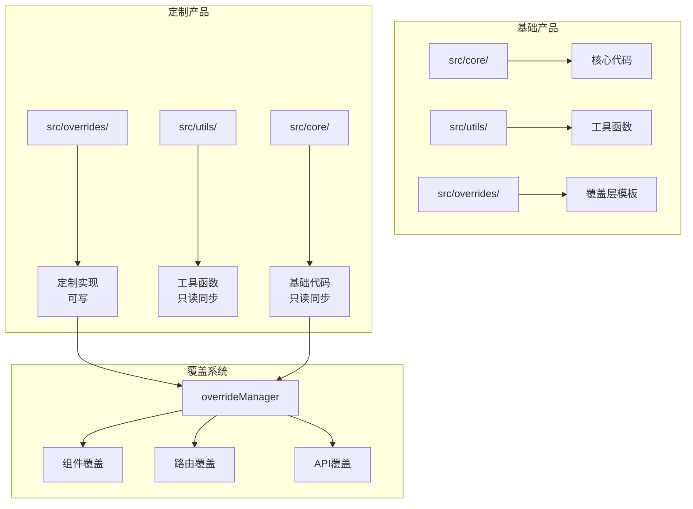
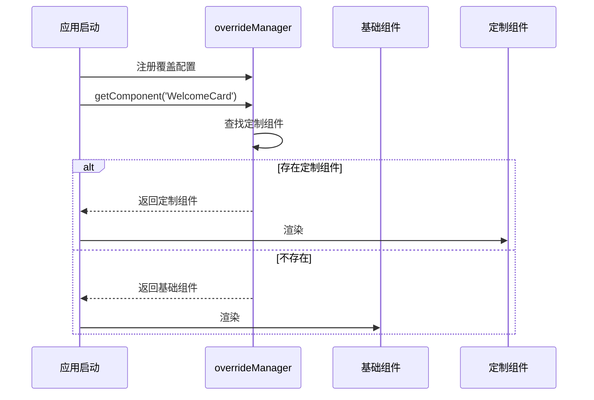
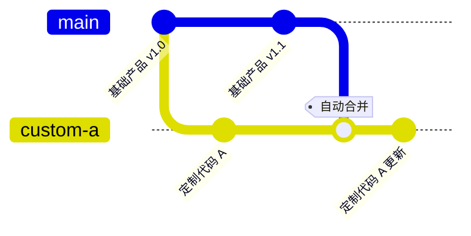

# 定制化项目代码合并方案

> **状态**: Draft
> **作者**: AIX Team
> **位置**: 适用于基础产品 + 定制产品的业务仓库

## 概述

基于覆盖层（Override Layer）的定制化项目代码隔离与自动合并方案，通过物理隔离定制代码与基础代码，实现基础产品更新时 90% 以上的自动化合并成功率。

## 动机

### 背景

团队维护基础产品和多个定制产品：
- **基础产品**: 核心功能代码库，持续迭代更新
- **定制产品**: 基于基础产品 fork 后二次开发，满足特定客户需求

**当前痛点**:
```
基础产品更新 → 定制产品合并 → 频繁冲突 → 手动解决 → 耗时且易出错
```

**冲突根因**: 定制代码与基础代码在同一文件中修改

### 为什么需要这个方案

现有方案不足：
- **Git 分支策略**: 长期分支维护成本高，合并冲突无法避免
- **代码注释标记**: 难以自动化处理，容易遗漏
- **手动 Cherry-pick**: 效率低，无法规模化

新方案优势：
- 物理隔离定制代码，从根源避免冲突
- 支持 CI/CD 自动化合并流程
- 定制逻辑清晰可维护

## 目标与非目标

### 目标

| 优先级 | 目标 | 说明 |
|--------|------|------|
| P0 | 代码物理隔离 | 定制代码与基础代码分离存储 |
| P0 | 自动合并流程 | CI/CD 自动同步基础产品更新 |
| P0 | 冲突率 < 5% | 合并冲突率降至 5% 以下 |
| P1 | 覆盖系统实现 | 组件/路由/API 等覆盖机制 |
| P1 | 迁移工具 | 现有定制项目迁移脚本 |
| P2 | 可视化管理 | 定制点管理界面 |

### 非目标

- 不解决基础产品 Breaking Change 问题（需语义化版本管理）
- 不支持深度定制（需修改基础代码的场景）
- 不提供运行时动态配置（编译时确定）

## 系统架构

### 架构概览



### 目录结构

```
定制产品/
├── src/
│   ├── core/              # 基础代码 (自动同步，禁止修改)
│   │   ├── views/
│   │   ├── components/
│   │   └── router/
│   ├── utils/             # 工具函数 (自动同步，禁止修改)
│   ├── overrides/         # 定制代码 (手动维护)
│   │   ├── components/    # 组件覆盖
│   │   ├── views/         # 页面覆盖
│   │   ├── router/        # 路由覆盖
│   │   ├── api/           # API 配置覆盖
│   │   ├── store/         # 状态管理覆盖
│   │   ├── locale/        # 国际化覆盖
│   │   └── index.ts       # 统一配置入口
│   └── main.ts
├── .github/
│   └── workflows/
│       └── sync-base.yml  # 自动同步基础产品
└── package.json
```

### 数据流



## 详细设计

### 覆盖系统核心

```typescript
// src/utils/override.ts
import type { Component } from 'vue';
import type { RouteRecordRaw } from 'vue-router';

export interface OverrideConfig {
  components?: Record<string, Component>;
  routes?: RouteRecordRaw[];
  store?: Record<string, any>;
  api?: ApiConfig;
  locale?: Record<string, any>;
  layout?: LayoutConfig;
}

class OverrideManager {
  private config: OverrideConfig = {};

  register(config: OverrideConfig) {
    this.config = config;
  }

  getComponent(name: string): Component | undefined {
    return this.config.components?.[name];
  }

  getRoutes(): RouteRecordRaw[] {
    return this.config.routes || [];
  }

  getApiConfig(): ApiConfig | undefined {
    return this.config.api;
  }
}

export const overrideManager = new OverrideManager();
```

### 组件覆盖

```typescript
// src/overrides/components/index.ts
import type { Component } from 'vue';

export function getCustomComponents(): Record<string, Component> {
  return {
    // 替换基础组件
    WelcomeCard: () => import('./CustomWelcomeCard.vue'),

    // 扩展基础组件
    UserProfile: () => import('./EnhancedUserProfile.vue'),
  };
}
```

**基础代码集成点**:
```vue
<!-- src/core/views/Home.vue -->
<template>
  <component :is="welcomeCard" />
</template>

<script setup lang="ts">
import { overrideManager } from '@/utils/override';
import DefaultWelcomeCard from '@/core/components/WelcomeCard.vue';

const welcomeCard = overrideManager.getComponent('WelcomeCard')
  || DefaultWelcomeCard;
</script>
```

### 路由覆盖

```typescript
// src/overrides/router/index.ts
import type { RouteRecordRaw } from 'vue-router';

export function getCustomRoutes(): RouteRecordRaw[] {
  return [
    // 新增定制路由
    {
      path: '/custom-feature',
      component: () => import('../views/CustomFeature.vue'),
      meta: { title: '定制功能' },
    },

    // 覆盖基础路由
    {
      path: '/dashboard',
      component: () => import('../views/CustomDashboard.vue'),
      meta: { override: true },
    },
  ];
}
```

**路由合并策略**:
```typescript
// src/router/index.ts
import { overrideManager } from '@/utils/override';
import overrideConfig from '@/overrides';

overrideManager.register(overrideConfig);

const baseRoutes: RouteRecordRaw[] = [...];
const customRoutes = overrideManager.getRoutes();

// 定制路由优先，过滤被覆盖的基础路由
const routes = [
  ...customRoutes,
  ...baseRoutes.filter(r => !customRoutes.some(c => c.path === r.path)),
];
```

### API 配置覆盖

```typescript
// src/overrides/api/index.ts
export function getCustomApiConfig() {
  return {
    baseURL: 'https://custom-api.example.com',
    timeout: 10000,
    endpoints: {
      customFeature: '/api/v2/custom',
    },
  };
}
```

## CI/CD 自动合并

### Git 分支策略



**核心原则**:
- `src/core/` 和 `src/utils/` 由基础产品维护，定制项目只读
- `src/overrides/` 由定制项目维护，基础产品不修改
- 合并时使用 `ours` 策略保护 overrides 目录

### 自动同步工作流

```yaml
# .github/workflows/sync-base.yml
name: Sync Base Product

on:
  schedule:
    - cron: '0 2 * * *'
  workflow_dispatch:

jobs:
  sync:
    runs-on: ubuntu-latest
    steps:
      - name: Checkout
        uses: actions/checkout@v3
        with:
          fetch-depth: 0

      - name: Setup Git
        run: |
          git config user.name "github-actions[bot]"
          git config user.email "github-actions[bot]@users.noreply.github.com"

      - name: Add upstream
        run: |
          git remote add upstream https://github.com/org/base-product.git
          git fetch upstream main --tags

      - name: Pre-merge check
        run: |
          FORBIDDEN=$(git diff upstream/main --name-only | grep -E '^src/(core|utils)/' || true)
          if [ -n "$FORBIDDEN" ]; then
            echo "❌ 检测到禁止修改的文件: $FORBIDDEN"
            exit 1
          fi

      - name: Merge with strategy
        run: |
          git merge upstream/main -X ours --no-commit --allow-unrelated-histories
          git checkout upstream/main -- src/core src/utils
          git checkout HEAD -- src/overrides

      - name: Run tests
        run: |
          npm ci
          npm run type-check
          npm run test

      - name: Commit and push
        run: |
          git add .
          git commit -m "chore: sync base product [skip ci]"
          git push origin main
```

### 冲突检测脚本

```bash
#!/bin/bash
# scripts/check-override-conflicts.sh

FORBIDDEN=$(git diff upstream/main --name-only | grep -E '^src/(core|utils)/' || true)

if [ -n "$FORBIDDEN" ]; then
  echo "❌ 检测到禁止修改的文件:"
  echo "$FORBIDDEN"
  echo "请将定制逻辑移至 src/overrides/ 目录"
  exit 1
fi

echo "✅ 定制代码规范检查通过"
```

## 迁移指南

### 现有定制项目迁移

**Step 1: 识别定制代码**
```bash
git diff base-product/main --name-only > modified-files.txt
```

**Step 2: 分类迁移**

| 修改类型 | 迁移目标 |
|---------|---------|
| 组件替换 | `overrides/components/` |
| 新增路由 | `overrides/router/` |
| API 配置 | `overrides/api/` |
| 国际化文案 | `overrides/locale/` |
| 状态管理 | `overrides/store/` |

**Step 3: 重构代码**
```typescript
// 迁移前: 直接修改基础组件 (❌)
// src/core/components/WelcomeCard.vue

// 迁移后: 创建覆盖组件 (✅)
// src/overrides/components/CustomWelcomeCard.vue
// src/overrides/components/index.ts
export function getCustomComponents() {
  return {
    WelcomeCard: () => import('./CustomWelcomeCard.vue'),
  };
}
```

### 基础产品改造清单

- [ ] 创建 `src/overrides/` 目录结构
- [ ] 实现 `src/utils/override.ts` 覆盖系统
- [ ] 在关键集成点注入覆盖逻辑
- [ ] 配置 CI/CD 自动同步流程
- [ ] 编写迁移文档和工具

## 缺点与风险

### 实现复杂度
- 基础产品需要预埋扩展点
- 覆盖系统增加代码理解成本

### 性能影响
- 动态组件加载有轻微性能损耗（可忽略）
- 路由合并逻辑增加启动时间（< 10ms）

### 学习成本
- 开发者需要理解覆盖机制
- 需要培训团队使用新流程

### 维护负担
- 扩展点不足时需要修改基础代码
- 需要维护覆盖系统本身

### 风险缓解
- 基础产品迭代时逐步增加扩展点
- 提供完善的文档和示例
- 定制项目编写集成测试验证覆盖逻辑

## 备选方案

### 方案 A: Git Submodule
将基础产品作为 submodule 引入定制项目。

**优点**: 版本隔离清晰

**缺点**:
- 无法直接修改基础代码
- 更新流程复杂
- 不支持覆盖机制

### 方案 B: Monorepo + Workspace
基础产品和定制产品在同一仓库。

**优点**: 代码共享方便

**缺点**:
- 仓库体积膨胀
- 权限管理困难
- 不适合多客户场景

### 方案 C: 插件系统
基础产品提供插件 API，定制功能通过插件实现。

**优点**: 扩展性强

**缺点**:
- 实现复杂度高
- 插件 API 设计困难
- 不适合深度定制

### 为什么选择当前方案

覆盖层方案平衡了以下因素：
- **实现成本**: 中等，基础产品改造工作量可控
- **维护成本**: 低，定制代码物理隔离
- **扩展性**: 高，支持组件/路由/API 等多维度覆盖
- **自动化**: 强，支持 CI/CD 自动合并

## 实施计划

### Phase 1: 基础产品改造 (2 周)
- [ ] 实现覆盖系统核心逻辑
- [ ] 识别并预埋扩展点（组件/路由/API）
- [ ] 编写迁移文档和工具脚本

### Phase 2: 试点迁移 (2 周)
- [ ] 选择 1-2 个定制项目试点
- [ ] 迁移定制代码到 overrides
- [ ] 验证自动合并流程
- [ ] 收集反馈并优化

### Phase 3: 全面推广 (4 周)
- [ ] 所有定制项目完成迁移
- [ ] 配置 CI/CD 自动同步
- [ ] 培训团队使用新流程
- [ ] 建立监控和告警机制

## 附录

### 技术依赖

| 依赖 | 版本 | 用途 |
|------|------|------|
| Vue | ^3.0.0 | 组件系统 |
| Vue Router | ^4.0.0 | 路由系统 |
| TypeScript | ^5.0.0 | 类型系统 |

### 相关文档

- [现有 overrides 实现参考](../../ai-project-verification-h5/src/overrides)
- [Vue 插件系统](https://vuejs.org/guide/reusability/plugins.html)
- [Micro Frontends 架构](https://micro-frontends.org/)

### 完整配置示例

```typescript
// src/overrides/index.ts
import type { OverrideConfig } from '@/utils/override';
import { getCustomComponents } from './components';
import { getCustomRoutes } from './router';
import { getCustomApiConfig } from './api';

const overrideConfig: OverrideConfig = {
  components: getCustomComponents(),
  routes: getCustomRoutes(),
  api: getCustomApiConfig(),
};

export default overrideConfig;
```
