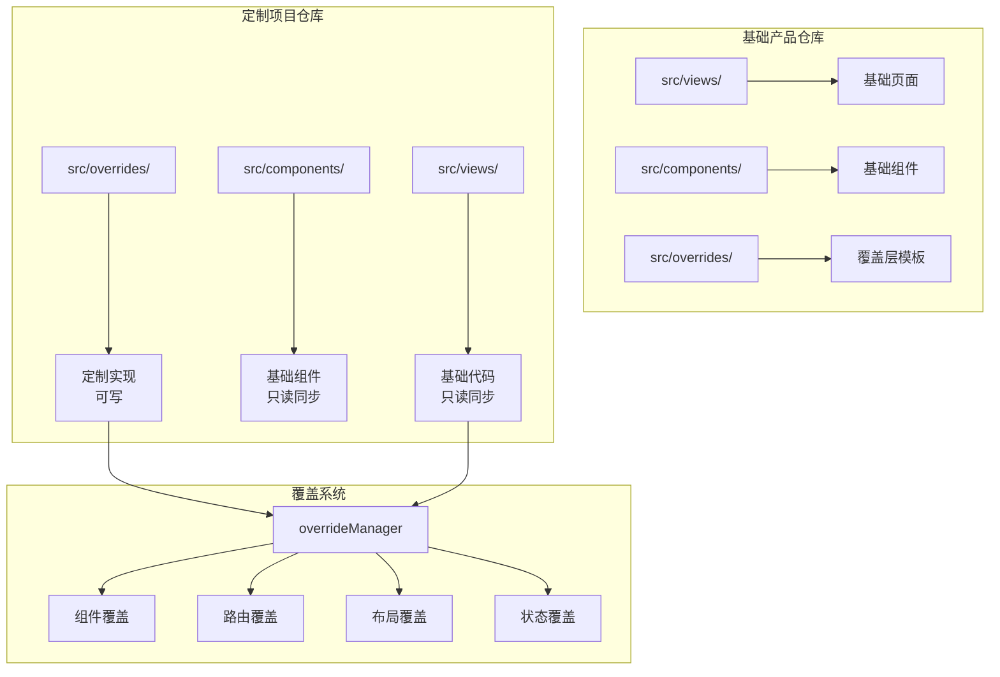

# 定制化项目代码合并方案

> **状态**: Draft
> **作者**: AIX Team
> **适用场景**: 基础产品 + 多个定制项目（独立仓库模式）

## 概述

基于覆盖层（Override Layer）的定制化项目代码隔离与自动合并方案，通过物理隔离定制代码与基础代码，实现基础产品更新时 95% 以上的自动化合并成功率。

## 动机

### 背景

团队维护一个基础产品和多个定制项目：

**架构模式**：
- **基础产品**: 独立仓库，提供核心功能和扩展点
- **定制项目**: 每个客户独立仓库，fork 基础产品后在 `src/overrides/` 目录实现定制

**当前痛点**：
```
基础产品更新 → 定制代码冲突 → 手动解决 → 耗时且易出错
```

**冲突根因**: 定制代码与基础代码混在一起修改

### 为什么需要这个方案

现有方案不足：
- **Git 分支策略**: 长期分支维护成本高，合并冲突无法避免
- **代码注释标记**: 难以自动化处理，容易遗漏
- **手动 Cherry-pick**: 效率低，无法规模化

新方案优势：
- 物理隔离定制代码（`src/overrides/` 目录），从根源避免冲突
- 支持 CI/CD 自动化合并流程
- 定制逻辑清晰可维护
- 支持多项目定制（通过环境变量切换）

## 目标与非目标

### 目标

| 优先级 | 目标 | 说明 |
|--------|------|------|
| P0 | 代码物理隔离 | 定制代码与基础代码分离存储（`src/overrides/`） |
| P0 | 自动合并流程 | CI/CD 自动同步基础产品更新 |
| P0 | 冲突率 < 5% | 合并冲突率降至 5% 以下 |
| P1 | 覆盖系统实现 | 组件/路由/布局/状态/API 等覆盖机制 |
| P1 | 多项目支持 | 支持多个定制项目共享基础代码 |
| P2 | 迁移工具 | 现有定制项目迁移脚本 |

### 非目标

- 不解决基础产品 Breaking Change 问题（需语义化版本管理）
- 不支持深度定制（需修改基础代码的场景）
- 不提供运行时动态配置（编译时确定）

## 系统架构

### 架构概览



### 目录结构

**基础产品仓库**：
```
base-product/
├── src/
│   ├── views/              # 基础页面
│   ├── components/         # 基础组件
│   ├── router/             # 基础路由
│   ├── store/              # 基础状态
│   ├── api/                # 基础 API
│   ├── utils/              # 工具函数
│   └── overrides/          # 覆盖层模板（空实现）
│       ├── components/
│       ├── router/
│       ├── layout/
│       ├── store/
│       ├── api/
│       ├── locale/
│       └── index.ts        # 空配置导出
└── .github/workflows/
```

**覆盖层模板**：
```typescript
// src/overrides/index.ts (基础产品提供的空模板)
import type { OverrideConfig } from '@/utils/override';

export default {
  components: {},
  store: {},
  locale: {},
  api: {},
  layout: {}
} as OverrideConfig;
```

**定制项目仓库**（fork 基础产品）：
```
custom-project-a/
├── src/
│   ├── views/              # 基础代码（自动同步，禁止修改）
│   ├── components/         # 基础组件（自动同步，禁止修改）
│   ├── router/             # 基础路由（自动同步，禁止修改）
│   ├── store/              # 基础状态（自动同步，禁止修改）
│   ├── api/                # 基础 API（自动同步，禁止修改）
│   ├── utils/              # 工具函数（自动同步，禁止修改）
│   └── overrides/          # ✅ 唯一可修改区域
│       ├── components/     # 组件覆盖
│       │   ├── MyWelcomeCard.vue
│       │   └── index.ts
│       ├── router/         # 路由覆盖
│       │   └── index.ts
│       ├── layout/         # 布局覆盖
│       │   ├── MyDefaultLayout.vue
│       │   └── index.ts
│       ├── store/          # 状态覆盖
│       │   └── index.ts
│       ├── api/            # API 配置覆盖
│       │   └── index.ts
│       ├── locale/         # 国际化覆盖
│       │   └── index.ts
│       ├── views/          # 自定义页面
│       │   └── MyCustomPage.vue
│       └── index.ts        # 统一配置入口
└── .github/workflows/sync-base.yml
```

**统一配置入口**：
```typescript
// src/overrides/index.ts (定制项目实现)
import type { OverrideConfig } from '@/utils/override';
import { getCustomComponents } from './components';
import { getCustomRoutes } from './router';
import { getCustomLayouts } from './layout';
import { getCustomStoreModules } from './store';
import { getCustomApiConfig } from './api';
import { getCustomLocaleMessages } from './locale';

export default {
  components: getCustomComponents(),
  layout: getCustomLayouts(),
  store: getCustomStoreModules(),
  api: getCustomApiConfig(),
  locale: getCustomLocaleMessages()
} as OverrideConfig;

export { getCustomRoutes };
```

## 详细设计

### 初始化流程

**基础产品应用入口**：
```typescript
// src/main.ts
import { createApp } from 'vue';
import { createPinia } from 'pinia';
import { createI18n } from 'vue-i18n';
import App from './App.vue';
import router from './router';
import { overrideManager } from '@/utils/override';
import overrideConfig, { getCustomRoutes } from '@/overrides';

const app = createApp(App);

// 1. 注册覆盖配置
overrideManager.register(overrideConfig, getCustomRoutes());

// 2. 自动注册覆盖组件
if (overrideConfig.components) {
  Object.entries(overrideConfig.components).forEach(([name, component]) => {
    app.component(name, component);
  });
}

// 3. 应用路由覆盖
const routes = applyRouteOverrides(baseRoutes);
router.addRoute(...routes);

// 4. 应用 API 配置覆盖
const apiConfig = overrideManager.getApiConfig();
axios.defaults.baseURL = apiConfig.baseURL || '/api';

// 5. 应用国际化覆盖
const i18n = createI18n({
  locale: 'zh-CN',
  messages: mergeLocaleMessages()
});

app.use(createPinia()).use(router).use(i18n).mount('#app');
```

### 覆盖系统核心

```typescript
// src/utils/override.ts
import type { Component, Module } from 'vue';
import type { RouteRecordRaw } from 'vue-router';

export interface ApiConfig {
  baseURL?: string;
  timeout?: number;
  headers?: Record<string, string>;
}

export interface LayoutConfig {
  layouts?: Record<string, Component>;
  defaultLayout?: string;
}

export interface OverrideConfig {
  components?: Record<string, Component>;
  store?: Record<string, Module>;
  locale?: Record<string, Record<string, any>>;
  api?: ApiConfig;
  layout?: LayoutConfig;
}

export interface CustomRouteConfig {
  overrideRoutes?: Record<string, Component>;
  customRoutes?: RouteRecordRaw[];
  disabledRoutes?: string[];
  whiteList?: string[];
}

class OverrideManager {
  private config: OverrideConfig = {};
  private routeConfig: CustomRouteConfig = {};

  register(config: OverrideConfig, routes?: CustomRouteConfig) {
    this.config = config;
    if (routes) this.routeConfig = routes;
  }

  // 组件覆盖
  getComponent(name: string): Component | undefined {
    return this.config.components?.[name];
  }

  // 状态覆盖
  getStoreModule(name: string): Module | undefined {
    return this.config.store?.[name];
  }

  // 路由覆盖
  getRoute(path: string): Component | undefined {
    return this.routeConfig.overrideRoutes?.[path];
  }

  getCustomRoutes(): RouteRecordRaw[] {
    return this.routeConfig.customRoutes || [];
  }

  isRouteDisabled(path: string): boolean {
    return this.routeConfig.disabledRoutes?.includes(path) || false;
  }

  // 布局覆盖
  getLayout(name: string): Component | undefined {
    return this.config.layout?.layouts?.[name];
  }

  // API 配置覆盖
  getApiConfig(): Partial<ApiConfig> {
    return this.config.api || {};
  }

  // 国际化覆盖
  getLocaleMessages(locale: string): Record<string, any> {
    return this.config.locale?.[locale] || {};
  }
}

export const overrideManager = new OverrideManager();
```

### 组件覆盖

**定制项目配置**：
```typescript
// src/overrides/components/index.ts
export function getCustomComponents(): Record<string, Component> {
  return {
    WelcomeCard: () => import('./MyWelcomeCard.vue'),
  };
}
```

**基础产品集成（自动注册）**：
```typescript
// src/main.ts
import { overrideManager } from '@/utils/override';
import overrideConfig from '@/overrides';

// 注册覆盖配置
overrideManager.register(overrideConfig);

// 自动注册全局组件覆盖
const app = createApp(App);
if (overrideConfig.components) {
  Object.entries(overrideConfig.components).forEach(([name, component]) => {
    app.component(name, component);
  });
}
```

**使用方式（无需手动包装）**：
```vue
<!-- src/views/Home.vue -->
<template>
  <!-- 自动使用覆盖组件，无需 getComponent() -->
  <WelcomeCard />
</template>
```

### 路由覆盖

**定制项目配置**：
```typescript
// src/overrides/router/index.ts
export function getCustomRoutes(): CustomRouteConfig {
  return {
    overrideRoutes: {
      '/home': () => import('@/overrides/views/MyHome.vue'),
    },
    customRoutes: [{
      path: '/custom-page',
      component: () => import('@/overrides/views/MyPage.vue'),
    }],
    disabledRoutes: ['/setting/theme'],
  };
}
```

**基础产品集成（递归处理嵌套路由）**：
```typescript
// src/router/index.ts
import { getCustomRoutes } from '@/overrides/router';

const customRoutes = getCustomRoutes();

// 递归应用路由覆盖
function applyRouteOverrides(routes: RouteRecordRaw[]): RouteRecordRaw[] {
  return routes
    .filter(route => !customRoutes.disabledRoutes?.includes(route.path))
    .map(route => {
      const override = customRoutes.overrideRoutes?.[route.path];
      return {
        ...route,
        component: override || route.component,
        children: route.children ? applyRouteOverrides(route.children) : undefined
      };
    });
}

const routes = applyRouteOverrides(baseRoutes);

// 新增自定义路由
if (customRoutes.customRoutes) {
  routes.push(...customRoutes.customRoutes);
}
```

### 布局覆盖

**定制项目配置**：
```typescript
// src/overrides/layout/index.ts
export function getCustomLayouts(): LayoutConfig {
  return {
    layouts: {
      'default': () => import('./MyDefaultLayout.vue'),
      'admin': () => import('./MyAdminLayout.vue'),
    },
    defaultLayout: 'default'
  };
}
```

**基础产品集成**：
```vue
<!-- src/App.vue -->
<template>
  <component :is="currentLayout">
    <router-view />
  </component>
</template>

<script setup lang="ts">
import { computed } from 'vue';
import { useRoute } from 'vue-router';
import { overrideManager } from '@/utils/override';
import DefaultLayout from '@/layouts/DefaultLayout.vue';

const route = useRoute();
const currentLayout = computed(() => {
  const layoutName = route.meta.layout || 'default';
  return overrideManager.getLayout(layoutName) || DefaultLayout;
});
</script>
```

### 状态覆盖

**定制项目配置**：
```typescript
// src/overrides/store/index.ts
export function getCustomStoreModules(): Record<string, Module> {
  return {
    user: {
      state: () => ({ customField: '' }),
      actions: {
        customAction() { /* ... */ }
      }
    }
  };
}
```

**基础产品集成**：
```typescript
// src/store/index.ts
import { createPinia } from 'pinia';
import { overrideManager } from '@/utils/override';

const pinia = createPinia();

// 注册覆盖的 store 模块
const customModules = overrideManager.config.store || {};
Object.entries(customModules).forEach(([name, module]) => {
  pinia.use(() => module);
});
```

### API 配置覆盖

**定制项目配置**：
```typescript
// src/overrides/api/index.ts
export function getCustomApiConfig(): ApiConfig {
  return {
    baseURL: 'https://custom-api.example.com',
    timeout: 10000,
    headers: {
      'X-Custom-Header': 'value'
    }
  };
}
```

**基础产品集成**：
```typescript
// src/api/request.ts
import axios from 'axios';
import { overrideManager } from '@/utils/override';

const defaultConfig = {
  baseURL: '/api',
  timeout: 5000
};

const customConfig = overrideManager.getApiConfig();
const request = axios.create({ ...defaultConfig, ...customConfig });
```

### 国际化覆盖

**定制项目配置**：
```typescript
// src/overrides/locale/index.ts
export function getCustomLocaleMessages(): Record<string, Record<string, any>> {
  return {
    'zh-CN': {
      welcome: '欢迎使用定制系统',
      customKey: '定制文案'
    },
    'en-US': {
      welcome: 'Welcome to Custom System',
      customKey: 'Custom Text'
    }
  };
}
```

**基础产品集成**：
```typescript
// src/i18n/index.ts
import { createI18n } from 'vue-i18n';
import { overrideManager } from '@/utils/override';
import zhCN from './locales/zh-CN';
import enUS from './locales/en-US';

const baseMessages = { 'zh-CN': zhCN, 'en-US': enUS };

// 合并覆盖的国际化文案
const messages = Object.keys(baseMessages).reduce((acc, locale) => {
  const customMessages = overrideManager.getLocaleMessages(locale);
  acc[locale] = { ...baseMessages[locale], ...customMessages };
  return acc;
}, {} as Record<string, any>);

export default createI18n({ locale: 'zh-CN', messages });
```

## 多项目定制支持

### 场景说明

当需要在同一仓库维护多个定制项目时（如客户 A、B、C），每个项目在 `src/overrides/` 下创建独立目录。

### 实现方案

**目录结构**：
```
src/overrides/
├── project-a/
│   ├── components/
│   ├── router/
│   ├── layout/
│   ├── store/
│   ├── api/
│   ├── locale/
│   └── index.ts
├── project-b/
│   └── index.ts
├── default/
│   └── index.ts
└── index.ts          # 动态加载入口
```

**动态加载**：
```typescript
// src/overrides/index.ts
import type { OverrideConfig } from '@/utils/override';

const projectName = import.meta.env.VITE_PROJECT || 'default';
const config = await import(`./${projectName}/index.ts`);

export default config.default as OverrideConfig;
export { getCustomRoutes } from `./${projectName}/index.ts`;
```

**构建脚本**：
```json
{
  "scripts": {
    "build:project-a": "VITE_PROJECT=project-a vite build",
    "build:project-b": "VITE_PROJECT=project-b vite build"
  }
}
```

## 前端配置管理

### 场景说明

通过可视化配置界面实现轻量级定制，无需修改代码即可调整系统外观和行为。

### 配置能力

- 系统标题、Logo、默认页面
- 水印（内容、颜色、字体、旋转角度）

### 实现方案

**配置存储**：
```typescript
// src/store/modules/siteConfig.ts
export const useSiteConfigStore = defineStore('siteConfig', {
  actions: {
    async load() {
      const res = await api.get('/api/config/frontend');
      this.savedConfig = mergeConfig(res.data);
    },
    async save(config: Partial<SiteConfig>) {
      await api.post('/api/config/frontend', config);
      this.savedConfig = mergeConfig(config);
    },
  },
});
```

## CI/CD 自动合并

### 自动同步工作流

```yaml
# .github/workflows/sync-base.yml
name: Sync Base Product

on:
  schedule:
    - cron: '0 2 * * *'
  workflow_dispatch:

jobs:
  sync:
    runs-on: ubuntu-latest
    steps:
      - uses: actions/checkout@v3
        with:
          fetch-depth: 0

      - name: Setup Git
        run: |
          git config user.name "github-actions[bot]"
          git config user.email "github-actions[bot]@users.noreply.github.com"

      - name: Add upstream
        run: |
          git remote add upstream https://github.com/org/base-product.git
          git fetch upstream main --tags

      - name: Pre-merge validation
        run: |
          MODIFIED=$(git diff HEAD upstream/main --name-only)
          FORBIDDEN=$(echo "$MODIFIED" | grep -v '^src/overrides/' | grep -E '^src/' || true)
          
          if [ -n "$FORBIDDEN" ]; then
            echo "❌ 检测到禁止修改的基础代码: $FORBIDDEN"
            exit 1
          fi

      - name: Check version compatibility
        run: |
          BASE_VERSION=$(git show upstream/main:package.json | jq -r .version)
          CURRENT_VERSION=$(jq -r .version package.json)
          BASE_MAJOR=$(echo $BASE_VERSION | cut -d. -f1)
          CURRENT_MAJOR=$(echo $CURRENT_VERSION | cut -d. -f1)
          
          if [ "$BASE_MAJOR" -gt "$CURRENT_MAJOR" ]; then
            echo "⚠️ Major 版本升级: $CURRENT_VERSION -> $BASE_VERSION"
            exit 1
          fi

      - name: Merge with protection
        run: |
          git merge upstream/main -X theirs --no-commit
          git checkout HEAD -- src/overrides

      - name: Run tests
        run: |
          npm ci
          npm run type-check || { git merge --abort; exit 1; }
          npm run test || { git merge --abort; exit 1; }

      - name: Create rollback tag
        run: |
          TAG="rollback-$(date +%Y%m%d-%H%M%S)"
          git tag -a "$TAG" HEAD~1 -m "Rollback point"
          echo "✅ 回滚点: $TAG"

      - name: Commit and push
        run: |
          git add .
          git commit -m "chore: sync base product $(date +%Y-%m-%d)"
          git push origin main
          git push origin --tags
```

### 冲突处理策略

当自动合并失败时（预期 < 5% 的情况），采用以下策略：

**1. 冲突检测与分类**：
```yaml
- name: Detect conflicts
  if: failure()
  run: |
    CONFLICTS=$(git diff --name-only --diff-filter=U)

    # 分类冲突文件
    OVERRIDE_CONFLICTS=$(echo "$CONFLICTS" | grep '^src/overrides/' || true)
    BASE_CONFLICTS=$(echo "$CONFLICTS" | grep -v '^src/overrides/' || true)

    echo "override_conflicts=$OVERRIDE_CONFLICTS" >> $GITHUB_OUTPUT
    echo "base_conflicts=$BASE_CONFLICTS" >> $GITHUB_OUTPUT
```

**2. 自动解决策略**：
```yaml
- name: Auto resolve conflicts
  if: failure()
  run: |
    # overrides 目录：保留定制代码（ours）
    git checkout --ours src/overrides

    # package.json：使用脚本智能合并（保留定制版本号，合并依赖）
    # 实现细节见项目 scripts/merge-package-json.js

    # 其他基础代码：使用上游版本（theirs）
    git checkout --theirs $(echo "$BASE_CONFLICTS" | grep -v 'package.json')
```

**3. 人工介入通知**：
```yaml
- name: AI auto-resolve conflicts
  if: failure()
  continue-on-error: true
  run: |
    # 收集冲突上下文
    CONFLICTS=$(git diff --name-only --diff-filter=U)
    CONFLICT_DETAILS=$(git diff --diff-filter=U)

    # 创建 AI 修复分支
    AI_BRANCH="sentinel/merge-conflict-$(date +%Y%m%d%H%M%S)"
    git checkout -b "$AI_BRANCH"

    # 调用 Claude Code 解决冲突
    npx @anthropic-ai/claude-code --prompt "
    基础产品更新时发生合并冲突，请分析并解决：

    ## 冲突文件
    $CONFLICTS

    ## 冲突详情
    \`\`\`diff
    $CONFLICT_DETAILS
    \`\`\`

    ## 解决策略
    1. src/overrides/ 目录：保留定制代码（当前分支）
    2. package.json：智能合并依赖，保留定制版本号
    3. 其他基础代码：优先使用上游版本，除非明显会破坏定制功能

    ## 约束
    - 解决冲突后删除冲突标记（<<<<<<, ======, >>>>>>）
    - 确保代码语法正确
    - 不要删除定制功能
    " --allowedTools "Edit,Read,Glob,Grep"

    # 检查是否成功解决冲突
    if [ -z "$(git diff --name-only --diff-filter=U)" ]; then
      git add -A
      git commit -m "chore: AI 自动解决合并冲突 $(date +%Y-%m-%d)"
      git push origin "$AI_BRANCH"

      # 创建 PR
      gh pr create \
        --head "$AI_BRANCH" \
        --title "fix: AI 自动解决合并冲突 ($(date +%Y-%m-%d))" \
        --body "## AI 自动解决合并冲突

基础产品更新时发生冲突，AI 已自动生成解决方案。

### 冲突文件
\`\`\`
$CONFLICTS
\`\`\`

### Review 清单
- [ ] 定制功能是否完整保留
- [ ] 基础代码更新是否正确应用
- [ ] 代码语法是否正确
- [ ] CI 是否全部通过

---
> 此 PR 由 AI 自动生成，请务必人工 Review 后再合并。" \
        --label "sentinel,merge-conflict"

      echo "✅ AI 已自动解决冲突并创建 PR: $AI_BRANCH"
      exit 0
    else
      echo "⚠️ AI 无法自动解决冲突，需要人工介入"
      git merge --abort
    fi

- name: Notify on manual intervention needed
  if: failure()
  run: |
    curl -X POST ${{ secrets.SLACK_WEBHOOK }} \
      -H 'Content-Type: application/json' \
      -d '{
        "text": "⚠️ 合并冲突需要人工处理（AI 自动解决失败）",
        "blocks": [{
          "type": "section",
          "text": {
            "type": "mrkdwn",
            "text": "*项目*: ${{ github.repository }}\n*冲突文件*:\n```\n'"$CONFLICTS"'\n```\n*查看详情*: ${{ github.server_url }}/${{ github.repository }}/actions/runs/${{ github.run_id }}"
          }
        }]
      }'

    # 创建 Issue 跟踪
    gh issue create \
      --title "合并冲突: $(date +%Y-%m-%d)" \
      --body "自动合并失败，AI 也无法自动解决，需要人工处理。详见 [工作流运行](${{ github.server_url }}/${{ github.repository }}/actions/runs/${{ github.run_id }})" \
      --label "merge-conflict,urgent"
```

**4. 回滚流程**：
```bash
# 手动回滚到上一个稳定版本
git reset --hard $(git tag -l "rollback-*" | tail -1)
git push origin main --force-with-lease

# 或回滚到指定标签
git reset --hard rollback-20260317-042057
git push origin main --force-with-lease
```

### 冲突预防机制

**1. 预合并检查**：
```yaml
- name: Dry-run merge
  run: |
    git merge upstream/main --no-commit --no-ff
    if [ $? -ne 0 ]; then
      echo "⚠️ 检测到潜在冲突，建议人工审查"
      git merge --abort
      exit 1
    fi
    git merge --abort
```

**2. 定期同步提醒**：
```yaml
- name: Check sync lag
  run: |
    COMMITS_BEHIND=$(git rev-list --count HEAD..upstream/main)
    if [ $COMMITS_BEHIND -gt 50 ]; then
      echo "⚠️ 落后基础产品 $COMMITS_BEHIND 个提交，建议尽快同步"
    fi
```

## 实施检查清单

### P0 核心功能

- [ ] **覆盖系统实现**
  - [ ] OverrideManager 完整实现（组件/路由/布局/状态/API/国际化）
  - [ ] 组件自动注册机制
  - [ ] 路由递归覆盖（支持嵌套路由）
  - [ ] 布局动态切换
  - [ ] 状态模块合并
  - [ ] API 配置合并
  - [ ] 国际化文案合并

- [ ] **CI/CD 自动合并**
  - [ ] 预合并校验（禁止修改基础代码）
  - [ ] 版本兼容性检查
  - [ ] 自动测试（类型检查 + 单元测试）
  - [ ] 回滚标签创建

- [ ] **冲突处理策略**
  - [ ] 冲突自动分类（overrides vs 基础代码）
  - [ ] 自动解决策略（ours/theirs）
  - [ ] package.json 智能合并脚本
  - [ ] Slack/Issue 通知机制
  - [ ] 回滚流程文档

### 验收标准

| 指标 | 目标 | 验证方式 |
|------|------|---------|
| 自动合并成功率 | ≥ 95% | 统计最近 20 次合并的成功率 |
| 冲突解决时间 | < 30 分钟 | 从冲突通知到解决完成的平均时间 |
| 覆盖功能完整性 | 100% | 所有覆盖类型都有实现和测试用例 |
| 回滚成功率 | 100% | 回滚后系统可正常运行 |

### 风险与缓解

| 风险 | 影响 | 缓解措施 |
|------|------|---------|
| 基础产品 Breaking Change | 定制项目构建失败 | 版本兼容性检查 + Major 版本升级拦截 |
| 覆盖配置错误 | 运行时报错 | TypeScript 类型检查 + 单元测试 |
| 合并冲突率超预期 | 人工介入成本高 | 定期同步提醒 + 预合并检查 |
| 回滚失败 | 系统不可用 | 自动化测试 + 回滚标签验证 |
