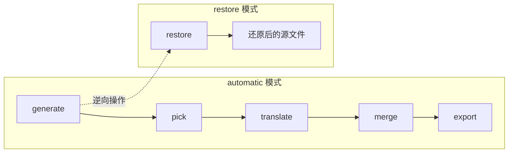
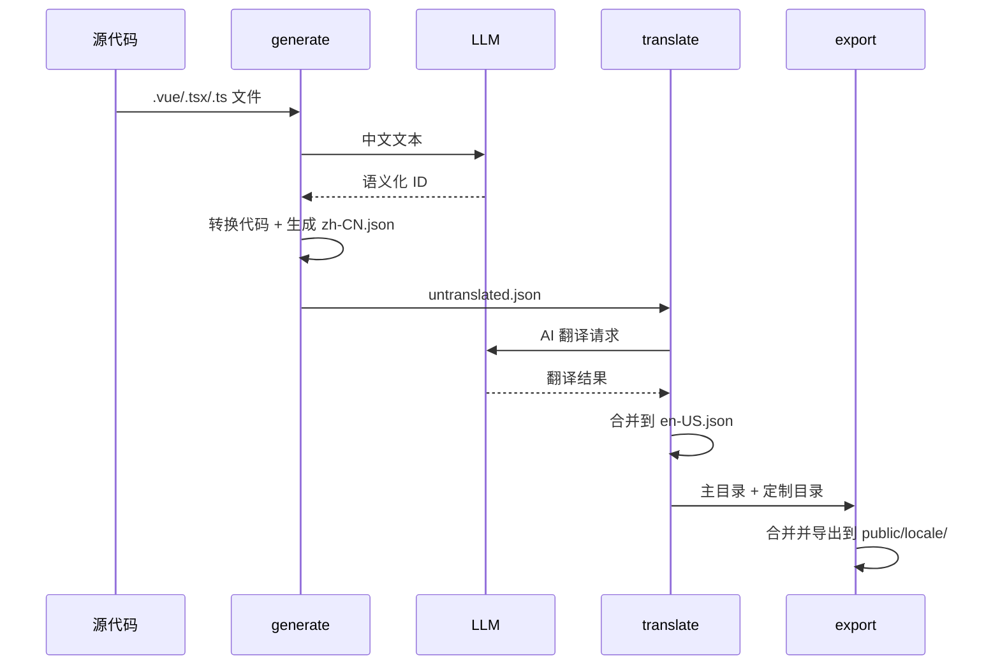

# 国际化自动化工具 (@kit/i18n-tools)

> **状态**: Completed
> **作者**: AIX Team
> **位置**: `internal/i18n-tools/`

## 概述

Vue/React 项目国际化自动化工具集，支持中文提取、语义化 ID 生成、AI 翻译和代码转换。

## 动机

### 背景

在中文项目国际化过程中，开发者面临以下痛点：

- **手动提取效率低**：逐个文件查找中文文本，容易遗漏
- **Key 命名不一致**：不同开发者命名风格各异，如 `btn1`、`submitButton`、`button_submit`
- **翻译流程割裂**：提取、翻译、合并需要多个工具配合
- **代码转换易出错**：手动替换 `"中文"` 为 `t('key')` 容易引入语法错误

### 为什么需要这个方案

现有工具如 `i18n-ally` 主要解决 IDE 层面的辅助，缺乏：
- 批量自动化能力
- 语义化 Key 生成
- AI 翻译集成
- 一键式工作流

## 目标与非目标

### 目标

| 优先级 | 目标 | 说明 |
|--------|------|------|
| P0 | 自动提取中文文本 | 支持 Vue SFC 和 React JSX/TSX |
| P0 | 语义化 Key 生成 | 基于 LLM 生成有意义的 key |
| P0 | AI 翻译集成 | 支持 OpenAI 兼容 API |
| P0 | 代码自动转换 | 将中文替换为 `t('key')` 调用 |
| P1 | 多框架适配 | vue-i18n、vue-i18next、react-intl、react-i18next |
| P1 | 还原能力 | 支持代码还原到转换前状态 |
| P2 | 增量更新 | 仅处理新增的中文文本 |

### 非目标

- 不提供运行时 i18n 库（使用现有的 vue-i18n 等）
- 不支持非中文源语言提取
- 不提供翻译管理平台（仅命令行工具）

## 核心能力

| 能力 | 说明 |
|------|------|
| **多框架支持** | Vue (`vue-i18n`, `vue-i18next`) 和 React (`react-intl`, `react-i18next`) |
| **智能提取** | 自动扫描源码中的中文文本，支持 JSX、模板、脚本等多种上下文 |
| **语义化 ID** | 基于 LLM 生成有意义的国际化 key，支持本地兜底策略 |
| **AI 翻译** | 集成 OpenAI 兼容 API（支持 OpenAI/DeepSeek/Azure 等） |
| **完整工作流** | 从提取到导出的一站式自动化流程 |

## 系统架构

### 自动化工作流



### 数据流转



### 目录结构

```
internal/i18n-tools/
├── src/
│   ├── cli.ts                  # CLI 入口
│   ├── index.ts                # 主入口
│   │
│   ├── adapters/               # 框架适配器
│   │   ├── FrameworkAdapter.ts # 适配器基类
│   │   ├── VueAdapter.ts       # Vue 适配器
│   │   └── ReactAdapter.ts     # React 适配器
│   │
│   ├── config/                 # 配置系统
│   │   ├── types.ts            # 配置类型定义
│   │   ├── loader.ts           # 配置加载器
│   │   └── defaults.ts         # 默认配置
│   │
│   ├── core/                   # 核心处理器
│   │   ├── BaseProcessor.ts    # 处理器基类
│   │   ├── GenerateProcessor.ts    # 代码生成
│   │   ├── PickProcessor.ts        # 提取待翻译
│   │   ├── TranslateProcessor.ts   # AI 翻译
│   │   ├── MergeProcessor.ts       # 合并翻译
│   │   ├── ExportProcessor.ts      # 导出语言包
│   │   ├── RestoreProcessor.ts     # 代码还原
│   │   └── AutomaticProcessor.ts   # 全自动流程
│   │
│   ├── strategies/             # 框架策略
│   │   ├── vue/                # Vue 策略
│   │   │   ├── VueTextExtractor.ts
│   │   │   ├── VueTransformer.ts
│   │   │   └── libraries/      # vue-i18n, vue-i18next
│   │   └── react/              # React 策略
│   │       ├── ReactTextExtractor.ts
│   │       ├── ReactTransformer.ts
│   │       └── libraries/      # react-intl, react-i18next
│   │
│   └── utils/                  # 工具函数
│       ├── LLMClient.ts        # LLM API 客户端
│       ├── IdGenerator.ts      # 语义化 ID 生成
│       └── LanguageFileManager.ts  # 语言文件管理
│
├── dist/                       # 构建产物
└── package.json
```

## 核心模块

### 代码生成器 (generate)

扫描源文件，提取中文文本，生成语义化 ID，转换代码。

**支持的上下文 (Vue)**:

| 上下文 | 转换前 | 转换后 |
|--------|--------|--------|
| 模板文本节点 | `<span>中文</span>` | `<span>&#123;&#123; $t('key') &#125;&#125;</span>` |
| 静态属性 | `<div title="中文">` | `<div :title="$t('key')">` |
| 动态属性 | `:placeholder="'中文'"` | `:placeholder="$t('key')"` |
| script 代码 | `const msg = '中文'` | `const msg = t('key')` |

**支持的上下文 (React)**:

| 上下文 | 转换前 | 转换后 |
|--------|--------|--------|
| JSX 文本 | `<span>中文</span>` | `<span>{t('key')}</span>` |
| JSX 属性 | `<Input placeholder="中文" />` | `<Input placeholder={t('key')} />` |
| JS 代码 | `const msg = '中文'` | `const msg = t('key')` |

### 语义化 ID 生成器

**LLM 模式**: 调用 AI 生成有意义的 ID

```typescript
// 输入
"请输入用户名"

// 输出
"login__please_input_username"
```

**本地兜底**: 使用中文常用词映射 + 哈希

| 中文 | 英文 | 中文 | 英文 |
|------|------|------|------|
| 确认 | confirm | 取消 | cancel |
| 删除 | delete | 添加 | add |
| 编辑 | edit | 保存 | save |
| 提交 | submit | 搜索 | search |

### AI 翻译器

支持 OpenAI 兼容 API：

```typescript
llm: {
  translation: {
    apiKey: process.env.LLM_API_KEY,
    model: 'gpt-4o',
    baseURL: 'https://api.deepseek.com',  // 可选
  }
}
```

## 配置示例

```typescript
// i18n.config.ts
import { defineConfig } from '@kit/i18n-tools';

export default defineConfig({
  rootDir: __dirname,
  framework: 'vue',

  paths: {
    locale: 'src/locale',
    source: 'src',
    tImport: '@/plugins/locale',
  },

  llm: {
    idGeneration: {
      apiKey: process.env.LLM_API_KEY!,
      model: 'gpt-4o',
    },
    translation: {
      apiKey: process.env.LLM_API_KEY!,
      model: 'gpt-4o',
    },
  },
});
```

## CLI 命令

```bash
# 交互模式
npx i18n-tools -i

# 全自动流程
npx i18n-tools --mode automatic

# 单步执行
npx i18n-tools --mode generate    # 代码生成
npx i18n-tools --mode pick        # 提取待翻译
npx i18n-tools --mode translate   # AI 翻译
npx i18n-tools --mode merge       # 合并翻译
npx i18n-tools --mode export      # 导出语言包
npx i18n-tools --mode restore     # 代码还原
```

## 生成的文件

```
src/locale/
├── zh-CN.json              # 源语言文件
├── en-US.json              # 目标语言文件
├── untranslated.json       # 待翻译条目 (中间文件)
└── translations.json       # 已翻译条目 (中间文件)

public/locale/
├── zh-CN.json              # 最终源语言包
└── en-US.json              # 最终目标语言包
```

## 缺点与风险

| 风险 | 说明 | 缓解措施 |
|------|------|----------|
| **LLM 依赖** | 语义化 Key 生成依赖外部 API | 提供本地兜底策略（常用词映射 + 哈希） |
| **AST 解析局限** | 复杂模板可能解析失败 | 支持跳过规则，手动处理边界情况 |
| **翻译质量** | AI 翻译可能不准确 | 生成待审核文件，支持人工校对 |
| **代码风格变化** | 转换后代码格式可能改变 | 集成 Prettier，保持格式一致 |

## 备选方案

### 方案 A：扩展 i18n-ally

直接为 VS Code 插件 i18n-ally 开发扩展功能。

**放弃原因**：
- 依赖 IDE 环境，无法集成到 CI/CD
- 扩展开发受限于插件 API
- 无法实现批量自动化

### 方案 B：使用 Google Translate API

使用传统翻译 API 而非 LLM。

**放弃原因**：
- 无法生成语义化 Key（LLM 核心优势）
- 翻译质量不如现代 LLM
- 上下文理解能力弱

### 为什么选择当前方案

- **独立工具**：可在任何环境运行，支持 CI/CD
- **LLM 驱动**：语义化 Key + 高质量翻译
- **框架适配器模式**：易于扩展支持新框架

## 技术依赖

| 依赖 | 用途 |
|------|------|
| `@babel/parser` | JavaScript/TypeScript AST 解析 |
| `@vue/compiler-sfc` | Vue SFC 解析 |
| `openai` | OpenAI 兼容 API 客户端 |
| `commander` | CLI 框架 |
| `inquirer` | 交互式 CLI |
| `globby` | 文件匹配 |
| `prettier` | 代码格式化 |

## 相关文档

- 详细使用指南: `internal/i18n-tools/README.md`
- 配置参考: `internal/i18n-tools/README.md#配置参考`
