# 群聊机器人服务 (@kit/im-bot)

> **状态**: Draft
> **作者**: AIX Team
> **位置**: `kit/im-bot/`

## 概述

基于飞书/钉钉/企微群聊的 LLM 机器人服务，可独立部署为 Node.js 服务（Docker）。用户在 IM 群聊中 @机器人发送自然语言消息，系统通过 LLM 自动解析意图、提取结构化字段，写入各平台对应的多维表格，并在群聊中返回执行结果。支持增删改查全操作，场景可插件化扩展。

## 动机

### 背景

团队日常有大量结构化数据需要录入多维表格（销售记录、任务跟踪、报销审批等），目前依赖手工操作：

- **操作繁琐**：需要打开多维表格 → 找到正确的表 → 逐字段填写 → 保存，一条记录耗时 1~3 分钟
- **场景分散**：不同业务使用不同平台（飞书/钉钉/企微），每个平台的表格 API 差异大
- **数据不及时**：离开群聊去填表的摩擦导致数据延迟录入，甚至遗漏
- **查询不便**：查询历史数据需要打开表格界面，无法在群聊中快速获取

### 为什么需要这个方案

通过 @机器人发送自然语言消息，可以将录入时间从分钟级降低到秒级：

- **零切换成本**：在群聊中直接完成数据录入，无需跳转到表格界面
- **自然语言输入**：无需记忆字段格式，LLM 自动提取结构化数据
- **平台自动路由**：消息来自哪个平台就写入哪个平台的表格，用户无需感知
- **场景插件化**：新增业务场景只需实现一个接口，不触碰已有代码

### 业务场景

| 场景 | 示例消息 | 目标表 |
|------|---------|--------|
| 销售记录 | "今天卖了【临期特价】安耐晒防晒霜金瓶60ML，成本40卖45，申通发的" | 销售记录表 |
| 任务跟踪 | "张三今天启动了A任务，预计明天提测，后台上线" | 任务跟踪表 |
| _未来扩展_ | _报销、库存盘点、考勤..._ | _对应表_ |

## 目标与非目标

### 目标

| 优先级 | 目标 | 说明 |
|--------|------|------|
| P0 | 飞书端到端打通 | 飞书群聊 @机器人 → LLM 解析 → 写入 Bitable → 回复结果 |
| P0 | 场景插件化架构 | BotScene 接口契约，新增场景不触碰已有代码 |
| P0 | 多维表格 CRUD | 支持新增/查询/编辑/删除四种操作 |
| P1 | 多平台消息通道 | 飞书/钉钉/企微三平台消息接入与回复 |
| P1 | 多平台表格适配 | Bitable / 宜搭多维表 / 智能表格 统一 CRUD 接口 |
| P1 | 事件去重与审计 | eventId 幂等 + bot_event_log 审计日志 |
| P2 | 富文本回复 | 飞书卡片 / 钉钉 Markdown / 企微 Markdown |
| P2 | 后台配置管理 | 表格映射配置、Bot 开关、日志查看 |

### 非目标

- 不做通用聊天机器人（只处理 @机器人 的结构化业务消息）
- 不做多轮对话管理（单消息单意图，复杂场景回复引导文案）
- 不做文件/图片/语音消息处理（仅处理文本消息）
- 不替代多维表格本身的管理界面（只提供群聊快捷通道）

## 接入平台

每个平台同时提供**消息通道**和**多维表格存储**，消息从哪个平台来就写入哪个平台的表格：

| 平台 | 消息接入 | 多维表格 | 触发方式 | 优先级 |
|------|---------|---------|---------|--------|
| 飞书 | 自建应用 + 事件订阅 (Webhook) | Bitable | @机器人 | P0 |
| 钉钉 | 自建机器人 Webhook 模式（不使用 Stream 长连接，降低基础设施依赖） | 宜搭多维表 | @机器人 | P1 |
| 企微 | 自建应用回调 | 智能表格 | @机器人 | P2 |

## 系统架构

### 架构图

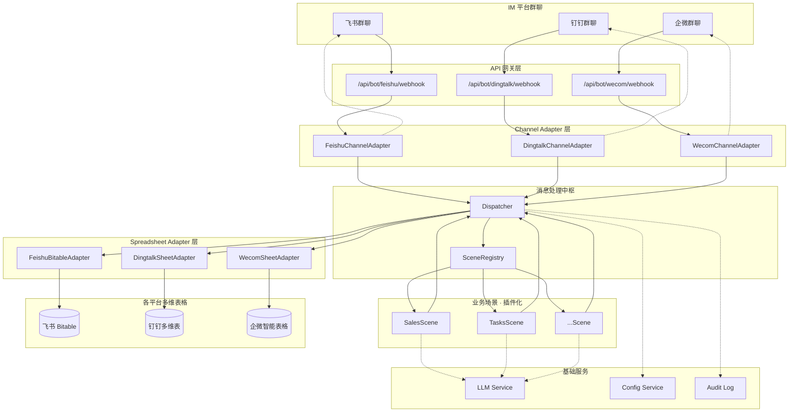

### 分层架构

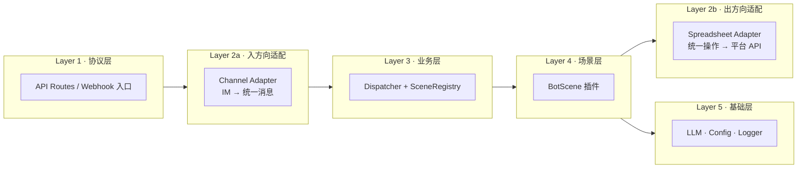

| 层级 | 职责 | 数据方向 | 扩展方式 |
|------|------|---------|---------|
| 协议层 | Webhook 入口，HTTP 收发 | 外部 → 内部 | 新增 route handler |
| 入方向适配 (2a) | Channel Adapter — 平台消息协议 → UnifiedMessage | 外部 → 内部 | 实现 ChannelAdapter 接口 |
| 业务层 | 去重、场景路由、流程编排 | — | 一般不需要扩展 |
| 场景层 | 具体业务逻辑（prompt / 校验 / 格式化） | — | 新建场景目录 + 注册 |
| 出方向适配 (2b) | Spreadsheet Adapter — 统一 CRUD → 平台表格 API | 内部 → 外部 | 实现 SpreadsheetAdapter 接口 |
| 基础层 | LLM 调用、配置读取、日志记录 | — | 注入实现 |

### 设计原则

| 原则 | 体现 |
|------|------|
| **消息与存储双适配** | Channel Adapter 抹平消息差异，Spreadsheet Adapter 抹平表格差异 |
| **场景间零耦合** | 每个 BotScene 独立目录，独立 prompt / schema / formatter |
| **平台路由自动化** | 消息来自哪个平台，就写入哪个平台的表格，场景代码无需感知 |
| **@触发** | 仅 @机器人 的消息才进入处理流程，其他消息静默忽略 |
| **依赖注入** | LLM / Config / Logger 通过构造参数注入，不绑定具体实现 |

### 目录结构

```
kit/im-bot/
├── src/
│   ├── index.ts                              # 包入口，导出所有公共 API
│   ├── server.ts                             # 独立服务入口 (Hono + Node.js HTTP)
│   ├── types.ts                              # 统一类型定义
│   │
│   ├── core/                                 # 核心引擎
│   │   ├── dispatcher.ts                     # 消息调度中枢
│   │   ├── scene-registry.ts                 # 场景注册中心
│   │   ├── dedup.ts                          # 事件去重 (DedupStore)
│   │   └── pending-action.ts                 # 有状态交互 (PendingActionStore)
│   │
│   ├── channels/                             # 消息通道适配器
│   │   ├── types.ts                          # ChannelAdapter 接口
│   │   ├── feishu.ts                         # 飞书消息适配
│   │   ├── dingtalk.ts                       # 钉钉消息适配
│   │   └── wecom.ts                          # 企微消息适配
│   │
│   ├── spreadsheets/                         # 多维表格适配器
│   │   ├── types.ts                          # SpreadsheetAdapter 接口
│   │   ├── feishu-bitable.ts                 # 飞书 Bitable
│   │   ├── dingtalk-sheet.ts                 # 钉钉宜搭多维表
│   │   ├── wecom-sheet.ts                    # 企微智能表格
│   │   └── factory.ts                        # 根据 platform 返回对应 adapter
│   │
│   ├── scenes/                               # 内置业务场景
│   │   ├── sales/                            # 销售记录场景
│   │   │   ├── index.ts
│   │   │   ├── prompt.ts
│   │   │   ├── schema.ts
│   │   │   └── formatter.ts
│   │   └── tasks/                            # 任务跟踪场景
│   │       ├── index.ts
│   │       ├── prompt.ts
│   │       ├── schema.ts
│   │       └── formatter.ts
│   │
│   ├── auth/                                 # 各平台 Token 管理
│   │   ├── types.ts                          # TokenManager 接口
│   │   ├── feishu-token.ts
│   │   ├── dingtalk-token.ts
│   │   └── wecom-token.ts
│   │
│   └── integrations/                         # 框架集成 (嵌入其他应用时使用)
│       ├── next.ts                           # Next.js API Route handler
│       ├── express.ts                        # Express middleware
│       └── hono.ts                           # Hono handler
│
├── __test__/                                 # 测试文件
│   ├── dispatcher.test.ts
│   ├── scene-registry.test.ts
│   ├── channels/
│   └── spreadsheets/
│
├── Dockerfile                                # 生产镜像构建
├── docker-compose.yml                        # 本地开发 / 单机部署
├── package.json
├── tsconfig.json
├── rollup.config.js
└── README.md
```

## 详细设计

### 核心类型定义

#### 统一消息格式

```typescript
type BotPlatform = 'feishu' | 'dingtalk' | 'wecom'

/** 统一消息 — 所有平台 Adapter 输出此结构 */
interface UnifiedMessage {
  platform: BotPlatform
  eventId: string        // 平台事件 ID (去重幂等键)
  messageId: string      // 消息 ID (回复时引用)
  chatId: string         // 群聊 ID
  chatName?: string
  senderId: string       // 发送者平台 ID
  senderName: string     // 发送者姓名
  content: string        // 纯文本 (已去除 @机器人 前缀)
  timestamp: number
}
```

#### 意图解析结果

```typescript
interface ParsedIntent {
  intent: 'CREATE' | 'UPDATE' | 'QUERY' | 'DELETE' | 'UNKNOWN'
  fields: Record<string, unknown>
  filters?: Record<string, unknown>
  confidence: number     // 0~1
  summary: string        // 人类可读摘要
}

/** 执行结果 — Dispatcher 执行 CRUD 后传给 formatReply() */
interface ExecuteResult {
  success: boolean
  /** 新增/更新后的记录 */
  record?: SpreadsheetRecord
  /** 查询返回的记录列表 */
  records?: SpreadsheetRecord[]
  /** 错误信息 */
  error?: string
}

interface SceneContext {
  today: string          // "2026-04-02"
  senderName: string
  chatName?: string
}
```

### 消息通道适配器

```typescript
/** 消息通道适配器 — 每个 IM 平台实现一个 */
interface ChannelAdapter {
  readonly platform: BotPlatform

  /**
   * 验证 Webhook 请求的合法性。
   *
   * 此方法需处理两种场景：
   * 1. URL 验证 (首次配置): 飞书发送 challenge 握手请求，需直接返回 challenge 值；
   *    钉钉/企微有各自的验证握手方式。
   * 2. 事件签名验证 (每次推送): 飞书使用 Encrypt Key 做 AES 解密验签；
   *    钉钉使用 botSecret 做 HMAC-SHA256 签名校验；
   *    企微使用 EncodingAESKey 做 AES 解密。
   *
   * 设计为异步接口：当前 MVP 使用 node:crypto 同步实现，
   * 但 Phase 4 如需支持 Web Crypto API (Edge Runtime) 则必须异步，
   * 从一开始定义为 Promise 避免后续破坏性变更。
   */
  verify(req: Request, body: unknown): Promise<VerifyResult>

  /** 解析平台事件体为统一消息，非 @机器人 的消息返回 null */
  parse(body: unknown): UnifiedMessage | null

  /** 主动向群聊推送回复 */
  reply(msg: UnifiedMessage, content: string): Promise<void>
}

/** 签名验证结果 */
type VerifyResult =
  | { ok: true }
  | { ok: false; status: number }
  | { challenge: string }  // URL 验证握手，需直接返回此值
```

各平台 @机器人 检测与签名验证方式：

| 平台 | @机器人 检测方式 | 内容提取 |
|------|----------------|---------|
| 飞书 | 事件体 `message.mentions` 数组中包含机器人的 `open_id` | 从 `content` 中去除 `@_user_1` 等 mention 占位符 |
| 钉钉 | Outgoing 机器人天然只接收 @机器人 的消息 | 去除消息开头的 `@机器人名` 文本 |
| 企微 | 事件体 `MsgType=text` 且 `Content` 包含 `@botname`，或通过 `MentionedList` 判断 | 去除 `@botname` 文本 |

| 平台 | 签名验证方式 | URL 验证 (首次配置) |
|------|------------|-------------------|
| 飞书 | `Encrypt Key` AES-256-CBC 解密（推荐）。`Verification Token` 已废弃，仅作后备 | 返回解密后的 `challenge` 值 |
| 钉钉 | `botSecret` HMAC-SHA256 签名校验 (Header: `sign` + `timestamp`) | 无独立握手，首条消息即验证 |
| 企微 | `EncodingAESKey` AES-256-CBC 解密（**必填**，明文模式不安全） | 返回解密后的 `echostr` |

### 多维表格适配器

三大平台表格 API 差异显著，通过统一接口抹平：

```typescript
/** 多维表格统一配置 */
interface SpreadsheetTableConfig {
  platform: BotPlatform
  workspaceId: string    // 飞书 app_token / 钉钉 baseId / 企微 docid
  tableId: string        // 飞书 table_id / 钉钉 sheetId / 企微 sheet_id
  fieldMapping: Record<string, string>  // 逻辑字段名 → 平台实际字段名
}

/** 统一记录结构 */
interface SpreadsheetRecord {
  recordId: string
  fields: Record<string, unknown>
}

/** 多维表格适配器 — 每个平台实现一个 */
interface SpreadsheetAdapter {
  readonly platform: BotPlatform

  createRecord(
    config: SpreadsheetTableConfig,
    fields: Record<string, unknown>,
  ): Promise<SpreadsheetRecord>

  updateRecord(
    config: SpreadsheetTableConfig,
    recordId: string,
    fields: Record<string, unknown>,
  ): Promise<SpreadsheetRecord>

  queryRecords(
    config: SpreadsheetTableConfig,
    filters: Record<string, unknown>,
  ): Promise<SpreadsheetRecord[]>

  deleteRecord(
    config: SpreadsheetTableConfig,
    recordId: string,
  ): Promise<void>
}
```

#### 三平台表格 API 差异对照

| 维度 | 飞书 Bitable | 钉钉宜搭多维表 | 企微智能表格 |
|------|-------------|---------------|-------------|
| **Base URL** | `open.feishu.cn/open-apis/bitable/v1/...` | `api.dingtalk.com/v1.0/yida/...`（通过宜搭 API 操作多维表） | `qyapi.weixin.qq.com/cgi-bin/wedoc/smartsheet/` |
| **认证方式** | Header: `Bearer {tenant_access_token}` | Header: `x-acs-dingtalk-access-token` | Query: `?access_token=XXX` |
| **HTTP 风格** | 标准 REST (POST/PUT/DELETE) | REST 风格，批量操作 | 全 POST (RPC 风格) |
| **新增** | `POST .../records` | `POST .../records` (批量) | `POST /add_records` |
| **查询** | `POST .../records/search` | `POST .../records/query` | `POST /get_records` |
| **更新** | `PUT .../records/{id}` | `PUT .../records` (批量) | `POST /update_records` |
| **删除** | `DELETE .../records/{id}` | `DELETE .../records` (批量) | `POST /delete_records` |
| **字段值格式** | 扁平 JSON | 扁平 JSON | 类型化数组 `[{type, text}]` |
| **筛选语法** | `conjunction + conditions` DSL | 较简单 | 较简单 |

**适配器内部处理差异**：
- 飞书：标准 REST，字段名直接作为 key
- 钉钉：批量接口包单条，ID 在 body 中传递
- 企微：全 POST + token 在 query string，字段值需要 `[{type: "text", text: "xxx"}]` 格式转换

### 业务场景接口

```typescript
/** 业务场景接口 — 扩展的唯一契约 */
interface BotScene {
  readonly id: string
  readonly name: string
  /** 场景简介，用于第二级 LLM 分类 prompt 构建 */
  readonly description: string

  /**
   * 关键词快速匹配 (不消耗 LLM token)。
   * 返回 0 表示不匹配，返回 > 0 的数值表示匹配置信度（越高越优先）。
   * SceneRegistry 选择得分最高的场景；得分相同时按注册顺序优先。
   */
  match(content: string): number

  /** 场景专属 LLM system prompt */
  getSystemPrompt(ctx: SceneContext): string

  /**
   * 校验并解析预处理后的 JSON 字符串为 ParsedIntent。
   * Dispatcher 已从 LLM 原始输出中提取第一个 `{...}` JSON 块，
   * 传入的 json 是提取后的纯 JSON 字符串。
   * 场景内部自行决定校验方式（Zod / JSON Schema / 手动校验），
   * 框架不关心校验实现，只消费返回的 ParsedIntent。
   * 返回 null 表示解析失败。
   */
  parseResult(json: string): ParsedIntent | null

  /** 格式化回复 */
  formatReply(intent: ParsedIntent, result: ExecuteResult): string
}
```

> **设计决策 1**：`parseResult()` 取代了早期设计中的 `getResultSchema(): ZodSchema<T>`。
> 原设计将 Zod 类型暴露在公共接口上，强制所有场景实现者依赖 zod，与"核心包最小依赖"原则矛盾。
> 新设计让场景自行封装校验逻辑，框架只消费 `ParsedIntent` 结果，实现解耦。
>
> **设计决策 2**：表格配置统一由 `BotConfig.tables` 管理，BotScene 不持有表格配置。
> 早期设计中 `BotScene` 有 `getTableConfig(platform)` 方法，但这与 `BotConfig.tables` 形成两个配置来源，
> 职责边界模糊。新设计中 Dispatcher 通过 `config.tables[scene.id][platform]` 自动查找目标表格配置，
> 场景代码完全不感知平台和表格细节，只关注业务逻辑（prompt / 校验 / 格式化）。

扩展新场景只需 3 步，不触碰任何已有代码：

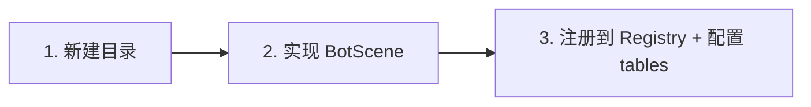

### Bot 实例创建

`@kit/im-bot` 通过工厂函数创建实例，所有外部依赖通过参数注入。支持两种使用方式：
1. **独立部署**（推荐）：通过内置 `server.ts` 作为独立 Node.js 服务运行，使用 Docker 部署
2. **嵌入已有应用**：通过 `integrations/` 适配器嵌入 Next.js / Express / Hono 应用

```typescript
interface BotConfig {
  /** LLM 调用函数 — 用户自行注入实现 */
  llm: (options: { system: string; user: string }) => Promise<string>

  /** 各平台凭证配置 */
  platforms: {
    feishu?: {
      appId: string
      appSecret: string
      /** AES 解密密钥（推荐，用于事件签名验证和消息解密） */
      encryptKey: string
      /** 已废弃，仅旧应用兼容使用。新应用请配置 encryptKey */
      verificationToken?: string
    }
    dingtalk?: {
      appKey: string
      appSecret: string
      /** 机器人唯一标识，用于主动发送消息 */
      robotCode: string
      /** Outgoing 机器人签名密钥（Webhook 模式必填） */
      botSecret: string
    }
    wecom?: {
      corpId: string
      /** 应用 Secret */
      botSecret: string
      /** 回调 Token（URL 验证和签名校验） */
      botToken: string
      /** AES 解密密钥（消息加解密必填） */
      encodingAesKey: string
    }
  }

  /** 各场景的表格配置（按平台按需配置，未配置的平台收到消息时返回错误提示） */
  tables: Record<string, Partial<Record<BotPlatform, SpreadsheetTableConfig>>>

  /** 可选：自定义日志 */
  logger?: Logger

  /** 可选：事件去重 TTL (ms)，默认 5 分钟 */
  dedupTTL?: number
}

/** 创建 Bot 实例 */
function createBot(config: BotConfig): Bot

interface Bot {
  /** 注册业务场景 */
  register(scene: BotScene): void

  /** 处理 Webhook 请求 — 返回 HTTP 响应体 */
  handleWebhook(platform: BotPlatform, request: Request): Promise<Response>

  /** 获取已注册场景列表 */
  getScenes(): BotScene[]
}
```

使用示例：

```typescript
import { createBot, SalesScene, TasksScene } from '@kit/im-bot'

const bot = createBot({
  llm: async ({ system, user }) => {
    // 接入你的 LLM 服务
    const res = await openai.chat.completions.create({
      model: 'deepseek-chat',
      messages: [
        { role: 'system', content: system },
        { role: 'user', content: user },
      ],
    })
    return res.choices[0].message.content ?? ''
  },
  platforms: {
    feishu: {
      appId: process.env.FEISHU_APP_ID!,
      appSecret: process.env.FEISHU_APP_SECRET!,
      encryptKey: process.env.FEISHU_ENCRYPT_KEY!,
    },
  },
  tables: {
    sales: {
      feishu: {
        platform: 'feishu',
        workspaceId: process.env.FEISHU_BITABLE_SALES_APP!,
        tableId: process.env.FEISHU_BITABLE_SALES_TABLE!,
        fieldMapping: { product: '商品名称', cost: '成本', price: '售价' },
      },
    },
  },
})

bot.register(new SalesScene())
bot.register(new TasksScene())
```

### 独立服务入口

`server.ts` 提供开箱即用的独立 HTTP 服务，基于 Hono + `@hono/node-server`，所有配置通过环境变量注入：

```typescript
// src/server.ts — 独立服务入口
import { serve } from '@hono/node-server'
import { Hono } from 'hono'
import { createBot, SalesScene, TasksScene } from './index'
import type { BotPlatform } from './types'

const bot = createBot({
  llm: async ({ system, user }) => {
    const res = await fetch(process.env.LLM_BASE_URL + '/chat/completions', {
      method: 'POST',
      headers: {
        'Content-Type': 'application/json',
        'Authorization': `Bearer ${process.env.LLM_API_KEY}`,
      },
      body: JSON.stringify({
        model: process.env.LLM_MODEL ?? 'deepseek-chat',
        messages: [
          { role: 'system', content: system },
          { role: 'user', content: user },
        ],
      }),
    })
    const data = await res.json()
    return data.choices[0].message.content ?? ''
  },
  platforms: {
    feishu: process.env.FEISHU_APP_ID ? {
      appId: process.env.FEISHU_APP_ID,
      appSecret: process.env.FEISHU_APP_SECRET!,
      encryptKey: process.env.FEISHU_ENCRYPT_KEY!,
    } : undefined,
    // 钉钉、企微同理，按需配置
  },
  tables: {
    sales: {
      feishu: process.env.FEISHU_BITABLE_SALES_APP ? {
        platform: 'feishu',
        workspaceId: process.env.FEISHU_BITABLE_SALES_APP,
        tableId: process.env.FEISHU_BITABLE_SALES_TABLE!,
        fieldMapping: { product: '商品名称', cost: '成本', price: '售价' },
      } : undefined,
    },
  },
})

bot.register(new SalesScene())
bot.register(new TasksScene())

const app = new Hono()

// 健康检查
app.get('/healthz', (c) => c.json({ status: 'ok' }))

// Webhook 路由 — 动态平台
app.post('/api/bot/:platform/webhook', (c) => {
  const platform = c.req.param('platform') as BotPlatform
  return bot.handleWebhook(platform, c.req.raw)
})

const port = Number(process.env.PORT ?? 3000)
console.log(`im-bot listening on :${port}`)
serve({ fetch: app.fetch, port })
```

启动方式：

```bash
# 开发
pnpm dev

# 生产 (Docker)
docker compose up -d
```

### 框架集成（嵌入已有应用）

如需嵌入其他应用而非独立部署，通过 `integrations/` 适配器接入：

#### Next.js App Router

```typescript
// app/api/bot/feishu/webhook/route.ts
import { createNextHandler } from '@kit/im-bot/integrations/next'

const handler = createNextHandler(bot, 'feishu')
export const POST = handler
```

#### Express

```typescript
import { createExpressHandler } from '@kit/im-bot/integrations/express'

app.post('/api/bot/feishu/webhook', createExpressHandler(bot, 'feishu'))
app.post('/api/bot/dingtalk/webhook', createExpressHandler(bot, 'dingtalk'))
app.post('/api/bot/wecom/webhook', createExpressHandler(bot, 'wecom'))
```

#### Hono

```typescript
import { createHonoHandler } from '@kit/im-bot/integrations/hono'

app.post('/api/bot/feishu/webhook', createHonoHandler(bot, 'feishu'))
```

### 消息处理主流程

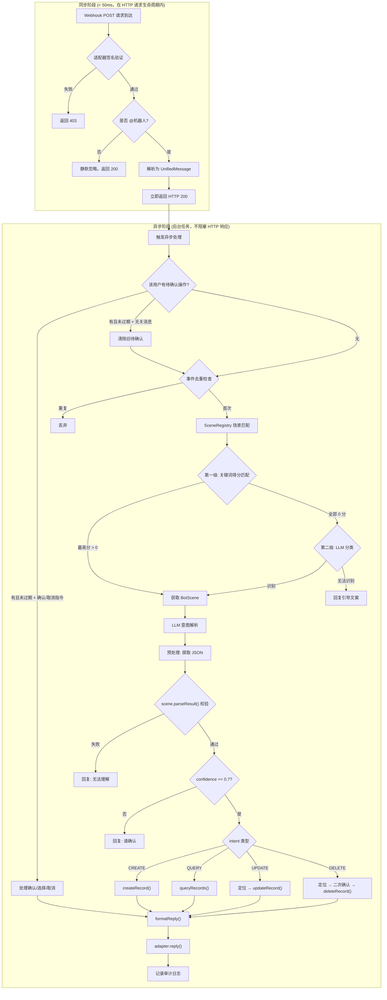

> **LLM 输出预处理**：LLM 返回的字符串不一定是纯 JSON，常见干扰包括 Markdown 代码块包裹（`` ```json...``` ``）、
> 多余解释性文字、截断的不完整 JSON 等。Dispatcher 在调用 `scene.parseResult()` 之前，
> 先执行预处理：用正则提取第一个 `{...}` 块。预处理失败（无法提取有效 JSON）时回复"无法理解"，
> 这与 `parseResult()` 返回 null 的语义相同但属于不同的错误阶段。

### 异步处理时序

所有平台 Webhook 都有超时限制（飞书 3s、钉钉 3s、企微 5s），LLM 调用通常需要 1~5s。必须先返回再异步处理。

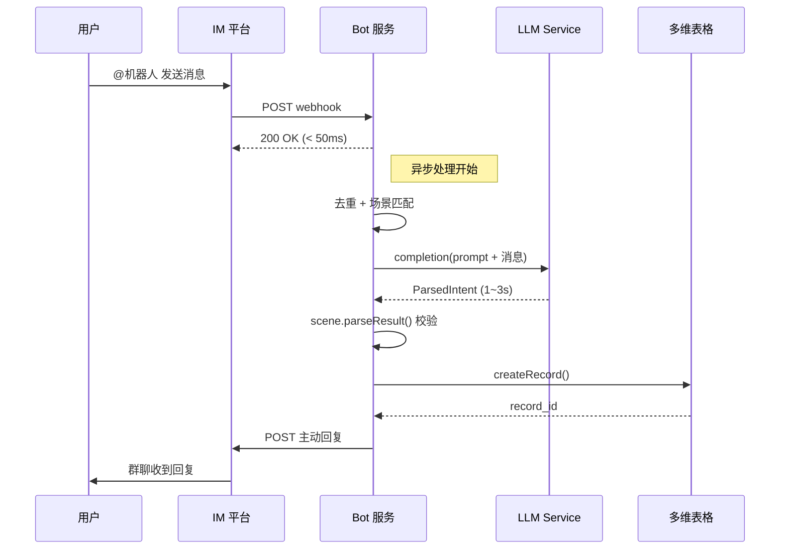

### 场景匹配策略

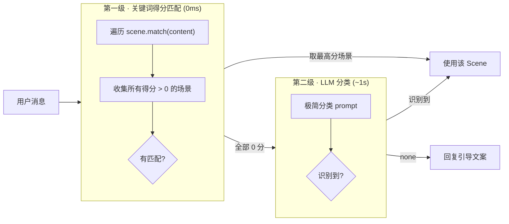

> `match()` 返回数值而非布尔值，解决了多场景关键词重叠时的竞争问题。
> 例如 SalesScene 对"卖了"返回 1.0，TasksScene 对"任务"返回 1.0，
> 如果消息同时包含两者，得分相同时按注册顺序优先。

**第二级 LLM 分类 prompt**：

当所有场景的 `match()` 均返回 0 时，Dispatcher 根据已注册场景的 `id` + `description` 动态构建分类 prompt：

```text
你是一个意图分类器。根据用户消息判断属于哪个业务场景。

## 可用场景
{{#each scenes}}
- {{id}}: {{description}}
{{/each}}

## 规则
- 只返回场景 id，不要解释
- 无法判断时返回 "none"

## 用户消息
{{content}}
```

LLM 返回的 id 与已注册场景匹配后进入该场景流程；返回 `"none"` 则回复引导文案。

### 平台路由

消息来源决定表格目标：

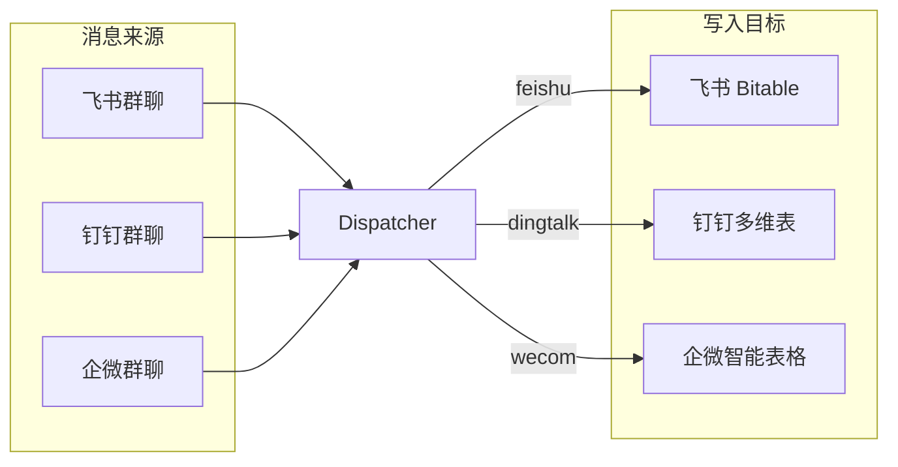

### CRUD 操作流程

#### CREATE — 新增

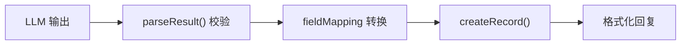

#### QUERY — 查询

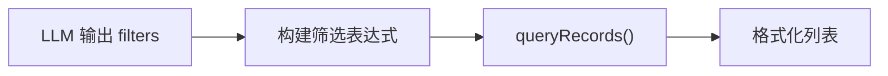

回复示例：

```
📊 查询结果 (共 3 条)
1. 安耐晒防晒霜金瓶60ML | ¥40/¥45 | 申通 SF12345
2. 蜜丝婷防晒霜 | ¥25/¥35 | 圆通 YT98765
3. 曼秀雷敦防晒乳 | ¥30/¥38 | 中通 ZT55555
```

#### UPDATE — 编辑

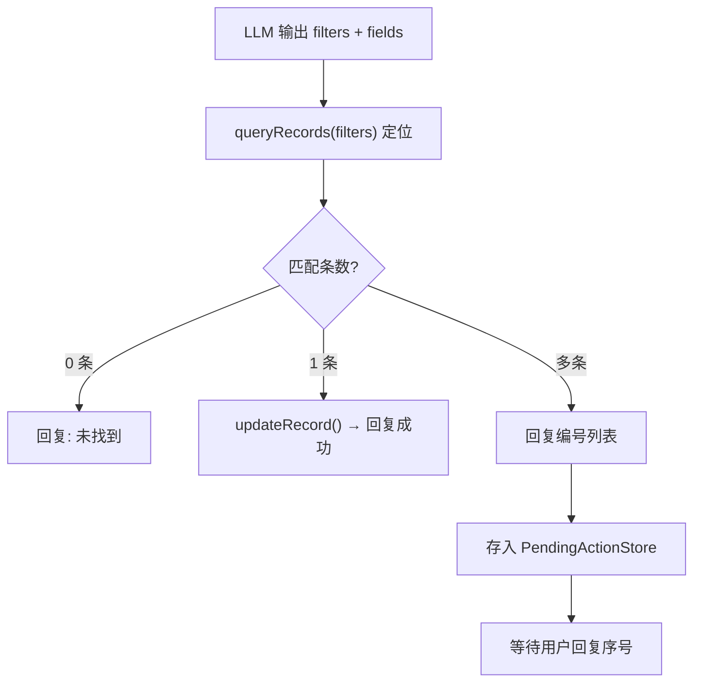

#### DELETE — 删除 (含二次确认)

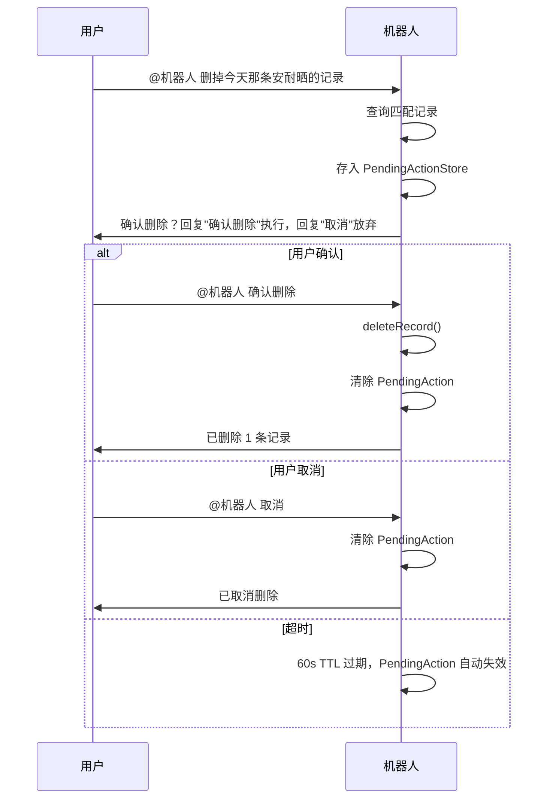

### 内置场景详细设计

#### 销售记录场景 (SalesScene)

**触发关键词**：`卖了`、`成本`、`售价`、`单号`、`快递`、`发货`

**字段定义**：

| 字段 | 类型 | 说明 | 示例 |
|------|------|------|------|
| date | string | 日期，默认今天 | "2026-04-02" |
| product | string | 商品名称 | "安耐晒防晒霜金瓶60ML" |
| tags | string[] | 标签 (【】内提取) | ["临期特价"] |
| cost | number | 成本价 | 40 |
| price | number | 售价 | 45 |
| courier | string | 快递公司 | "申通" |
| customer | string | 客户名称 | "" |
| trackingNo | string | 快递单号 | "SF12345" |
| operator | string | 操作人 (消息发送者) | "李四" |

**LLM Prompt 关键片段**：

```text
你是「销售记录助手」，从群聊消息中提取销售数据，返回严格 JSON。

## 字段
- date: 日期，未提及默认 {today}
- product: 商品名称 (去除【】标签符号)
- tags: 【】内标签提取为数组
- cost/price: 成本价/售价 (数字)
- courier: 快递公司
- customer: 客户名称
- trackingNo: 快递单号

## 意图
- 描述卖了/发了 → CREATE
- "把XX改成YY" → UPDATE (fields=新值, filters=定位条件)
- "查一下/有多少" → QUERY
- "删掉/取消" → DELETE

## 输出 (严格 JSON)
{"intent":"CREATE","fields":{...},"filters":null,"confidence":0.95,"summary":"..."}
```

**回复格式**：

```
✅ 已录入销售记录

商品：安耐晒防晒霜金瓶60ML
标签：临期特价 | 品牌推荐
成本/售价：¥40 / ¥45
快递：申通 | 单号：SF12345
操作人：李四
```

#### 任务跟踪场景 (TasksScene)

**触发关键词**：`任务`、`启动`、`提测`、`上线`、`排期`、`进度`

**字段定义**：

| 字段 | 类型 | 说明 | 示例 |
|------|------|------|------|
| assignee | string | 负责人 | "张三" |
| task | string | 任务名称 | "A任务" |
| status | string | 状态 | "进行中" |
| startDate | string | 启动日期 | "2026-04-02" |
| testDate | string | 提测日期 | "2026-04-03" |
| releaseType | string | 上线方式 | "后台上线" |

**回复格式**：

```
✅ 已录入任务

任务：A任务
负责人：张三
状态：进行中
启动日期：2026-04-02
预计提测：2026-04-03
上线方式：后台上线
```

### Token 认证管理

三个平台的 Token 管理采用相同模式：带 TTL 缓存 + 提前刷新。

```typescript
interface TokenManager {
  /** 获取有效 Token，过期自动刷新 */
  getToken(): Promise<string>
}
```

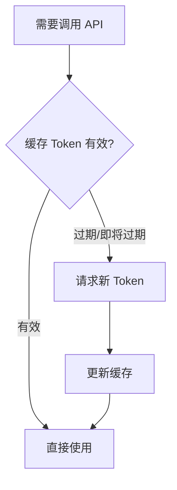

| 平台 | 获取 Token API | 凭证 | 有效期 |
|------|---------------|------|--------|
| 飞书 | `POST /auth/v3/tenant_access_token/internal` | `app_id` + `app_secret` | 2 小时 |
| 钉钉 | `POST /v1.0/oauth2/accessToken` | `appKey` + `appSecret` | 2 小时 |
| 企微 | `GET /cgi-bin/gettoken` | `corpid` + `corpsecret` | 7200 秒 |

### 事件去重

飞书会对超时/失败的回调重试（最多 5 次），钉钉和企微也可能重发。用 `eventId` 做幂等：

```typescript
/**
 * 事件去重存储接口。
 * 接口方法为异步（返回 Promise），以兼容 Redis 等外部存储。
 * TTL 由调用方传入，确保框架级 dedupTTL 配置对所有实现统一生效。
 */
interface DedupStore {
  has(eventId: string): Promise<boolean>
  set(eventId: string, ttlMs: number): Promise<void>
}

// 默认实现：内存 Map + TTL 自动清理
class MemoryDedupStore implements DedupStore {
  private map = new Map<string, number>()

  async has(eventId: string): Promise<boolean> {
    const expiresAt = this.map.get(eventId)
    if (!expiresAt) return false
    if (Date.now() > expiresAt) { this.map.delete(eventId); return false }
    return true
  }

  async set(eventId: string, ttlMs: number): Promise<void> {
    this.map.set(eventId, Date.now() + ttlMs)
  }
}
```

用户可通过 `BotConfig` 注入外部实现：

```typescript
interface BotConfig {
  // ...
  /** 可选：自定义去重存储（默认内存 Map） */
  dedupStore?: DedupStore
}
```

### 有状态交互 (二次确认 / 多条选择)

DELETE 二次确认和 UPDATE 多条匹配选择序号都需要机器人"记住"上下文，等待用户的下一条消息。通过 `PendingActionStore` 统一管理：

```typescript
interface PendingAction {
  /** 触发场景 */
  sceneId: string
  /** 待执行的操作类型 */
  type: 'confirm_delete' | 'select_record'
  /** 候选记录列表 */
  candidates: SpreadsheetRecord[]
  /** 原始消息上下文 (用于 fieldMapping 和回复) */
  message: UnifiedMessage
  /** 待更新字段 (仅 select_record) */
  updateFields?: Record<string, unknown>
  /** 过期时间戳 */
  expiresAt: number
}

/**
 * 有状态交互存储 — 以 chatId:senderId 为复合 key 管理待确认操作。
 * 每个用户在每个群聊中独立维护待确认状态，避免多人并发时互相覆盖。
 */
interface PendingActionStore {
  get(chatId: string, senderId: string): Promise<PendingAction | null>
  set(chatId: string, senderId: string, action: PendingAction): Promise<void>
  delete(chatId: string, senderId: string): Promise<void>
}
```

**交互流程**：

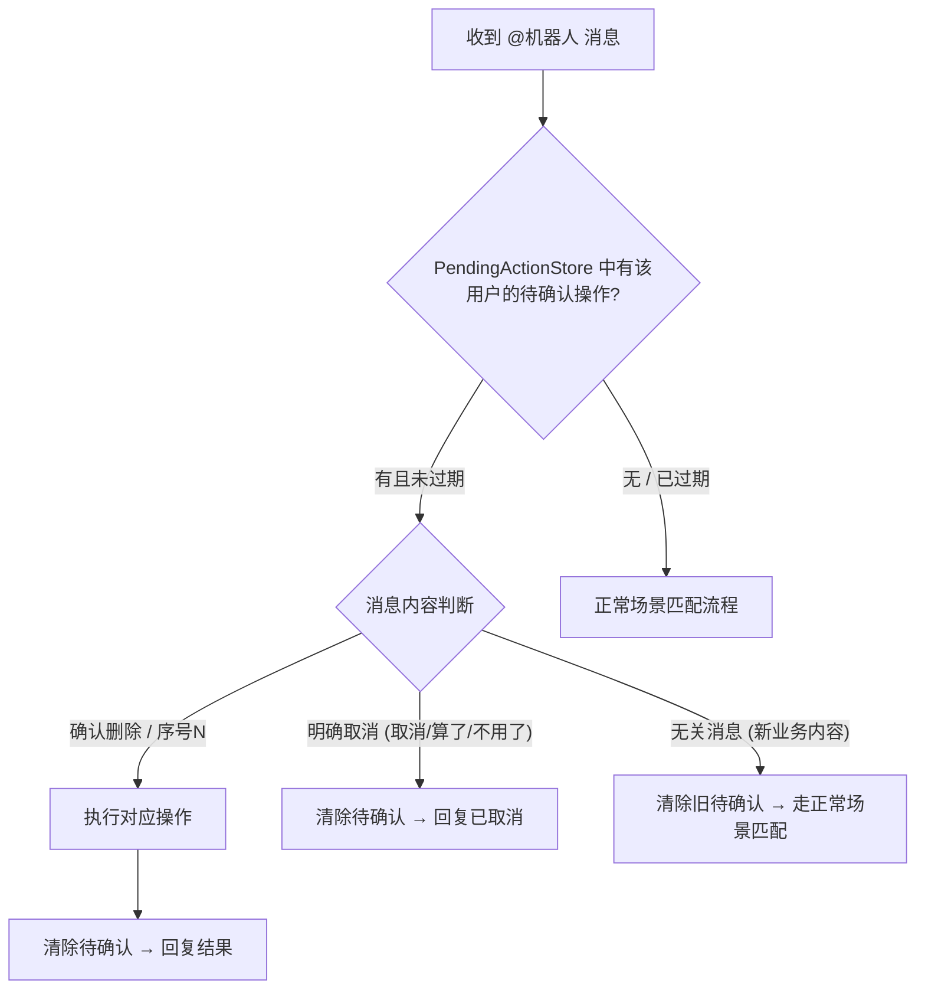

> **PendingAction 消息分类策略**：当用户有待确认操作时，新消息按以下优先级判断：
> 1. **确认指令**：匹配"确认删除"、数字序号等 → 执行待确认操作
> 2. **取消指令**：匹配"取消"、"算了"、"不用了"等 → 清除待确认，回复已取消
> 3. **无关消息**：不匹配以上两类 → 视为用户意图已转移，自动清除旧的待确认操作，按正常流程处理新消息

默认提供 `MemoryPendingActionStore`（内存 Map + TTL 清理），用户可通过 `BotConfig` 注入 Redis 等外部实现：

```typescript
interface BotConfig {
  // ...
  /** 可选：自定义有状态交互存储，默认内存实现 */
  pendingActionStore?: PendingActionStore
  /** 可选：待确认操作超时 (ms)，默认 60 秒 */
  pendingActionTTL?: number
}
```

### 错误处理

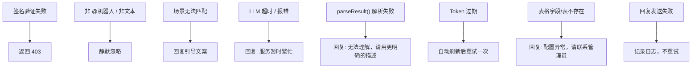

### 审计日志

通过回调函数暴露事件日志，用户自行决定存储方式：

```typescript
interface BotEvent {
  platform: BotPlatform
  eventId: string
  chatId: string
  senderId: string
  senderName: string
  content: string
  sceneId?: string
  intent?: string
  result: 'success' | 'error' | 'ignored'
  resultData?: unknown
  errorMsg?: string
  costMs: number
  createdAt: Date    // 与 Drizzle schema 字段名一致
}

// 在 BotConfig 中注入
interface BotConfig {
  // ...
  /**
   * 审计日志回调。框架以 fire-and-forget 方式调用（不 await），
   * 不影响主流程时序。内部 try-catch 捕获异常并通过 logger.error 输出，
   * 不会产生未处理的 Promise rejection。
   */
  onEvent?: (event: BotEvent) => void | Promise<void>
}
```

如果用户使用 Drizzle ORM，可直接定义对应表：

```typescript
export const botEventLog = createTable(
  'bot_event_log',
  (d) => ({
    id: serial('id').primaryKey(),
    platform: d.varchar({ length: 20 }).notNull(),
    eventId: d.varchar({ length: 128 }).notNull(),
    chatId: d.varchar({ length: 128 }),
    senderId: d.varchar({ length: 128 }),
    senderName: d.varchar({ length: 64 }),
    content: d.text(),
    sceneId: d.varchar({ length: 32 }),
    intent: d.varchar({ length: 16 }),
    result: d.varchar({ length: 16 }).notNull(),
    resultData: jsonb(),
    errorMsg: d.text(),
    costMs: d.integer(),
    createdAt: d.timestamp({ withTimezone: true })
      .$defaultFn(() => new Date())
      .notNull(),
  }),
  (t) => [
    index('bot_event_log_created_at_idx').on(t.createdAt),
    index('bot_event_log_event_id_idx').on(t.eventId),
  ],
)
```

## 部署架构

作为独立 Node.js 服务部署，通过 Docker 容器化，环境变量注入所有配置：

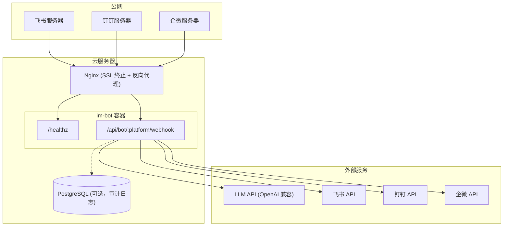

| 项目 | 说明 |
|------|------|
| 独立 Node.js 服务 | 基于 Hono + `@hono/node-server`，单进程运行 |
| Webhook 公网可达 | 三个平台都要求 HTTPS 地址，通过 Nginx SSL 终止 |
| Docker 部署 | Dockerfile 多阶段构建，docker-compose 一键启动 |
| 健康检查 | `GET /healthz` 供 Docker / 负载均衡器探活 |
| 无额外中间件 | 单实例部署无需 Redis，事件去重用内存 Map + TTL |
| PostgreSQL 可选 | 仅在持久化审计日志时需要，非必需依赖 |

### Docker 配置

```dockerfile
# Dockerfile
FROM node:20-alpine AS builder
WORKDIR /app
COPY package.json pnpm-lock.yaml ./
RUN corepack enable && pnpm install --frozen-lockfile
COPY . .
RUN pnpm build

FROM node:20-alpine
WORKDIR /app
COPY --from=builder /app/dist ./dist
COPY --from=builder /app/node_modules ./node_modules
COPY --from=builder /app/package.json ./
EXPOSE 3000
HEALTHCHECK --interval=30s --timeout=3s CMD wget -qO- http://localhost:3000/healthz || exit 1
CMD ["node", "dist/server.js"]
```

```yaml
# docker-compose.yml
services:
  im-bot:
    build: .
    ports:
      - "${PORT:-3000}:3000"
    env_file: .env
    restart: unless-stopped
    healthcheck:
      test: ["CMD", "wget", "-qO-", "http://localhost:3000/healthz"]
      interval: 30s
      timeout: 3s
      retries: 3
```

## 环境变量

```typescript
// 服务配置
PORT                            // 监听端口，默认 3000
NODE_ENV                        // 运行环境 (production / development)

// LLM 服务 (OpenAI 兼容接口)
LLM_BASE_URL                    // API 地址，如 https://api.deepseek.com/v1
LLM_API_KEY                     // API 密钥
LLM_MODEL                       // 模型名称，默认 deepseek-chat

// 飞书
FEISHU_APP_ID
FEISHU_APP_SECRET
FEISHU_ENCRYPT_KEY              // AES 解密密钥（推荐，事件签名验证必填）
FEISHU_VERIFICATION_TOKEN       // 已废弃，仅旧应用兼容
FEISHU_BITABLE_SALES_APP        // app_token
FEISHU_BITABLE_SALES_TABLE      // table_id
FEISHU_BITABLE_TASKS_APP
FEISHU_BITABLE_TASKS_TABLE

// 钉钉
DINGTALK_APP_KEY
DINGTALK_APP_SECRET
DINGTALK_BOT_SECRET             // 机器人签名密钥
DINGTALK_BOT_ROBOT_CODE
DINGTALK_NOTABLE_SALES_BASE     // baseId
DINGTALK_NOTABLE_SALES_SHEET    // sheetId
DINGTALK_NOTABLE_TASKS_BASE
DINGTALK_NOTABLE_TASKS_SHEET

// 企微
WECOM_CORP_ID
WECOM_BOT_SECRET
WECOM_BOT_TOKEN
WECOM_ENCODING_AES_KEY
WECOM_SHEET_SALES_DOC           // docid
WECOM_SHEET_SALES_TABLE         // sheet_id
WECOM_SHEET_TASKS_DOC
WECOM_SHEET_TASKS_TABLE
```

## 缺点与风险

| 风险 | 说明 | 缓解措施 |
|------|------|---------|
| **三平台 API 维护成本** | 飞书/钉钉/企微的开放 API 各自迭代，适配器需要持续跟踪 | Adapter 接口隔离，各适配器独立维护 |
| **LLM 解析准确率** | 自然语言模糊性可能导致字段提取错误 | confidence 阈值 + Schema 校验 + 用户确认机制 |
| **Webhook 超时限制** | 飞书/钉钉 3s 超时，LLM 可能超时 | 先返回 200 再异步处理 |
| **单实例状态局限** | 内存 Map（DedupStore / PendingActionStore）在多实例部署时失效 | 两者均提供接口可注入 Redis 实现 |
| **表格 Schema 变更** | 用户修改表头会导致 fieldMapping 失效 | 运行时校验 + 友好错误提示 |
| **Delete 误操作** | 群聊环境误删风险 | 二次确认机制 + 60s 超时取消 |
| **Edge Runtime 不兼容** | `node:crypto` 在 Edge 环境不可用，无法做签名验证 | MVP 仅支持 Node.js 部署，Phase 4 考虑 Web Crypto API 适配 |

## 备选方案

### 方案 A: 统一存储到单一数据库

所有平台的消息统一写入 PostgreSQL，不使用各平台的多维表格。

**放弃原因**：用户习惯在各自平台的多维表格中查看和管理数据，额外的数据库会增加数据同步负担。

### 方案 B: 基于 Webhook + 云函数

每个平台单独部署云函数处理 Webhook。

**放弃原因**：三套独立函数导致代码重复，场景逻辑和 LLM 调用无法复用，维护成本高。

### 方案 C: 基于消息队列异步处理

Webhook 收到消息后推入 MQ，消费者异步处理。

**放弃原因**：当前消息量不大（日均百级），引入 MQ 增加运维复杂度。单实例 + 异步函数已足够，后续如需扩容可平滑迁移。

### 为什么选择当前方案

**统一引擎 + 双适配器 + 场景插件**：
- Channel Adapter 和 Spreadsheet Adapter 分别抹平消息和存储差异
- BotScene 接口让业务逻辑完全解耦
- 独立部署为 Node.js 服务，Docker 容器化，环境变量注入配置
- 同时提供 integrations 适配器，也可嵌入 Next.js / Express / Hono 等已有应用
- 参考了 tRPC（框架无关 handler 适配）+ Stripe SDK（Webhook 验证模式）的设计

## 实施路线

### Phase 1 — MVP (飞书端到端)

- 核心类型定义 (`types.ts`)
- Dispatcher + SceneRegistry
- 事件去重（MemoryDedupStore 默认实现，飞书重试最多 5 次，不去重会写入重复记录）
- 飞书 Token 管理
- 飞书 Channel Adapter (签名验证 + URL Challenge + 解析 + @过滤 + 回复)
- 飞书 Bitable Adapter (CRUD)
- SalesScene (CREATE)
- 独立服务入口 (`server.ts`) + Dockerfile + docker-compose
- 端到端联调 (Docker 部署 → 飞书 Webhook → LLM → Bitable)

### Phase 2 — 完整 CRUD + 第二场景

- SalesScene UPDATE / QUERY / DELETE 补全
- PendingActionStore 有状态交互（DELETE 二次确认 + UPDATE 多条匹配选择）
- TasksScene 完整实现
- DedupStore 接口 + 外部存储注入支持
- 审计日志回调

### Phase 3 — 多平台接入

- 钉钉 Token + Channel Adapter + 宜搭多维表 Adapter
- 企微 Token + Channel Adapter + 智能表格 Adapter
- 各平台联调

### Phase 4 — 增强体验

- "处理中..." 中间状态消息
- 飞书卡片 / 钉钉 Markdown / 企微 Markdown 富文本回复
- Next.js / Express 集成适配器（嵌入已有应用场景）
- 配置可从外部存储动态读取

## 附录

### 技术依赖

| 依赖 | 版本 | 用途 |
|------|------|------|
| `hono` | ^4.x | HTTP 框架 (路由、请求处理) |
| `@hono/node-server` | ^1.x | Node.js HTTP 服务适配 |
| `zod` | ^3.x | 内置场景的 LLM 输出校验（不暴露在公共接口） |
| `node:crypto` | built-in | 飞书 AES 解密、钉钉 HMAC-SHA256 签名、企微 AES 解密 |
| `node:fetch` | built-in | HTTP 请求 (各平台 API 调用) |

> LLM 服务由用户注入，不绑定 openai / anthropic SDK。
>
> **Edge Runtime 限制**：`node:crypto` 在 Vercel Edge Runtime / Cloudflare Workers 中不可用。
> 如需部署到 Edge 环境，签名验证需改用 Web Crypto API，这在 Phase 4 中作为增强项考虑。
> 当前 MVP 目标为 Node.js 服务器部署，不受此限制影响。

### 相关文档

- [飞书开放平台 - 事件订阅](https://open.feishu.cn/document/server-docs/event-subscription)
- [飞书开放平台 - Bitable API](https://open.feishu.cn/document/server-docs/docs/bitable-v1)
- [钉钉开放平台 - 机器人](https://open.dingtalk.com/document/orgapp/robot-overview)
- [企业微信开放平台 - 消息回调](https://developer.work.weixin.qq.com/document/path/90930)
