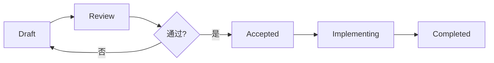

# RFC 设计文档

RFC (Request for Comments) 是本项目的技术设计文档规范。每当设计新的工具库、架构方案或重大功能时，我们会先编写 RFC 文档，确保：

- 设计思路清晰、可追溯
- 团队成员可以提前 Review 和讨论
- 后续开发有明确的实施指南

> 本规范参考了 [React RFC](https://github.com/reactjs/rfcs)、[Rust RFC](https://github.com/rust-lang/rfcs) 和 [MADR](https://adr.github.io/madr/) 的最佳实践。

## 文档列表

### 已完成

| RFC | 描述 |
|-----|------|
| [国际化工具](./i18n-tools.md) | Vue/React 国际化自动化工具集 |
| [MCP Server](./mcp-server.md) | 组件库 MCP 协议服务器 |

### 草稿

| RFC | 描述 |
|-----|------|
| [视觉比对测试](./visual-testing-rfc.md) | 基于 Figma + LLM 的视觉回归测试方案 |
| [AI 自动修复](./sentinel-design-draft.md) | 基于 Sentry + Claude Code 的自动发现问题与修复系统 |

## RFC 编写规范

### 文件命名

```
docs/rfcs/<feature-name>.md
```

- 使用小写字母和连字符
- 简洁明了，避免冗余后缀

### 文档头部

```markdown
# 工具名称 (@scope/package-name)

> **状态**: Draft
> **作者**: AIX Team
> **位置**: `internal/xxx/`
```

**规则**：
- 标题格式：`工具名称 (@scope/package-name)`
- 必填字段：状态、作者、位置
- 不要包含日期（Git 会记录）

### 状态定义

| 状态 | 说明 |
|------|------|
| **Draft** | 初稿，正在编写或等待讨论 |
| **Review** | 已完成初稿，正在进行团队评审 |
| **Accepted** | 已通过评审，待实施 |
| **Implementing** | 正在实施中 |
| **Completed** | 已完成实施 |
| **Rejected** | 已拒绝 |
| **Deprecated** | 已废弃 |

## 章节结构

### 必需章节

| 章节 | 说明 | 参考来源 |
|------|------|----------|
| **概述** | 一段话说明这是什么、解决什么问题 | React/Rust RFC |
| **动机** | 为什么要做这个？用户面临什么问题？ | React/Rust RFC |
| **目标与非目标** | 明确边界，P0/P1/P2 优先级 | 通用实践 |
| **系统架构** | 架构图、目录结构、数据流 | 通用实践 |
| **详细设计** | 核心模块、接口定义、实现细节 | React/Rust RFC |
| **缺点与风险** | 诚实评估方案的不足之处 | React/Rust RFC |
| **备选方案** | 考虑过的其他方案及放弃原因 | React/Rust RFC |

### 可选章节

| 章节 | 说明 | 适用场景 |
|------|------|----------|
| **先例参考** | 其他项目/语言中的类似实现 | 有参考价值时 |
| **待解决问题** | RFC 阶段暂不确定的设计细节 | 初稿阶段 |
| **未来可能性** | 自然的扩展方向（但不在本次范围） | 有远景规划时 |
| **采用策略** | 如何迁移、是否有破坏性变更 | 影响现有代码时 |
| **配置系统** | 配置文件 Schema 和示例 | 有配置需求时 |
| **CLI 设计** | 命令行接口设计 | 有 CLI 时 |
| **编程 API** | 编程接口设计 | 有 API 时 |

### 推荐模板

```markdown
# 工具名称 (@scope/package-name)

> **状态**: Draft
> **作者**: AIX Team
> **位置**: `internal/xxx/`

## 概述

一段话说明这个工具/功能是什么，解决什么核心问题。

## 动机

### 背景

描述当前用户面临的问题，提供具体的使用场景。

### 为什么需要这个方案

说明现有方案的不足，以及新方案如何解决这些问题。

## 目标与非目标

### 目标

| 优先级 | 目标 | 说明 |
|--------|------|------|
| P0 | 核心功能 | 必须实现 |
| P1 | 重要功能 | 应该实现 |
| P2 | 增强功能 | 可以后续迭代 |

### 非目标

- 明确说明不做什么
- 避免范围蔓延

## 系统架构

### 架构图

使用 Mermaid 绘制架构图。

### 目录结构

展示代码组织方式。

### 数据流

说明数据如何在系统中流转。

## 详细设计

### 核心模块

详细说明各模块的职责和接口。

### 接口定义

提供 TypeScript 类型定义。

## 缺点与风险

诚实评估方案的不足：

- 实现复杂度
- 性能影响
- 学习成本
- 维护负担

## 备选方案

### 方案 A

说明考虑过的其他方案。

### 为什么选择当前方案

对比分析，说明决策理由。

## 附录

### 技术依赖

列出主要依赖包。

### 相关文档

链接到相关资源。
```

---

## 格式规范

### 章节标题

```markdown
## 一级章节
### 二级章节
#### 三级章节
```

**规则**：
- 不要带数字编号（右侧目录会自动生成）
- 使用简洁的标题
- 层级不超过 4 级

### 图表

**使用 Mermaid**，不要使用 ASCII 艺术图：

```markdown

```

**规则**：
- 不要添加自定义颜色样式
- 保持图表简洁
- 中文标签使用引号包裹

### 代码示例

```markdown
```typescript
interface Config {
  name: string;
  options?: Options;
}
```
```

**规则**：
- 提供完整、可运行的示例
- 类型定义和使用示例分开
- 添加必要注释

### 表格

```markdown
| 字段 | 类型 | 必填 | 说明 |
|------|------|------|------|
| name | string | 是 | 名称 |
```

---

## 侧边栏配置

在 `.vitepress/config.ts` 中添加：

```typescript
'/rfcs/': [
  {
    text: 'RFC 设计文档',
    items: [{ text: '概述', link: '/rfcs/' }],
  },
  {
    text: '已完成',
    items: [
      { text: '工具简称', link: '/rfcs/tool-name' },
    ],
  },
  {
    text: '草稿',
    items: [
      { text: '新工具简称', link: '/rfcs/new-tool' },
    ],
  },
],
```

**规则**：
- 侧边栏标题简洁（不超过 8 个字）
- 按状态分组
- 不要包含括号内的包名

---

## 评审流程



1. **Draft**: 作者完成初稿，可以是不完整的
2. **Review**: 通过 PR 提交，团队成员 Review
3. **讨论**: 如有争议，组织会议讨论
4. **Accepted**: 通过评审，开始实施
5. **Completed**: 实施完成，更新状态

### 写作建议

来自 Rust RFC 的建议：

> 仓促提交的 RFC 会损害其被接受的机会。低质量的提案、之前被拒绝的功能、或不符合近期路线图的提案可能会被快速拒绝。在 RFC 之前做好准备工作可以使流程更顺畅。

- **先讨论再写**: 在正式写 RFC 之前，先和团队成员讨论可行性
- **关注动机**: 清楚说明"为什么"比"怎么做"更重要
- **诚实评估**: 不要回避方案的缺点和风险
- **考虑替代方案**: 说明为什么当前方案优于其他方案

---

## 参考资料

- [React RFC Process](https://github.com/reactjs/rfcs)
- [Rust RFC Process](https://github.com/rust-lang/rfcs)
- [MADR - Markdown Architectural Decision Records](https://adr.github.io/madr/)
- [ADR GitHub](https://adr.github.io/)
- [Pragmatic Engineer: RFC and Design Doc Examples](https://newsletter.pragmaticengineer.com/p/software-engineering-rfc-and-design)
