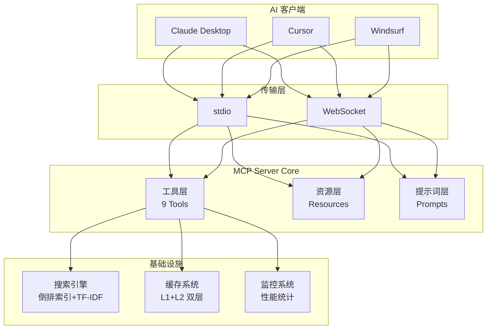
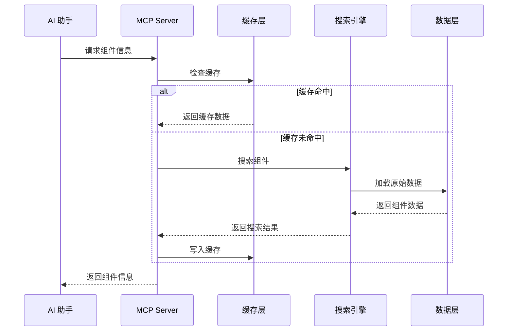
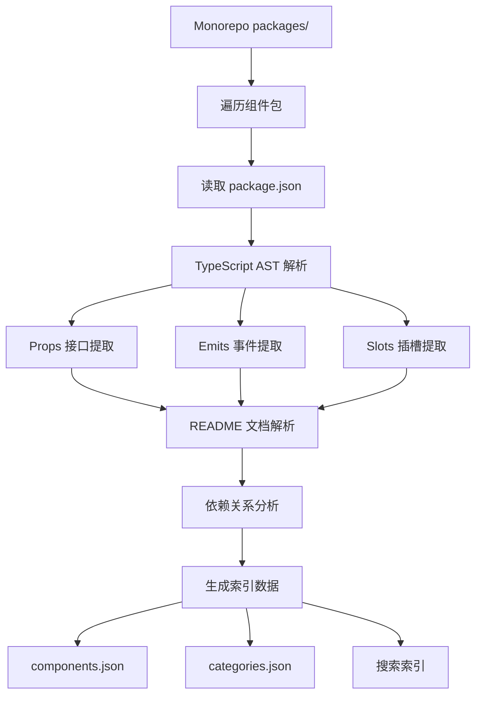

# 组件库 MCP Server (@kit/mcp-server)

> **状态**: Completed
> **作者**: AIX Team
> **位置**: `internal/mcp-server/`

## 概述

基于 [Model Context Protocol (MCP)](https://github.com/modelcontextprotocol) 的高性能组件库服务器，为 AI 助手提供智能组件库上下文支持。

## 动机

### 背景

在使用 AI 助手（Claude、Cursor 等）进行组件库开发时，存在以下问题：

- **上下文缺失**：AI 不了解组件库的 Props、Emits、Slots 定义
- **重复查阅文档**：开发者需要频繁复制粘贴组件 API 给 AI
- **示例代码不准确**：AI 生成的组件使用代码可能与实际 API 不符
- **无法搜索组件**：AI 无法根据需求推荐合适的组件

### 为什么需要这个方案

通过 MCP 协议，AI 助手可以主动查询组件库信息，实现：
- 自动获取组件 Props/Emits/Slots 定义
- 根据需求智能推荐组件
- 生成准确的组件使用代码

## 目标与非目标

### 目标

| 优先级 | 目标 | 说明 |
|--------|------|------|
| P0 | MCP 协议支持 | 实现标准 MCP Server |
| P0 | 组件信息提取 | 基于 TypeScript AST 解析 Props/Emits/Slots |
| P0 | 智能搜索 | 支持中英文混合搜索、模糊匹配 |
| P1 | 多客户端支持 | Claude Desktop、Cursor、Windsurf 等 |
| P1 | 高性能缓存 | 毫秒级响应，支持大型组件库 |
| P2 | 图标搜索 | 支持按名称、分类搜索图标 |

### 非目标

- 不提供组件运行时功能
- 不替代 Storybook 文档
- 不支持非 TypeScript 组件库

## 核心能力

| 能力 | 说明 |
|------|------|
| **智能组件提取** | 基于 TypeScript AST 精确解析 Props/Emits/Slots |
| **高性能搜索** | 内置倒排索引 + TF-IDF 算法，支持中英文混合搜索 |
| **多层缓存** | 内存 + 文件双层缓存，命中率 85%+ |
| **9个专业工具** | 组件查询、智能搜索、依赖分析、图标搜索 |
| **高度可配置** | 仅需修改一个配置文件即可适配任何组件库 |

## 系统架构

### 核心架构图



### 数据流转



### 组件提取流程



## 目录结构

```
internal/mcp-server/
├── src/
│   ├── cli.ts                    # 命令行入口
│   ├── index.ts                  # 主入口
│   │
│   ├── config/                   # 配置管理
│   ├── constants/                # 常量定义 (适配其他组件库主要修改这里)
│   │   ├── library.ts            # 组件库配置
│   │   └── project.ts            # 项目常量
│   │
│   ├── extractors/               # 组件提取器
│   │   ├── component-extractor.ts
│   │   ├── readme-extractor.ts
│   │   └── typescript-extractor.ts
│   │
│   ├── mcp-tools/                # MCP 工具 (9个)
│   │   ├── component-tools.ts    # 8个组件查询工具
│   │   └── icon-tools.ts         # 图标搜索工具
│   │
│   ├── server/                   # 服务器核心
│   ├── transports/               # 传输层 (stdio/WebSocket)
│   │
│   └── utils/
│       ├── cache-manager.ts      # 双层缓存
│       ├── search-index.ts       # 搜索引擎
│       ├── monitoring.ts         # 监控统计
│       └── performance.ts        # 性能优化
│
├── data/                         # 数据存储
│   ├── components.json           # 组件索引
│   └── categories.json           # 分类标签
│
└── __test__/                     # 测试套件
```

## MCP 工具集

### 组件查询工具 (8个)

| 工具名称 | 功能说明 |
|---------|---------|
| `list-components` | 列出所有组件，支持分类筛选 |
| `get-component-info` | 获取组件详细信息 (Props/Emits/Slots) |
| `get-component-props` | 获取组件属性定义 |
| `get-component-examples` | 获取使用示例代码 |
| `get-component-dependencies` | 获取依赖关系 |
| `get-component-changelog` | 获取变更日志 |
| `get-categories-and-tags` | 获取分类和标签 |
| `search-components` | 智能搜索组件 |

### 图标工具 (1个)

| 工具名称 | 功能说明 |
|---------|---------|
| `search-icons` | 搜索图标组件 |

## 搜索引擎

自研高性能搜索引擎，无需 Elasticsearch/Fuse.js：

| 特性 | 说明 |
|------|------|
| **倒排索引** | O(1) 词项到文档映射 |
| **TF-IDF** | 词频-逆文档频率，精准相关性排序 |
| **模糊匹配** | 基于编辑距离的相似度计算 |
| **中文分词** | 支持中英文混合、驼峰命名解析 |
| **字段加权** | 名称/描述/标签 权重可配置 |

### 性能指标

| 组件数量 | 冷启动 | 缓存命中 | 索引大小 |
|---------|--------|---------|---------|
| 10 | 2-5ms | <1ms | 50KB |
| 50 | 3-8ms | <1ms | 200KB |
| 100 | 5-12ms | <1ms | 500KB |
| 500 | 8-25ms | 1-2ms | 2MB |

## 缓存系统

双层缓存架构：

| 层级 | 存储 | 命中率 | 响应时间 |
|------|------|--------|---------|
| L1 内存 | LRU (100条) | 75-80% | <1ms |
| L2 文件 | JSON | 15-20% | 2-5ms |

## CLI 命令

```bash
# 提取组件数据
node dist/cli.js extract --packages=../../packages

# 启动服务器 (stdio 模式)
node dist/cli.js serve

# 启动服务器 (WebSocket 模式)
node dist/cli.js serve-ws --port 8080

# 验证数据完整性
node dist/cli.js validate

# 查看统计信息
node dist/cli.js stats

# 健康检查
node dist/cli.js health

# 清理缓存
node dist/cli.js clean
```

## AI 工具集成

### Claude Desktop

```json
{
  "mcpServers": {
    "aix-components": {
      "command": "npx",
      "args": ["@aix/mcp-server", "serve"]
    }
  }
}
```

### Cursor

```json
{
  "mcpServers": {
    "aix-components": {
      "command": "npx",
      "args": ["@aix/mcp-server", "serve"]
    }
  }
}
```

## 适配其他组件库

只需修改 `src/constants/library.ts`：

```typescript
export const COMPONENT_LIBRARY_CONFIG = {
  name: 'Your Components',
  packageScope: '@your-org',

  componentPatterns: {
    propsInterfacePattern: /^(\w+)Props$/,
    componentFilePattern: /^[A-Z][a-zA-Z0-9]*\.(ts|tsx|vue)$/,
  },

  packageStructure: {
    srcDir: 'src',
    storiesDir: 'stories',
  },
};
```

**支持的组件库类型**:
- Vue 3 (Composition API / Options API)
- React (Function / Class Components)
- TypeScript 严格类型
- Monorepo (pnpm workspace / Lerna / Nx)

## 缺点与风险

| 风险 | 说明 | 缓解措施 |
|------|------|----------|
| **MCP 协议演进** | MCP 仍在快速迭代，API 可能变化 | 抽象协议层，便于升级 |
| **AST 解析复杂度** | 复杂类型定义可能解析不完整 | 支持 README 文档补充信息 |
| **客户端兼容性** | 不同 AI 客户端实现可能有差异 | 优先支持主流客户端，提供测试套件 |
| **数据同步** | 组件更新后需要重新提取 | 提供 watch 模式和 CI 集成 |

## 备选方案

### 方案 A：直接读取 README

让 AI 直接读取组件的 README.md 文件。

**放弃原因**：
- README 格式不统一，解析困难
- 无法提供结构化的 Props/Emits 信息
- 搜索能力弱

### 方案 B：使用 Storybook API

基于 Storybook 的组件元数据 API。

**放弃原因**：
- 依赖 Storybook 运行时
- 无法在 CLI 环境使用
- 元数据不够完整

### 方案 C：使用现有 MCP 服务

使用社区的通用文档 MCP 服务。

**放弃原因**：
- 无法提供组件库特定的查询能力
- 缺乏 Props/Emits/Slots 结构化信息
- 搜索精度不足

### 为什么选择当前方案

- **TypeScript AST**：精确提取类型信息
- **专用工具集**：针对组件库场景优化
- **高性能搜索**：自研搜索引擎，毫秒级响应
- **易于适配**：修改配置即可适配其他组件库

## 技术依赖

| 依赖 | 用途 |
|------|------|
| `@modelcontextprotocol/sdk` | MCP 协议实现 |
| `typescript` | TypeScript AST 解析 |
| `commander` | CLI 框架 |
| `ws` | WebSocket 支持 |
| `chalk` | 终端彩色输出 |

## 相关文档

- 详细使用指南: `internal/mcp-server/README.md`
- MCP 协议: https://github.com/modelcontextprotocol
