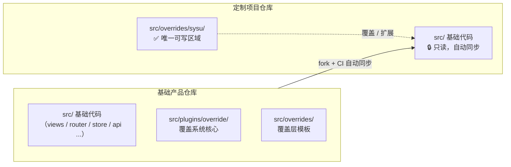
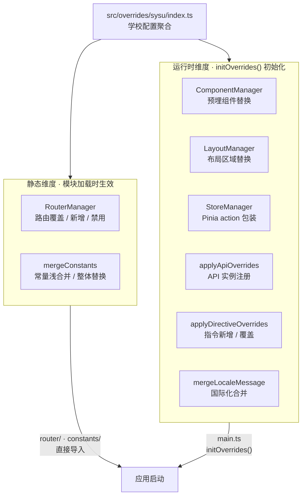

# 定制化项目代码合并方案 (@kit/override-cli)

> **状态**: 已完成
> **作者**: AIX Team
> **适用场景**: 基础产品 + 多个定制项目（独立仓库模式）

## 概述

基于覆盖层（Override Layer）的定制化项目代码隔离与自动合并方案，通过物理隔离定制代码与基础代码，实现基础产品更新时 95% 以上的自动化合并成功率。

## 动机

### 背景

团队维护一个基础产品和多个定制项目：

**架构模式**：
- **基础产品**: 独立仓库，提供核心功能和扩展点
- **定制项目**: 每个客户独立仓库，fork 基础产品后在 `src/overrides/` 目录实现定制

**当前痛点**：
```
基础产品更新 → 定制代码冲突 → 手动解决 → 耗时且易出错
```

**冲突根因**: 定制代码与基础代码混在一起修改

### 为什么需要这个方案

现有方案不足：
- **Git 分支策略**: 长期分支维护成本高，合并冲突无法避免
- **代码注释标记**: 难以自动化处理，容易遗漏
- **手动 Cherry-pick**: 效率低，无法规模化

新方案优势：
- 物理隔离定制代码（`src/overrides/` 目录），从根源避免冲突
- CLI 工具一键初始化定制项目结构
- 定制逻辑清晰可维护
- 支持多项目定制（通过注册表 + Cookie 动态加载）
- 可配合 CI/CD 自动合并流程（GitLab CI）

## 目标与非目标

### 目标

| 优先级 | 目标 | 说明 |
|--------|------|------|
| P0 | CLI 初始化工具 | 一键生成定制化目录结构和模板文件 |
| P0 | 代码物理隔离 | 定制代码与基础代码分离存储（`src/overrides/`） |
| P0 | 覆盖系统实现 | 组件/路由/布局/状态/API/常量/指令 等覆盖机制 |
| P1 | 冲突率 < 5% | 合并冲突率降至 5% 以下 |
| P2 | CI/CD 自动合并 | GitLab CI 自动同步基础产品更新 |
| P2 | 迁移工具 | 现有定制项目迁移脚本 |

### 非目标

- 不解决基础产品 Breaking Change 问题（需语义化版本管理）
- 不支持深度定制（需修改基础代码的场景）
- 不提供运行时切换定制层（定制层选择在编译时确定，轻量级运行时配置见"前端配置管理"章节）

## 系统架构

### 架构概览

**仓库关系与代码隔离**：



**覆盖系统三层架构**：



### 目录结构

**基础产品仓库**：
```
base-product/
├── src/
│   ├── api/                # API 请求层
│   ├── assets/             # 静态资源
│   ├── components/         # 基础公共组件
│   ├── composables/        # 公共 Composables
│   ├── constants/          # 常量定义
│   ├── directives/         # 内置全局指令
│   ├── interface/          # 全局类型定义
│   ├── layout/             # 布局组件
│   ├── locale/             # 国际化语言包
│   ├── plugins/            # 插件（含 SiteConfig Schema）
│   ├── router/             # 路由配置
│   ├── store/              # 状态管理（Pinia）
│   ├── styles/             # 全局样式 + 主题变量
│   ├── utils/              # 工具函数
│   ├── plugins/
│   │   └── override/       # 覆盖系统核心实现
│   │       ├── index.ts             # 统一导出 + initOverrides()
│   │       ├── override-api.ts      # applyApiOverrides()
│   │       ├── override-component.ts# ComponentManager
│   │       ├── override-constants.ts# mergeConstants()
│   │       ├── override-directives.ts# applyDirectiveOverrides()
│   │       ├── override-layout.ts   # LayoutManager
│   │       ├── override-router.ts   # RouterManager
│   │       └── override-store.ts    # StoreManager
│   ├── views/              # 页面组件
│   ├── main.ts             # 应用入口
│   └── overrides/          # 覆盖层（学校配置目录）
│       ├── types.ts        # OverrideConfig 类型
│       ├── deployment.ts   # 部署级常量覆盖（对所有学校生效）
│       ├── index.ts        # 统一导出入口（三层聚合）
│       └── registry.ts     # 学校注册表 + 动态加载
└── .gitlab-ci.yml
```

**定制项目仓库**（fork 基础产品）：
```
custom-project-a/
├── src/
│   ├── api/                # 自动同步，禁止修改
│   ├── assets/             # 自动同步，禁止修改
│   ├── components/         # 自动同步，禁止修改
│   ├── composables/        # 自动同步，禁止修改
│   ├── constants/          # 自动同步（合法引用 overrides）
│   ├── directives/         # 自动同步，禁止修改
│   ├── interface/          # 自动同步，禁止修改
│   ├── layout/             # 自动同步，禁止修改
│   ├── locale/             # 自动同步，禁止修改
│   ├── plugins/            # 自动同步，禁止修改
│   ├── router/             # 自动同步（合法引用 overrides）
│   ├── store/              # 自动同步，禁止修改
│   ├── styles/             # 自动同步，禁止修改
│   ├── utils/              # 自动同步，禁止修改
│   ├── plugins/            # 自动同步，禁止修改
│   ├── views/              # 自动同步，禁止修改
│   ├── main.ts             # 自动同步（合法引用 overrides）
│   └── overrides/          # ✅ 唯一可修改区域
│       ├── types.ts        # 类型定义（同步）
│       ├── deployment.ts   # 部署级常量覆盖（可按需修改）
│       ├── index.ts        # 统一导出入口（同步）
│       ├── registry.ts     # 学校注册表（需修改映射）
│       └── sysu/           # 学校定制配置目录
│           ├── index.ts        # 配置聚合入口
│           ├── api/            # API 配置覆盖
│           │   └── index.ts
│           ├── components/     # 组件覆盖
│           │   └── index.ts
│           ├── constants/      # 常量覆盖
│           │   └── index.ts
│           ├── directives/     # 指令覆盖
│           │   └── index.ts
│           ├── layout/         # 布局覆盖
│           │   └── index.ts
│           ├── locale/         # 国际化覆盖
│           │   └── index.ts
│           ├── router/         # 路由覆盖
│           │   └── index.ts
│           ├── store/          # 状态覆盖
│           │   └── index.ts
│           └── views/          # 自定义页面
│               └── CustomHome.vue
└── .gitlab-ci.yml
```

**统一导出入口**：
```typescript
// src/overrides/index.ts
import type { RuntimeOverrideConfig, CustomRouteConfig, ConstantsOverride } from '@/plugins/override';
import { loadSchoolConfig } from './registry';

const school = loadSchoolConfig();

// 运行时维度 → main.ts → initOverrides()
const overrideConfig: RuntimeOverrideConfig = {
  components: school?.components,
  store: school?.store,
  locale: school?.locale,
  api: school?.api,
  layout: school?.layout,
  directives: school?.directives,
};

export default overrideConfig;

// 静态维度 → 各消费方直接导入
export const customRoutes: CustomRouteConfig = school?.router ?? {};
// 三层架构：标准产品 + 部署级覆盖(deployment.ts) + 学校定制(overrides/{schoolCode}/)
import deploymentConstants from './deployment';
export const customConstants: ConstantsOverride = {
  ...deploymentConstants,
  ...(school?.constants ?? {}),
};
```

**学校配置聚合入口**：
```typescript
// src/overrides/sysu/index.ts
import type { OverrideConfig } from '../types';
import { getCustomComponents } from './components';
import { getCustomRoutes } from './router';
import { getCustomConstants } from './constants';
import { getCustomLocales } from './locale';
import { getCustomStoreModules } from './store';
import { getCustomApiConfig } from './api';
import { getCustomLayout } from './layout';
import { getCustomDirectives } from './directives';

const config: OverrideConfig = {
  components: getCustomComponents(),
  router: getCustomRoutes(),
  constants: getCustomConstants(),
  locale: getCustomLocales(),
  store: getCustomStoreModules(),
  api: getCustomApiConfig(),
  layout: getCustomLayout(),
  directives: getCustomDirectives(),
};

export default config;
```

## 详细设计

### 三层架构

覆盖系统分为**静态维度**和**运行时维度**，常量维度采用三层覆盖：

| 维度 | 模块 | 生效时机 | 集成方式 |
|------|------|---------|---------|
| 静态 | `router`、`constants` | 模块加载时 | 消费方直接导入 |
| 运行时 | `components`、`store`、`locale`、`api`、`layout`、`directives` | 应用启动时 | `initOverrides()` 统一注册 |

### 类型定义

```typescript
// src/plugins/override/index.ts

/** 常量覆盖（静态维度） */
export interface ConstantsOverride {
  roles?: Record<string, string>;
  roleDescriptions?: Record<string, string>;
  menuList?: MenuItem[];
  apiCode?: Record<string, number>;
  proxyUri?: Record<string, string>;
  uri?: Record<string, string>;
  defaultLocale?: string;
  defaultThemeStyle?: string;
}

/** 路由覆盖配置（静态维度） */
export interface CustomRouteConfig {
  /** 替换已有路由（key 为全路径，值为组件或路由配置对象） */
  overrideRoutes?: Record<string, RouteComponent | Partial<RouteRecordRaw>>;
  /** 新增独立路由 */
  customRoutes?: RouteRecordRaw[];
  /** 按路径禁用路由（禁用父路由会同时移除其所有子路由） */
  disabledRoutes?: string[];
  /** 追加免登录白名单路径 */
  whiteList?: string[];
}

/** Store 覆盖函数（通过 Pinia 插件机制包装 action） */
export type StoreOverrideFn<T = any> = (store: T) => Record<string, unknown>;

export interface StoreModuleConfig {
  overrides?: Record<string, StoreOverrideFn>;
}

/** 国际化覆盖 */
export type LocaleMessages = Record<string, Record<string, unknown>>;

/** API 覆盖配置 */
export interface CustomApiConfig {
  /** 替换/新增 API 实例 */
  instances?: Record<string, any>;
  /** 为指定实例注册插件模块 */
  modules?: Record<string, Array<(this: any, options?: any) => any>>;
}

/** Layout 覆盖配置 */
export interface CustomLayoutConfig {
  /** 替换整个 Layout 组件（与 components 二选一） */
  layout?: Component;
  /** 替换 Layout 内部区域 */
  components?: Partial<Record<'header' | 'menu' | 'main', Component>>;
  /** 覆盖默认配置值 */
  defaultConfig?: {
    layoutVisible?: Partial<LayoutVisible>;
    headerVisible?: Partial<HeaderVisible>;
    logoConfig?: Partial<LogoConfig>;
  };
}

/** 运行时覆盖配置（initOverrides 使用） */
export interface RuntimeOverrideConfig {
  components?: Record<string, Component>;
  store?: StoreModuleConfig;
  locale?: LocaleMessages;
  api?: CustomApiConfig;
  layout?: CustomLayoutConfig;
  directives?: Record<string, Directive>;
}

/** initOverrides 参数 */
export interface InitOverridesOptions {
  pinia: Pinia;
  i18n: I18nLike;
  config: RuntimeOverrideConfig;
  app: App;
}
```

```typescript
// src/overrides/types.ts（学校配置完整类型）

/** 学校覆盖配置 = 运行时维度 + 静态维度 */
export interface OverrideConfig extends RuntimeOverrideConfig {
  router?: CustomRouteConfig;
  constants?: ConstantsOverride;
}
```

### 初始化流程

```typescript
// src/main.ts
import { setupDirectives } from '@/directives';
import { initOverrides } from '@/plugins/override';
import overrideConfig from '@/overrides';

const app = createApp(App);

// 1. 注册内置全局指令（在 Override 之前，确保定制指令可覆盖内置指令）
setupDirectives(app);

// 2. 初始化 Override 系统（运行时维度）
//    路由覆盖已在 router/index.ts 中同步注册
//    常量覆盖已在 constants/index.ts 中同步合并
initOverrides({
  pinia: store,
  i18n,
  config: overrideConfig,
  app,
});

// 3. 使用插件
app.use(i18n);
app.use(store);
app.use(router);
app.mount('#app');
```

### initOverrides 实现

```typescript
// src/plugins/override/index.ts
export function initOverrides({ pinia, i18n, config, app }: InitOverridesOptions): void {
  // 1. 注册组件覆盖
  if (config.components) {
    componentManager.register(config.components);
  }

  // 2. 注册 Layout 覆盖
  if (config.layout) {
    layoutManager.register(config.layout);
  }

  // 3. 注册 Store 覆盖（Pinia 插件）
  if (config.store?.overrides) {
    storeManager.register(config.store);
    pinia.use(storeManager.createPlugin());
  }

  // 4. 合并语言包
  if (config.locale) {
    for (const [locale, messages] of Object.entries(config.locale)) {
      i18n.global.mergeLocaleMessage(locale, messages);
    }
  }

  // 5. 应用 API 覆盖
  if (config.api) {
    applyApiOverrides(config.api, apiInstances);
  }

  // 6. 注册定制指令（可覆盖内置指令）
  if (config.directives) {
    applyDirectiveOverrides(app, config.directives);
  }
}
```

### 路由覆盖（RouterManager）

**定制项目配置**：
```typescript
// src/overrides/sysu/router/index.ts
import type { CustomRouteConfig } from '@/plugins/override';

export function getCustomRoutes(): CustomRouteConfig {
  return {
    overrideRoutes: {
      '/home': () => import('../views/CustomHome.vue'),
    },
    customRoutes: [{
      path: '/sysu-lab',
      component: () => import('@/layout/index.vue'),
      children: [{
        path: '',
        component: () => import('../views/LabManagement.vue'),
      }],
    }],
    disabledRoutes: ['/setting/theme'],
    whiteList: ['/sysu-lab'],
  };
}
```

**基础产品集成**：
```typescript
// src/router/index.ts
import { routerManager } from '@/plugins/override';
import { customRoutes } from '@/overrides';

// 同步注册路由覆盖配置
routerManager.register(customRoutes);

const router = createRouter({
  history: createWebHistory(),
  routes: routerManager.applyOverrides(staticRoutes),
});

// 添加自定义路由
routerManager.addCustomRoutes(router);

// DEV 环境警告未匹配的覆盖路由
routerManager.warnUnmatched();
```

**RouterManager 关键特性**：
- 使用**全路径**匹配（如 `/home`、`/setting/account`），支持嵌套路由
- `overrideRoutes` 的值可以是 `RouteComponent`（仅替换组件）或 `Partial<RouteRecordRaw>`（浅合并配置，children 追加）
- 始终**浅拷贝**路由对象，避免修改原始路由（HMR 安全）
- 禁用父路由会同时移除其所有子路由
- DEV 环境自动检测未匹配的覆盖路由

### 常量覆盖（mergeConstants）

**定制项目配置**：
```typescript
// src/overrides/sysu/constants/index.ts
import type { ConstantsOverride } from '@/plugins/override';

export function getCustomConstants(): ConstantsOverride {
  return {
    menuList: [/* 定制菜单 */],
    roles: { ASSISTANT: '5' },
    defaultLocale: 'en-US',
  };
}
```

**基础产品集成**：
```typescript
// src/constants/index.ts
import { mergeConstants } from '@/plugins/override';
import { customConstants } from '@/overrides';

const DEFAULTS = {
  roles: DEFAULT_ROLES,
  roleDescriptions: DEFAULT_ROLE_DESCRIPTIONS,
  menuList: DEFAULT_MENU_LIST,
  apiCode: DEFAULT_API_CODE,
  proxyUri: DEFAULT_PROXY_URI,
  uri: {} as Record<string, string>,
  defaultLocale: DEFAULT_LOCALE_VALUE,
  defaultThemeStyle: DEFAULT_THEME_STYLE_VALUE,
} satisfies Required<ConstantsOverride>;

const merged = mergeConstants(DEFAULTS, customConstants);

export const ROLES = merged.roles;
export const ROLE_DESCRIPTIONS = merged.roleDescriptions;
export const menuList = merged.menuList;
// ...
```

**合并策略**：
- **纯对象**（如 `roles`）→ 浅合并（`{ ...defaults, ...overrides }`）
- **原始值 / 数组**（如 `menuList`、`defaultLocale`）→ 整体替换

### 组件覆盖（ComponentManager）

**定制项目配置**：
```typescript
// src/overrides/sysu/components/index.ts
import type { Component } from 'vue';

export function getCustomComponents(): Record<string, Component> {
  return {
    WelcomeCard: () => import('../views/CustomWelcomeCard.vue'),
  };
}
```

**基础产品使用方式**（通过预埋替换点）：
```vue
<script setup lang="ts">
import { componentManager } from '@/plugins/override';
import DefaultWelcomeCard from './DefaultWelcomeCard.vue';

// 优先使用定制组件，否则使用默认组件
const WelcomeCard = componentManager.getComponent('WelcomeCard', DefaultWelcomeCard);
</script>

<template>
  <component :is="WelcomeCard" />
</template>
```

**ComponentManager API**：
- `register(components)` — 批量注册定制组件
- `getComponent(name, fallback)` — 获取组件，未注册则返回 fallback

### 布局覆盖（LayoutManager）

**定制项目配置**：
```typescript
// src/overrides/sysu/layout/index.ts
import type { CustomLayoutConfig } from '@/plugins/override';

export function getCustomLayout(): CustomLayoutConfig {
  return {
    // 方式一：替换 Layout 内部区域（推荐）
    components: {
      header: () => import('../views/CustomHeader.vue'),
    },
    // 覆盖默认配置
    defaultConfig: {
      headerVisible: { themeSwitch: false },
    },

    // 方式二：替换整个 Layout（与 components 二选一）
    // layout: () => import('../views/CustomLayout.vue'),
  };
}
```

**LayoutManager API**：
- `register(config)` — 注册 Layout 覆盖配置
- `getLayoutComponent(fallback)` — 获取整个 Layout 组件
- `getSlotComponent(slot, fallback)` — 获取 header/menu/main 区域组件
- `getDefaultConfig()` — 获取覆盖的默认配置值

> 注意：`layout` 与 `components` 二选一，设置 `layout` 后 `components` 无效。

### 状态覆盖（StoreManager）

通过 **Pinia 插件机制**包装已有 Store 的 action，而非替换整个 Store 模块。

**定制项目配置**：
```typescript
// src/overrides/sysu/store/index.ts
import type { StoreModuleConfig } from '@/plugins/override';

export function getCustomStoreModules(): StoreModuleConfig {
  return {
    overrides: {
      // key 为 store.$id
      global: (store) => ({
        toggleTheme() {
          console.log('[SYSU] before toggle');
          const original = store.toggleTheme;
          original.call(store);
        },
      }),
    },
  };
}
```

**StoreManager 关键特性**：
- `register(config)` — 注册 Store 覆盖配置
- `createPlugin()` — 创建 Pinia 插件，自动过滤 ref/computed 防止响应式脱钩
- **限制**：只推荐覆盖 action，不建议覆盖 ref/computed（会创建新的响应式引用，与 store 内部脱钩）

### API 覆盖（applyApiOverrides）

**定制项目配置**：
```typescript
// src/overrides/sysu/api/index.ts
import type { CustomApiConfig } from '@/plugins/override';

export function getCustomApiConfig(): CustomApiConfig {
  return {
    // 注册新 API 实例或替换已有实例
    instances: {
      external: PolymasApi.create({ baseURL: 'https://sysu-api.example.com' }),
    },
    // 为指定实例注册插件模块
    modules: {
      external: [pluginA, pluginB],
    },
  };
}
```

### 国际化覆盖

**定制项目配置**：
```typescript
// src/overrides/sysu/locale/index.ts
import type { LocaleMessages } from '@/plugins/override';

export function getCustomLocales(): LocaleMessages {
  return {
    // 按需添加覆盖内容，key 与基础产品保持一致可覆盖，新增 key 为定制专有
    // 'zh-CN': { layout: { systemTitle: '中山大学化学实验教学平台' } },
  };
}
```

**合并方式**：在 `initOverrides` 中通过 `i18n.global.mergeLocaleMessage()` 合并，支持：
- **覆盖** — 使用与基础产品相同的 key（如 `layout.systemTitle`）
- **新增** — 添加定制专有的 key（如 `sysu.labName`）

### 指令覆盖（applyDirectiveOverrides）

**定制项目配置**：
```typescript
// src/overrides/sysu/directives/index.ts
import type { Directive } from 'vue';

export function getCustomDirectives(): Record<string, Directive> {
  return {
    // key 为指令名（不含 v- 前缀），同名可覆盖内置指令
    'lab-access': {
      mounted(el, binding) {
        // 实验室权限控制逻辑
      },
    },
  };
}
```

**集成顺序**：`setupDirectives(app)` 先注册内置指令 → `initOverrides()` 中注册定制指令，同名覆盖。

### 导入方向约束（ESLint）

覆盖系统的核心原则是**依赖方向单向**：标准产品代码不应反向依赖 `overrides/` 目录，否则定制代码与基础代码耦合，合并时冲突率上升。通过 ESLint `no-restricted-imports` 规则在编译时强制执行。

#### 限制规则定义

```typescript
// eslint.config.mjs
const SCRIPT_EXTS = '*.{ts,tsx,js,jsx,vue,mts,cts}';

const restrictedPatterns = {
  overrides: {
    group: ['@/overrides', '@/overrides/**', '**/overrides', '**/overrides/**'],
    message:
      'overrides/ 目录仅允许 main.ts、router/、constants/ 引用。核心代码不应依赖 override 系统，请检查依赖方向。',
  },
};
```

#### 规则应用

```javascript
// eslint.config.mjs（Flat Config 格式）
{
  files: [`src/**/${SCRIPT_EXTS}`],
  ignores: [
    'src/main.ts',       // overrides 合法引用方（initOverrides 入口）
    'src/overrides/**',  // overrides 自身（内部互引用）
    'src/router/**',     // overrides 合法引用方（静态维度：路由覆盖）
    'src/constants/**',  // overrides 合法引用方（静态维度：常量覆盖）
  ],
  rules: {
    'no-restricted-imports': ['error', { patterns: [restrictedPatterns.overrides] }],
  },
},
```

#### 依赖方向示意

```
✅ 允许的依赖方向：
  main.ts        → src/overrides/     （initOverrides 入口）
  router/        → src/overrides/     （静态维度：路由覆盖）
  constants/     → src/overrides/     （静态维度：常量覆盖）
  overrides/sysu → src/views/...      （定制代码引用基础代码）
  overrides/sysu → src/components/... （定制代码引用基础代码）

❌ 禁止的依赖方向：
  src/views/     → src/overrides/     （基础页面不应感知定制层）
  src/components/→ src/overrides/     （基础组件不应感知定制层）
  src/store/     → src/overrides/     （基础状态不应感知定制层）
  src/utils/     → src/overrides/     （工具函数不应感知定制层）
  src/api/       → src/overrides/     （API 层不应感知定制层）
```

> **设计意图**：基础产品通过 `ComponentManager.getComponent()`、`LayoutManager.getSlotComponent()` 等 Manager API 间接使用定制组件，而非直接 import overrides 目录。Manager 在 `plugins/override/` 中实现，由 `initOverrides()` 统一注入——这是唯一的桥梁。

## 前端配置管理

### 场景说明

通过可视化配置界面实现轻量级定制，无需修改代码即可调整系统外观和行为。与覆盖系统互补：覆盖系统解决编译时定制，前端配置管理解决运行时配置。

### 架构设计

采用 **Schema 驱动**方案：通过声明式 Schema 定义配置项，自动生成可视化表单和类型推断。

```
Schema 定义 (constants/siteConfig.ts)
    ↓
SchemaForm 自动渲染 → ConfigEditor (可视化 / JSON 模式)
    ↓
useSiteConfigStore.save() → Pinia + Persist 插件 → IndexedDB
    ↓
页面组件通过 computed 响应式读取
```

### 配置能力

| 分组 | 配置项 | 类型 | 说明 |
|------|--------|------|------|
| 基本配置 | `systemTitle` | string(text) | 系统标题 |
| | `defaultPage` | string(text) | 登录后默认页面 |
| | `logoUrl` | string(image) | 系统 Logo（支持图片上传） |
| 水印配置 | `enabled` | boolean | 启用开关 |
| | `content` | string | 水印文字内容 |
| | `color` | string(color) | 颜色（支持透明度） |
| | `fontSize` | number(slider) | 字体大小 (12-48px) |
| | `rotate` | number(slider) | 旋转角度 (-90 ~ 90) |

### Schema 定义

```typescript
// src/constants/siteConfig.ts
export const SITE_CONFIG_SCHEMA = {
  basic: {
    type: 'object',
    title: '基本配置',
    properties: {
      systemTitle: {
        type: 'string',
        inputType: 'text',
        title: '系统标题',
        defaultValue: '天河化学',
      },
      logoUrl: {
        type: 'string',
        inputType: 'image',
        title: '系统 Logo',
        defaultValue: '',
      },
    },
  },
  watermark: {
    type: 'object',
    title: '水印配置',
    properties: {
      enabled: { type: 'boolean', title: '启用水印', defaultValue: false },
      content: { type: 'string', inputType: 'text', title: '水印内容', defaultValue: '' },
      color: { type: 'string', inputType: 'color', title: '颜色', defaultValue: 'rgba(0,0,0,0.15)' },
      fontSize: { type: 'number', inputType: 'slider', title: '字体大小', min: 12, max: 48, defaultValue: 16 },
      rotate: { type: 'number', inputType: 'slider', title: '旋转角度', min: -90, max: 90, defaultValue: -22 },
    },
  },
} as const satisfies SiteSchema;
```

### 配置 Store

```typescript
// src/store/modules/siteConfig.ts
export const useSiteConfigStore = defineStore('siteConfig', () => {
  // 用户自定义配置（只存储覆盖部分）
  const config = ref<Partial<SiteConfig>>({});

  // 合并默认值后的完整配置（computed 响应式）
  const savedConfig = computed(() => mergeConfig(config.value));

  function save(newConfig: Partial<SiteConfig>) {
    config.value = newConfig; // 仅存储覆盖部分，不混入默认值
  }

  function reset() {
    config.value = {};
  }

  return { config: savedConfig, save, reset };
});
// 持久化：Pinia Persist 插件 → IndexedDB (localforage)
```

### 页面集成示例

```typescript
// src/layout/index.vue
const siteConfig = useSiteConfig();

// 水印
const watermarkProps = computed(() => {
  const { content, color, fontSize, fontWeight, rotate, gapX, gapY } = siteConfig.config.watermark;
  return { content, font: { color, fontSize, fontWeight }, rotate, gap: [gapX, gapY] };
});

// 系统标题
const systemTitle = computed(() => siteConfig.config.basic.systemTitle || t('layout.systemTitle'));
```

## CLI 初始化工具

### 概述

提供 `@kit/override-cli` CLI 工具，用于在业务仓库中一键生成定制化所需的目录结构和模板文件。开发者只需运行命令、回答几个交互式问题，即可完成定制化项目的初始化。

### 使用方式

```bash
# 在业务仓库根目录执行
npx @kit/override-cli

# 或通过 pnpm script
pnpm override:init
```

### 交互流程

```
$ npx @kit/override-cli

🚀 Override 初始化工具

? 项目代码（用于目录名，如 sysu、gzdx）: sysu
? 项目语言: (自动检测: TypeScript)
  ❯ TypeScript
    JavaScript
? 选择需要定制的模块: (空格选择，回车确认)
  ◉ constants  （常量覆盖）    [必选]
  ◉ router     （路由覆盖）    [必选]
  ◉ views      （自定义页面）  [必选]
  ◻ api        （API 配置覆盖）
  ◻ components （组件覆盖）
  ◻ directives （指令覆盖）
  ◻ layout     （布局覆盖）
  ◻ locale     （国际化覆盖）
  ◻ store      （状态覆盖）

✅ 已生成以下文件:

  src/overrides/
  ├── types.ts
  ├── index.ts
  ├── registry.ts
  └── sysu/
      ├── index.ts
      ├── constants/index.ts
      ├── router/index.ts
      ├── views/
      ├── components/index.ts
      └── locale/
          └── index.ts

📝 下一步:
  1. 在 registry.ts 中添加学校 NID 映射
  2. 在各模块的 index.ts 中实现定制逻辑
  3. 详见文档: https://...
```

### 语言检测策略

CLI 工具自动检测业务仓库使用的语言：

| 检测规则 | 结果 |
|---------|------|
| 存在 `tsconfig.json` 或 `tsconfig.app.json` | TypeScript |
| `package.json` 中 devDependencies 包含 `typescript` | TypeScript |
| 以上均不满足 | JavaScript |

用户可通过交互提示或 `--lang ts/js` 参数覆盖自动检测结果。

### 模块清单

| 模块 | 目录 | 必选 | 维度 | 说明 |
|------|------|------|------|------|
| `constants` | `constants/` | ✅ | 静态 | 角色、菜单、API 码、代理前缀等常量覆盖 |
| `router` | `router/` | ✅ | 静态 | 路由覆盖、新增、禁用、免登录白名单 |
| `views` | `views/` | ✅ | — | 自定义页面组件目录（被 router/components 引用） |
| `api` | `api/` | | 运行时 | API 实例注册/替换、插件模块注册 |
| `components` | `components/` | | 运行时 | 预埋组件替换（需保持相同 Props/Emits 接口） |
| `directives` | `directives/` | | 运行时 | 全局指令新增/替换 |
| `layout` | `layout/` | | 运行时 | Layout 组件或内部区域（header/menu/main）替换 |
| `locale` | `locale/` | | 运行时 | 国际化文案覆盖/新增（在 `index.ts` 中以对象形式返回，无需 JSON 文件） |
| `store` | `store/` | | 运行时 | Pinia Store action 包装覆盖 |

> **必选说明**：
> - `constants` + `router` 属于静态维度，是覆盖系统的基础，几乎所有定制项目都需要
> - `views` 是自定义页面的存放目录，路由覆盖和组件覆盖都会引用其中的 `.vue` 文件

### 生成文件详情

CLI 生成的文件分两类：

**基础设施文件**（始终生成）— 代码详见[目录结构](#目录结构)和[类型定义](#类型定义)章节：

| 文件 | 说明 |
|------|------|
| `src/overrides/types.ts` | OverrideConfig 类型定义 |
| `src/overrides/index.ts` | 统一导出入口（运行时 + 静态维度） |
| `src/overrides/registry.ts` | 学校注册表 + Cookie 动态加载 |
| `src/overrides/{project}/index.ts` | 学校配置聚合入口（根据选中模块生成 import） |

**模块模板文件**（按选择生成）：

每个选中的模块生成对应目录和 `index.ts`（或 `index.js`），包含：
- 完整的类型导入（TS）或 JSDoc 注释（JS）
- 导出函数骨架（返回空配置对象）
- 用法示例（注释形式）
- 可用配置项说明

`views` 模块生成空目录，供 router/components 引用。

### 命令行参数

支持非交互模式，用于 CI 或脚本化调用：

```bash
npx @kit/override-cli \
  --project sysu \
  --lang ts \
  --modules router,constants,components,locale \
  --yes  # 跳过确认
```

| 参数 | 缩写 | 说明 | 默认值 |
|------|------|------|--------|
| `--project` | `-p` | 项目代码 | 交互输入 |
| `--lang` | `-l` | 语言（ts/js） | 自动检测 |
| `--modules` | `-m` | 定制模块（逗号分隔） | 交互选择 |
| `--output` | `-o` | 输出目录 | `src/overrides` |
| `--yes` | `-y` | 跳过确认提示 | false |
| `--dry-run` | | 仅预览将生成的文件 | false |

### 安全机制

| 场景 | 处理方式 |
|------|---------|
| 目标目录已存在 | 提示用户选择：跳过已有文件 / 覆盖 / 取消 |
| 文件已存在 | 逐文件提示，默认跳过，避免覆盖已有定制代码 |
| 项目代码重名 | 检测已有学校目录，提示冲突 |
| 非项目根目录 | 检测 `package.json` 是否存在，不存在则报错 |

### 技术实现

| 依赖 | 用途 |
|------|------|
| `prompts` | 交互式问答（轻量，无需 inquirer） |
| `picocolors` | 终端彩色输出 |
| `fs-extra` | 文件操作 |

工具以 `@kit/override-cli` 独立包发布，也可作为业务脚手架的一部分集成。

## CI/CD 自动合并（P2）

> **优先级**: P2，当前阶段以 CLI 工具落地定制方案为主，自动合并后续迭代实现。

### 自动同步工作流（GitLab CI）

```yaml
# .gitlab-ci.yml
sync-base-product:
  stage: sync
  rules:
    - if: $CI_PIPELINE_SOURCE == "schedule"
    - if: $CI_PIPELINE_SOURCE == "web"
  variables:
    UPSTREAM_URL: "${UPSTREAM_REPO_URL}"
    UPSTREAM_BRANCH: "main"
  script:
    # 配置 Git
    - git config user.name "gitlab-ci[bot]"
    - git config user.email "gitlab-ci[bot]@${CI_SERVER_HOST}"

    # 添加上游仓库
    - git remote add upstream "${UPSTREAM_URL}" || git remote set-url upstream "${UPSTREAM_URL}"
    - git fetch upstream ${UPSTREAM_BRANCH} --tags

    # 预合并校验：检查定制项目是否修改了基础代码（相对于分叉点）
    - |
      MERGE_BASE=$(git merge-base HEAD upstream/${UPSTREAM_BRANCH})
      MODIFIED=$(git diff ${MERGE_BASE} HEAD --name-only)
      FORBIDDEN=$(echo "$MODIFIED" | grep -v '^src/overrides/' | grep -E '^src/' || true)
      if [ -n "$FORBIDDEN" ]; then
        echo "❌ 检测到禁止修改的基础代码: $FORBIDDEN"
        exit 1
      fi

    # 版本兼容性检查
    - |
      BASE_MAJOR=$(git show upstream/${UPSTREAM_BRANCH}:package.json | jq -r '.version' | cut -d. -f1)
      CURRENT_MAJOR=$(jq -r '.version' package.json | cut -d. -f1)
      if [ "$BASE_MAJOR" -gt "$CURRENT_MAJOR" ]; then
        echo "⚠️ Major 版本升级，需人工处理"
        exit 1
      fi

    # 合并（保护学校定制目录，允许上游更新 overrides 基础设施文件）
    - git merge upstream/${UPSTREAM_BRANCH} -X theirs --no-commit
    - git checkout HEAD -- src/overrides/*/

    # 验证
    - npm ci
    - npm run type-check || { git merge --abort; exit 1; }
    - npm run test || { git merge --abort; exit 1; }

    # 创建回滚标签并提交
    - git tag -a "rollback-$(date +%Y%m%d-%H%M%S)" HEAD~1 -m "Rollback point"
    - git add .
    - git commit -m "chore: sync base product $(date +%Y-%m-%d)"
    - git push origin HEAD:${CI_COMMIT_REF_NAME}
    - git push origin --tags
```

### 冲突处理策略

| 冲突类型 | 自动解决策略 | 说明 |
|---------|-------------|------|
| `src/overrides/*/`（学校定制目录） | 保留定制代码（ours） | 学校定制代码永远优先 |
| `src/overrides/` 基础设施文件 | 使用上游版本（theirs） | `types.ts`、`index.ts`、`registry.ts` 跟随上游更新 |
| `package.json` | 智能合并脚本 | 保留定制版本号，合并依赖 |
| 其他基础代码 | 使用上游版本（theirs） | 基础代码以上游为准 |
| 无法自动解决 | 创建 MR + 飞书/企微通知 | 人工介入处理 |

### 回滚流程

```bash
# 回滚到上一个稳定版本
git reset --hard $(git tag -l "rollback-*" | tail -1)
git push origin main --force-with-lease
```

## 实施检查清单

### P0 — CLI 初始化工具 + 覆盖系统

- [ ] **CLI 初始化工具**（`@kit/override-cli`）
  - [ ] 交互式问答流程（项目代码、语言、模块选择）
  - [ ] 语言自动检测（tsconfig.json / package.json）
  - [ ] TS/JS 双模板生成
  - [ ] 基础设施文件生成（types / index / registry）
  - [ ] 各模块模板生成（9 个模块，含 views 目录）
  - [ ] 文件冲突检测与安全处理
  - [ ] 命令行参数支持（非交互模式）
  - [ ] dry-run 预览模式

- [ ] **覆盖系统核心**（`src/plugins/override/`）
  - [ ] initOverrides() 统一初始化入口
  - [ ] RouterManager（路由覆盖、新增、禁用，全路径匹配，递归嵌套）
  - [ ] mergeConstants（常量浅合并 / 整体替换）
  - [ ] ComponentManager（预埋组件替换 + fallback）
  - [ ] LayoutManager（整体替换 / 区域替换 / 默认配置覆盖）
  - [ ] StoreManager（Pinia 插件 action 包装，过滤 ref/computed）
  - [ ] applyApiOverrides（多实例注册 + 模块注册）
  - [ ] applyDirectiveOverrides（指令新增/覆盖）
  - [ ] 国际化覆盖（mergeLocaleMessage 合并）
  - [ ] 学校注册表 + Cookie 动态加载机制

### P1 — 冲突率优化

- [ ] 基础代码修改检测（lint 规则 / pre-commit hook）
- [ ] 定制项目模板仓库

### P2 — CI/CD 自动合并（GitLab CI）

- [ ] 预合并校验（禁止修改基础代码）
- [ ] 版本兼容性检查
- [ ] 自动测试（类型检查 + 单元测试）
- [ ] 回滚标签创建
- [ ] 冲突自动分类（overrides vs 基础代码）
- [ ] 自动解决策略（ours/theirs）
- [ ] package.json 智能合并脚本
- [ ] 飞书/企微通知 + Issue 跟踪
- [ ] 回滚流程文档

### 验收标准

| 指标 | 目标 | 验证方式 |
|------|------|---------|
| CLI 初始化成功率 | 100% | TS/JS 双语言 + 全模块组合测试 |
| 覆盖功能完整性 | 100% | 所有覆盖类型都有实现和测试用例 |
| 生成代码类型安全 | 100% | 生成后 `vue-tsc --noEmit` 零报错 |
| 自动合并成功率 | ≥ 95%（P2 阶段） | 统计最近 20 次合并的成功率 |

### 风险与缓解

| 风险 | 影响 | 缓解措施 |
|------|------|---------|
| 基础产品 Breaking Change | 定制项目构建失败 | 版本兼容性检查 + Major 版本升级拦截 |
| 覆盖配置错误 | 运行时报错 | TypeScript 类型检查 + 单元测试 |
| CLI 模板过时 | 生成的代码与基础产品不兼容 | 模板版本与基础产品版本绑定 |
| 合并冲突率超预期 | 人工介入成本高 | 定期同步提醒 + 预合并检查 |
