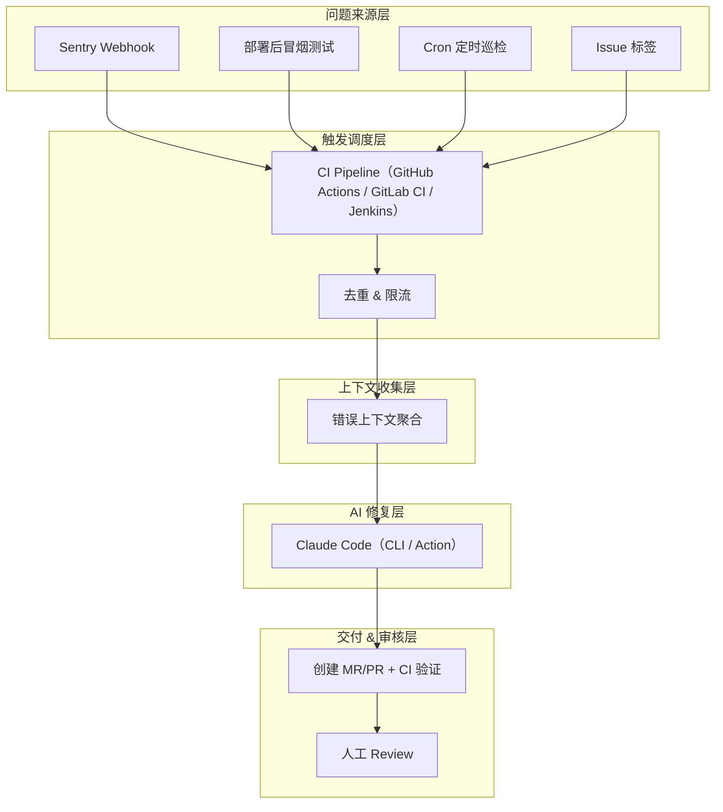
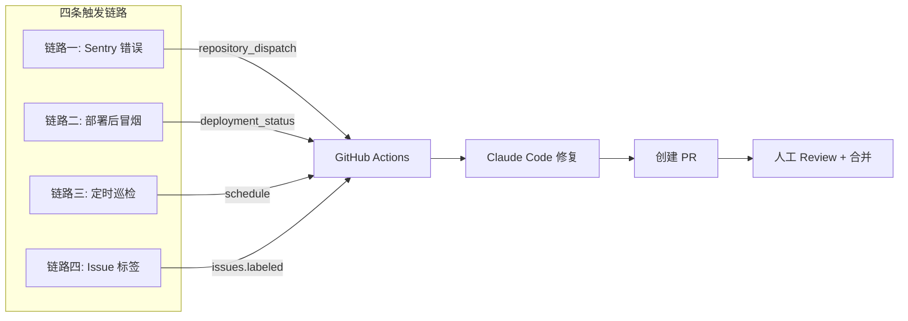
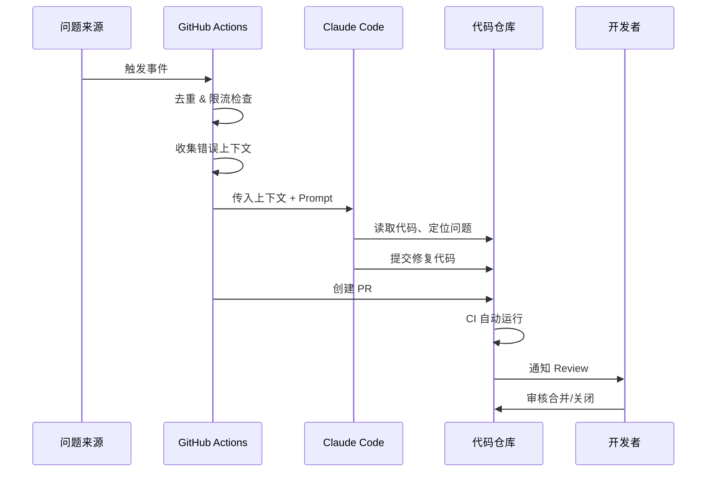
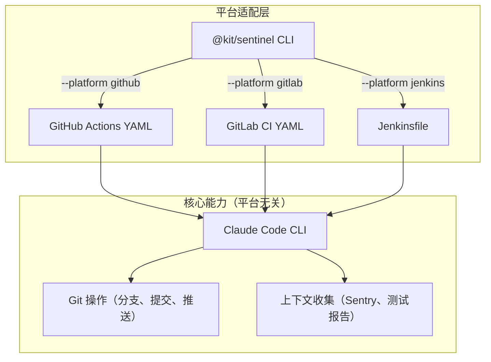
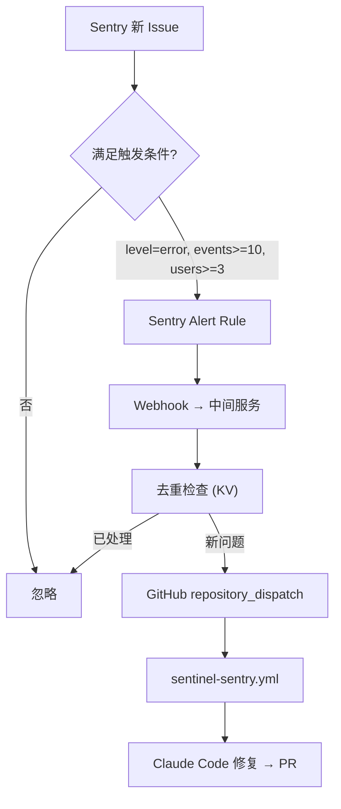
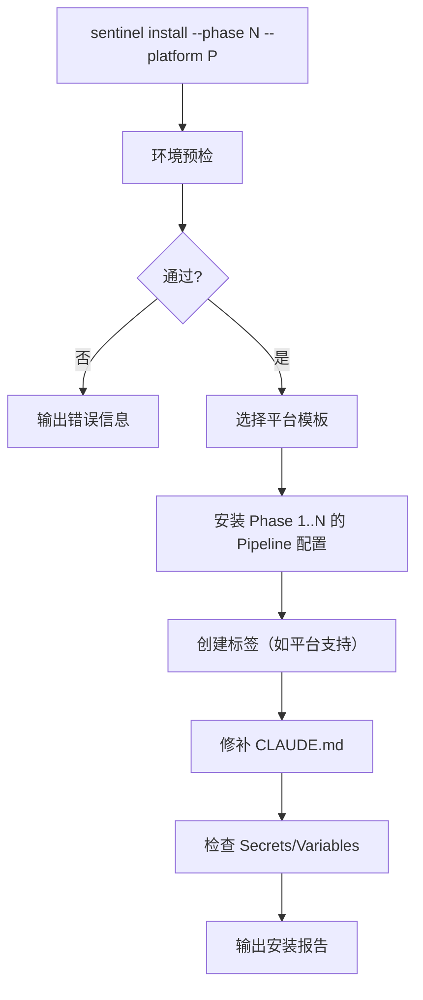

# AI 自动修复系统 (sentinel)

> **状态**: Draft
> **作者**: AIX Team
> **适用范围**: 业务仓库（当前支持 GitHub Actions，GitLab CI / Jenkins 为远期规划）
> **定位**: 平台无关的通用方案模板，托管于 aix 仓库统一管理，各业务仓库按需接入

## 概述

基于 Sentry 监控、部署后冒烟测试、定时巡检和 Issue/工单标签四种触发源，结合 Claude Code（CLI 或 Action）实现「发现问题 → AI 分析修复 → 创建 MR/PR → 人工审核合并」的自动化闭环系统。

方案采用**平台适配层**设计，核心修复逻辑与 CI 平台解耦，通过 `@kit/sentinel` CLI 工具为不同 CI 平台（GitHub Actions / GitLab CI / Jenkins 等）生成对应的 Pipeline 配置。

**核心原则**：

| 原则 | 说明 |
|------|------|
| **AI 修，人审核** | AI 只负责创建 PR，合并权始终在人 |
| **最小改动** | 每次修复只改必要的代码，不做额外重构 |
| **可观测** | 修复过程全程可追溯，失败有通知 |
| **可降级** | 一键关闭，不影响正常开发流程 |

## 动机

### 背景

业务仓库部署上线后，问题发现和修复依赖人工：

- **响应慢**：线上报错需要开发人员手动查看 Sentry → 分析 → 定位 → 修复 → 提 PR
- **发现晚**：部署后回归问题可能数小时后才被用户反馈发现
- **长期忽视**：依赖漏洞、代码质量退化等慢性问题容易积累

### 为什么需要这个方案

现有工作流的不足：

- **纯人工**：从发现到修复全靠人力，无法做到 7×24 响应
- **上下文丢失**：Sentry 错误信息与代码修复在不同平台，上下文切换成本高
- **缺乏闭环**：发现问题后没有自动化的修复和追踪机制

通过 AI 自动修复，可以将「问题发现 → PR 创建」从小时级缩短到分钟级，开发者只需 Review 和合并。

## 目标与非目标

### 目标

| 优先级 | 目标 | 说明 |
|--------|------|------|
| P0 | Issue 标签触发修复 | 开发者打 `sentinel` 标签即触发 AI 修复 |
| P0 | 部署后冒烟测试修复 | 部署成功后自动跑 E2E，失败触发修复 |
| P0 | 安全防护 | 权限控制、限流、降级开关 |
| P1 | Sentry 错误联动 | 线上错误超阈值自动触发修复 |
| P1 | 定时质量巡检 | 每周 Cron 跑 lint/type-check/test/audit（默认每周一） |
| P2 | 可观测性 | 修复效果 Dashboard、通知策略、周报 |

### 非目标

- 不替代人工 Code Review
- 不自动合并 PR 到主分支
- 不处理需求变更类任务（只处理 bug 修复和质量问题）
- 不处理需要跨仓库协调的问题

## 系统架构

### 整体架构图



### 触发链路概览



### 数据流转



### 上下文收集策略

不同触发源收集不同上下文：

| 触发源 | 收集内容 |
|--------|---------|
| **Sentry** | 错误标题、堆栈、影响用户数、首次/末次出现时间、Sentry 链接 |
| **冒烟测试** | 测试报告 JSON、失败截图、控制台日志 |
| **定时巡检** | lint 报告、type-check 报告、audit 报告 |
| **Issue** | Issue 标题、描述、评论、关联信息 |

### 技术选型

| 组件 | 选型 | 说明 |
|------|------|------|
| CI/CD | GitHub Actions / GitLab CI / Jenkins | 通过平台适配层支持多种 CI |
| AI 引擎 | Claude Code CLI（`npx @anthropic-ai/claude-code`）| 平台无关，任何 CI 环境均可运行 |
| AI 引擎（GitHub 专用） | `anthropics/claude-code-action@v1` | GitHub Actions 专用封装，开箱即用 |
| 错误监控 | Sentry | 线上运行时错误捕获 |
| 通知 | CI 平台通知 + 飞书/钉钉 Webhook | 修复 MR/PR 创建后通知 |
| 中间服务 | Cloudflare Worker / Vercel Serverless | Sentry → CI 触发的转发层 |
| 安装工具 | `@kit/sentinel` CLI | 为不同 CI 平台生成对应配置 |

### CI 平台适配架构

方案的核心修复逻辑与 CI 平台解耦，通过**平台适配层**为不同 CI 生成对应的 Pipeline 配置：



#### 各平台能力映射

| 通用能力 | GitHub Actions | GitLab CI | Jenkins |
|---------|----------------|-----------|---------|
| AI 修复引擎 | `claude-code-action@v1` | `npx @anthropic-ai/claude-code` CLI | `npx @anthropic-ai/claude-code` CLI |
| 创建 MR/PR | `gh pr create` | `glab mr create` | GitLab/GitHub API |
| Issue 触发 | `issues.labeled` 事件 | Webhook + Pipeline trigger | Webhook + Job trigger |
| 定时触发 | `schedule.cron` | `rules: - if: $CI_PIPELINE_SOURCE == "schedule"` | `triggers { cron(...) }` |
| 部署后触发 | `deployment_status` / `workflow_run` | `after_script` / downstream pipeline | Post-build action |
| Sentry 触发 | `repository_dispatch` | Pipeline trigger API | Generic Webhook Trigger |
| Secret 管理 | GitHub Secrets | CI/CD Variables (masked) | Jenkins Credentials |
| 并发控制 | `concurrency` group | `resource_group` | `disableConcurrentBuilds` |
| 降级开关 | `vars.SENTINEL_ENABLED` | CI/CD Variable | Global property / 参数化构建 |
| 分支保护 | Branch Protection Rules | Protected Branches | 无原生支持，需额外插件 |

#### GitLab CI 模板示例（概念参考，尚未实现）

```yaml
# .gitlab-ci.yml (概念示例，Phase 5 实现时参考)
sentinel:issue:
  stage: fix
  rules:
    - if: $CI_PIPELINE_SOURCE == "trigger" && $SENTINEL_ISSUE_IID && $SENTINEL_ENABLED != "false"
  variables:
    ANTHROPIC_API_KEY: $ANTHROPIC_API_KEY
  resource_group: sentinel
  script:
    - git checkout -b "sentinel/issue-${SENTINEL_ISSUE_IID}"
    - |
      npx @anthropic-ai/claude-code --prompt "
        请根据以下 Issue 修复代码：
        ## Issue #${SENTINEL_ISSUE_IID}
        **标题**: ${ISSUE_TITLE}
        **描述**: ${ISSUE_BODY}
        ## 约束
        - 只修改 src/ 目录
        - 最小改动原则
      " --allowedTools "Bash,Read,Write,Edit,Glob,Grep"
    - |
      if [ -n "$(git status --porcelain)" ]; then
        git add -A
        git commit -m "fix: 自动修复 #${ISSUE_ID} - ${ISSUE_TITLE}"
        git push origin HEAD
        glab mr create \
          --source-branch "sentinel/issue-${ISSUE_ID}" \
          --title "fix: 自动修复 #${ISSUE_ID} - ${ISSUE_TITLE}" \
          --description "AI 自动修复，请 Review 后合并。" \
          --label "sentinel"
      fi

sentinel:scheduled:
  stage: fix
  rules:
    - if: $CI_PIPELINE_SOURCE == "schedule" && $SENTINEL_ENABLED != "false"
    - if: $CI_PIPELINE_SOURCE == "web" && $SENTINEL_ENABLED != "false"
      when: manual
  variables:
    ANTHROPIC_API_KEY: $ANTHROPIC_API_KEY
  resource_group: sentinel
  script:
    - pnpm install
    - mkdir -p reports
    - pnpm lint 2>&1 | tee reports/lint.txt || true
    - pnpm type-check 2>&1 | tee reports/typecheck.txt || true
    - pnpm test 2>&1 | tee reports/test.txt || true
    - |
      DATE_TAG=$(date +%Y%m%d)
      git checkout -b "sentinel/scheduled-${DATE_TAG}"
      npx @anthropic-ai/claude-code --prompt "
        以下是质量巡检结果，请修复发现的问题：
        $(cat reports/*.txt | head -500)
      " --allowedTools "Bash,Read,Write,Edit,Glob,Grep"
    - |
      if [ -n "$(git status --porcelain)" ]; then
        git add -A
        git commit -m "chore: 每日质量巡检自动修复 (${DATE_TAG})"
        git push origin HEAD
        glab mr create \
          --source-branch "sentinel/scheduled-${DATE_TAG}" \
          --title "chore: 每日质量巡检自动修复" \
          --label "sentinel,maintenance"
      fi
```

#### Jenkins Pipeline 模板示例（概念参考，尚未实现）

> **注**: 以下为概念示例，Phase 5 实现时参考。实际实现中每条链路生成独立的 `Jenkinsfile.sentinel-*` 文件。

```groovy
// Jenkinsfile.sentinel-issue (概念示例，Phase 5 实现时参考)
pipeline {
    agent any

    triggers {
        // 定时巡检：工作日凌晨 2 点
        cron('0 2 * * 1-5')
        // Sentry/Issue 通过 Generic Webhook Trigger 插件触发
        GenericTrigger(
            genericVariables: [
                [key: 'TRIGGER_TYPE', value: '$.type'],
                [key: 'ISSUE_TITLE', value: '$.title'],
                [key: 'ISSUE_BODY', value: '$.body'],
                [key: 'ISSUE_ID', value: '$.id']
            ],
            token: 'sentinel-trigger'
        )
    }

    environment {
        ANTHROPIC_API_KEY = credentials('anthropic-api-key')
    }

    options {
        lock(resource: 'sentinel-lock')   // 并发控制
        timeout(time: 15, unit: 'MINUTES')
    }

    stages {
        stage('Quality Check') {
            when {
                anyOf {
                    triggeredBy 'TimerTrigger'
                    environment name: 'TRIGGER_TYPE', value: 'scheduled'
                }
            }
            steps {
                sh 'pnpm install'
                sh 'pnpm lint 2>&1 | tee reports/lint.txt || true'
                sh 'pnpm type-check 2>&1 | tee reports/typecheck.txt || true'
                sh 'pnpm test 2>&1 | tee reports/test.txt || true'
            }
        }

        stage('AI Fix') {
            steps {
                sh """
                    BRANCH="sentinel/\${TRIGGER_TYPE}-\$(date +%Y%m%d%H%M%S)"
                    git checkout -b "\$BRANCH"

                    npx @anthropic-ai/claude-code --prompt "\$(cat reports/*.txt 2>/dev/null || echo \$ISSUE_BODY)"

                    if [ -n "\$(git status --porcelain)" ]; then
                        git add -A
                        git commit -m "fix: 自动修复 - \${ISSUE_TITLE:-质量巡检}"
                        git push origin HEAD
                    fi
                """
            }
        }

        stage('Create MR') {
            when { expression { sh(script: 'git log origin/main..HEAD --oneline | wc -l', returnStdout: true).trim() != '0' } }
            steps {
                // 根据代码托管平台选择对应命令
                sh 'glab mr create --source-branch $(git branch --show-current) --title "fix: AI 自动修复" --label sentinel || true'
            }
        }
    }

    post {
        failure {
            // 飞书/钉钉通知
            sh 'echo "Auto fix failed" | curl -X POST -d @- ${WEBHOOK_URL} || true'
        }
    }
}
```

## 详细设计

### 链路一：Sentry 错误 → 自动修复

**触发条件**: Sentry 新 Issue 产生且满足阈值

#### 流程图



#### Sentry Alert Rule 配置

```
条件:
  - 事件级别: error 或 fatal
  - 事件数: >= 10 次（1小时内）
  - 影响用户: >= 3 人
  - 首次出现（避免重复触发旧问题）

动作:
  - 发送 Webhook 到中间服务
```

#### 中间服务（Sentry → GitHub 转发）

```typescript
// Cloudflare Worker / Vercel Edge Function
export default async function handler(req: Request) {
  const payload = await req.json()

  // 验证 Sentry 签名
  const signature = req.headers.get('sentry-hook-signature')
  if (!verifySignature(signature, payload)) {
    return new Response('Unauthorized', { status: 401 })
  }

  // 去重检查（同一 Issue 24h 内只触发一次）
  const issueId = payload.data.issue.id
  const cacheKey = `sentry-fix:${issueId}`
  const cached = await KV.get(cacheKey)
  if (cached) {
    return new Response('Duplicate, skipped', { status: 200 })
  }
  await KV.put(cacheKey, '1', { expirationTtl: 86400 })

  // 通过 Sentry API 获取解析后的堆栈（webhook payload 中的堆栈可能是 minified 的）
  const resolvedStacktrace = await fetchResolvedStacktrace(
    payload.data.issue.id
  )

  // 提取上下文
  const context = {
    title: payload.data.issue.title,
    culprit: payload.data.issue.culprit,
    // 生成安全的去重 key，避免特殊字符影响 GitHub Actions concurrency group
    safe_key: createHash('md5')
      .update(payload.data.issue.culprit || '')
      .digest('hex')
      .slice(0, 8),
    level: payload.data.issue.level,
    count: payload.data.issue.count,
    users_affected: payload.data.issue.userCount,
    first_seen: payload.data.issue.firstSeen,
    permalink: payload.data.issue.permalink,
    // 截断 stacktrace，避免超过 GITHUB_OUTPUT 的 1MB 限制
    stacktrace: truncate(resolvedStacktrace || extractStacktrace(payload), 8192),
  }

  // 触发 GitHub Actions
  // 注意：repository_dispatch 需要 PAT（Personal Access Token），默认 GITHUB_TOKEN 无法触发
  await fetch(
    `https://api.github.com/repos/${OWNER}/${REPO}/dispatches`,
    {
      method: 'POST',
      headers: {
        Authorization: `token ${GITHUB_PAT}`,
        Accept: 'application/vnd.github.v3+json',
      },
      body: JSON.stringify({
        event_type: 'sentry-issue',
        client_payload: context,
      }),
    }
  )

  return new Response('OK', { status: 200 })
}

// 截断字符串，避免超过 GITHUB_OUTPUT 的 1MB 限制（默认 8KB）
function truncate(str: string, maxBytes: number): string {
  const encoder = new TextEncoder()
  if (encoder.encode(str).length <= maxBytes) return str
  // 按行截断，保留完整行
  const lines = str.split('\n')
  let result = ''
  for (const line of lines) {
    const next = result ? `${result}\n${line}` : line
    if (encoder.encode(next).length > maxBytes - 30) break
    result = next
  }
  return result + '\n... (truncated)'
}

// 通过 Sentry API 获取已解析的堆栈（source-mapped）
async function fetchResolvedStacktrace(issueId: string): Promise<string | null> {
  try {
    const res = await fetch(
      `https://sentry.io/api/0/issues/${issueId}/events/latest/`,
      {
        headers: { Authorization: `Bearer ${SENTRY_AUTH_TOKEN}` },
      }
    )
    if (!res.ok) return null
    const event = await res.json()
    // 提取已解析的堆栈帧
    const frames = event.entries
      ?.find((e: any) => e.type === 'exception')
      ?.data?.values?.[0]?.stacktrace?.frames
    if (!frames) return null
    return frames
      .filter((f: any) => f.inApp)
      .map((f: any) => `  at ${f.function} (${f.filename}:${f.lineNo}:${f.colNo})`)
      .reverse()
      .join('\n')
  } catch {
    return null
  }
}
```

#### GitHub Actions Workflow

```yaml
# .github/workflows/sentinel-sentry.yml
name: "Sentinel: Sentry Error"

on:
  repository_dispatch:
    types: [sentry-issue]

concurrency:
  # 使用中间服务生成的 safe_key（MD5 hash），避免 culprit 中特殊字符导致问题
  group: sentinel-sentry-${{ github.event.client_payload.safe_key || github.run_id }}
  cancel-in-progress: false

jobs:
  sentinel:
    if: ${{ vars.SENTINEL_ENABLED != 'false' }}
    runs-on: ubuntu-latest
    timeout-minutes: 15
    permissions:
      contents: write
      pull-requests: write
      issues: write

    steps:
      - uses: actions/checkout@v4
        with:
          fetch-depth: 0

      - uses: pnpm/action-setup@v4
      - uses: actions/setup-node@v4
        with:
          node-version: 20
          cache: 'pnpm'
      - run: pnpm install

      - name: Check daily PR limit
        env:
          GH_TOKEN: ${{ secrets.GITHUB_TOKEN }}
        run: |
          count=$(gh pr list --label sentinel --state open \
            --json createdAt \
            --jq '[.[] | select(.createdAt > (now - 86400 | todate))] | length')
          if [ "$count" -ge 10 ]; then
            echo "::warning::Daily sentinel PR limit reached ($count/10), skipping."
            exit 1
          fi
          echo "Current daily PR count: $count/10"

      - name: Check duplicate PR
        id: dedup
        env:
          GH_TOKEN: ${{ secrets.GITHUB_TOKEN }}
          CULPRIT: ${{ github.event.client_payload.culprit }}
        run: |
          # 检查是否已有针对同一 culprit 的开放 PR
          # 通过 env 传递 client_payload 避免 shell 注入（${{ }} 在 run: 中直接插值有注入风险）
          existing=$(gh pr list --label sentinel --state open \
            --json title \
            --jq --arg c "$CULPRIT" '[.[] | select(.title | contains($c))] | length')
          if [ "$existing" -gt 0 ]; then
            echo "::warning::Duplicate PR exists for: $CULPRIT, skipping."
            echo "skip=true" >> $GITHUB_OUTPUT
            exit 0
          fi
          echo "skip=false" >> $GITHUB_OUTPUT

      - name: Prepare error context
        if: steps.dedup.outputs.skip != 'true'
        id: context
        env:
          SENTRY_TITLE: ${{ github.event.client_payload.title }}
          SENTRY_CULPRIT: ${{ github.event.client_payload.culprit }}
          SENTRY_LEVEL: ${{ github.event.client_payload.level }}
          SENTRY_COUNT: ${{ github.event.client_payload.count }}
          SENTRY_USERS: ${{ github.event.client_payload.users_affected }}
          SENTRY_FIRST_SEEN: ${{ github.event.client_payload.first_seen }}
          SENTRY_PERMALINK: ${{ github.event.client_payload.permalink }}
          SENTRY_STACKTRACE: ${{ github.event.client_payload.stacktrace }}
        run: |
          echo "branch_name=sentinel/sentry-$(date +%Y%m%d%H%M%S)" >> $GITHUB_OUTPUT

          # 通过 env 传递 client_payload 避免 shell 注入
          {
            echo "error_context<<CONTEXT_EOF"
            echo "## Sentry Error Report"
            echo ""
            echo "| 字段 | 值 |"
            echo "|------|-----|"
            echo "| **标题** | $SENTRY_TITLE |"
            echo "| **问题函数** | $SENTRY_CULPRIT |"
            echo "| **级别** | $SENTRY_LEVEL |"
            echo "| **触发次数** | $SENTRY_COUNT |"
            echo "| **影响用户数** | $SENTRY_USERS |"
            echo "| **首次出现** | $SENTRY_FIRST_SEEN |"
            echo "| **Sentry 链接** | $SENTRY_PERMALINK |"
            echo ""
            echo "## Stack Trace"
            echo '```'
            echo "$SENTRY_STACKTRACE"
            echo '```'
            echo "CONTEXT_EOF"
          } >> $GITHUB_OUTPUT

      - name: Claude Code Sentinel
        if: steps.dedup.outputs.skip != 'true'
        id: claude
        uses: anthropics/claude-code-action@v1
        with:
          anthropic_api_key: ${{ secrets.ANTHROPIC_API_KEY }}
          model: claude-sonnet-4-6
          max_turns: 20
          branch: ${{ steps.context.outputs.branch_name }}
          prompt: |
            你是一个自动修复机器人，负责修复线上 Sentry 报出的错误。

            ## 错误信息
            ${{ steps.context.outputs.error_context }}

            ## 修复要求
            1. 根据 stack trace 定位问题代码文件和行号
            2. 分析错误根因（不要只处理表面症状）
            3. 用最小改动修复问题
            4. 修复后确保不引入新的类型错误

            ## 约束
            - 只允许修改 src/ 目录下的文件
            - 单次最多修改 5 个文件
            - 不允许删除或修改测试文件
            - 不允许修改配置文件
            - 如果无法确定修复方案，请输出分析报告，不要强行修改代码

            ## 输出
            修复完成后，用以下格式输出摘要：
            ---
            **根因分析**: <一句话描述根因>
            **修复方案**: <一句话描述改了什么>
            **影响范围**: <列出修改的文件>
            **风险评估**: 低/中/高
            ---

      # claude-code-action 自动 commit + push 到指定分支，之后检查分支是否被创建
      - name: Check branch created
        if: steps.dedup.outputs.skip != 'true'
        id: changes
        env:
          BRANCH_NAME: ${{ steps.context.outputs.branch_name }}
        run: |
          if git ls-remote --exit-code origin "refs/heads/$BRANCH_NAME" > /dev/null 2>&1; then
            echo "has_changes=true" >> $GITHUB_OUTPUT
          else
            echo "has_changes=false" >> $GITHUB_OUTPUT
            echo "::notice::Claude 未修改代码（分支未创建），跳过创建 PR"
          fi

      - name: Create Pull Request
        if: steps.changes.outputs.has_changes == 'true'
        id: pr
        env:
          GH_TOKEN: ${{ secrets.GITHUB_TOKEN }}
          BRANCH_NAME: ${{ steps.context.outputs.branch_name }}
          SENTRY_TITLE: ${{ github.event.client_payload.title }}
          SENTRY_CULPRIT: ${{ github.event.client_payload.culprit }}
          SENTRY_COUNT: ${{ github.event.client_payload.count }}
          SENTRY_USERS: ${{ github.event.client_payload.users_affected }}
          SENTRY_PERMALINK: ${{ github.event.client_payload.permalink }}
          ERROR_CONTEXT: ${{ steps.context.outputs.error_context }}
        run: |
          gh pr create \
            --head "$BRANCH_NAME" \
            --title "fix: 自动修复 Sentry 错误 - $SENTRY_TITLE" \
            --body "## AI 自动修复

          本 PR 由自动修复系统根据 Sentry 错误报告生成。

          ### Sentry Issue
          - **错误**: $SENTRY_TITLE
          - **位置**: \`$SENTRY_CULPRIT\`
          - **影响**: $SENTRY_COUNT 次触发, $SENTRY_USERS 用户受影响
          - **链接**: $SENTRY_PERMALINK

          ### 错误上下文
          $ERROR_CONTEXT

          ### Review 清单
          - [ ] 根因分析是否正确
          - [ ] 修复方案是否合理
          - [ ] 是否有潜在的副作用
          - [ ] CI 是否全部通过

          ---
          > 此 PR 由 AI 自动生成，请务必人工 Review 后再合并。" \
            --label "sentinel,bot" \
            --reviewer "${{ vars.SENTINEL_REVIEWERS }}"

      - name: Notify on failure
        if: failure()
        env:
          SENTRY_TITLE: ${{ github.event.client_payload.title }}
        run: |
          # 可接入飞书/钉钉 Webhook 通知
          echo "Auto fix failed for: $SENTRY_TITLE"
```

### 链路二：部署后冒烟测试 → 自动修复

**触发条件**: 生产环境部署成功后自动运行

```yaml
# .github/workflows/sentinel-post-deploy.yml
name: "Sentinel: Post-Deploy Smoke Test"

on:
  deployment_status:
  workflow_run:
    workflows: ["Deploy Production"]
    types: [completed]
  workflow_dispatch:
    inputs:
      environment_url:
        description: '目标环境 URL'
        required: true
        default: 'https://your-app.com'

jobs:
  smoke-test:
    if: >
      vars.SENTINEL_ENABLED != 'false' && (
      github.event_name == 'workflow_dispatch' ||
      (github.event_name == 'deployment_status' && github.event.deployment_status.state == 'success') ||
      (github.event_name == 'workflow_run' && github.event.workflow_run.conclusion == 'success'))
    runs-on: ubuntu-latest
    timeout-minutes: 20
    permissions:
      contents: write
      pull-requests: write

    steps:
      - uses: actions/checkout@v4

      - uses: pnpm/action-setup@v4
      - uses: actions/setup-node@v4
        with:
          node-version: 20
          cache: 'pnpm'

      - run: pnpm install

      - name: Install Playwright browsers
        run: pnpm exec playwright install --with-deps chromium

      - name: Run smoke tests
        id: smoke
        continue-on-error: true
        run: |
          mkdir -p test-results
          set +e
          pnpm test:e2e:smoke \
            --reporter=json \
            --output-file=test-results/report.json \
            2>&1 | tee test-results/output.log
          echo "exit_code=$?" >> $GITHUB_OUTPUT
          set -e
        env:
          BASE_URL: ${{ github.event.inputs.environment_url || github.event.deployment_status.target_url }}

      - name: Prepare test context
        if: steps.smoke.outputs.exit_code != '0'
        id: test-context
        run: |
          # 将测试结果存入 step output（YAML prompt 中 $(cat) 不会被 shell 展开）
          {
            echo "test_output<<TEST_EOF"
            head -500 test-results/output.log 2>/dev/null || echo "无测试日志"
            echo "TEST_EOF"
          } >> $GITHUB_OUTPUT

          {
            echo "test_report<<REPORT_EOF"
            cat test-results/report.json 2>/dev/null || echo "无 JSON 报告"
            echo "REPORT_EOF"
          } >> $GITHUB_OUTPUT

          {
            echo "fail_summary<<FAIL_EOF"
            grep -E "FAIL|Error" test-results/output.log 2>/dev/null | head -20 || echo "无匹配"
            echo "FAIL_EOF"
          } >> $GITHUB_OUTPUT

      - name: Skip if tests pass
        if: steps.smoke.outputs.exit_code == '0'
        run: echo "All smoke tests passed, no fix needed."

      - name: Claude Code Sentinel
        if: steps.smoke.outputs.exit_code != '0'
        uses: anthropics/claude-code-action@v1
        with:
          anthropic_api_key: ${{ secrets.ANTHROPIC_API_KEY }}
          model: claude-sonnet-4-6
          max_turns: 25
          branch: "sentinel/post-deploy-${{ github.run_id }}"
          prompt: |
            部署后冒烟测试失败了，请分析并修复。

            ## 测试输出日志
            ${{ steps.test-context.outputs.test_output }}

            ## 测试报告（如存在）
            ${{ steps.test-context.outputs.test_report }}

            ## 修复要求
            1. 分析哪些测试用例失败了
            2. 区分问题类型：是业务代码 bug 还是环境/配置问题
            3. 只修复业务代码 bug，不要修改测试用例
            4. 如果是环境问题，只输出分析报告

            ## 约束
            - 只修改 src/ 目录
            - 不修改测试文件、配置文件
            - 最小化改动

      # claude-code-action 自动 commit + push 到指定分支
      - name: Check branch created
        if: steps.smoke.outputs.exit_code != '0'
        id: changes
        run: |
          BRANCH_NAME="sentinel/post-deploy-${{ github.run_id }}"
          if git ls-remote --exit-code origin "refs/heads/$BRANCH_NAME" > /dev/null 2>&1; then
            echo "has_changes=true" >> $GITHUB_OUTPUT
          else
            echo "has_changes=false" >> $GITHUB_OUTPUT
            echo "::notice::Claude 未修改代码（可能是环境问题），跳过创建 PR"
          fi

      - name: Create Pull Request
        if: steps.changes.outputs.has_changes == 'true'
        env:
          GH_TOKEN: ${{ secrets.GITHUB_TOKEN }}
          FAIL_SUMMARY: ${{ steps.test-context.outputs.fail_summary }}
        run: |
          gh pr create \
            --head "sentinel/post-deploy-${{ github.run_id }}" \
            --title "fix: 自动修复部署后冒烟测试失败" \
            --body "## AI 自动修复 - 部署后测试失败

          部署后冒烟测试发现问题，AI 已自动生成修复方案。

          ### 失败测试
          \`\`\`
          $FAIL_SUMMARY
          \`\`\`

          ### Review 清单
          - [ ] 确认修复方案正确
          - [ ] 确认未引入新问题
          - [ ] CI 全部通过

          ---
          > 此 PR 由 AI 自动生成，请务必人工 Review 后再合并。" \
            --label "sentinel,post-deploy,urgent"
```

### 链路三：定时质量巡检

**触发条件**: 工作日定时执行

```yaml
# .github/workflows/sentinel-scheduled.yml
name: "Sentinel: Scheduled Quality Check"

on:
  schedule:
    - cron: '0 3 * * 1'  # 每周一凌晨 3:00（UTC，可按需调整为工作日每日执行）
  workflow_dispatch:

jobs:
  quality-check:
    if: ${{ vars.SENTINEL_ENABLED != 'false' }}
    runs-on: ubuntu-latest
    timeout-minutes: 30
    permissions:
      contents: write
      pull-requests: write

    steps:
      - uses: actions/checkout@v4

      - uses: pnpm/action-setup@v4
      - uses: actions/setup-node@v4
        with:
          node-version: 20
          cache: 'pnpm'

      - run: pnpm install

      - name: Prepare reports directory
        run: mkdir -p reports

      - name: Run lint
        id: lint
        continue-on-error: true
        run: |
          set +e
          pnpm lint 2>&1 | tee reports/lint.txt
          echo "exit=$?" >> $GITHUB_OUTPUT

      - name: Run type check
        id: typecheck
        continue-on-error: true
        run: |
          set +e
          pnpm type-check 2>&1 | tee reports/typecheck.txt
          echo "exit=$?" >> $GITHUB_OUTPUT

      - name: Run tests
        id: test
        continue-on-error: true
        run: |
          set +e
          pnpm test 2>&1 | tee reports/test.txt
          echo "exit=$?" >> $GITHUB_OUTPUT

      - name: Security audit
        id: audit
        continue-on-error: true
        run: |
          set +e
          pnpm audit 2>&1 | tee reports/audit.txt
          echo "exit=$?" >> $GITHUB_OUTPUT

      - name: Summarize results
        id: summary
        run: |
          has_issues=false
          {
            echo "## 质量巡检报告 - $(date +%Y-%m-%d)"
            echo ""

            if [ "${{ steps.lint.outputs.exit }}" != "0" ]; then
              echo "### Lint 检查失败"
              echo '```'
              tail -50 reports/lint.txt
              echo '```'
              has_issues=true
            else
              echo "### Lint 检查通过"
            fi

            if [ "${{ steps.typecheck.outputs.exit }}" != "0" ]; then
              echo "### 类型检查失败"
              echo '```'
              tail -50 reports/typecheck.txt
              echo '```'
              has_issues=true
            else
              echo "### 类型检查通过"
            fi

            if [ "${{ steps.test.outputs.exit }}" != "0" ]; then
              echo "### 单元测试失败"
              echo '```'
              tail -50 reports/test.txt
              echo '```'
              has_issues=true
            else
              echo "### 单元测试通过"
            fi

            if [ "${{ steps.audit.outputs.exit }}" != "0" ]; then
              echo "### 安全审计发现问题"
              echo '```'
              tail -30 reports/audit.txt
              echo '```'
              has_issues=true
            else
              echo "### 安全审计通过"
            fi
          } > /tmp/report.md

          echo "has_issues=$has_issues" >> $GITHUB_OUTPUT

          # 将报告内容存入 step output（YAML 中 $(cat) 不会被 shell 展开）
          {
            echo "report<<REPORT_EOF"
            cat /tmp/report.md
            echo "REPORT_EOF"
          } >> $GITHUB_OUTPUT

          # 生成日期标签
          echo "date_tag=$(date +%Y%m%d)" >> $GITHUB_OUTPUT
          echo "date_display=$(date +%Y-%m-%d)" >> $GITHUB_OUTPUT

      - name: Claude Code Sentinel
        if: steps.summary.outputs.has_issues == 'true'
        uses: anthropics/claude-code-action@v1
        with:
          anthropic_api_key: ${{ secrets.ANTHROPIC_API_KEY }}
          model: claude-sonnet-4-6
          max_turns: 30
          branch: "sentinel/scheduled-${{ steps.summary.outputs.date_tag }}"
          prompt: |
            以下是每日质量巡检的结果，请修复发现的问题。

            ${{ steps.summary.outputs.report }}

            ## 修复优先级
            1. 类型错误（可能导致运行时问题）
            2. 单元测试失败（回归 bug）
            3. Lint 错误（代码质量）
            4. 安全漏洞（依赖升级）

            ## 约束
            - Lint 问题优先使用 --fix 自动修复
            - 依赖升级只做 patch 版本升级，minor/major 升级请标注让人工决策
            - 如果某个问题你不确定怎么修，跳过并在报告中说明

      # claude-code-action 自动 commit + push 到指定分支
      - name: Check branch created
        if: steps.summary.outputs.has_issues == 'true'
        id: changes
        run: |
          BRANCH_NAME="sentinel/scheduled-${{ steps.summary.outputs.date_tag }}"
          if git ls-remote --exit-code origin "refs/heads/$BRANCH_NAME" > /dev/null 2>&1; then
            echo "has_changes=true" >> $GITHUB_OUTPUT
          else
            echo "has_changes=false" >> $GITHUB_OUTPUT
            echo "::notice::Claude 未修改代码，跳过创建 PR"
          fi

      - name: Create Pull Request
        if: steps.changes.outputs.has_changes == 'true'
        env:
          GH_TOKEN: ${{ secrets.GITHUB_TOKEN }}
          REPORT: ${{ steps.summary.outputs.report }}
        run: |
          gh pr create \
            --head "sentinel/scheduled-${{ steps.summary.outputs.date_tag }}" \
            --title "chore: 每日质量巡检自动修复 (${{ steps.summary.outputs.date_display }})" \
            --body "## 每日质量巡检

          $REPORT

          ---
          > 此 PR 由 AI 自动生成，请务必人工 Review 后再合并。" \
            --label "sentinel,maintenance"
```

### 链路四：Issue 标签触发（人机协同）

**触发条件**: 开发者在 Issue 上打 `sentinel` 标签

> **安全注意**: `sentinel` 标签应通过 GitHub 权限设置限制为 Collaborator 及以上角色才能添加，防止外部用户通过 Issue 内容进行 Prompt 注入。

```yaml
# .github/workflows/sentinel-issue.yml
name: "Sentinel: From Issue"

on:
  issues:
    types: [labeled]

jobs:
  sentinel:
    if: github.event.label.name == 'sentinel' && vars.SENTINEL_ENABLED != 'false'
    runs-on: ubuntu-latest
    timeout-minutes: 15
    permissions:
      contents: write
      pull-requests: write
      issues: write

    steps:
      - uses: actions/checkout@v4
        with:
          fetch-depth: 0

      - uses: pnpm/action-setup@v4
      - uses: actions/setup-node@v4
        with:
          node-version: 20
          cache: 'pnpm'
      - run: pnpm install

      - name: Comment on issue - start
        uses: peter-evans/create-or-update-comment@v4
        with:
          issue-number: ${{ github.event.issue.number }}
          body: |
            **自动修复已触发**

            正在分析 Issue 并生成修复方案，预计 5-10 分钟完成。
            完成后会自动创建 PR 并关联此 Issue。

      - name: Claude Code Sentinel
        id: claude
        uses: anthropics/claude-code-action@v1
        with:
          anthropic_api_key: ${{ secrets.ANTHROPIC_API_KEY }}
          model: claude-sonnet-4-6
          max_turns: 25
          branch: "sentinel/issue-${{ github.event.issue.number }}"
          prompt: |
            请根据以下 GitHub Issue 修复代码：

            ## Issue #${{ github.event.issue.number }}
            **标题**: ${{ github.event.issue.title }}

            **描述**:
            ${{ github.event.issue.body }}

            ## 要求
            1. 仔细理解 Issue 描述的问题
            2. 在代码中定位相关文件
            3. 实现修复（最小改动原则）
            4. 确保修复后类型检查和 lint 通过

      # 硬检查：确保 AI 没有修改白名单以外的文件（防止 Prompt 注入绕过 CLAUDE.md 软约束）
      # claude-code-action 会自动 commit + push，用 git diff origin/DEFAULT_BRANCH 对比所有变更
      - name: Validate changed files
        id: validate
        env:
          DEFAULT_BRANCH: ${{ github.event.repository.default_branch }}
        run: |
          BRANCH_NAME="sentinel/issue-${{ github.event.issue.number }}"
          # 检查分支是否被创建（说明 claude 产生了代码变更）
          if ! git ls-remote --exit-code origin "refs/heads/$BRANCH_NAME" > /dev/null 2>&1; then
            echo "has_changes=false" >> $GITHUB_OUTPUT
            exit 0
          fi

          # 获取该分支相对默认分支的所有变更文件
          git fetch origin "$BRANCH_NAME"
          CHANGED_FILES=$(git diff "origin/$DEFAULT_BRANCH...origin/$BRANCH_NAME" --name-only 2>/dev/null || true)

          if [ -z "$CHANGED_FILES" ]; then
            echo "has_changes=false" >> $GITHUB_OUTPUT
            exit 0
          fi

          FORBIDDEN=$(echo "$CHANGED_FILES" | grep -vE '^src/|^styles/' || true)
          if [ -n "$FORBIDDEN" ]; then
            echo "::error::AI 修改了白名单以外的文件，拒绝创建 PR:"
            echo "$FORBIDDEN"
            exit 1
          fi

          echo "has_changes=true" >> $GITHUB_OUTPUT

      - name: Create Pull Request
        if: steps.validate.outputs.has_changes == 'true'
        id: pr
        env:
          GH_TOKEN: ${{ secrets.GITHUB_TOKEN }}
        run: |
          PR_URL=$(gh pr create \
            --head "sentinel/issue-${{ github.event.issue.number }}" \
            --title "fix: 自动修复 #${{ github.event.issue.number }} - ${{ github.event.issue.title }}" \
            --body "## AI 自动修复

          Closes #${{ github.event.issue.number }}

          ### 修复说明
          根据 Issue 描述自动生成的修复方案。

          ### Review 清单
          - [ ] 修复方案是否正确
          - [ ] 是否有潜在的副作用
          - [ ] CI 是否全部通过

          ---
          > 此 PR 由 AI 自动生成，请务必人工 Review 后再合并。" \
            --label "sentinel,bot")
          echo "pr_url=$PR_URL" >> $GITHUB_OUTPUT

      - name: Comment on issue - no changes
        if: steps.validate.outputs.has_changes == 'false'
        uses: peter-evans/create-or-update-comment@v4
        with:
          issue-number: ${{ github.event.issue.number }}
          body: |
            **自动修复完成，但未产生代码变更**

            AI 分析了此 Issue，但未找到需要修改的代码。可能需要人工介入。

      - name: Comment on issue - done
        if: steps.pr.outputs.pr_url
        uses: peter-evans/create-or-update-comment@v4
        with:
          issue-number: ${{ github.event.issue.number }}
          body: |
            **修复 PR 已创建**: ${{ steps.pr.outputs.pr_url }}

            请 Review 后合并。

      - name: Comment on issue - failed
        if: failure()
        uses: peter-evans/create-or-update-comment@v4
        with:
          issue-number: ${{ github.event.issue.number }}
          body: |
            **自动修复失败**

            AI 无法自动修复此问题，需要人工介入。
            Workflow 日志: ${{ github.server_url }}/${{ github.repository }}/actions/runs/${{ github.run_id }}
```

### CLAUDE.md 修复规范

在业务仓库的 `CLAUDE.md` 中需要添加 sentinel 相关约束，作为 AI 修复行为的「护栏」：

```markdown
# Sentinel 规范（供 CI 中的 Claude Code 使用）

## 修复原则
- 最小改动原则：只改必要的代码
- 不做额外重构、不添加新功能
- 不修改测试用例来让测试通过
- 不确定时宁可不改，输出分析报告

## 文件权限
- 允许修改: src/**
- 允许修改: styles/**
- 禁止修改: tests/**, __tests__/**
- 禁止修改: *.config.*, .env*
- 禁止修改: package.json (依赖变更需人工决策)
- 禁止修改: .github/workflows/**

## 修复质量要求
- 修复后代码必须通过 TypeScript 类型检查
- 不引入 any 类型来绕过类型错误
- 保持现有代码风格一致
- 添加必要的注释说明修复原因
```

### 安全防护

#### 权限控制

```yaml
# 最小权限原则
permissions:
  contents: write        # 创建分支和提交
  pull-requests: write   # 创建 PR
  issues: write          # 评论 Issue
  # 不给 admin 权限，不给 deployments 权限
```

#### 分支保护规则

main 分支必须开启以下保护：

| 规则 | 配置 |
|------|------|
| Require pull request before merging | 开启 |
| Require approvals | >= 1 人审批 |
| Require status checks to pass | 开启 |
| Require branches to be up to date | 开启 |
| Allow auto-merge | 关闭 |

#### 限流机制

| 维度 | 限制 | 实现方式 |
|------|------|---------|
| 同一错误去重 | 24 小时内同一 Sentry Issue 只触发 1 次 | 中间服务 KV 存储 |
| 并发控制 | 同一触发源内串行执行 | `concurrency` group（按链路隔离，非全局限制） |
| 全局并发限制 | 跨链路总并发不超过 3 个 | 中间服务层令牌桶限流（推荐），或 GitHub Actions `concurrency` 全局 group |
| 重复 PR 检测 | 已有同类开放 PR 时跳过 | workflow 中 `gh pr list` 检查 |
| 每日上限 | 单日最多创建 10 个修复 PR | workflow 中 `gh pr list` 统计当日数量 |
| 成本控制 | 单次修复 max_turns <= 30 | Claude Code Action 参数 |

#### 降级开关

通过 GitHub Repository Variable `SENTINEL_ENABLED` 一键控制：

```yaml
jobs:
  sentinel:
    if: ${{ vars.SENTINEL_ENABLED != 'false' }}
```

紧急情况设置 `SENTINEL_ENABLED=false` 即可关闭所有自动修复。

### 可观测性

#### 修复效果指标

| 指标 | 说明 | 目标 |
|------|------|------|
| 修复成功率 | 创建的 PR 中被合并的比例 | > 60% |
| 平均修复时间 | 从错误发生到 PR 创建 | < 30 min |
| 误报率 | 创建了 PR 但修复不正确被关闭 | < 30% |
| CI 通过率 | 自动修复 PR 的 CI 通过比例 | > 80% |

#### 通知策略

| 事件 | 通知渠道 | 接收人 |
|------|---------|--------|
| 修复 PR 创建 | GitHub Notification + IM | 对应模块 Owner |
| 修复失败 | IM 告警 | 值班人员 |
| 每日巡检报告 | 邮件/IM | 全组 |
| 周报汇总 | 邮件 | Tech Lead |

## 缺点与风险

| 风险 | 影响 | 缓解措施 |
|------|------|----------|
| **AI 修复引入新 bug** | 高 | 强制 CI 通过 + 人工 Review，禁止自动合并 |
| **过度触发浪费资源** | 中 | 去重 + 限流 + 阈值调优 + 每日上限 |
| **Prompt 注入** | 中 | Issue 内容可能包含恶意指令；三层防护：(1) 标签权限限制为 Collaborator+，(2) CLAUDE.md 软约束文件权限，(3) PR 创建前 diff 白名单硬检查 |
| **API Key 泄露** | 高 | 使用 GitHub Secrets 存储，最小权限原则 |
| **修复质量低，团队不信任** | 中 | 先从简单问题开始，逐步证明价值 |
| **API 成本失控** | 中 | max_turns 限制 + 每日上限 + 降级开关 + 月度预算告警 |

## 待解决问题

以下问题需要在实施前确认：

| # | 问题 | 影响 | 建议 | 状态 |
|---|------|------|------|------|
| 1 | **`claude-code-action` 的 outputs schema** | 当前假设存在 `has_changes`、`summary` 等输出字段，需对照官方文档确认实际字段名 | Phase 1 启动前验证，必要时调整 workflow | 待确认 |
| 2 | ~~**`claude-code-action` 与 `create-pull-request` 的职责划分**~~ | ~~action 本身可能支持创建 PR，与 `create-pull-request` 共用可能产生分支/commit 冲突~~ | 已解决：移除 `create-pull-request`，使用 `claude-code-action` 的 `branch` 参数 + `gh pr create` | **已解决** |
| 3 | ~~**step output 的大小限制**~~ | ~~`GITHUB_OUTPUT` 有 ~1MB 限制，大型测试报告或 stacktrace 可能超限~~ | 已解决：中间服务添加 8KB stacktrace 截断，测试日志 `head -500` 截断 | **已解决** |
| 4 | **冒烟测试套件就绪度** | 链路二依赖 `pnpm test:e2e:smoke`，各业务仓库的 E2E 测试成熟度不一 | Phase 2 前先评估各仓库 E2E 覆盖率 | 待确认 |
| 5 | **修复失败后的重试策略** | 当前修复失败仅发通知，无自动重试机制 | MVP 阶段不重试，后续根据失败原因分类（瞬态 vs 永久）决定是否引入 | 待确认 |

## 备选方案

### 方案 A：基于 Dependabot / Renovate

仅使用 Dependabot 或 Renovate 处理依赖更新和安全漏洞。

**放弃原因**：
- 只能处理依赖问题，无法修复业务代码 bug
- 无法与 Sentry 联动
- 无法处理运行时错误

### 方案 B：基于 GitHub Copilot Workspace

使用 GitHub Copilot Workspace 从 Issue 自动生成修复 PR。

**放弃原因**：
- 功能尚在预览阶段，不够成熟
- 无法自定义触发链路（Sentry、部署后测试等）
- 缺乏 CLAUDE.md 类似的行为约束机制

### 方案 C：自建 Agent 服务

部署一个长期运行的 Agent 服务，轮询 Sentry 和 CI 状态。

**放弃原因**：
- 运维成本高，需要维护服务器
- GitHub Actions 已提供事件驱动能力，无需轮询
- Claude Code Action 开箱即用，无需自建

### 为什么选择当前方案

- **事件驱动**：利用 GitHub Actions 原生事件机制，无需维护额外服务
- **行为可控**：CLAUDE.md 约束 + 文件权限限制 + 分支保护
- **渐进可达**：四条链路独立，可逐步上线
- **成本可控**：按触发次数付费，有多层限流保障

## 采用策略

### Phase 1: MVP

**目标**: 跑通链路四（Issue 标签触发），验证 Claude Code Action 基本能力

- [ ] 业务仓库 CLAUDE.md 添加修复规范
- [ ] 配置 `sentinel-issue.yml` workflow
- [ ] 配置 GitHub Secrets（ANTHROPIC_API_KEY）
- [ ] 手动创建 3-5 个已知 bug 的 Issue，测试修复效果
- [ ] 评估修复质量，调优 prompt

### Phase 2: 部署后检测

**目标**: 接入部署后冒烟测试自动修复

- [ ] 确保已有可用的冒烟测试套件（E2E 或 API 测试）
- [ ] 配置 `sentinel-post-deploy.yml` workflow
- [ ] 在 staging 环境先行验证
- [ ] 灰度到生产环境

### Phase 3: Sentry 联动

**目标**: 线上错误自动修复

- [ ] 创建 GitHub PAT（Personal Access Token），配置为 `SENTINEL_PAT` Secret（`repository_dispatch` 需要 PAT，默认 `GITHUB_TOKEN` 无法触发）
- [ ] 部署中间服务（Cloudflare Worker），配置 `GITHUB_PAT`、`SENTRY_AUTH_TOKEN` 环境变量
- [ ] 配置 Sentry Alert Rule + Webhook
- [ ] 配置 `sentinel-sentry.yml` workflow
- [ ] 调优触发阈值（避免过度触发）
- [ ] 生产试运行，观察效果

### Phase 4: 定时巡检 + 可观测

**目标**: 完整闭环 + 效果可度量

- [ ] 配置 `sentinel-scheduled.yml` workflow
- [ ] 接入 IM 通知（飞书/钉钉）
- [ ] 搭建修复效果 Dashboard
- [ ] 建立周报机制
- [ ] 根据数据持续调优

### Phase 5: 多 CI 平台适配（远期规划）

> **注**: Phase 1-4 以 GitHub Actions 为唯一实现平台。Phase 5 为远期规划，待 GitHub 平台验证成熟后再启动。代码中已预留 `PlatformAdapter` 接口和工厂模式，扩展新平台只需实现接口并注册。

**目标**: 支持 GitLab CI、Jenkins 等非 GitHub 平台的业务仓库

- [ ] 实现 GitLab CI 适配器 + `glab` CLI 集成
- [ ] 实现 Jenkins Pipeline 适配器 + Generic Webhook Trigger
- [ ] Sentry 中间服务支持多平台 dispatch（GitHub dispatch / GitLab trigger / Jenkins webhook）
- [ ] 编写各平台的安装和验证文档
- [ ] 在 GitLab/Jenkins 仓库试点验证

## CLI 安装工具

为降低各业务仓库的接入成本，提供 `@kit/sentinel` CLI 工具实现一键安装。

### 安装

```bash
# GitHub Actions（默认）
sentinel install --phase 1

# GitLab CI
sentinel install --phase 1 --platform gitlab

# Jenkins
sentinel install --phase 1 --platform jenkins

# 从 aix monorepo 内开发调试
pnpm --filter @kit/sentinel dev -- install --phase 1 --platform github
```

### 命令

| 命令 | 说明 |
|------|------|
| `sentinel install` | 安装指定 Phase 的 workflow 到目标仓库 |
| `sentinel check` | 检查目标仓库的安装状态（workflow、secrets、CLAUDE.md） |
| `sentinel uninstall` | 移除已安装的 sentinel workflow 和配置 |

### install 命令参数

| 参数 | 说明 | 默认值 |
|------|------|--------|
| `--platform <name>` | CI 平台：当前仅支持 `github`（`gitlab` / `jenkins` 为远期规划） | github |
| `--phase <1-4>` | 安装指定阶段（累积安装 1..N） | 交互选择 |
| `--all` | 安装全部 4 个阶段 | - |
| `--target <path>` | 目标仓库路径 | 当前目录 |
| `-y, --yes` | 跳过交互确认 | false |
| `--dry-run` | 仅预览，不实际写入 | false |
| `--node-version <ver>` | Pipeline 中的 Node.js 版本 | 20 |
| `--reviewers <list>` | MR/PR 默认 Reviewer | - |

### 安装流程



### 工具架构

工具源码位于 `internal/sentinel/`，关键模块：

| 模块 | 职责 |
|------|------|
| `core/installer.ts` | 安装编排器（按平台分发） |
| `core/workflow-writer.ts` | 模板渲染 + 写入对应平台的配置目录 |
| `core/claude-md-patcher.ts` | 幂等修补 CLAUDE.md |
| `core/label-creator.ts` | 通过平台 CLI 创建标签 |
| `core/secrets-checker.ts` | 检查 Secrets/Variables 并输出配置引导 |
| `utils/template.ts` | `__VAR__` 模板变量替换 |

模板文件按平台组织：

```
templates/
├── github/                    # GitHub Actions 模板（已实现）
│   ├── sentinel-issue.yml
│   ├── sentinel-post-deploy.yml
│   ├── sentinel-sentry.yml
│   └── sentinel-scheduled.yml
├── claude-md/                 # CLAUDE.md 补丁（通用）
│   └── sentinel-rules.md
└── worker/                    # Sentry Worker（通用）
    └── sentry-webhook.ts
# gitlab/ 和 jenkins/ 目录为远期 Phase 5 规划
```

## 附录

### 成本预估

| 项目 | 预估成本 | 说明 |
|------|---------|------|
| Claude API | ~$50-200/月 | 取决于触发频率，Sonnet 模型性价比高 |
| CI 运行时 | 取决于平台 | GitHub Actions 包含在 Plan 中；GitLab 有免费额度；Jenkins 需自备 Runner |
| 中间服务 | ~$0-5/月 | Cloudflare Worker 免费额度通常够用 |
| 人工 Review | ~2-4 小时/周 | Review AI 生成的 MR/PR |

### FAQ

**Q: 自动修复的 PR 谁来 Review？**

根据修改文件的 CODEOWNERS 自动指定 Reviewer，如未配置则指定 `SENTINEL_REVIEWERS` 变量中的人员。

**Q: 如果 AI 修错了怎么办？**

直接关闭 PR 即可。所有修复都在独立分支，不影响主分支。PR 被关闭的数据会进入误报率统计，用于持续调优。

**Q: 如何防止同一个问题反复创建 PR？**

三层防护：(1) Sentry 侧去重 24h，(2) GitHub concurrency group 防止同一问题并发，(3) 创建 PR 前检查是否已有同类 PR 开放。

**Q: 可以自动合并吗？**

不建议。MVP 阶段必须人工 Review。后续如果修复成功率稳定 > 90%，可以考虑对特定类型（如纯 lint fix）开启 auto-merge。

**Q: 费用会不会失控？**

通过 max_turns 限制 + 每日上限 + 降级开关三重保障。建议初期设置 Anthropic API 的月度用量预算告警。

**Q: 不用 GitHub 能跑吗？**

可以。核心修复能力由 Claude Code CLI 提供，不依赖任何特定 CI 平台。Phase 1-4 先以 GitHub Actions 为主验证效果，Phase 5 扩展至 GitLab CI 和 Jenkins。使用 `sentinel install --platform gitlab/jenkins` 即可生成对应平台配置。

**Q: `claude-code-action` 和 Claude Code CLI 有什么区别？**

`claude-code-action` 是 Claude Code CLI 的 GitHub Action 封装，功能等价但仅限 GitHub Actions 环境。在 GitLab CI / Jenkins 等平台，直接使用 `npx @anthropic-ai/claude-code` CLI 即可达到相同效果。CLI 可在任何有 Node.js 的环境运行。

**Q: Jenkins 没有原生分支保护怎么办？**

Jenkins 本身不提供分支保护，但代码仓库通常托管在 GitLab/GitHub/Bitbucket 上，分支保护规则在仓库侧配置即可。AI 修复的 MR/PR 仍然需要通过仓库的审核流程才能合并。

### 技术依赖

**通用依赖（所有平台）**

| 依赖 | 用途 |
|------|------|
| Claude Code CLI (`npx @anthropic-ai/claude-code`) | AI 代码修复引擎（平台无关） |
| Sentry SDK | 线上错误监控 |
| Cloudflare Workers / Vercel | Webhook 中间服务 |
| `@kit/sentinel` CLI | 安装配置工具 |

**GitHub 专用依赖**

| 依赖 | 用途 |
|------|------|
| `anthropics/claude-code-action@v1` | GitHub Action 封装（可选，CLI 亦可） |
| `peter-evans/create-or-update-comment@v4` | Issue 评论通知 |
| `actions/checkout@v4` | 代码检出 |
| `gh` CLI | 创建 PR、管理标签和 Secrets |

**GitLab 专用依赖**

| 依赖 | 用途 |
|------|------|
| `glab` CLI | 创建 MR、管理标签 |
| GitLab Pipeline Trigger API | Sentry/外部系统触发 Pipeline |

**Jenkins 专用依赖**

| 依赖 | 用途 |
|------|------|
| Generic Webhook Trigger 插件 | 接收外部 Webhook 触发构建 |
| Lockable Resources 插件 | 并发控制 |
| Credentials Binding 插件 | Secret 管理 |

### Secrets 需求

| Secret/Variable | 用途 | 哪个阶段需要 |
|-----------------|------|-------------|
| `ANTHROPIC_API_KEY` (Secret) | Claude API 调用 | Phase 1-4 |
| `SENTINEL_PAT` (Secret) | GitHub PAT，用于 `repository_dispatch` 触发 | Phase 3 (Sentry) |
| `SENTINEL_ENABLED` (Variable) | 降级开关，设为 `false` 关闭所有自动修复 | Phase 1-4 |
| `SENTINEL_REVIEWERS` (Variable) | 修复 PR 的默认 Reviewer 列表 | Phase 1-4（可选） |
