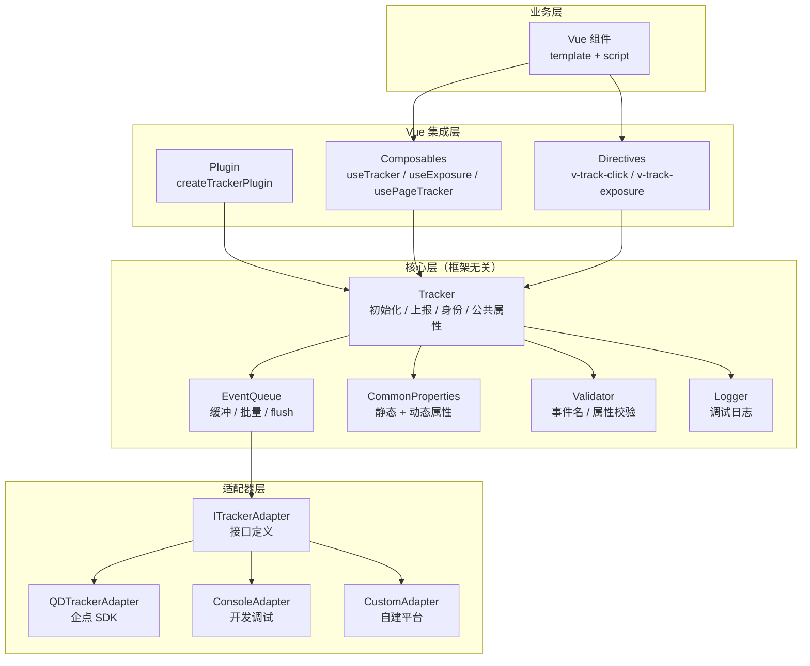
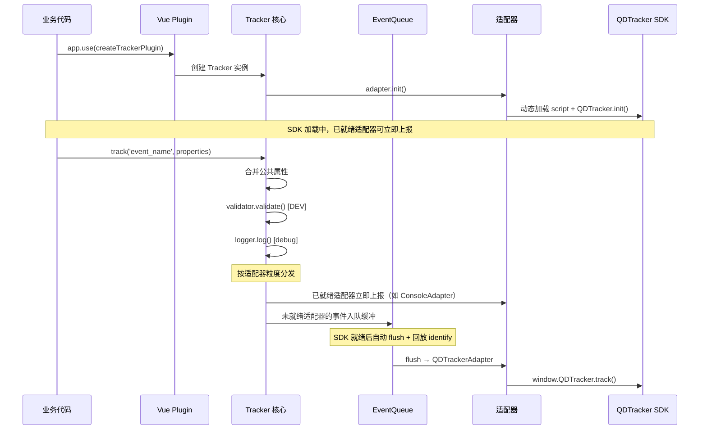

# 埋点数据采集 (@aix/tracker)

> **状态**: Draft
> **作者**: AIX Team
> **位置**: `packages/tracker/`

## 概述

基于适配器模式的前端埋点数据采集组件包，为 Vue 3 应用提供声明式和命令式的行为追踪能力。核心层与分析平台解耦，内置企点营销云 QDTracker SDK 适配器，支持同时上报多个分析平台。

## 动机

### 背景

团队使用腾讯企点营销云 BA（Behavior Analytics）平台进行用户行为分析，前端通过企点 Web SDK（QDTracker.js）进行数据上报。当前存在以下问题：

- **直接调用 SDK 耦合度高**：业务代码中散落大量 `window.QDTracker.track()` 调用，与企点 SDK 强绑定
- **无类型安全**：事件名和属性全靠字符串拼接，拼写错误难以发现
- **重复代码多**：曝光检测、点击埋点、页面埋点在各组件中重复实现
- **调试困难**：开发环境无法直观看到埋点上报内容，定位问题需要抓包
- **缺乏规范约束**：事件编码命名、属性类型不一致，难以统一管控
- **多平台扩展困难**：如需同时上报自建分析平台，需侵入式修改全部埋点代码

### 为什么需要这个方案

封装为组件包后可以实现：

- 适配器模式解耦分析平台，业务代码零改动即可切换或新增上报目标
- TypeScript 类型约束事件名和属性，编译期发现错误
- Vue 指令 + Composables 提供声明式埋点，减少重复代码
- 内置调试和校验机制，开发体验大幅提升

## 目标与非目标

### 目标

| 优先级 | 目标 | 说明 |
|--------|------|------|
| P0 | 核心埋点能力 | 初始化、事件上报、用户身份、公共属性管理 |
| P0 | 企点 SDK 适配器 | 封装 QDTracker.js 全部能力，CDN script 异步加载 |
| P0 | Vue 3 集成 | Plugin 安装、Composables、自定义指令 |
| P0 | TypeScript 类型安全 | 完整的事件/属性类型定义，支持泛型约束 |
| P1 | 多平台适配器 | 支持同时上报多个分析平台 |
| P1 | 曝光埋点 | 基于 IntersectionObserver 的自动曝光检测 |
| P1 | Vue Router 集成 | 路由级自动 pageview/pageclose 上报 |
| P1 | 调试模式 | 开发环境 console 输出上报详情 |
| P2 | 事件校验 | 开发环境校验事件名/属性命名规范 |
| P2 | 事件缓冲 | SDK 未就绪前缓存、批量上报策略 |

### 非目标

- 不替代企点 QDTracker SDK 本身的全埋点能力（$pageview、$WebClick 等预置事件）
- 不提供服务端埋点能力
- 不包含数据分析和可视化功能
- 不处理数据脱敏和合规逻辑（由业务层负责）

## 系统架构

### 架构分层



### 目录结构

```
packages/tracker/
├── src/
│   ├── index.ts                      # 统一导出入口
│   ├── types.ts                      # 所有公共 TypeScript 类型
│   │
│   ├── core/                         # 核心层（框架无关）
│   │   ├── index.ts
│   │   ├── tracker.ts                # Tracker 主类
│   │   ├── queue.ts                  # 事件缓冲队列
│   │   ├── common-properties.ts      # 公共属性管理
│   │   ├── validator.ts              # 事件校验器
│   │   └── logger.ts                 # 调试日志
│   │
│   ├── adapters/                     # 适配器层
│   │   ├── index.ts
│   │   ├── adapter.interface.ts      # 适配器接口定义
│   │   ├── qdtracker.adapter.ts      # 企点 QDTracker SDK 适配器
│   │   └── console.adapter.ts        # Console 调试适配器
│   │
│   ├── composables/                  # Vue Composition API
│   │   ├── index.ts
│   │   ├── use-tracker.ts            # 核心 hook
│   │   ├── use-exposure.ts           # 曝光检测 hook
│   │   └── use-page-tracker.ts       # 页面级埋点 hook
│   │
│   ├── directives/                   # Vue 自定义指令
│   │   ├── index.ts
│   │   ├── v-track-click.ts          # 点击埋点指令
│   │   └── v-track-exposure.ts       # 曝光埋点指令
│   │
│   └── plugin/                       # Vue 插件
│       └── index.ts                  # app.use() 安装入口
│
├── __test__/
│   ├── core/
│   │   ├── tracker.spec.ts
│   │   ├── queue.spec.ts
│   │   └── validator.spec.ts
│   ├── adapters/
│   │   ├── qdtracker.adapter.spec.ts
│   │   └── console.adapter.spec.ts
│   ├── composables/
│   │   ├── use-tracker.spec.ts
│   │   └── use-exposure.spec.ts
│   └── directives/
│       ├── v-track-click.spec.ts
│       └── v-track-exposure.spec.ts
│
├── package.json
├── rollup.config.js
└── tsconfig.json
```

### 数据流



## 详细设计

### 适配器接口

```typescript
/**
 * 分析平台适配器接口
 * 所有适配器必须实现此接口
 */
interface ITrackerAdapter {
  /** 适配器标识名 */
  readonly name: string;

  /** 初始化底层 SDK */
  init(options: TrackerInitOptions): void | Promise<void>;

  /** 上报事件 */
  track(eventName: string, properties: Record<string, unknown>): void;

  /** 设置用户身份 */
  identify(account: AccountInfo): void;

  /** 设置公共属性 */
  setCommonData(data: Record<string, unknown>): void;

  /** 当前是否就绪 */
  isReady(): boolean;

  /** 销毁清理 */
  destroy?(): void;
}
```

### 企点 SDK 适配器

```typescript
/**
 * 企点 QDTracker SDK 适配器
 * 通过 CDN script 标签异步加载 SDK
 */
class QDTrackerAdapter implements ITrackerAdapter {
  readonly name = 'qdtracker';
  private sdk: any = null;
  private ready = false;

  async init(options: TrackerInitOptions): Promise<void> {
    // 1. 动态注入 <script> 加载 QDTracker.js
    await this.loadScript(options.sdkUrl);

    // 2. 如需 AES 加密，额外加载 AES_SEC.js（需在 init 之前加载脚本）
    if (options.qdOptions?.encrypt_mode === 'aes') {
      await this.loadScript(options.qdOptions.aesUrl);
    }

    // 3. 如需点击全埋点，额外加载 autoTrack.js
    if (options.qdOptions?.heatmap) {
      const autoTrack = await this.loadModule(options.qdOptions.autoTrackUrl);
      window.QDTracker.use(autoTrack);
    }

    // 4. 调用 QDTracker.init
    this.sdk = window.QDTracker.init({
      appkey: options.appkey,
      tid: options.tid ?? '',
      options: {
        url: options.url,
        encrypt_mode: options.qdOptions?.encrypt_mode ?? 'close',
        enable_compression: options.qdOptions?.enable_compression ?? false,
        track_interval: options.qdOptions?.track_interval ?? 0,
        batch_max_time: options.qdOptions?.batch_max_time ?? 1,
        preventAutoTrack: options.qdOptions?.preventAutoTrack ?? true,
        pagestay: options.qdOptions?.pagestay ?? false,
        heatmap: options.qdOptions?.heatmap,
      },
    });

    // 5. AES 加密需在 init 之后调用 setAes 注册加密方法
    if (options.qdOptions?.encrypt_mode === 'aes') {
      this.sdk.setAes(window['__qq_qidian_da_market_AES_method']);
    }

    this.ready = true;
  }

  track(eventName: string, properties: Record<string, unknown>): void {
    this.sdk?.track(eventName, properties);
  }

  identify(account: AccountInfo): void {
    this.sdk?.setAccountInfo(account);
  }

  setCommonData(data: Record<string, unknown>): void {
    this.sdk?.setCommonData(data);
  }

  isReady(): boolean {
    return this.ready;
  }

  private loadScript(url: string): Promise<void> {
    return new Promise((resolve, reject) => {
      if (!url) return resolve();
      const script = document.createElement('script');
      script.src = url;
      script.charset = 'UTF-8';
      script.onload = () => resolve();
      script.onerror = () => reject(new Error(`[aix-tracker] 加载脚本失败: ${url}`));
      document.head.appendChild(script);
    });
  }

  private loadModule(url: string): Promise<any> {
    if (!url) return Promise.resolve(undefined);
    return import(/* @vite-ignore */ url);
  }
}
```

### Console 调试适配器

开发/测试环境使用，`init()` 同步完成（`isReady()` 立即返回 `true`），将每次上报通过 `console.groupCollapsed` + `console.table` 输出到控制台，便于开发时直观查看事件名、属性和时间戳。

### Tracker 核心类

```typescript
class Tracker {
  private adapters: ITrackerAdapter[];
  private queue: EventQueue;
  private commonProps: CommonProperties;
  private validator: TrackerValidator | null;
  private logger: TrackerLogger;
  private options: TrackerInitOptions;
  private visibilityHandler: (() => void) | null = null;
  /** 缓存最近一次 identify 调用，适配器就绪后回放 */
  private pendingIdentify: AccountInfo | null = null;

  constructor(options: TrackerInitOptions) {
    this.options = options;
    this.adapters = options.adapters ?? [new QDTrackerAdapter()];
    this.queue = new EventQueue(options.queue);
    this.commonProps = new CommonProperties(options.commonProperties);
    this.validator = options.validation ? new TrackerValidator(options.validation) : null;
    this.logger = new TrackerLogger(options.debug ?? false);
  }

  async init(): Promise<void> {
    // 并行初始化所有适配器
    const results = await Promise.allSettled(
      this.adapters.map(adapter => adapter.init(this.options))
    );

    // 记录初始化失败的适配器
    results.forEach((result, i) => {
      if (result.status === 'rejected') {
        console.error(`[aix-tracker] 适配器 "${this.adapters[i].name}" 初始化失败:`, result.reason);
      }
    });

    // 回放缓冲的 identify 调用
    if (this.pendingIdentify) {
      this.adapters.forEach(a => {
        if (a.isReady()) a.identify(this.pendingIdentify!);
      });
    }

    // 回放缓冲的公共属性
    const resolved = this.commonProps.resolve();
    this.adapters.forEach(a => {
      if (a.isReady()) a.setCommonData(resolved);
    });

    // flush 缓冲队列中的事件（只分发给入队时未就绪的目标适配器）
    this.queue.flush((event, props, targetAdapters) => {
      const targets = this.adapters.filter(a => targetAdapters.includes(a.name));
      this.dispatchToAdapters(event, props, targets);
    });

    // 注册页面关闭时 flush
    if (typeof window !== 'undefined') {
      this.visibilityHandler = () => {
        if (document.visibilityState === 'hidden') {
          this.queue.flush((event, props, targetAdapters) => {
            const targets = this.adapters.filter(a => targetAdapters.includes(a.name));
            this.dispatchToAdapters(event, props, targets);
          });
        }
      };
      window.addEventListener('visibilitychange', this.visibilityHandler);
    }
  }

  /**
   * 上报自定义事件
   * 已就绪的适配器立即分发，未就绪的适配器事件进缓冲队列等待 flush
   */
  track<E extends string = string>(
    eventName: EventName<E>,
    properties?: BaseEventProperties
  ): void {
    // 1. 合并公共属性
    const mergedProps = this.commonProps.merge(properties ?? {});

    // 2. 开发环境校验
    if (this.validator) {
      const valid = this.validator.validate(eventName, mergedProps);
      if (!valid && this.validator.shouldBlock()) return;
    }

    // 3. 调试日志
    this.logger.logTrack(eventName, mergedProps);

    // 4. 按适配器就绪状态分组分发
    const readyAdapters = this.adapters.filter(a => a.isReady());
    const pendingAdapters = this.adapters.filter(a => !a.isReady());

    // 已就绪的适配器立即上报
    if (readyAdapters.length > 0) {
      this.dispatchToAdapters(eventName, mergedProps, readyAdapters);
    }

    // 未就绪的适配器：事件入队，记录目标适配器名称，flush 时只分发给它们
    if (pendingAdapters.length > 0) {
      this.queue.enqueue(eventName, mergedProps, pendingAdapters.map(a => a.name));
    }
  }

  // identify(account) — 已就绪的适配器立即调用，同时缓存到 pendingIdentify，init() 中回放
  // setCommonData(data) — 更新 CommonProperties 内部状态，同步到已就绪的适配器
  // destroy() — flush 剩余队列 → 销毁适配器 → 移除 visibilitychange 监听
}
```

### 事件缓冲队列

```typescript
interface QueueConfig {
  /** 队列最大长度，超出时丢弃最旧事件，默认 50 */
  maxSize?: number;
}

interface QueuedEvent {
  event: string;
  properties: Record<string, unknown>;
  /** 入队时未就绪的适配器名称列表，flush 时只分发给这些适配器 */
  targetAdapters: string[];
}

class EventQueue {
  private buffer: QueuedEvent[] = [];
  private maxSize: number;

  constructor(config?: QueueConfig) {
    this.maxSize = config?.maxSize ?? 50;
  }

  enqueue(event: string, properties: Record<string, unknown>, targetAdapters: string[]): void {
    // 队列已满时，丢弃最旧的事件并警告
    if (this.buffer.length >= this.maxSize) {
      const dropped = this.buffer.shift();
      console.warn(`[aix-tracker] 缓冲队列已满(${this.maxSize})，丢弃最旧事件: ${dropped?.event}`);
    }
    this.buffer.push({ event, properties, targetAdapters });
  }

  flush(callback: (event: string, properties: Record<string, unknown>, targetAdapters: string[]) => void): void {
    const items = this.buffer.splice(0);
    items.forEach(item => callback(item.event, item.properties, item.targetAdapters));
  }

  get size(): number {
    return this.buffer.length;
  }
}
```

### 公共属性管理

`CommonProperties` 内部维护 `Map<string, PropertyValue>`，属性值支持**静态值**或**动态函数**（每次上报时执行）。

核心行为：
- `update(data)` — 注册/更新属性，传 `null` 删除对应属性
- `resolve()` — 解析所有属性（执行动态函数），返回纯值对象
- `merge(eventProps)` — `{ ...resolve(), ...eventProps }`，**事件属性优先级高于公共属性**

### 事件校验器

仅在开发环境启用（`validation: true` 或传入 `ValidatorConfig`），校验规则：

```typescript
interface ValidatorConfig {
  /** 事件名正则，默认 /^(app|mp|web)_[a-z0-9]+(_[a-z0-9]+){1,5}$/ */
  eventNamePattern?: RegExp;
  /** 属性白名单 */
  allowedProperties?: string[];
  /** 校验失败策略：warn 仅警告 / block 阻止上报，默认 warn */
  onViolation?: 'warn' | 'block';
}
```

校验行为：
- 预置事件（`$` 开头如 `$pageview`）跳过校验
- 事件名不匹配正则 → 警告/阻止
- 属性不在白名单中（`global_` 前缀的公共属性除外）→ 警告/阻止

## 核心类型定义

```typescript
// ---------- 基础数据类型 ----------

type TrackerDataType = string | number | boolean | Date;
type EventName<T extends string = string> = T;

/** 通用事件属性 */
interface BaseEventProperties {
  content_title?: string;
  content_name?: string;
  content_pos?: number;
  content_id?: string;
  function_name?: string;
  [key: string]: TrackerDataType | undefined;
}

/** 用户身份 */
interface AccountInfo {
  uin?: string;
  mobile?: string;
  diy_id?: Record<string, string>;
}

// ---------- 公共属性模型 ----------

/**
 * 公共属性按企点 BA 平台数据模型分为 4 类：
 * - TimeProperties: 时间属性 (event_time)
 * - UserProperties: 用户属性 (global_id, global_name, global_gender, ...)
 * - ContextProperties: 上报场景属性 (global_is_login, global_device_type, ...)
 * - PageProperties: 触点访问属性 (global_product_type, global_page_name, ...)
 *
 * 完整定义见 types.ts，此处省略字段列表
 */
type CommonProperties = TimeProperties & UserProperties & ContextProperties & PageProperties;

/** 公共属性值支持静态值或动态函数，传 null 表示删除该属性 */
type CommonPropertyValue<T> = T | (() => T) | null;
type CommonPropertyMap = {
  [K in keyof CommonProperties]?: CommonPropertyValue<NonNullable<CommonProperties[K]>>;
};

// ---------- 初始化配置 ----------

interface TrackerInitOptions {
  appkey: string;                              // 企点 appkey
  tid?: string;                                // 工号
  url?: string;                                // 上报地址
  sdkUrl?: string;                             // SDK 脚本地址（CDN）
  debug?: boolean;                             // 调试模式
  validation?: boolean | ValidatorConfig;      // 事件校验（开发环境）
  adapters?: ITrackerAdapter[];                // 适配器列表（默认 [QDTrackerAdapter]）
  queue?: QueueConfig;                         // 事件缓冲配置
  commonProperties?: CommonPropertyMap;        // 初始公共属性
  qdOptions?: QDTrackerOptions;                // 企点 SDK 特有配置
}

/** 企点 SDK 特有配置（encrypt_mode / heatmap / pagestay 等，完整定义见 types.ts） */
interface QDTrackerOptions { /* ... */ }
```

> 指令绑定值类型（`TrackClickBinding`、`TrackExposureBinding`）和 Vue 插件配置类型（`TrackerPluginOptions`、`AutoPageviewConfig`）见下方 Vue 集成章节。

## Vue 集成

### Plugin 安装

`createTrackerPlugin(options)` 返回 Vue Plugin，`install()` 内部依次：
1. 创建 `Tracker` 实例
2. `app.provide()` 注入到组件树 + 挂载 `$tracker` 全局属性
3. 注册 `v-track-click` / `v-track-exposure` 自定义指令
4. 如传入 `router`，安装 Router 守卫（自动 pageview/pageclose）
5. 异步调用 `tracker.init()` 初始化适配器

**使用方式**：

```typescript
// main.ts
import { createApp } from 'vue';
import { createTrackerPlugin, QDTrackerAdapter, ConsoleAdapter } from '@aix/tracker';
import router from './router';

const app = createApp(App);

app.use(createTrackerPlugin({
  appkey: 'your_appkey',
  url: 'https://report.example.com/event',
  sdkUrl: 'https://cdn.example.com/QDTracker.js',
  debug: import.meta.env.DEV,
  validation: import.meta.env.DEV,
  router,
  autoPageview: true,
  adapters: import.meta.env.DEV
    ? [new ConsoleAdapter()]
    : [new QDTrackerAdapter()],
  commonProperties: {
    global_product_type: 'Web',
    global_product_name: '中山大学移动门户',
    global_app_version: __APP_VERSION__,
  },
}));
```

### Composables

**useTracker** — 通过 `inject()` 获取 Tracker 实例，返回 `{ track, identify, setCommonData }`：

```vue
<script setup lang="ts">
import { useTracker } from '@aix/tracker';

const { track, identify } = useTracker();

// 登录后设置用户身份
function onLogin(user: User) {
  identify({
    uin: user.id,
    mobile: user.phone,
    diy_id: { customId: user.studentId },
  });
}

// 手动上报事件
function onClickApp(item: AppItem, index: number) {
  track('app_zdydmh_home_top_app_ck', {
    content_title: item.name,
    content_pos: index + 1,
    content_id: item.id,
  });
}
</script>
```

**useExposure** — 基于 IntersectionObserver 的曝光检测：

- 返回 `{ elementRef, isExposed, reset }`，业务组件将 `elementRef` 绑定到目标元素
- 元素进入视口且可见时长超过 `minVisibleTime`（默认 300ms）后触发上报
- `once` 模式（默认 `true`）下仅上报一次后自动断开 Observer
- `onBeforeUnmount` 时清理 Observer 和定时器，`watch(elementRef)` 支持动态切换目标元素

**使用方式**：

```vue
<script setup lang="ts">
import { useExposure } from '@aix/tracker';

const { elementRef: bannerRef, isExposed } = useExposure({
  event: 'app_zdydmh_home_top_app_imp',
  properties: () => ({
    content_title: props.item.name,
    content_pos: props.index + 1,
    content_id: props.item.id,
  }),
  threshold: 0.5,
  once: true,
});
</script>

<template>
  <div ref="bannerRef">{{ item.name }}</div>
</template>
```

**usePageTracker** — 组件级页面埋点（注意：与 `autoPageview` Router Guard 互斥，二者只能启用一个，否则会重复上报）：

- `onMounted` 时上报 `$pageview`，`onBeforeUnmount` 时上报 `$pageclose`（携带停留时长 `dr`）
- 接受 `pageName`、`enterProperties`、`leaveProperties` 配置

### 自定义指令

**v-track-click** — `mounted` 时绑定 click 事件，`updated` 时重新绑定以捕获最新 properties，`beforeUnmount` 时清理。支持 `once` 模式。

**使用方式**：

```html
<!-- 基础用法 -->
<button v-track-click="{ event: 'app_zdydmh_home_top_app_ck', properties: { content_title: '应用名' } }">
  点击
</button>

<!-- 动态属性 -->
<div
  v-for="(item, index) in list"
  :key="item.id"
  v-track-click="{
    event: 'app_zdydmh_search_page_ck',
    properties: { content_title: item.title, content_pos: index + 1 }
  }"
>
  {{ item.title }}
</div>

<!-- 仅触发一次 -->
<button v-track-click="{ event: 'web_zdydmh_guide_start_ck', once: true }">
  开始引导
</button>
```

**v-track-exposure**：

```html
<!-- 曝光埋点 -->
<div
  v-for="(item, index) in list"
  :key="item.id"
  v-track-exposure="{
    event: 'app_zdydmh_home_top_app_imp',
    properties: { content_title: item.name, content_pos: index + 1, content_id: item.id },
    threshold: 0.5,
    once: true
  }"
>
  {{ item.name }}
</div>
```

### Vue Router 集成

通过 `router.afterEach` 守卫自动上报页面事件：

1. **排除检查** — 匹配 `exclude` 配置（路由名字符串或路径正则）的路由跳过
2. **页面名称解析** — 优先使用 `getPageName(to)`，fallback 到 `route.meta.title` → `route.name` → `route.path`
3. **上报 `$pageclose`** — 非首次导航时，携带前一页停留时长 `dr`
4. **更新公共属性** — 自动维护 `global_from_page_*` 和 `global_current_page_*`
5. **上报 `$pageview`** — 携带当前页信息，可选包含 `route.query`

## 调试与验证机制

### 调试模式

当 `debug: true` 时，TrackerLogger 在控制台输出每次上报的详细信息：

```
▸ [Track] app_zdydmh_home_top_app_ck           ← 可折叠
  时间: 2024-03-28T10:30:00.000Z
  ┌──────────────────┬─────────────┐
  │ content_title    │ 校园地图     │
  │ content_pos      │ 3           │
  │ content_id       │ map_001     │
  │ global_product   │ Web         │
  └──────────────────┴─────────────┘
```

### 事件校验

开发环境下自动校验：
- 事件名格式：`/^(app|mp|web)_[a-z0-9]+(_[a-z0-9]+){1,5}$/`
- 属性白名单：如配置了 `allowedProperties`，检查是否有未登记属性
- 违规策略：`warn`（默认，仅警告）或 `block`（阻止上报）

### 埋点验证清单

| 验证项 | 方式 |
|--------|------|
| 事件名命名规范 | Validator 正则匹配 |
| 属性是否已登记 | Validator 白名单比对 |
| 公共属性是否完整 | debug 模式打印缺失字段 |
| 上报是否成功 | Network 面板 + debug 日志 |
| 曝光是否重复 | once 模式 + isExposed 状态 |

## 缺点与风险

| 风险 | 说明 | 缓解措施 |
|------|------|---------|
| CDN 加载延迟 | QDTracker.js 通过 script 标签异步加载，存在加载延迟 | EventQueue 缓冲机制，SDK 就绪后自动 flush；已就绪的适配器（如 ConsoleAdapter）不受阻塞，立即上报 |
| 多适配器性能开销 | 每次 track 遍历所有适配器 | 适配器数量通常 ≤ 3，开销可忽略 |
| IntersectionObserver 兼容性 | 部分旧浏览器不支持 | 降级为不上报曝光，不影响核心功能 |
| 企点 SDK 全局污染 | QDTracker 挂载在 window 上 | 适配器层隔离，业务代码不直接访问 window.QDTracker |
| 类型安全有限 | 事件名和属性仍可传入任意字符串 | 提供泛型约束能力，业务层可定义事件枚举收窄类型 |

## 备选方案

### 方案 A：直接封装企点 SDK（不使用适配器模式）

- 优点：实现简单，代码量少
- 缺点：强耦合企点 SDK，无法扩展其他平台
- **放弃原因**：用户明确需要多平台支持

### 方案 B：基于 mitt 事件总线的松耦合方案

- 优点：极度解耦，任何模块都可以发布事件
- 缺点：缺乏类型安全，事件流难以追踪
- **放弃原因**：不利于维护和调试

### 方案 C：将核心层和 Vue 层拆分为两个包

- 优点：核心层可复用于 React 等框架
- 缺点：当前仅有 Vue 技术栈，增加维护成本
- **放弃原因**：过度设计，当前阶段一个包内分层即可

## 先例参考

| 项目 | 参考点 |
|------|--------|
| [GrowingIO SDK](https://www.growingio.com/) | 全埋点 + 代码埋点混合模式、曝光检测 |
| [神策 Web SDK](https://www.sensorsdata.cn/) | 事件 + 属性数据模型、公共属性管理 |
| [@vueuse/core](https://vueuse.org/) | Composables 设计模式、useIntersectionObserver |
| [Analytics.js](https://segment.com/docs/connections/sources/catalog/libraries/website/javascript/) | 适配器 / Destination 模式，多平台分发 |

## 未来可能性

| 方向 | 说明 |
|------|------|
| 更多适配器 | Google Analytics、Mixpanel、自建上报服务适配器 |
| 埋点可视化浮层 | 开发环境高亮已埋点元素，展示事件名和属性 |
| Vue DevTools 面板 | 自定义 Inspector 实时展示埋点状态 |
| 离线缓存 | IndexedDB 缓存离线事件，恢复网络后上报 |
| 性能埋点 | Web Vitals (LCP/FID/CLS) 自动采集 |
| A/B 测试集成 | 公共属性携带实验分组信息 |
| 远程配置 | 从管理平台拉取事件白名单、采样率、动态开关 |
| SSR 兼容 | Nuxt 3 服务端渲染时静默跳过 |

## 实现检查清单

| 优先级 | 检查项 | 说明 |
|--------|--------|------|
| P0 | 核心 Tracker 类 | init / track / identify / setCommonData / destroy |
| P0 | QDTrackerAdapter | CDN 异步加载 + SDK 初始化 + 事件上报 |
| P0 | ConsoleAdapter | 开发调试输出 |
| P0 | EventQueue | 缓冲 / flush / visibilitychange 兜底 |
| P0 | createTrackerPlugin | Vue 插件安装入口 |
| P0 | useTracker | 核心 Composable |
| P0 | TypeScript 类型定义 | 完整的公共类型导出 |
| P1 | v-track-click | 点击埋点指令 |
| P1 | v-track-exposure | 曝光埋点指令 |
| P1 | useExposure | IntersectionObserver 封装 |
| P1 | Vue Router 集成 | 自动 pageview / pageclose |
| P1 | CommonProperties | 静态 + 动态公共属性 |
| P2 | TrackerValidator | 事件名 / 属性校验 |
| P2 | TrackerLogger | debug 日志输出 |
| P2 | 单元测试 | 核心模块 + Composables + 指令 |
