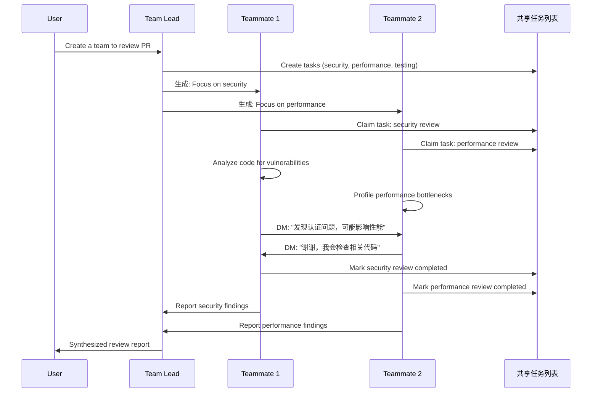

# Agent Team 完整使用指南

> Claude Code 的分布式并行协作功能详解

::: tip 前置知识
本指南假设你已经：
- 熟悉 Claude Code CLI 的基本使用
- 了解命令行操作
- 有一定的软件开发经验

如果你是 Claude Code 新手，建议先阅读 [Claude Code 官方文档](https://code.claude.com/docs/)。
:::

## 1. Agent Team 是什么

### 1.1 核心概念

**Agent Team** 是 Claude Code 的实验性功能，允许多个独立的 Claude Code 实例（代理）并行协作完成复杂任务。

```
传统单一会话:
  You ←→ Claude

Agent Team 架构:
  You ←→ Team Lead (主代理)
         ├─→ Teammate 1 (独立实例)
         ├─→ Teammate 2 (独立实例)
         ├─→ Teammate 3 (独立实例)
         └─→ Teammate N (独立实例)

         + 共享任务列表
         + 队友间直接通信
```

### 1.2 关键特性

| 特性 | 说明 |
|------|------|
| **独立 Context Window** | 每个队友拥有独立的对话历史和上下文 |
| **并行执行** | 多个队友同时工作，不会相互阻塞 |
| **直接通信** | 队友之间可以直接对话，无需通过 Lead |
| **共享任务列表** | 所有队友共享任务列表，可自我分配任务 |
| **自主协调** | 队友可以主动认领任务、报告进度、请求帮助 |

### 1.3 工作流程



---

## 2. Agent Team vs Subagent 对比

### 2.1 架构对比

#### Subagent（传统子代理）

```
主会话（Your Context Window）
  │
  ├─ 你的对话历史
  ├─ Subagent 调用
  │   ├─ Subagent 工作（在主 context 中）
  │   └─ 返回结果（结果被压缩汇总）
  └─ 继续对话

特点：
✓ 结果会返回到主 context window
✓ 结果被压缩以节省 tokens
✓ 轻量、快速
✗ 无法独立讨论
✗ 共享 context 限制
```

#### Agent Team（代理团队）

```
你的会话 ←→ Team Lead (主代理)
              ├─ 协调和监督
              └─ 综合结果

独立实例 1：Teammate A
  ├─ 独立 context window
  ├─ 完整对话历史
  └─ 可与其他队友直接通信

独立实例 2：Teammate B
  ├─ 独立 context window
  ├─ 完整对话历史
  └─ 可与其他队友直接通信

共享资源：
  ├─ 任务列表（Task List）
  ├─ 工作目录（File System）
  └─ 配置（CLAUDE.md, MCP Servers, Skills）

特点：
✓ 真正的并行工作
✓ 独立的上下文空间
✓ 队友可以讨论和挑战假设
✗ 更高的 token 成本
✗ 需要更多协调
```

### 2.2 详细功能对比表

| 维度 | Subagent | Agent Team |
|------|---------|-----------|
| **运行环境** | 在主会话内运行 | 每个队友是独立的 Claude Code 进程 |
| **Context Window** | 共享主会话的 context | 每个队友拥有独立的 context window |
| **对话历史** | 融入主会话历史 | 队友各自维护独立历史 |
| **结果返回** | 结果压缩后返回主会话 | 队友独立工作，最后综合 |
| **通信方式** | 只能向主代理报告 | 队友间可直接发送消息 |
| **协调机制** | 主代理统一管理 | 共享任务列表 + 自主认领 |
| **并行能力** | 伪并行（顺序执行） | 真并行（同时执行） |
| **文件编辑** | 可在同一文件工作 | 需避免同一文件冲突 |
| **Token 成本** | 低（1x context + 压缩） | 高（N x context，N=队友数） |
| **启动速度** | 快速（内部调用） | 较慢（启动新进程） |
| **UI 显示** | 在主会话中显示 | 独立窗口或切换显示 |
| **权限管理** | 继承主会话权限 | 可独立配置权限 |

### 2.3 性能对比

```
任务类型：代码审查（检查 5 个文件）

┌─────────────────┬─────────────┬─────────────┬─────────────┐
│                 │ 单一会话    │ Subagent    │ Agent Team  │
├─────────────────┼─────────────┼─────────────┼─────────────┤
│ 执行方式        │ 顺序检查    │ 顺序检查    │ 并行检查    │
│ 总耗时          │ ~15 分钟    │ ~15 分钟    │ ~5 分钟     │
│ Token 使用      │ ~50K        │ ~55K        │ ~150K       │
│ 上下文污染      │ 高          │ 中          │ 低          │
│ 讨论深度        │ 浅          │ 浅          │ 深          │
│ 结果质量        │ 一般        │ 一般        │ 优秀        │
└─────────────────┴─────────────┴─────────────┴─────────────┘

结论：
- 简单任务（单一文件）：用单一会话
- 中等任务（快速子任务）：用 Subagent
- 复杂任务（需讨论和并行）：用 Agent Team
```

### 2.4 使用场景决策树

```
                    开始任务
                       │
                       ▼
              任务是否需要多角度分析？
              /              \
            是                否
            │                 │
            ▼                 ▼
    子任务是否需要讨论？      任务是否需要分解？
    /              \          /              \
  是                否       是                否
  │                 │        │                 │
  ▼                 ▼        ▼                 ▼
Agent Team      Subagent   Subagent      单一会话
(并行+讨论)    (快速执行)  (分解执行)    (直接处理)

示例：
Agent Team：
- PR 多维度审查（安全+性能+测试）
- Bug 多假设调查（3种理论并行验证）
- 跨层开发（前端+后端+测试并行）

Subagent：
- 快速代码搜索（Explore agent）
- 单一任务外包（生成测试用例）
- 数据收集（读取多个文件汇总）

单一会话：
- 简单问题回答
- 单一文件编辑
- 快速代码生成
```

---

## 3. 配置和启用

### 3.1 启用 Agent Team 功能

Agent Team 是实验性功能，默认禁用，需要手动启用。

#### 方式一：环境变量（临时）

```bash
# 当前终端会话启用
export CLAUDE_CODE_EXPERIMENTAL_AGENT_TEAMS=1

# 验证
echo $CLAUDE_CODE_EXPERIMENTAL_AGENT_TEAMS
# 输出：1

# 启动 Claude Code
claude
```

#### 方式二：Settings 配置（永久推荐）

```bash
# 编辑或创建 settings.json
vim ~/.claude/settings.json
```

```json
{
  "env": {
    "CLAUDE_CODE_EXPERIMENTAL_AGENT_TEAMS": "1"
  },
  "teammateMode": "auto"
}
```

#### 方式三：项目级配置

```bash
# 仅在当前项目启用
vim .claude/settings.json
```

```json
{
  "env": {
    "CLAUDE_CODE_EXPERIMENTAL_AGENT_TEAMS": "1"
  }
}
```

### 3.2 显示模式配置

Agent Team 支持三种显示模式：

```json
{
  "teammateMode": "auto"       // 推荐：自动选择最佳模式
  // "teammateMode": "in-process"  // 同一终端，按键切换
  // "teammateMode": "tmux"        // 分屏显示（需要 tmux）
}
```

#### 模式详解

| 模式 | 说明 | 优点 | 缺点 | 适用场景 |
|------|------|------|------|---------|
| **auto** | 自动选择（优先 tmux） | 智能选择 | 无 | 推荐默认 |
| **in-process** | 所有队友在同一终端 | 兼容性好 | 需要按键切换 | 无 tmux 环境 |
| **tmux** | 每个队友独立窗口 | 可视化好，实时查看 | 需要 tmux | macOS + iTerm2 |

### 3.3 安装 tmux（可选但推荐）

```bash
# macOS
brew install tmux

# Linux (Ubuntu/Debian)
sudo apt-get install tmux

# Linux (CentOS/RHEL)
sudo yum install tmux

# 验证安装
tmux -V
# 输出：tmux 3.x
```

#### tmux 基础配置（可选）

```bash
# 创建 ~/.tmux.conf
cat > ~/.tmux.conf << 'EOF'
# 鼠标支持
set -g mouse on

# 状态栏美化
set -g status-bg colour235
set -g status-fg colour136

# 窗格切换快捷键
bind -n M-Left select-pane -L
bind -n M-Right select-pane -R
bind -n M-Up select-pane -U
bind -n M-Down select-pane -D
EOF

# 重载配置
tmux source-file ~/.tmux.conf
```

### 3.4 权限预配置（推荐）

避免频繁的权限提示：

```json
{
  "env": {
    "CLAUDE_CODE_EXPERIMENTAL_AGENT_TEAMS": "1"
  },
  "teammateMode": "auto",
  "permissions": {
    "allow": [
      "Bash(pnpm:*)",
      "Bash(npm:*)",
      "Bash(git:*)",
      "Read(*)",
      "Grep(*)",
      "Glob(*)",
      "WebSearch"
    ]
  }
}
```

---

## 4. 使用方式

### 4.1 创建 Agent Team

#### 基础语法

```bash
# 启动 Claude Code
claude

# 在会话中输入
创建一个代理团队来<任务描述>。

生成 <N> 个队友：
- <队友1名称>: <职责描述>
- <队友2名称>: <职责描述>
- <队友N名称>: <职责描述>

<协作指示>
```

#### 实例 1：代码审查团队

```bash
创建一个代理团队来审查认证模块。

生成 3 个审查员：
- 安全专家：检查漏洞、令牌处理、会话管理
- 性能分析师：分析算法复杂度、数据库查询、缓存策略
- 代码质量审查员：检查代码风格、命名规范、重复代码、测试覆盖率

让他们独立工作，并向我汇报发现，以便综合分析。
```

#### 实例 2：功能开发团队

```bash
创建一个代理团队来实现用户通知功能。

生成 3 个开发者：
- 后端开发：实现通知 API 接口和数据库架构
- 前端开发：构建通知 UI 组件和状态管理
- QA 工程师：为通知流程编写全面的测试

在不同文件上并行工作。通过共享任务列表协调。
使用计划模式 - 在做出更改前需要批准。
```

### 4.2 与队友交互

#### in-process 模式快捷键

| 快捷键 | 功能 | 说明 |
|--------|------|------|
| `Shift+Up/Down` | 切换队友 | 循环浏览所有队友 |
| `Enter` | 发送消息 | 向当前选中的队友发送消息 |
| `Ctrl+T` | 任务列表 | 显示/隐藏共享任务列表 |
| `Shift+Tab` | 委托模式 | 切换到委托模式（仅协调，不编码） |
| `Escape` | 中断 | 中断当前队友的工作 |
| `Ctrl+C` | 退出 | 退出整个会话 |

#### 与队友对话示例

```bash
# 1. 切换到特定队友
Shift+Down  # 循环到 "安全专家"

# 2. 查看队友当前状态
# （自动显示队友最新消息和工作进度）

# 3. 发送消息给队友
Press Enter, then type:
"先专注于 OAuth2 令牌验证"

# 4. 返回 Lead
Shift+Up  # 切换回 Team Lead

# 5. 让 Lead 协调
"让安全专家与性能分析师分享发现"
```

### 4.3 任务列表管理

#### 查看任务列表

```bash
# 按 Ctrl+T 显示任务列表，格式如下：

┌──────────────────────────────────────────────────────┐
│ Task List: auth-review-team                          │
├────┬─────────────────────────┬──────────┬───────────┤
│ ID │ Task                    │ Status   │ Owner     │
├────┼─────────────────────────┼──────────┼───────────┤
│ 1  │ Security review         │ Progress │ Security  │
│ 2  │ Performance review      │ Progress │ Perf      │
│ 3  │ Test coverage check     │ Pending  │ -         │
│ 4  │ Update documentation    │ Blocked  │ -         │
│    │ (blocked by: 1, 2, 3)   │          │           │
└────┴─────────────────────────┴──────────┴───────────┘
```

#### 管理任务

```bash
# 通过 Lead 管理任务

# 创建新任务
"创建任务：重构 auth.ts 中的错误处理"

# 分配任务
"将任务 #3 分配给 QA 工程师"

# 设置任务依赖
"标记任务 #4 被任务 #1、#2 和 #3 阻塞"

# 查询进度
"每个队友目前在做什么？"

# 更新任务状态
"标记任务 #1 为已完成"
```

### 4.4 委托模式（Delegate Mode）

委托模式下，Lead 仅负责协调，不编写代码。

```bash
# 切换到委托模式
Shift+Tab

# 在委托模式下的操作：
"创建 3 个任务：实现登录 UI、添加验证、编写测试"
"将登录 UI 分配给前端开发"
"让后端开发审查 API 架构"
"让所有队友报告进度"

# 退出委托模式
Shift+Tab
```

### 4.5 关闭团队

```bash
# 方式 1：优雅关闭（推荐）
"让所有队友在完成当前任务后关闭"

# 方式 2：立即关闭
"清理团队"

# 方式 3：关闭特定队友
"让安全专家队友关闭"
```

---

## 5. 实际应用场景

### 5.1 代码审查（Code Review）

#### 场景描述
多维度审查 PR，确保代码质量、安全性、性能和可维护性。

#### 实施步骤

```bash
claude

创建一个代理团队来全面审查 PR #142。

生成 4 个专业审查员：
- 安全审查员：检查认证、授权、输入验证、XSS/SQL 注入风险
- 性能审查员：分析算法复杂度、数据库查询、内存使用、渲染优化
- 无障碍审查员：检查 ARIA 属性、键盘导航、屏幕阅读器支持、颜色对比度
- 测试审查员：验证测试覆盖率、边界情况、集成测试、Story 完整性

每个审查员应该：
1. 专注于自己的专业领域
2. 立即报告关键问题
3. 提出具体改进建议
4. 如果发现跨领域问题，与其他审查员分享

将所有发现综合为优先级报告。
```

#### 输出示例

```markdown
## PR #142 全面审查报告

### 🔴 严重问题（必须修复）
1. [安全] 用户搜索中的 SQL 注入漏洞（第 87 行）
2. [性能] fetchUserData 中的 N+1 查询问题（第 142 行）

### 🟡 重要问题（应该修复）
3. [无障碍] 模态对话框缺少 ARIA 标签
4. [测试] 未覆盖边界情况：空搜索结果

### 🟢 建议（考虑改进）
5. [性能] 考虑缓存用户资料数据
6. [代码质量] 将复杂逻辑提取到单独函数

### 跨领域关注点
- 安全与性能：身份验证检查在循环中执行（性能影响）
- 无障碍与测试：缺少模态框的键盘导航测试

### 预估修复时间：2-3 小时
```

### 5.2 Bug 调查（Bug Investigation）

#### 场景描述
用户报告复杂 bug，原因不明，需要并行验证多个假设。

#### 实施步骤

```bash
claude

用户报告："应用在第一条消息后崩溃，而不是保持连接"

创建一个调查团队来并行测试不同的假设。

生成 5 个调查员：
- 假设 A：网络超时导致连接过早关闭
- 假设 B：消息处理器中的内存泄漏导致崩溃
- 假设 C：事件监听器未清理，导致重复处理程序
- 假设 D：连接状态机中的竞态条件
- 假设 E：大消息导致 WebSocket 缓冲区溢出

每个调查员应该：
1. 独立测试其假设
2. 收集证据（日志、性能分析、复现步骤）
3. 主动用反证据挑战其他假设
4. 更新共享的 findings.md 并标注置信度

目标：在 30 分钟内就根本原因达成共识。
```

#### 工作流

```
T=0:  Lead 创建 5 个假设任务
T=5:  5 个 investigators 同时开始调查
T=10: Investigator C 发现：event listener 未清理的证据
T=12: Investigator D 挑战：不是 race condition，因为...
T=15: Investigator A 支持 C 的发现：网络日志显示连接正常
T=20: Investigator B 排除内存泄漏：内存占用稳定
T=25: 3 位 investigators 达成共识：Hypothesis C 最可能
T=30: Lead 综合报告：根因是 event listener 未清理
```

### 5.3 跨层并行开发（Full-Stack Development）

#### 场景描述
开发完整功能，涉及前端、后端、测试多个层面。

#### 实施步骤

```bash
claude

从头开始实现完整的"用户资料编辑"功能。

创建一个包含 4 个专家的开发团队：
- API 设计师：设计 RESTful 端点、请求/响应架构、错误处理
- 前端开发：构建资料编辑表单、验证、状态管理、API 集成
- 后端开发：实现 API 端点、数据库操作、业务逻辑
- QA 工程师：编写单元测试、集成测试、E2E 测试、边界情况覆盖

在以下约束下并行工作：
- API 设计师必须先完成架构（其他人依赖它）
- 架构完成后，前端和后端可以同时工作
- QA 并行编写测试，初期模拟 API

使用计划模式 - 实施前需要批准。
通过任务列表协调。
```

#### 任务依赖图

```
任务 1：设计 API 架构
   ├─→ 任务 2：实现后端 API
   │     └─→ 任务 5：集成测试
   └─→ 任务 3：实现前端 UI
         └─→ 任务 4：编写单元测试

任务 6：E2E 测试（依赖：2, 3）
任务 7：文档（依赖：1, 2, 3）
```

### 5.4 架构评估（Architecture Review）

#### 场景描述
评估重构方案的可行性，分析风险和收益。

#### 实施步骤

```bash
claude

评估从 Vue 2 迁移到 Vue 3 的方案。

创建一个包含 5 个分析师的评估团队：
- 迁移分析师：识别破坏性变更、迁移步骤、工作量估算
- 风险分析师：评估迁移风险、回滚策略、停机影响
- 性能分析师：对比 Vue 2 vs Vue 3 性能、包体积影响
- 兼容性分析师：检查第三方库兼容性、polyfill 需求
- 成本收益分析师：计算开发成本 vs 长期收益

每个分析师应该：
1. 研究和收集数据
2. 创建详细分析报告
3. 挑战其他分析师的假设
4. 投票表决建议（执行/不执行/推迟）

最终输出：包含建议的全面迁移评估报告。
```

### 5.5 重构任务（Refactoring）

#### 场景描述
并行重构多个独立模块，避免阻塞。

#### 实施步骤

```bash
claude

将遗留认证系统重构为模块化架构。

创建一个包含 4 个开发者的重构团队：
- 模块 A：重构密码认证（auth/password.ts）
- 模块 B：重构 OAuth 提供商（auth/oauth.ts）
- 模块 C：重构会话管理（auth/session.ts）
- 模块 D：重构令牌处理（auth/token.ts）

规则：
- 每个开发者独占一个模块（避免文件冲突）
- 通过任务列表协调共享接口
- 重构前先编写测试（TDD 方法）
- 每 15 分钟报告进度

目标：在 1 小时内并行完成所有 4 个模块。
```

---

## 6. AIX 组件库实战示例

### 6.1 新组件全流程开发

#### 任务：开发 Tooltip 组件

```bash
claude

创建一个代理团队从头开始构建 Tooltip 组件。

生成 4 个专家，遵循 AIX 标准：
- API 设计师：设计 Props/Emits/Slots 类型（types.ts），确保与其他组件的 API 一致性
- 组件开发者：实现 Vue 组件（index.vue）、使用 CSS 变量的 SCSS 样式、BEM 命名
- Story 编写者：编写 Storybook stories（stories/），覆盖所有 props 组合和边界情况
- 测试工程师：编写单元测试（__test__/）、无障碍测试，覆盖率 > 80%

规则：
- 遵循 .claude/agents/component-design.md 指南
- 仅使用 @aix/theme CSS 变量（禁止硬编码颜色）
- 确保 TypeScript 严格模式合规
- 所有类名使用 .aix-tooltip 前缀

协调：
- API 设计师先完成 types.ts（其他人依赖它）
- 类型完成后，开发者和 Story 编写者可以并行工作
- 测试工程师并行编写测试，初期模拟组件

对组件开发者使用计划模式。
```

#### 文件分工

```
packages/tooltip/
├── src/
│   ├── types.ts          ← API Designer
│   ├── index.vue         ← Component Developer
│   └── index.ts          ← Component Developer
├── stories/
│   └── Tooltip.stories.ts  ← Story Writer
└── __test__/
    └── index.test.ts     ← Test Engineer
```

#### 任务列表

```
任务 1：设计 Tooltip Props/Emits/Slots 类型
  状态：进行中
  负责人：API 设计师
  文件：src/types.ts

任务 2：实现 Tooltip 组件
  状态：待处理（被任务 1 阻塞）
  负责人：组件开发者
  文件：src/index.vue, src/index.ts, src/styles.scss

任务 3：编写 Storybook stories
  状态：待处理（被任务 1 阻塞）
  负责人：Story 编写者
  文件：stories/Tooltip.stories.ts

任务 4：编写单元测试和 a11y 测试
  状态：进行中
  负责人：测试工程师
  文件：__test__/index.test.ts

任务 5：运行类型检查和 lint
  状态：待处理（被任务 2 阻塞）
  负责人：组件开发者

任务 6：更新文档
  状态：待处理（被任务 2, 3, 4 阻塞）
  负责人：API 设计师
```

### 6.2 组件深度 PR 审查

#### 任务：审查 PDF Viewer 组件重构

```bash
claude

对照 AIX 标准审查 PDF Viewer 组件重构（PR #456）。

创建一个包含 5 个专家的审查团队：
- 架构审查员：检查模块结构、状态管理、composables 使用
- 类型安全审查员：验证 TypeScript 严格模式、Props/Emits 类型、类型导出
- 性能审查员：分析渲染优化、内存使用、包体积影响
- 无障碍审查员：检查 ARIA 属性、键盘导航、焦点管理、屏幕阅读器
- 测试审查员：验证测试覆盖率（>80%）、边界情况、Storybook stories 完整性

每个审查员应该：
1. 阅读 .claude/agents/<专业>.md 了解标准
2. 对照标准检查 git diff
3. 报告违规情况及严重程度（严重/重要/建议）
4. 提供具体修复建议和代码示例

交叉检查：
- 性能与无障碍经常冲突（讨论权衡）
- 类型安全与性能可能冲突（讨论抽象）

最终输出：带修复建议的优先级问题列表。
```

#### 审查清单

```markdown
## 架构审查
✅ Composables 已提取到 packages/hooks/
✅ 状态管理遵循 Composition API 模式
❌ 严重：PDF 加载逻辑应该在单独的 composable 中

## 类型安全审查
✅ Props/Emits 在 types.ts 中定义
❌ 重要：overlay 数据缺少泛型类型
⚠️  建议：在 index.ts 中添加类型导出

## 性能审查
✅ Canvas 渲染使用 RAF 优化
❌ 严重：ResizeObserver 中的内存泄漏（未清理）
⚠️  建议：考虑为大型 PDF 虚拟化页面列表

## 无障碍审查
✅ 控件上存在 ARIA 标签
❌ 重要：overlay 热点缺少键盘导航
❌ 严重：全屏模式未实现焦点陷阱

## 测试审查
✅ 单元测试覆盖 Props/Emits
❌ 严重：缺少缩放交互测试（根据 MEMORY.md 的 bug）
⚠️  覆盖率：72%（目标：80%）
```

### 6.3 复杂 Bug 调查

#### 任务：修复 PDF Viewer 缩放闪烁

```bash
claude

Investigate the PDF Viewer zoom flicker bug reported by users.

Symptoms:
- Manual zoom (zoomIn/zoomOut) causes canvas to flash back to fit-to-container scale
- Issue occurs only in fitToContainer mode
- Reported in MEMORY.md with partial analysis

Create a debug team with 3 investigators:
- Theory A: ResizeObserver causing cascade (MEMORY.md hypothesis)
  - Investigator should verify: does zoom change canvas size → trigger ResizeObserver → reset scale?
  - Check: debouncedResize logic, isManualZoom flag implementation

- Theory B: Event timing issue
  - Investigator should check: are zoom and resize events racing?
  - Profile: event order, requestAnimationFrame timing

- Theory C: State synchronization problem
  - Investigator should verify: is Vue reactivity causing unexpected re-renders?
  - Check: watch() dependencies, computed() invalidation

每个调查员应该：
1. 阅读 packages/pdf-viewer/src/index.vue
2. 通过代码追踪和控制台日志测试假设
3. 如果假设正确，创建最小复现
4. 用反证据挑战其他理论

目标：在 20 分钟内确认根本原因并提出修复方案。
```

### 6.4 样式系统一致性检查

#### 任务：确保所有组件使用主题变量

```bash
claude

审核 packages/ 中的所有组件以确保 CSS 变量合规。

创建一个包含 4 个检查员的审核团队：
- 检查员 1：检查 packages/button/、packages/icons/
- 检查员 2：检查 packages/pdf-viewer/、packages/video/
- 检查员 3：检查 packages/subtitle/
- 检查员 4：检查 packages/theme/（验证变量定义）

每个检查员应该：
1. 搜索硬编码颜色（hex、rgb、hsl）
2. 搜索硬编码间距（px 值的 margin/padding）
3. 验证所有样式使用 @aix/theme 的 var(--aix-*)
4. 报告违规情况及文件:行号引用

需要标记的违规：
❌ color: #1890ff;          → 应使用：var(--aix-color-primary)
❌ border-radius: 4px;      → 应使用：var(--aix-border-radius)
❌ padding: 12px;           → 应使用：var(--aix-spacing-md)
✅ color: var(--aix-color-primary);  ← 正确

输出：带修复建议的合规报告。
```

### 6.5 测试覆盖率提升

#### 任务：将覆盖率从 72% 提升到 80%+

```bash
claude

将 packages/pdf-viewer/ 的测试覆盖率从 72% 提升到 >80%。

创建一个包含 3 个工程师的测试团队：
- 单元测试工程师：为未测试函数编写缺失的单元测试
- 集成测试工程师：编写组件交互测试（zoom + resize、overlay + click）
- 边界情况工程师：编写边界情况测试（空 PDF、错误数据、边界值）

工作流程：
1. 运行：pnpm test --coverage --filter=@aix/pdf-viewer
2. 分析覆盖率报告（coverage/lcov-report/index.html）
3. 识别未覆盖的行/分支
4. 编写测试填补空白

重点领域（来自 MEMORY.md 的 bug）：
- 手动缩放交互（zoomIn、zoomOut、setScale）
- ResizeObserver 防抖逻辑
- 图片 overlay 事件处理器（mouseenter、mouseleave）
- fitToPage vs fitToWidth 模式切换

目标：在所有类别（行、分支、函数）中达到 >80% 覆盖率。
```

---

## 7. 最佳实践

### 7.1 任务设计原则

#### ✅ 好的任务设计

```bash
# 明确的职责划分
生成 3 个队友：
- 安全专家：专注于 auth.ts 中的认证漏洞
- 性能专家：分析 database.ts 中的查询性能
- 代码质量专家：审查 utils.ts 中的代码风格

# 清晰的文件边界
- 队友 A：仅编辑 src/index.vue
- 队友 B：仅编辑 src/types.ts
- 队友 C：仅编辑 __test__/index.test.ts

# 合理的任务粒度（5-6个任务/队友）
任务 1：设计 Props 类型（15 分钟）
任务 2：实现组件逻辑（30 分钟）
任务 3：编写 SCSS 样式（20 分钟）
任务 4：编写单元测试（25 分钟）
任务 5：编写 Storybook story（15 分钟）
```

#### ❌ 不好的任务设计

```bash
# 职责重叠（会产生冲突）
生成 2 个队友：
- 队友 A：审查认证模块
- 队友 B：审查认证模块
# 问题：两人编辑同一文件会冲突

# 任务边界模糊
生成 3 teammates:
- Teammate A: Fix bugs
- Teammate B: Improve code quality
- Teammate C: Optimize performance
# 问题：职责不清，可能重复工作

# 任务粒度太小（协调开销 > 收益）
任务 1：导入 React（30 秒）
任务 2：定义接口（1 分钟）
任务 3：编写一个函数（2 分钟）
# 问题：启动队友的时间比任务本身还长

# 任务粒度太大（风险高）
任务 1：重构整个代码库（3 小时）
# 问题：队友工作太久，出错时浪费大量 tokens
```

### 7.2 团队规模建议

```
任务复杂度           推荐队友数    原因
─────────────────────────────────────────────
简单任务（单文件）    0          直接在主会话处理
小型任务（2-3 文件）  2-3        快速并行，协调简单
中型任务（模块级）    3-5        平衡并行度和协调成本
大型任务（系统级）    5-7        最大化并行，但需强协调
超大任务（跨系统）    不推荐      协调成本过高，考虑分阶段

建议：
✓ 从 2-3 人小团队开始练习
✓ 熟悉后逐步增加到 5 人
✗ 避免超过 7 人（协调成本 > 并行收益）
```

### 7.3 沟通和协调

#### 定期同步

```bash
# 每 15 分钟让 Lead 检查进度
"每个队友目前在做什么？"

# 输出示例：
安全专家：分析 OAuth2 实现（任务 #1，完成 60%）
性能专家：分析数据库查询（任务 #2，完成 80%）
测试工程师：编写集成测试（任务 #4，完成 30%）
```

#### 鼓励队友间讨论

```bash
# 让队友分享发现
"让安全专家与性能专家分享发现"

# 让队友挑战假设
"让所有调查员用证据挑战彼此的理论"

# 让队友协作
"前端开发和后端开发应在实现前讨论 API 契约"
```

#### 及时重定向

```bash
# 队友方向错误时及时纠正
Shift+Down  # 切换到该队友
"停止 X 工作，转而专注于 Y，因为..."

# 或通过 Lead
"让 API 设计师将 schema 改为使用 RESTful 规范"
```

### 7.4 文件冲突预防

```bash
# 明确文件所有权
"文件所有权：
- src/index.vue: Component Developer (独占)
- src/types.ts: API Designer (独占)
- __test__/index.test.ts: Test Engineer (独占)
- stories/: Story Writer (独占)"

# 协调接口变更
"API 设计师在修改 types.ts 前应通知其他队友"

# 使用 Git 分支隔离（高级）
"每个队友在独立分支上工作：
- Component Developer: feature/tooltip-impl
- Test Engineer: feature/tooltip-tests
- Story Writer: feature/tooltip-stories
全部完成后合并到 main"
```

### 7.5 成本优化

#### 选择合适的模型

```bash
# 简单任务用 Haiku（快且便宜）
生成 3 teammates using Haiku model:
- File Reader: Extract data from config files
- Log Parser: Parse error logs for patterns
- Code Formatter: Format code according to style guide

# 复杂任务用 Sonnet（平衡）
生成 3 个队友使用 Sonnet 模型：
- 架构师：设计系统架构
- 代码审查员：审查代码质量
- Bug 调查员：根本原因分析

# 关键任务用 Opus（最强）
生成 1 teammate using Opus model:
- Security Auditor: Comprehensive security audit
```

#### 监控和限制

```bash
# 实时监控成本
/cost

# 限制队友轮数（防止失控）
"每个队友最多用 10 轮完成任务"

# 及时关闭闲置队友
"关闭已完成任务的队友"
```

### 7.6 计划模式（高风险任务）

```bash
# 对可能破坏性的任务要求计划审批
Create a refactoring team with plan mode enabled.

生成 2 developers:
- Backend Refactor: Refactor authentication module (require plan approval)
- Database Migration: Migrate user table schema (require plan approval)

每个开发者必须：
1. 分析当前代码
2. 设计重构计划
3. 提交计划以供批准
4. 等待批准后再实施

这确保没有破坏性更改在未审查的情况下发生。
```

---

## 8. 成本和性能

### 8.1 Token 使用分析

```
假设任务：审查 5 个文件的 PR

┌──────────────────────┬─────────┬─────────┬──────────┐
│                      │ 单会话  │ Subagent│ Team (3) │
├──────────────────────┼─────────┼─────────┼──────────┤
│ 文件读取             │ 5 次    │ 5 次    │ 5 次     │
│ 分析深度             │ 浅      │ 浅      │ 深       │
│ Context Window       │ 1x      │ 1x      │ 3x       │
│ 结果压缩             │ 无      │ 有      │ 无       │
├──────────────────────┼─────────┼─────────┼──────────┤
│ Input Tokens         │ 20K     │ 22K     │ 45K      │
│ Output Tokens        │ 3K      │ 3.5K    │ 12K      │
│ Total Tokens         │ 23K     │ 25.5K   │ 57K      │
├──────────────────────┼─────────┼─────────┼──────────┤
│ Cost (Sonnet 估算)   │ $0.69   │ $0.77   │ $1.71    │
│ 耗时                 │ 8 min   │ 8 min   │ 4 min    │
│ 结果质量             │ ⭐⭐     │ ⭐⭐     │ ⭐⭐⭐⭐  │
└──────────────────────┴─────────┴─────────┴──────────┘

结论：
- Token 成本：Team > Subagent > 单会话
- 时间效率：Team > (Subagent ≈ 单会话)
- 结果质量：Team >> Subagent ≈ 单会话

ROI 分析：
- 简单任务：成本增加 2.5x，不值得
- 复杂任务：成本增加 2.5x，但节省 50% 时间 + 质量提升，值得
```

### 8.2 定价参考（2024 年）

```
Claude 3.5 Sonnet:
- Input:  $3 / 1M tokens
- Output: $15 / 1M tokens

Agent Team 成本估算：
- 小团队（2-3 人）：  2-3x 单会话成本
- 中型团队（4-5 人）： 4-5x 单会话成本
- 大型团队（6-7 人）： 6-7x 单会话成本

典型任务成本：
- 代码审查（3 人团队，30 min）： $1-2
- Bug 调查（5 人团队，20 min）：  $2-3
- 功能开发（4 人团队，1 hour）：  $4-6

建议：
- 开发环境：使用 Agent Team 提高效率
- 生产环境：评估 ROI 后决定
- 学习阶段：从小任务开始，控制成本
```

### 8.3 性能优化建议

#### 减少 Token 消耗

```bash
# 1. 使用更小的模型处理简单任务
生成 teammates using Haiku for data extraction tasks

# 2. 限制上下文大小
"只读取 PR 中更改的文件，而不是整个代码库"

# 3. 分阶段执行
"阶段 1：3 个队友分析问题（20 分钟）
 阶段 2：如果达成共识，1 个队友实施修复
 阶段 1 后关闭未使用的队友"

# 4. 重用结果
"安全专家：与其他队友分享你的 findings.md，而不是重复分析"
```

#### 提高并行效率

```bash
# 1. 独立任务最大化并行
任务 1, 2, 3：无依赖 → 3 个队友同时工作
任务 4：依赖于 1, 2, 3 → 全部完成后开始

# 2. 避免阻塞
"API 设计师：尽早发布草稿架构，以便前端/后端可以开始规划"

# 3. 流水线设计
Teammate A: Design (0-15min) → Implement (15-30min)
Teammate B:           Wait (0-15min) → Test (15-30min) → Document (30-45min)
# Teammate B 等待 A 的设计，但随后并行工作
```

#### 监控和调试

```bash
# 查看实时成本
/cost

# 输出示例：
Session cost: $2.34
├─ Team Lead: $0.45
├─ Teammate 1 (Security): $0.67
├─ Teammate 2 (Performance): $0.58
└─ Teammate 3 (Testing): $0.64

# 识别高成本队友
"Teammate 1 比其他人消耗更多 token - 检查是否陷入循环"
```

---

## 9. 常见问题

### 9.1 启用和配置问题

#### Q1: 启用后没有看到队友

```bash
# 检查清单：
1. 确认环境变量
   echo $CLAUDE_CODE_EXPERIMENTAL_AGENT_TEAMS
   # 应输出：1

2. 确认任务复杂度
   # Claude 会判断任务是否需要团队
   # 简单任务不会自动创建团队

3. 明确请求团队
   # 而不是：审查这段代码
   # 应该是：创建一个代理团队来审查这段代码

4. 检查显示模式
   # In-process 模式：按 Shift+Down 切换
   # Tmux 模式：查看是否有新窗格
```

#### Q2: tmux 模式不工作

```bash
# 检查 tmux 安装
which tmux
tmux -V

# 如果未安装
brew install tmux  # macOS
sudo apt-get install tmux  # Linux

# 确认 settings.json 配置
cat ~/.claude/settings.json | grep teammateMode

# 尝试强制 tmux 模式
{
  "teammateMode": "tmux"
}
```

#### Q3: 权限提示过多

```bash
# 在 settings.json 中预批准工具
{
  "permissions": {
    "allow": [
      "Bash(git:*)",
      "Bash(pnpm:*)",
      "Read(*)",
      "Grep(*)",
      "Glob(*)",
      "Edit(*)",
      "Write(*)"
    ]
  }
}

# 或启动时使用标志
claude --permission-mode acceptEdits
```

### 9.2 协作问题

#### Q4: 队友编辑了同一个文件导致冲突

```bash
# 预防措施：明确文件所有权
"文件所有权：
- Teammate A: 仅 packages/button/src/index.vue
- Teammate B: 仅 packages/button/src/types.ts
- Teammate C: 仅 packages/button/__test__/index.test.ts"

# 发生冲突后：
1. Shift+Down 切换到冲突的队友
2. "停止编辑 index.vue - Teammate A 拥有该文件"
3. "专注于你分配的文件"

# 使用 Git 分支隔离（高级）
"每个队友在独立的 git 分支上工作"
```

#### Q5: 队友进度不同步

```bash
# 定期同步
"大家都在做什么？报告进度百分比。"

# 输出示例：
Teammate A: Task #1 - 90% done, almost finished
Teammate B: Task #2 - 30% done, blocked by API question
Teammate C: Task #3 - 70% done, on track

# 处理阻塞
"Teammate A, please help Teammate B with the API question since you're almost done"
```

#### Q6: 队友在错误的方向上工作

```bash
# 立即重定向
Shift+Down  # 切换到该队友
"停止。你在实现 OAuth1，但我们需要 OAuth2。请用 OAuth2 重新开始。"

# 或通过 Lead
"让后端开发使用 JWT token 而不是 session cookies"

# 预防措施：在开始前确认理解
"开始前确认：你明白我们使用的是 OAuth2 而不是 OAuth1，对吗？"
```

### 9.3 性能和成本问题

#### Q7: Token 消耗太快

```bash
# 检查成本
/cost

# 识别高消耗队友
"哪个队友消耗的 token 最多？"

# 优化措施：
1. 关闭闲置队友
   "关闭已完成任务的队友"

2. 限制轮数
   "每个队友最多用 10 轮完成"

3. 使用更小模型
   "对简单的数据提取任务使用 Haiku 模型"

4. 分阶段执行
   "阶段 1：仅分析（3 个队友）
    阶段 2：实现（1 个队友，其他关闭）"
```

#### Q8: 队友工作太慢

```bash
# 检查是否卡住
Shift+Down  # 切换到该队友查看状态

# 可能原因：
1. 任务太复杂
   "将任务分解成更小的步骤"

2. 等待其他队友
   "别等待 - 用模拟依赖开始"

3. 陷入错误循环
   "停止修复 - 报告错误并继续"

# 设置时间限制
"你有 15 分钟完成任务。如果被阻塞，报告我们会重新分配。"
```

#### Q9: 如何优雅关闭团队

```bash
# 方式 1：逐个关闭（推荐）
"让安全专家在汇报发现后关闭"
# 队友会保存进度并发送最终报告

# 方式 2：全部关闭
"让所有队友优雅关闭"

# 方式 3：强制清理（不推荐）
"清理团队"
# 可能丢失未保存的工作

# 检查残留进程
ps aux | grep claude-code

# 清理 tmux 会话
tmux ls
tmux kill-session -t <session-name>
```

### 9.4 调试问题

#### Q10: 队友没有响应

```bash
# 检查队友状态
Shift+Down  # 切换到该队友
# 查看最后的消息和状态

# 可能原因：
1. 正在思考（等待）
   # 给予更多时间

2. 等待权限批准
   # 检查是否有权限提示

3. 进程崩溃
   # 查看错误日志
   cat ~/.claude/logs/latest.log

# 重启队友
"重启性能分析师队友"
```

#### Q11: 任务列表显示错误

```bash
# 刷新任务列表
Ctrl+T  # 隐藏
Ctrl+T  # 再次显示

# 手动检查任务文件
ls ~/.claude/tasks/<team-name>/

# 清理损坏的任务
"清理任务列表并重新创建任务"
```

#### Q12: In-process 模式切换不工作

```bash
# 确认快捷键
Shift+Up    # 向上循环
Shift+Down  # 向下循环

# 如果不响应：
1. 检查终端是否支持 Shift+方向键
   # 某些终端可能拦截这些快捷键

2. 尝试 tmux 模式
   {
     "teammateMode": "tmux"
   }

3. 查看队友列表
   "列出所有活跃的队友"
```

---

## 10. 快速参考

### 10.1 配置速查

```json
// ~/.claude/settings.json 推荐配置
{
  "env": {
    "CLAUDE_CODE_EXPERIMENTAL_AGENT_TEAMS": "1"
  },
  "teammateMode": "auto",
  "permissions": {
    "allow": [
      "Bash(git:*)",
      "Bash(pnpm:*)",
      "Bash(npm:*)",
      "Read(*)",
      "Grep(*)",
      "Glob(*)",
      "Edit(*)",
      "Write(*)",
      "WebSearch"
    ]
  }
}
```

### 10.2 命令速查表

| 操作 | 命令/快捷键 |
|------|------------|
| **创建团队** | `创建一个代理团队来 <任务>` |
| **切换队友** | `Shift+Up/Down` (in-process 模式) |
| **发送消息** | `Enter` 后输入 (in-process 模式) |
| **任务列表** | `Ctrl+T` |
| **委托模式** | `Shift+Tab` |
| **查看成本** | `/cost` |
| **检查进度** | `每个队友在做什么？` |
| **分配任务** | `将任务 #N 分配给 <队友>` |
| **创建任务** | `创建任务：<描述>` |
| **关闭队友** | `让 <队友> 关闭` |
| **清理团队** | `清理团队` |

### 10.3 创建团队模板

```bash
# 代码审查模板
创建一个代理团队来审查 <PR/文件/模块>。

生成 N 个审查员：
- <专业1>: <关注领域>
- <专业2>: <关注领域>
- <专业N>: <关注领域>

每个审查员应该：
1. 专注于自己的专业领域
2. 立即报告关键问题
3. 提出具体改进建议

将发现综合为优先级报告。
```

```bash
# 功能开发模板
创建一个开发团队来实现 <功能>。

生成 N 个开发者：
- <角色1>: <职责> (<文件>)
- <角色2>: <职责> (<文件>)
- <角色N>: <职责> (<文件>)

规则：
- 每个开发者拥有特定文件（避免冲突）
- 通过任务列表协调
- 对<关键角色>使用计划模式

并行工作，遵循这些依赖：
- <任务 A> 必须在 <任务 B> 之前完成
```

```bash
# Bug 调查模板
调查 <bug 描述>。

创建一个调试团队，包含 N 个调查员：
- 假设 A: <理论1>
- 假设 B: <理论2>
- 假设 N: <理论N>

每个调查员应该：
1. 独立测试其假设
2. 收集证据
3. 挑战其他假设
4. 更新 findings.md

目标：在 <时间> 内就根本原因达成共识。
```

### 10.4 决策流程图

```
                    开始任务
                       │
                       ▼
              是否需要多人协作？
              /              \
            是                否
            │                 │
            ▼                 ▼
    是否需要深度讨论？        任务是否可分解？
    /              \          /              \
  是                否       是                否
  │                 │        │                 │
  ▼                 ▼        ▼                 ▼
Agent Team      Subagent   Subagent      单一会话
(并行+讨论)    (快速并行)  (分解执行)    (直接处理)

成本考虑：
Agent Team: 高 (3-7x)
Subagent: 中 (1.2x)
单一会话: 低 (1x)

时间效率：
Agent Team: 高 (真并行)
Subagent: 中 (伪并行)
单一会话: 低 (顺序)
```

### 10.5 常用任务清单

```markdown
## 代码审查任务
- [ ] 创建审查团队（安全+性能+测试+无障碍）
- [ ] 读取 PR diff
- [ ] 并行审查不同维度
- [ ] 队友间讨论冲突点
- [ ] 综合生成优先级报告

## 功能开发任务
- [ ] 创建开发团队（API+前端+后端+QA）
- [ ] API Designer 先完成 schema
- [ ] 前端/后端并行开发
- [ ] QA 并行编写测试
- [ ] 集成和验证

## Bug 调查任务
- [ ] 创建调查团队（多假设）
- [ ] 并行验证不同理论
- [ ] 队友间挑战假设
- [ ] 收集证据达成共识
- [ ] 实施修复

## 重构任务
- [ ] 创建重构团队（按模块划分）
- [ ] 明确文件所有权
- [ ] 定义共享接口
- [ ] 并行重构不同模块
- [ ] 集成测试验证
```

---

## 附录

### A. Agent Team vs Subagent 完整对比表

| 维度 | Agent Team | Subagent | 推荐场景 |
|------|-----------|----------|---------|
| **架构** | 独立进程 | 内部调用 | Team: 复杂任务 / Sub: 简单任务 |
| **Context** | 独立 window | 共享 window | Team: 需独立讨论 / Sub: 快速汇总 |
| **通信** | 直接互联 | 仅向主代理 | Team: 需协作 / Sub: 单向报告 |
| **并行** | 真并行 | 伪并行 | Team: 时间敏感 / Sub: 顺序可接受 |
| **成本** | 3-7x | 1.2x | Team: 质量优先 / Sub: 成本优先 |
| **启动** | 较慢 (5-10s) | 快速 (<1s) | Team: 长时任务 / Sub: 短时任务 |
| **UI** | 独立显示 | 主会话内 | Team: 需可视化 / Sub: 结果导向 |
| **文件** | 需避免冲突 | 可同文件 | Team: 大范围 / Sub: 局部修改 |
| **调试** | 独立日志 | 统一日志 | Team: 复杂调试 / Sub: 简单跟踪 |

### B. 实验性功能注意事项

Agent Team 是**实验性功能**，可能存在以下限制：

```
已知问题：
- 偶尔队友进程可能无响应（需重启）
- Tmux 模式在某些终端可能不兼容
- 任务列表文件锁偶尔冲突
- 高并发时可能触发 API 速率限制

稳定性建议：
- 从小团队（2-3 人）开始
- 定期保存重要更改
- 监控队友状态
- 及时关闭闲置队友
- 复杂任务分阶段执行
```

### C. 相关资源

```
官方文档：
- https://code.claude.com/docs/en/agent-teams.md
- https://code.claude.com/docs/zh-CN/agent-teams

社区讨论：
- https://github.com/anthropics/claude-code/discussions

技术支持：
- 提交 Issue: https://github.com/anthropics/claude-code/issues
- 反馈问题: /help 命令

本项目相关：
- CLAUDE.md: 项目整体指南
- .claude/agents/: 专业 Agent 文档
- .claude/skills/: 自动化 Skills
- MEMORY.md: 调试经验记录
```

---

**最后更新**: 2024-02-14
**版本**: 1.0.0
**维护者**: AIX 组件库团队

---

## 贡献指南

如果在使用 Agent Team 过程中发现新的最佳实践或常见问题，请更新本文档：

```bash
# 1. 编辑文档
vim docs/tech-sharing/agent-team.md

# 2. 提交更改
git add docs/tech-sharing/agent-team.md
git commit -m "docs: 更新 Agent Team 指南 - <新内容>"

# 3. 推送到仓库
git push origin master
```

欢迎分享你的实战经验！ 🚀
