# Agent Team 完整使用指南

> Claude Code 的分布式并行协作功能详解

::: tip 前置知识
本指南假设你已经：
- 熟悉 Claude Code CLI 的基本使用
- 了解命令行操作
- 有一定的软件开发经验

如果你是 Claude Code 新手，建议先阅读 [Claude Code 官方文档](https://code.claude.com/docs/)。
:::

## 1. Agent Team 是什么

### 1.1 核心概念

**Agent Team** 是 Claude Code 的实验性功能，允许多个独立的 Claude Code 实例（代理）并行协作完成复杂任务。

```
传统单一会话:
  You ←→ Claude

Agent Team 架构:
  You ←→ Team Lead (主代理)
         ├─→ Teammate 1 (独立实例)
         ├─→ Teammate 2 (独立实例)
         ├─→ Teammate 3 (独立实例)
         └─→ Teammate N (独立实例)

         + 共享任务列表
         + 队友间直接通信
```

### 1.2 关键特性

| 特性 | 说明 |
|------|------|
| **独立 Context Window** | 每个队友拥有独立的对话历史和上下文 |
| **并行执行** | 多个队友同时工作，不会相互阻塞 |
| **直接通信** | 队友之间可以直接对话，无需通过 Lead |
| **共享任务列表** | 所有队友共享任务列表，可自我分配任务 |
| **自主协调** | 队友可以主动认领任务、报告进度、请求帮助 |

### 1.3 工作流程

```mermaid
sequenceDiagram
    participant User
    participant Lead as Team Lead
    participant T1 as Teammate 1
    participant T2 as Teammate 2
    participant TaskList as 共享任务列表

    User->>Lead: Create a team to review PR #123
    Lead->>TaskList: Create tasks (security, performance, testing)
    Lead->>T1: 生成: Focus on security
    Lead->>T2: 生成: Focus on performance

    T1->>TaskList: Claim task: security review
    T2->>TaskList: Claim task: performance review

    T1->>T1: Analyze code for vulnerabilities
    T2->>T2: Profile performance bottlenecks

    T1->>T2: DM: "Found auth issue, may impact perf"
    T2->>T1: DM: "Thanks, I'll check related code"

    T1->>TaskList: Mark security review completed
    T2->>TaskList: Mark performance review completed

    T1->>Lead: Report security findings
    T2->>Lead: Report performance findings

    Lead->>User: Synthesized review report
```



---

## 2. Agent Team vs Subagent 对比

### 2.1 架构对比

#### Subagent（传统子代理）

```
主会话（Your Context Window）
  │
  ├─ 你的对话历史
  ├─ Subagent 调用
  │   ├─ Subagent 工作（在主 context 中）
  │   └─ 返回结果（结果被压缩汇总）
  └─ 继续对话

特点：
✓ 结果会返回到主 context window
✓ 结果被压缩以节省 tokens
✓ 轻量、快速
✗ 无法独立讨论
✗ 共享 context 限制
```

#### Agent Team（代理团队）

```
你的会话 ←→ Team Lead (主代理)
              ├─ 协调和监督
              └─ 综合结果

独立实例 1：Teammate A
  ├─ 独立 context window
  ├─ 完整对话历史
  └─ 可与其他队友直接通信

独立实例 2：Teammate B
  ├─ 独立 context window
  ├─ 完整对话历史
  └─ 可与其他队友直接通信

共享资源：
  ├─ 任务列表（Task List）
  ├─ 工作目录（File System）
  └─ 配置（CLAUDE.md, MCP Servers, Skills）

特点：
✓ 真正的并行工作
✓ 独立的上下文空间
✓ 队友可以讨论和挑战假设
✗ 更高的 token 成本
✗ 需要更多协调
```

### 2.2 详细功能对比表

| 维度 | Subagent | Agent Team |
|------|---------|-----------|
| **运行环境** | 在主会话内运行 | 每个队友是独立的 Claude Code 进程 |
| **Context Window** | 共享主会话的 context | 每个队友拥有独立的 context window |
| **对话历史** | 融入主会话历史 | 队友各自维护独立历史 |
| **结果返回** | 结果压缩后返回主会话 | 队友独立工作，最后综合 |
| **通信方式** | 只能向主代理报告 | 队友间可直接发送消息 |
| **协调机制** | 主代理统一管理 | 共享任务列表 + 自主认领 |
| **并行能力** | 伪并行（顺序执行） | 真并行（同时执行） |
| **文件编辑** | 可在同一文件工作 | 需避免同一文件冲突 |
| **Token 成本** | 低（1x context + 压缩） | 高（N x context，N=队友数） |
| **启动速度** | 快速（内部调用） | 较慢（启动新进程） |
| **UI 显示** | 在主会话中显示 | 独立窗口或切换显示 |
| **权限管理** | 继承主会话权限 | 可独立配置权限 |

### 2.3 性能对比

```
任务类型：代码审查（检查 5 个文件）

┌─────────────────┬─────────────┬─────────────┬─────────────┐
│                 │ 单一会话    │ Subagent    │ Agent Team  │
├─────────────────┼─────────────┼─────────────┼─────────────┤
│ 执行方式        │ 顺序检查    │ 顺序检查    │ 并行检查    │
│ 总耗时          │ ~15 分钟    │ ~15 分钟    │ ~5 分钟     │
│ Token 使用      │ ~50K        │ ~55K        │ ~150K       │
│ 上下文污染      │ 高          │ 中          │ 低          │
│ 讨论深度        │ 浅          │ 浅          │ 深          │
│ 结果质量        │ 一般        │ 一般        │ 优秀        │
└─────────────────┴─────────────┴─────────────┴─────────────┘

结论：
- 简单任务（单一文件）：用单一会话
- 中等任务（快速子任务）：用 Subagent
- 复杂任务（需讨论和并行）：用 Agent Team
```

### 2.4 使用场景决策树

```
                    开始任务
                       │
                       ▼
              任务是否需要多角度分析？
              /              \
            是                否
            │                 │
            ▼                 ▼
    子任务是否需要讨论？      任务是否需要分解？
    /              \          /              \
  是                否       是                否
  │                 │        │                 │
  ▼                 ▼        ▼                 ▼
Agent Team      Subagent   Subagent      单一会话
(并行+讨论)    (快速执行)  (分解执行)    (直接处理)

示例：
Agent Team：
- PR 多维度审查（安全+性能+测试）
- Bug 多假设调查（3种理论并行验证）
- 跨层开发（前端+后端+测试并行）

Subagent：
- 快速代码搜索（Explore agent）
- 单一任务外包（生成测试用例）
- 数据收集（读取多个文件汇总）

单一会话：
- 简单问题回答
- 单一文件编辑
- 快速代码生成
```

---

## 3. 配置和启用

### 3.1 启用 Agent Team 功能

Agent Team 是实验性功能，默认禁用，需要手动启用。

#### 方式一：环境变量（临时）

```bash
# 当前终端会话启用
export CLAUDE_CODE_EXPERIMENTAL_AGENT_TEAMS=1

# 验证
echo $CLAUDE_CODE_EXPERIMENTAL_AGENT_TEAMS
# 输出：1

# 启动 Claude Code
claude
```

#### 方式二：Settings 配置（永久推荐）

```bash
# 编辑或创建 settings.json
vim ~/.claude/settings.json
```

```json
{
  "env": {
    "CLAUDE_CODE_EXPERIMENTAL_AGENT_TEAMS": "1"
  },
  "teammateMode": "auto"
}
```

#### 方式三：项目级配置

```bash
# 仅在当前项目启用
vim .claude/settings.json
```

```json
{
  "env": {
    "CLAUDE_CODE_EXPERIMENTAL_AGENT_TEAMS": "1"
  }
}
```

### 3.2 显示模式配置

Agent Team 支持三种显示模式：

```json
{
  "teammateMode": "auto"       // 推荐：自动选择最佳模式
  // "teammateMode": "in-process"  // 同一终端，按键切换
  // "teammateMode": "tmux"        // 分屏显示（需要 tmux）
}
```

#### 模式详解

| 模式 | 说明 | 优点 | 缺点 | 适用场景 |
|------|------|------|------|---------|
| **auto** | 自动选择（优先 tmux） | 智能选择 | 无 | 推荐默认 |
| **in-process** | 所有队友在同一终端 | 兼容性好 | 需要按键切换 | 无 tmux 环境 |
| **tmux** | 每个队友独立窗口 | 可视化好，实时查看 | 需要 tmux | macOS + iTerm2 |

### 3.3 安装 tmux（可选但推荐）

```bash
# macOS
brew install tmux

# Linux (Ubuntu/Debian)
sudo apt-get install tmux

# Linux (CentOS/RHEL)
sudo yum install tmux

# 验证安装
tmux -V
# 输出：tmux 3.x
```

#### tmux 基础配置（可选）

```bash
# 创建 ~/.tmux.conf
cat > ~/.tmux.conf << 'EOF'
# 鼠标支持
set -g mouse on

# 状态栏美化
set -g status-bg colour235
set -g status-fg colour136

# 窗格切换快捷键
bind -n M-Left select-pane -L
bind -n M-Right select-pane -R
bind -n M-Up select-pane -U
bind -n M-Down select-pane -D
EOF

# 重载配置
tmux source-file ~/.tmux.conf
```

### 3.4 权限预配置（推荐）

避免频繁的权限提示：

```json
{
  "env": {
    "CLAUDE_CODE_EXPERIMENTAL_AGENT_TEAMS": "1"
  },
  "teammateMode": "auto",
  "permissions": {
    "allow": [
      "Bash(pnpm:*)",
      "Bash(npm:*)",
      "Bash(git:*)",
      "Read(*)",
      "Grep(*)",
      "Glob(*)",
      "WebSearch"
    ]
  }
}
```

---

## 4. 使用方式

### 4.1 创建 Agent Team

#### 基础语法

```bash
# 启动 Claude Code
claude

# 在会话中输入
创建一个代理团队来<任务描述>。

生成 <N> 个队友：
- <队友1名称>: <职责描述>
- <队友2名称>: <职责描述>
- <队友N名称>: <职责描述>

<协作指示>
```

#### 实例 1：代码审查团队

```bash
创建一个代理团队来审查认证模块。

生成 3 个审查员：
- 安全专家：检查漏洞、令牌处理、会话管理
- 性能分析师：分析算法复杂度、数据库查询、缓存策略
- 代码质量审查员：检查代码风格、命名规范、重复代码、测试覆盖率

让他们独立工作，并向我汇报发现，以便综合分析。
```

#### 实例 2：功能开发团队

```bash
创建一个代理团队来实现用户通知功能。

生成 3 个开发者：
- 后端开发：实现通知 API 接口和数据库架构
- 前端开发：构建通知 UI 组件和状态管理
- QA 工程师：为通知流程编写全面的测试

在不同文件上并行工作。通过共享任务列表协调。
使用计划模式 - 在做出更改前需要批准。
```

### 4.2 与队友交互

#### in-process 模式快捷键

| 快捷键 | 功能 | 说明 |
|--------|------|------|
| `Shift+Up/Down` | 切换队友 | 循环浏览所有队友 |
| `Enter` | 发送消息 | 向当前选中的队友发送消息 |
| `Ctrl+T` | 任务列表 | 显示/隐藏共享任务列表 |
| `Shift+Tab` | 委托模式 | 切换到委托模式（仅协调，不编码） |
| `Escape` | 中断 | 中断当前队友的工作 |
| `Ctrl+C` | 退出 | 退出整个会话 |

#### 与队友对话示例

```bash
# 1. 切换到特定队友
Shift+Down  # 循环到 "Security Expert"

# 2. 查看队友当前状态
# （自动显示队友最新消息和工作进度）

# 3. 发送消息给队友
Press Enter, then type:
"Focus on OAuth2 token validation first"

# 4. 返回 Lead
Shift+Up  # 切换回 Team Lead

# 5. 让 Lead 协调
"让安全专家与性能分析师分享发现"
```

### 4.3 任务列表管理

#### 查看任务列表

```bash
# 按 Ctrl+T 显示任务列表，格式如下：

┌──────────────────────────────────────────────────────┐
│ Task List: auth-review-team                          │
├────┬─────────────────────────┬──────────┬───────────┤
│ ID │ Task                    │ Status   │ Owner     │
├────┼─────────────────────────┼──────────┼───────────┤
│ 1  │ Security review         │ Progress │ Security  │
│ 2  │ Performance review      │ Progress │ Perf      │
│ 3  │ Test coverage check     │ Pending  │ -         │
│ 4  │ Update documentation    │ Blocked  │ -         │
│    │ (blocked by: 1, 2, 3)   │          │           │
└────┴─────────────────────────┴──────────┴───────────┘
```

#### 管理任务

```bash
# 通过 Lead 管理任务

# 创建新任务
"Create a task: refactor error handling in auth.ts"

# 分配任务
"Assign task #3 to the QA Engineer"

# 设置任务依赖
"Mark task #4 as blocked by tasks #1, #2, and #3"

# 查询进度
"What is each teammate currently working on?"

# 更新任务状态
"Mark task #1 as completed"
```

### 4.4 委托模式（Delegate Mode）

委托模式下，Lead 仅负责协调，不编写代码。

```bash
# 切换到委托模式
Shift+Tab

# 在委托模式下的操作：
"Create 3 tasks: implement login UI, add validation, write tests"
"Assign login UI to Frontend Dev"
"Ask Backend Dev to review the API schema"
"Ask all teammates to report progress"

# 退出委托模式
Shift+Tab
```

### 4.5 关闭团队

```bash
# 方式 1：优雅关闭（推荐）
"Ask all teammates to shut down after completing their current tasks"

# 方式 2：立即关闭
"Clean up the team"

# 方式 3：关闭特定队友
"让安全专家队友关闭"
```

---

## 5. 实际应用场景

### 5.1 代码审查（Code Review）

#### 场景描述
多维度审查 PR，确保代码质量、安全性、性能和可维护性。

#### 实施步骤

```bash
claude

创建一个代理团队来全面审查 PR #142。

生成 4 个专业审查员：
- 安全审查员：检查认证、授权、输入验证、XSS/SQL 注入风险
- 性能审查员：分析算法复杂度、数据库查询、内存使用、渲染优化
- 无障碍审查员：检查 ARIA 属性、键盘导航、屏幕阅读器支持、颜色对比度
- 测试审查员：验证测试覆盖率、边界情况、集成测试、Story 完整性

每个审查员应该：
1. 专注于自己的专业领域
2. 立即报告关键问题
3. 提出具体改进建议
4. 如果发现跨领域问题，与其他审查员分享

将所有发现综合为优先级报告。
```

#### 输出示例

```markdown
## PR #142 全面审查报告

### 🔴 严重问题（必须修复）
1. [安全] 用户搜索中的 SQL 注入漏洞（第 87 行）
2. [性能] fetchUserData 中的 N+1 查询问题（第 142 行）

### 🟡 重要问题（应该修复）
3. [无障碍] 模态对话框缺少 ARIA 标签
4. [测试] 未覆盖边界情况：空搜索结果

### 🟢 建议（考虑改进）
5. [性能] 考虑缓存用户资料数据
6. [代码质量] 将复杂逻辑提取到单独函数

### 跨领域关注点
- 安全与性能：身份验证检查在循环中执行（性能影响）
- 无障碍与测试：缺少模态框的键盘导航测试

### 预估修复时间：2-3 小时
```

### 5.2 Bug 调查（Bug Investigation）

#### 场景描述
用户报告复杂 bug，原因不明，需要并行验证多个假设。

#### 实施步骤

```bash
claude

用户报告："应用在第一条消息后崩溃，而不是保持连接"

创建一个调查团队来并行测试不同的假设。

生成 5 个调查员：
- 假设 A：网络超时导致连接过早关闭
- 假设 B：消息处理器中的内存泄漏导致崩溃
- 假设 C：事件监听器未清理，导致重复处理程序
- 假设 D：连接状态机中的竞态条件
- 假设 E：大消息导致 WebSocket 缓冲区溢出

每个调查员应该：
1. 独立测试其假设
2. 收集证据（日志、性能分析、复现步骤）
3. 主动用反证据挑战其他假设
4. 更新共享的 findings.md 并标注置信度

目标：在 30 分钟内就根本原因达成共识。
```

#### 工作流

```
T=0:  Lead 创建 5 个假设任务
T=5:  5 个 investigators 同时开始调查
T=10: Investigator C 发现：event listener 未清理的证据
T=12: Investigator D 挑战：不是 race condition，因为...
T=15: Investigator A 支持 C 的发现：网络日志显示连接正常
T=20: Investigator B 排除内存泄漏：内存占用稳定
T=25: 3 位 investigators 达成共识：Hypothesis C 最可能
T=30: Lead 综合报告：根因是 event listener 未清理
```

### 5.3 跨层并行开发（Full-Stack Development）

#### 场景描述
开发完整功能，涉及前端、后端、测试多个层面。

#### 实施步骤

```bash
claude

Implement a complete "User Profile Edit" feature from scratch.

Create a development team with 4 specialists:
- API Designer: Design RESTful endpoints, request/response schemas, error handling
- Frontend Developer: Build profile edit form, validation, state management, API integration
- Backend Developer: Implement API endpoints, database operations, business logic
- QA Engineer: Write unit tests, integration tests, E2E tests, edge case coverage

Work in parallel with these constraints:
- API Designer must finish schema first (others depend on it)
- Frontend and Backend can work simultaneously after schema is done
- QA writes tests in parallel, mocking APIs initially

Use plan mode - require approval before implementation.
Coordinate through task list.
```

#### 任务依赖图

```
Task 1: Design API schema
   ├─→ Task 2: Implement Backend API
   │     └─→ Task 5: Integration tests
   └─→ Task 3: Implement Frontend UI
         └─→ Task 4: Write unit tests

Task 6: E2E tests (depends on: 2, 3)
Task 7: Documentation (depends on: 1, 2, 3)
```

### 5.4 架构评估（Architecture Review）

#### 场景描述
评估重构方案的可行性，分析风险和收益。

#### 实施步骤

```bash
claude

Evaluate the proposal to migrate from Vue 2 to Vue 3.

Create an evaluation team with 5 analysts:
- Migration Analyst: Identify breaking changes, migration steps, effort estimation
- Risk Analyst: Assess migration risks, rollback strategy, downtime impact
- Performance Analyst: Compare Vue 2 vs Vue 3 performance, bundle size impact
- Compatibility Analyst: Check third-party library compatibility, polyfill needs
- Cost-Benefit Analyst: Calculate development cost vs long-term benefits

Each analyst should:
1. Research and gather data
2. Create detailed analysis report
3. Challenge assumptions of other analysts
4. Vote on recommendation (Go / No-Go / Defer)

Final output: Comprehensive migration assessment with recommendation.
```

### 5.5 重构任务（Refactoring）

#### 场景描述
并行重构多个独立模块，避免阻塞。

#### 实施步骤

```bash
claude

Refactor the legacy authentication system into modular architecture.

Create a refactoring team with 4 developers:
- Module A: Refactor password authentication (auth/password.ts)
- Module B: Refactor OAuth providers (auth/oauth.ts)
- Module C: Refactor session management (auth/session.ts)
- Module D: Refactor token handling (auth/token.ts)

Rules:
- Each developer owns one module exclusively (no file conflicts)
- Coordinate on shared interfaces through task list
- Write tests before refactoring (TDD approach)
- Report progress every 15 minutes

Goal: Complete all 4 modules in parallel within 1 hour.
```

---

## 6. AIX 组件库实战示例

### 6.1 新组件全流程开发

#### 任务：开发 Tooltip 组件

```bash
claude

创建一个代理团队从头开始构建 Tooltip 组件。

生成 4 个专家，遵循 AIX 标准：
- API 设计师：设计 Props/Emits/Slots 类型（types.ts），确保与其他组件的 API 一致性
- 组件开发者：实现 Vue 组件（index.vue）、使用 CSS 变量的 SCSS 样式、BEM 命名
- Story 编写者：编写 Storybook stories（stories/），覆盖所有 props 组合和边界情况
- 测试工程师：编写单元测试（__test__/）、无障碍测试，覆盖率 > 80%

规则：
- 遵循 .claude/agents/component-design.md 指南
- 仅使用 @aix/theme CSS 变量（禁止硬编码颜色）
- 确保 TypeScript 严格模式合规
- 所有类名使用 .aix-tooltip 前缀

协调：
- API 设计师先完成 types.ts（其他人依赖它）
- 类型完成后，开发者和 Story 编写者可以并行工作
- 测试工程师并行编写测试，初期模拟组件

对组件开发者使用计划模式。
```

#### 文件分工

```
packages/tooltip/
├── src/
│   ├── types.ts          ← API Designer
│   ├── index.vue         ← Component Developer
│   └── index.ts          ← Component Developer
├── stories/
│   └── Tooltip.stories.ts  ← Story Writer
└── __test__/
    └── index.test.ts     ← Test Engineer
```

#### 任务列表

```
Task 1: Design Tooltip Props/Emits/Slots types
  Status: In Progress
  Owner: API Designer
  Files: src/types.ts

Task 2: Implement Tooltip component
  Status: Pending (blocked by Task 1)
  Owner: Component Developer
  Files: src/index.vue, src/index.ts, src/styles.scss

Task 3: Write Storybook stories
  Status: Pending (blocked by Task 1)
  Owner: Story Writer
  Files: stories/Tooltip.stories.ts

Task 4: Write unit and a11y tests
  Status: In Progress
  Owner: Test Engineer
  Files: __test__/index.test.ts

Task 5: Run type-check and lint
  Status: Pending (blocked by Task 2)
  Owner: Component Developer

Task 6: Update documentation
  Status: Pending (blocked by Task 2, 3, 4)
  Owner: API Designer
```

### 6.2 组件深度 PR 审查

#### 任务：审查 PDF Viewer 组件重构

```bash
claude

Review the PDF Viewer component refactor (PR #456) against AIX standards.

Create a review team with 5 specialists:
- Architecture Reviewer: Check module structure, state management, composables usage
- Type Safety Reviewer: Verify TypeScript strict mode, Props/Emits types, type exports
- Performance Reviewer: Analyze rendering optimization, memory usage, bundle size impact
- Accessibility Reviewer: Check ARIA attributes, keyboard navigation, focus management, screen reader
- Testing Reviewer: Verify test coverage (>80%), edge cases, Storybook stories completeness

Each reviewer should:
1. Read .claude/agents/<specialty>.md for standards
2. Check git diff against standards
3. Report violations with severity (Critical/Important/Suggestion)
4. Suggest specific fixes with code examples

Cross-check:
- Performance & Accessibility often conflict (discuss trade-offs)
- Type Safety & Performance may conflict (discuss abstractions)

Final output: Prioritized issue list with fix recommendations.
```

#### 审查清单

```markdown
## 架构审查
✅ Composables 已提取到 packages/hooks/
✅ 状态管理遵循 Composition API 模式
❌ 严重：PDF 加载逻辑应该在单独的 composable 中

## 类型安全审查
✅ Props/Emits 在 types.ts 中定义
❌ 重要：overlay 数据缺少泛型类型
⚠️  建议：在 index.ts 中添加类型导出

## 性能审查
✅ Canvas 渲染使用 RAF 优化
❌ 严重：ResizeObserver 中的内存泄漏（未清理）
⚠️  建议：考虑为大型 PDF 虚拟化页面列表

## 无障碍审查
✅ 控件上存在 ARIA 标签
❌ 重要：overlay 热点缺少键盘导航
❌ 严重：全屏模式未实现焦点陷阱

## 测试审查
✅ 单元测试覆盖 Props/Emits
❌ 严重：缺少缩放交互测试（根据 MEMORY.md 的 bug）
⚠️  覆盖率：72%（目标：80%）
```

### 6.3 复杂 Bug 调查

#### 任务：修复 PDF Viewer 缩放闪烁

```bash
claude

Investigate the PDF Viewer zoom flicker bug reported by users.

Symptoms:
- Manual zoom (zoomIn/zoomOut) causes canvas to flash back to fit-to-container scale
- Issue occurs only in fitToContainer mode
- Reported in MEMORY.md with partial analysis

Create a debug team with 3 investigators:
- Theory A: ResizeObserver causing cascade (MEMORY.md hypothesis)
  - Investigator should verify: does zoom change canvas size → trigger ResizeObserver → reset scale?
  - Check: debouncedResize logic, isManualZoom flag implementation

- Theory B: Event timing issue
  - Investigator should check: are zoom and resize events racing?
  - Profile: event order, requestAnimationFrame timing

- Theory C: State synchronization problem
  - Investigator should verify: is Vue reactivity causing unexpected re-renders?
  - Check: watch() dependencies, computed() invalidation

Each investigator should:
1. Read packages/pdf-viewer/src/index.vue
2. Test hypothesis with code tracing and console logs
3. Create minimal reproduction if hypothesis is correct
4. Challenge other theories with counter-evidence

Goal: Confirm root cause and propose fix within 20 minutes.
```

### 6.4 样式系统一致性检查

#### 任务：确保所有组件使用主题变量

```bash
claude

Audit all components in packages/ to ensure CSS variable compliance.

Create an audit team with 4 inspectors:
- Inspector 1: Check packages/button/, packages/icons/
- Inspector 2: Check packages/pdf-viewer/, packages/video/
- Inspector 3: Check packages/subtitle/
- Inspector 4: Check packages/theme/ (verify variable definitions)

Each inspector should:
1. Search for hardcoded colors (hex, rgb, hsl)
2. Search for hardcoded spacing (px values for margins/padding)
3. Verify all styles use var(--aix-*) from @aix/theme
4. Report violations with file:line references

Violations to flag:
❌ color: #1890ff;          → Should use: var(--aix-color-primary)
❌ border-radius: 4px;      → Should use: var(--aix-border-radius)
❌ padding: 12px;           → Should use: var(--aix-spacing-md)
✅ color: var(--aix-color-primary);  ← Correct

Output: Compliance report with fix recommendations.
```

### 6.5 测试覆盖率提升

#### 任务：将覆盖率从 72% 提升到 80%+

```bash
claude

Increase test coverage for packages/pdf-viewer/ from 72% to >80%.

Create a testing team with 3 engineers:
- Unit Test Engineer: Write missing unit tests for untested functions
- Integration Test Engineer: Write tests for component interactions (zoom + resize, overlay + click)
- Edge Case Engineer: Write tests for edge cases (empty PDF, malformed data, boundary values)

Workflow:
1. Run: pnpm test --coverage --filter=@aix/pdf-viewer
2. Analyze coverage report (coverage/lcov-report/index.html)
3. Identify uncovered lines/branches
4. Write tests to cover gaps

Focus areas (from MEMORY.md bugs):
- Manual zoom interactions (zoomIn, zoomOut, setScale)
- ResizeObserver debounce logic
- Image overlay event handlers (mouseenter, mouseleave)
- fitToPage vs fitToWidth mode switching

Goal: Achieve >80% coverage in all categories (lines, branches, functions).
```

---

## 7. 最佳实践

### 7.1 任务设计原则

#### ✅ 好的任务设计

```bash
# 明确的职责划分
生成 3 teammates:
- Security Expert: Focus on auth vulnerabilities in auth.ts
- Performance Expert: Profile query performance in database.ts
- Code Quality Expert: Review code style in utils.ts

# 清晰的文件边界
- Teammate A: Edit only src/index.vue
- Teammate B: Edit only src/types.ts
- Teammate C: Edit only __test__/index.test.ts

# 合理的任务粒度（5-6个任务/队友）
Task 1: Design Props types (15 min)
Task 2: Implement component logic (30 min)
Task 3: Write SCSS styles (20 min)
Task 4: Write unit tests (25 min)
Task 5: Write Storybook story (15 min)
```

#### ❌ 不好的任务设计

```bash
# 职责重叠（会产生冲突）
生成 2 teammates:
- Teammate A: Review the auth module
- Teammate B: Review the auth module
# 问题：两人编辑同一文件会冲突

# 任务边界模糊
生成 3 teammates:
- Teammate A: Fix bugs
- Teammate B: Improve code quality
- Teammate C: Optimize performance
# 问题：职责不清，可能重复工作

# 任务粒度太小（协调开销 > 收益）
Task 1: Import React (30 sec)
Task 2: Define interface (1 min)
Task 3: Write one function (2 min)
# 问题：启动 teammate 的时间比任务本身还长

# 任务粒度太大（风险高）
Task 1: Refactor the entire codebase (3 hours)
# 问题：队友工作太久，出错时浪费大量 tokens
```

### 7.2 团队规模建议

```
任务复杂度           推荐队友数    原因
─────────────────────────────────────────────
简单任务（单文件）    0          直接在主会话处理
小型任务（2-3 文件）  2-3        快速并行，协调简单
中型任务（模块级）    3-5        平衡并行度和协调成本
大型任务（系统级）    5-7        最大化并行，但需强协调
超大任务（跨系统）    不推荐      协调成本过高，考虑分阶段

建议：
✓ 从 2-3 人小团队开始练习
✓ 熟悉后逐步增加到 5 人
✗ 避免超过 7 人（协调成本 > 并行收益）
```

### 7.3 沟通和协调

#### 定期同步

```bash
# 每 15 分钟让 Lead 检查进度
"What is each teammate currently working on?"

# 输出示例：
Security Expert: Analyzing OAuth2 implementation (Task #1, 60% done)
Performance Expert: Profiling database queries (Task #2, 80% done)
Test Engineer: Writing integration tests (Task #4, 30% done)
```

#### 鼓励队友间讨论

```bash
# 让队友分享发现
"Ask Security Expert to share findings with Performance Expert"

# 让队友挑战假设
"Ask all investigators to challenge each other's theories with evidence"

# 让队友协作
"Frontend Dev and Backend Dev should discuss the API contract before implementing"
```

#### 及时重定向

```bash
# 队友方向错误时及时纠正
Shift+Down  # 切换到该队友
"Stop working on X, focus on Y instead because..."

# 或通过 Lead
"Ask the API Designer to change the schema to use RESTful conventions"
```

### 7.4 文件冲突预防

```bash
# 明确文件所有权
"File ownership:
- src/index.vue: Component Developer (exclusive)
- src/types.ts: API Designer (exclusive)
- __test__/index.test.ts: Test Engineer (exclusive)
- stories/: Story Writer (exclusive)"

# 协调接口变更
"API Designer should notify other teammates before changing types.ts"

# 使用 Git 分支隔离（高级）
"Each teammate works on a separate branch:
- Component Developer: feature/tooltip-impl
- Test Engineer: feature/tooltip-tests
- Story Writer: feature/tooltip-stories
Merge to main after all are done"
```

### 7.5 成本优化

#### 选择合适的模型

```bash
# 简单任务用 Haiku（快且便宜）
生成 3 teammates using Haiku model:
- File Reader: Extract data from config files
- Log Parser: Parse error logs for patterns
- Code Formatter: Format code according to style guide

# 复杂任务用 Sonnet（平衡）
生成 3 teammates using Sonnet model:
- Architect: Design system architecture
- Code Reviewer: Review code quality
- Bug Investigator: Root cause analysis

# 关键任务用 Opus（最强）
生成 1 teammate using Opus model:
- Security Auditor: Comprehensive security audit
```

#### 监控和限制

```bash
# 实时监控成本
/cost

# 限制队友轮数（防止失控）
"Each teammate should complete their task in maximum 10 turns"

# 及时关闭闲置队友
"Shut down teammates that have completed their tasks"
```

### 7.6 计划模式（高风险任务）

```bash
# 对可能破坏性的任务要求计划审批
Create a refactoring team with plan mode enabled.

生成 2 developers:
- Backend Refactor: Refactor authentication module (require plan approval)
- Database Migration: Migrate user table schema (require plan approval)

Each developer must:
1. Analyze current code
2. Design refactoring plan
3. Submit plan for approval
4. Wait for approval before implementing

This ensures no destructive changes happen without review.
```

---

## 8. 成本和性能

### 8.1 Token 使用分析

```
假设任务：审查 5 个文件的 PR

┌──────────────────────┬─────────┬─────────┬──────────┐
│                      │ 单会话  │ Subagent│ Team (3) │
├──────────────────────┼─────────┼─────────┼──────────┤
│ 文件读取             │ 5 次    │ 5 次    │ 5 次     │
│ 分析深度             │ 浅      │ 浅      │ 深       │
│ Context Window       │ 1x      │ 1x      │ 3x       │
│ 结果压缩             │ 无      │ 有      │ 无       │
├──────────────────────┼─────────┼─────────┼──────────┤
│ Input Tokens         │ 20K     │ 22K     │ 45K      │
│ Output Tokens        │ 3K      │ 3.5K    │ 12K      │
│ Total Tokens         │ 23K     │ 25.5K   │ 57K      │
├──────────────────────┼─────────┼─────────┼──────────┤
│ Cost (Sonnet 估算)   │ $0.69   │ $0.77   │ $1.71    │
│ 耗时                 │ 8 min   │ 8 min   │ 4 min    │
│ 结果质量             │ ⭐⭐     │ ⭐⭐     │ ⭐⭐⭐⭐  │
└──────────────────────┴─────────┴─────────┴──────────┘

结论：
- Token 成本：Team > Subagent > 单会话
- 时间效率：Team > (Subagent ≈ 单会话)
- 结果质量：Team >> Subagent ≈ 单会话

ROI 分析：
- 简单任务：成本增加 2.5x，不值得
- 复杂任务：成本增加 2.5x，但节省 50% 时间 + 质量提升，值得
```

### 8.2 定价参考（2024 年）

```
Claude 3.5 Sonnet:
- Input:  $3 / 1M tokens
- Output: $15 / 1M tokens

Agent Team 成本估算：
- 小团队（2-3 人）：  2-3x 单会话成本
- 中型团队（4-5 人）： 4-5x 单会话成本
- 大型团队（6-7 人）： 6-7x 单会话成本

典型任务成本：
- 代码审查（3 人团队，30 min）： $1-2
- Bug 调查（5 人团队，20 min）：  $2-3
- 功能开发（4 人团队，1 hour）：  $4-6

建议：
- 开发环境：使用 Agent Team 提高效率
- 生产环境：评估 ROI 后决定
- 学习阶段：从小任务开始，控制成本
```

### 8.3 性能优化建议

#### 减少 Token 消耗

```bash
# 1. 使用更小的模型处理简单任务
生成 teammates using Haiku for data extraction tasks

# 2. 限制上下文大小
"Read only the changed files in the PR, not the entire codebase"

# 3. 分阶段执行
"Phase 1: 3 teammates analyze the problem (20 min)
 Phase 2: If consensus is reached, 1 teammate implements the fix
 Shut down unused teammates after Phase 1"

# 4. 重用结果
"Security Expert: Share your findings.md with other teammates instead of duplicating analysis"
```

#### 提高并行效率

```bash
# 1. 独立任务最大化并行
Task 1, 2, 3: No dependencies → 3 teammates work simultaneously
Task 4: Depends on 1, 2, 3 → Starts after all complete

# 2. 避免阻塞
"API Designer: Publish the draft schema early so Frontend/Backend can start planning"

# 3. 流水线设计
Teammate A: Design (0-15min) → Implement (15-30min)
Teammate B:           Wait (0-15min) → Test (15-30min) → Document (30-45min)
# Teammate B 等待 A 的设计，但随后并行工作
```

#### 监控和调试

```bash
# 查看实时成本
/cost

# 输出示例：
Session cost: $2.34
├─ Team Lead: $0.45
├─ Teammate 1 (Security): $0.67
├─ Teammate 2 (Performance): $0.58
└─ Teammate 3 (Testing): $0.64

# 识别高成本队友
"Teammate 1 is using more tokens than others - check if it's stuck in a loop"
```

---

## 9. 常见问题

### 9.1 启用和配置问题

#### Q1: 启用后没有看到队友

```bash
# 检查清单：
1. 确认环境变量
   echo $CLAUDE_CODE_EXPERIMENTAL_AGENT_TEAMS
   # 应输出：1

2. 确认任务复杂度
   # Claude 会判断任务是否需要团队
   # 简单任务不会自动创建团队

3. 明确请求团队
   # 而不是：Review this code
   # 应该是：创建一个代理团队来 review this code

4. 检查显示模式
   # In-process 模式：按 Shift+Down 切换
   # Tmux 模式：查看是否有新窗格
```

#### Q2: tmux 模式不工作

```bash
# 检查 tmux 安装
which tmux
tmux -V

# 如果未安装
brew install tmux  # macOS
sudo apt-get install tmux  # Linux

# 确认 settings.json 配置
cat ~/.claude/settings.json | grep teammateMode

# 尝试强制 tmux 模式
{
  "teammateMode": "tmux"
}
```

#### Q3: 权限提示过多

```bash
# 在 settings.json 中预批准工具
{
  "permissions": {
    "allow": [
      "Bash(git:*)",
      "Bash(pnpm:*)",
      "Read(*)",
      "Grep(*)",
      "Glob(*)",
      "Edit(*)",
      "Write(*)"
    ]
  }
}

# 或启动时使用标志
claude --permission-mode acceptEdits
```

### 9.2 协作问题

#### Q4: 队友编辑了同一个文件导致冲突

```bash
# 预防措施：明确文件所有权
"File ownership:
- Teammate A: packages/button/src/index.vue only
- Teammate B: packages/button/src/types.ts only
- Teammate C: packages/button/__test__/index.test.ts only"

# 发生冲突后：
1. Shift+Down 切换到冲突的队友
2. "Stop editing index.vue - Teammate A owns that file"
3. "Focus on your assigned file instead"

# 使用 Git 分支隔离（高级）
"Each teammate works on a separate git branch"
```

#### Q5: 队友进度不同步

```bash
# 定期同步
"What is everyone working on? Report progress percentage."

# 输出示例：
Teammate A: Task #1 - 90% done, almost finished
Teammate B: Task #2 - 30% done, blocked by API question
Teammate C: Task #3 - 70% done, on track

# 处理阻塞
"Teammate A, please help Teammate B with the API question since you're almost done"
```

#### Q6: 队友在错误的方向上工作

```bash
# 立即重定向
Shift+Down  # 切换到该队友
"Stop. You're implementing OAuth1 but we need OAuth2. Please restart with OAuth2."

# 或通过 Lead
"Ask the Backend Dev to use JWT tokens instead of session cookies"

# 预防措施：在开始前确认理解
"Before starting, confirm: you understand we're using OAuth2, not OAuth1, correct?"
```

### 9.3 性能和成本问题

#### Q7: Token 消耗太快

```bash
# 检查成本
/cost

# 识别高消耗队友
"Which teammate is using the most tokens?"

# 优化措施：
1. 关闭闲置队友
   "Shut down teammates that have completed their tasks"

2. 限制轮数
   "Each teammate should complete in max 10 turns"

3. 使用更小模型
   "Use Haiku model for simple data extraction tasks"

4. 分阶段执行
   "Phase 1: Analysis only (3 teammates)
    Phase 2: Implementation (1 teammate, others shut down)"
```

#### Q8: 队友工作太慢

```bash
# 检查是否卡住
Shift+Down  # 切换到该队友查看状态

# 可能原因：
1. 任务太复杂
   "Break down your task into smaller steps"

2. 等待其他队友
   "Don't wait - start with mocked dependencies"

3. 陷入错误循环
   "Stop trying to fix this - report the error and move on"

# 设置时间限制
"You have 15 minutes to complete this task. If blocked, report and we'll reassign."
```

#### Q9: 如何优雅关闭团队

```bash
# 方式 1：逐个关闭（推荐）
"让安全专家在汇报发现后关闭"
# 队友会保存进度并发送最终报告

# 方式 2：全部关闭
"Ask all teammates to shut down gracefully"

# 方式 3：强制清理（不推荐）
"Clean up the team"
# 可能丢失未保存的工作

# 检查残留进程
ps aux | grep claude-code

# 清理 tmux 会话
tmux ls
tmux kill-session -t <session-name>
```

### 9.4 调试问题

#### Q10: 队友没有响应

```bash
# 检查队友状态
Shift+Down  # 切换到该队友
# 查看最后的消息和状态

# 可能原因：
1. 正在思考（等待）
   # 给予更多时间

2. 等待权限批准
   # 检查是否有权限提示

3. 进程崩溃
   # 查看错误日志
   cat ~/.claude/logs/latest.log

# 重启队友
"Restart the Performance Analyst teammate"
```

#### Q11: 任务列表显示错误

```bash
# 刷新任务列表
Ctrl+T  # 隐藏
Ctrl+T  # 再次显示

# 手动检查任务文件
ls ~/.claude/tasks/<team-name>/

# 清理损坏的任务
"Clean up the task list and recreate tasks"
```

#### Q12: In-process 模式切换不工作

```bash
# 确认快捷键
Shift+Up    # 向上循环
Shift+Down  # 向下循环

# 如果不响应：
1. 检查终端是否支持 Shift+方向键
   # 某些终端可能拦截这些快捷键

2. 尝试 tmux 模式
   {
     "teammateMode": "tmux"
   }

3. 查看队友列表
   "List all active teammates"
```

---

## 10. 快速参考

### 10.1 配置速查

```json
// ~/.claude/settings.json 推荐配置
{
  "env": {
    "CLAUDE_CODE_EXPERIMENTAL_AGENT_TEAMS": "1"
  },
  "teammateMode": "auto",
  "permissions": {
    "allow": [
      "Bash(git:*)",
      "Bash(pnpm:*)",
      "Bash(npm:*)",
      "Read(*)",
      "Grep(*)",
      "Glob(*)",
      "Edit(*)",
      "Write(*)",
      "WebSearch"
    ]
  }
}
```

### 10.2 命令速查表

| 操作 | 命令/快捷键 |
|------|------------|
| **创建团队** | `创建一个代理团队来 <任务>` |
| **切换队友** | `Shift+Up/Down` (in-process 模式) |
| **发送消息** | `Enter` 后输入 (in-process 模式) |
| **任务列表** | `Ctrl+T` |
| **委托模式** | `Shift+Tab` |
| **查看成本** | `/cost` |
| **检查进度** | `What is each teammate working on?` |
| **分配任务** | `Assign task #N to <teammate>` |
| **创建任务** | `Create a task: <description>` |
| **关闭队友** | `Ask <teammate> to shut down` |
| **清理团队** | `Clean up the team` |

### 10.3 创建团队模板

```bash
# 代码审查模板
创建一个代理团队来审查 <PR/文件/模块>。

生成 N 个审查员：
- <专业1>: <关注领域>
- <专业2>: <关注领域>
- <专业N>: <关注领域>

每个审查员应该：
1. 专注于自己的专业领域
2. 立即报告关键问题
3. 提出具体改进建议

将发现综合为优先级报告。
```

```bash
# 功能开发模板
创建一个开发团队来实现 <功能>。

生成 N 个开发者：
- <角色1>: <职责> (<文件>)
- <角色2>: <职责> (<文件>)
- <角色N>: <职责> (<文件>)

规则：
- 每个开发者拥有特定文件（避免冲突）
- 通过任务列表协调
- 对<关键角色>使用计划模式

并行工作，遵循这些依赖：
- <任务 A> 必须在 <任务 B> 之前完成
```

```bash
# Bug 调查模板
调查 <bug 描述>。

创建一个调试团队，包含 N 个调查员：
- 假设 A: <理论1>
- 假设 B: <理论2>
- 假设 N: <理论N>

每个调查员应该：
1. 独立测试其假设
2. 收集证据
3. 挑战其他假设
4. 更新 findings.md

目标：在 <时间> 内就根本原因达成共识。
```

### 10.4 决策流程图

```
                    开始任务
                       │
                       ▼
              是否需要多人协作？
              /              \
            是                否
            │                 │
            ▼                 ▼
    是否需要深度讨论？        任务是否可分解？
    /              \          /              \
  是                否       是                否
  │                 │        │                 │
  ▼                 ▼        ▼                 ▼
Agent Team      Subagent   Subagent      单一会话
(并行+讨论)    (快速并行)  (分解执行)    (直接处理)

成本考虑：
Agent Team: 高 (3-7x)
Subagent: 中 (1.2x)
单一会话: 低 (1x)

时间效率：
Agent Team: 高 (真并行)
Subagent: 中 (伪并行)
单一会话: 低 (顺序)
```

### 10.5 常用任务清单

```markdown
## 代码审查任务
- [ ] 创建审查团队（安全+性能+测试+无障碍）
- [ ] 读取 PR diff
- [ ] 并行审查不同维度
- [ ] 队友间讨论冲突点
- [ ] 综合生成优先级报告

## 功能开发任务
- [ ] 创建开发团队（API+前端+后端+QA）
- [ ] API Designer 先完成 schema
- [ ] 前端/后端并行开发
- [ ] QA 并行编写测试
- [ ] 集成和验证

## Bug 调查任务
- [ ] 创建调查团队（多假设）
- [ ] 并行验证不同理论
- [ ] 队友间挑战假设
- [ ] 收集证据达成共识
- [ ] 实施修复

## 重构任务
- [ ] 创建重构团队（按模块划分）
- [ ] 明确文件所有权
- [ ] 定义共享接口
- [ ] 并行重构不同模块
- [ ] 集成测试验证
```

---

## 附录

### A. Agent Team vs Subagent 完整对比表

| 维度 | Agent Team | Subagent | 推荐场景 |
|------|-----------|----------|---------|
| **架构** | 独立进程 | 内部调用 | Team: 复杂任务 / Sub: 简单任务 |
| **Context** | 独立 window | 共享 window | Team: 需独立讨论 / Sub: 快速汇总 |
| **通信** | 直接互联 | 仅向主代理 | Team: 需协作 / Sub: 单向报告 |
| **并行** | 真并行 | 伪并行 | Team: 时间敏感 / Sub: 顺序可接受 |
| **成本** | 3-7x | 1.2x | Team: 质量优先 / Sub: 成本优先 |
| **启动** | 较慢 (5-10s) | 快速 (<1s) | Team: 长时任务 / Sub: 短时任务 |
| **UI** | 独立显示 | 主会话内 | Team: 需可视化 / Sub: 结果导向 |
| **文件** | 需避免冲突 | 可同文件 | Team: 大范围 / Sub: 局部修改 |
| **调试** | 独立日志 | 统一日志 | Team: 复杂调试 / Sub: 简单跟踪 |

### B. 实验性功能注意事项

Agent Team 是**实验性功能**，可能存在以下限制：

```
已知问题：
- 偶尔队友进程可能无响应（需重启）
- Tmux 模式在某些终端可能不兼容
- 任务列表文件锁偶尔冲突
- 高并发时可能触发 API 速率限制

稳定性建议：
- 从小团队（2-3 人）开始
- 定期保存重要更改
- 监控队友状态
- 及时关闭闲置队友
- 复杂任务分阶段执行
```

### C. 相关资源

```
官方文档：
- https://code.claude.com/docs/en/agent-teams.md
- https://code.claude.com/docs/zh-CN/agent-teams

社区讨论：
- https://github.com/anthropics/claude-code/discussions

技术支持：
- 提交 Issue: https://github.com/anthropics/claude-code/issues
- 反馈问题: /help 命令

本项目相关：
- CLAUDE.md: 项目整体指南
- .claude/agents/: 专业 Agent 文档
- .claude/skills/: 自动化 Skills
- MEMORY.md: 调试经验记录
```

---

**最后更新**: 2024-02-14
**版本**: 1.0.0
**维护者**: AIX 组件库团队

---

## 贡献指南

如果在使用 Agent Team 过程中发现新的最佳实践或常见问题，请更新本文档：

```bash
# 1. 编辑文档
vim docs/tech-sharing/agent-team.md

# 2. 提交更改
git add docs/tech-sharing/agent-team.md
git commit -m "docs: 更新 Agent Team 指南 - <新内容>"

# 3. 推送到仓库
git push origin master
```

欢迎分享你的实战经验！ 🚀
