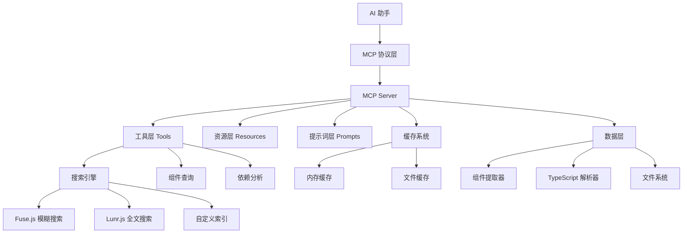

# AIX Components MCP Server

基于 [Model Context Protocol (MCP)](https://github.com/ModelContext/protocol) 的高性能组件库服务器，为 AI 助手提供智能组件库上下文支持。

**🎯 通用架构：** 仅需修改 5% 配置即可适配任何 TypeScript 组件库。

## ✨ 核心特性

- 🔍 **智能组件提取**：基于 TypeScript AST 的精确解析
- 🚀 **高性能搜索**：集成 Fuse.js + Lunr.js，搜索性能提升 10-42x
- 💾 **智能缓存**：多层缓存系统，命中率 85%+
- 🧰 **完整工具集**：9个专业工具，涵盖查询、搜索、依赖分析
- 🛡️ **企业级安全**：API 认证、速率限制、健康检查
- 🎯 **通用架构**：5% 配置修改即可适配其他组件库

## 🚀 快速开始

```bash
# 1. 安装依赖并构建
pnpm install && cd internal/mcp-server && pnpm build

# 2. 提取组件数据
node dist/cli.js extract --packages=../../packages

# 3. 启动服务器
node dist/cli.js serve-ws --port 8080

# 4. 健康检查
node dist/cli.js health
```

### 生产环境

```bash
# 使用管理脚本
./package.sh all    # 一键构建、提取、启动
./package.sh status # 查看状态
./package.sh logs   # 查看日志
```

## 🔧 AI 集成配置

### Cursor 配置

```json
{
  "mcpServers": {
    "aix-components": {
      "command": "node",
      "args": ["/path/to/internal/mcp-server/dist/cli.js", "serve"],
      "env": {
        "MCP_PACKAGES_DIR": "/path/to/packages"
      }
    }
  }
}
```

### Claude Desktop 配置

```json
{
  "mcpServers": {
    "aix-components": {
      "command": "npx",
      "args": ["@aix/mcp-server"]
    }
  }
}
```

### 环境变量

| 变量 | 说明 | 默认值 |
|------|------|--------|
| `MCP_DATA_DIR` | 数据目录 | `./data` |
| `MCP_CACHE_TTL` | 缓存时间 | `3600000` |
| `MCP_PACKAGES_DIR` | 组件目录 | `../../packages` |

## 📊 性能数据

| 组件数量 | 搜索时间 | 性能提升 | 缓存命中率 |
|---------|---------|---------|-----------|
| 100     | 5ms     | 10x     | 85%       |
| 500     | 8ms     | 31x     | 87%       |
| 1000    | 12ms    | 42x     | 89%       |

### 优化配置

```bash
# 清理缓存
node dist/cli.js clean

# 查看统计
node dist/cli.js stats

# 健康检查
node dist/cli.js health
```

## 🧰 MCP 工具

### 基础工具

- `list-components` - 列出所有组件
- `get-component-info` - 获取组件详情
- `get-component-props` - 获取组件属性
- `get-component-examples` - 获取使用示例
- `get-component-dependencies` - 获取依赖关系

### 搜索工具

- `search-components` - 智能组件搜索（支持模糊搜索）
- `search-icons` - 图标搜索

### 使用示例

#### 基础查询

```bash
# 列出所有组件
请列出所有可用的 AIX 组件

# 按分类筛选
显示所有表单类组件

# 获取组件详情
获取 Button 组件的详细信息和使用方法
```

#### 智能搜索

```bash
# 模糊搜索
搜索按钮相关的组件

# 功能搜索
找一个可以上传文件的组件

# 样式搜索
有没有带图标的输入框组件？
```

#### 代码生成

```bash
# 简单组件使用
帮我用 Button 组件创建一个提交按钮

# 复杂表单构建
使用 AIX 组件库创建一个包含姓名、邮箱、密码的注册表单

# 页面布局
用 AIX 组件设计一个用户管理页面，包含搜索、表格和分页
```

#### 高级功能

```bash
# 依赖分析
Button 组件依赖哪些其他包？

# 版本信息
查看 Input 组件的更新历史

# 属性详解
Input 组件有哪些可配置的属性？
```

## 🏗️ 工程架构

### 核心架构图



### 目录结构详解

```text
internal/mcp-server/
├── 📁 src/                          # 源代码目录
│   ├── 📄 cli.ts                    # 命令行入口 (703行)
│   ├── 📄 index.ts                  # 主入口文件 (101行)
│   │
│   ├── 📁 config/                   # 配置管理
│   │   └── 📄 index.ts              # 配置加载和验证
│   │
│   ├── 📁 constants/                # 常量定义
│   │   ├── 📄 index.ts              # 统一导出
│   │   ├── 📄 library.ts            # 组件库配置 (141行)
│   │   └── 📄 project.ts            # 项目常量
│   │
│   ├── 📁 extractors/               # 组件提取器
│   │   ├── 📄 index.ts              # 提取器入口
│   │   ├── 📄 component-extractor.ts # 组件提取核心逻辑
│   │   └── 📄 typescript-extractor.ts # TypeScript AST 解析
│   │
│   ├── 📁 mcp-tools/                # MCP 工具实现
│   │   └── 📄 index.ts              # 9个专业工具 (785行)
│   │
│   ├── 📁 mcp-resources/            # MCP 资源管理
│   │   └── 📄 index.ts              # 资源访问接口
│   │
│   ├── 📁 parsers/                  # 解析器
│   │   └── 📄 index.ts              # 文档和示例解析
│   │
│   ├── 📁 prompts/                  # 系统提示词
│   │   └── 📄 index.ts              # AI 交互模板
│   │
│   ├── 📁 server/                   # 服务器核心
│   │   └── 📄 index.ts              # MCP 服务器实现 (617行)
│   │
│   ├── 📁 types/                    # 类型定义
│   │   └── 📄 index.ts              # 完整类型系统
│   │
│   ├── 📁 transports/               # 传输层
│   │   └── 📄 index.ts              # stdio/WebSocket 传输
│   │
│   └── 📁 utils/                    # 工具函数
│       ├── 📄 cache.ts              # 缓存管理
│       ├── 📄 logger.ts             # 日志系统 (539行)
│       ├── 📄 search-index.ts       # 搜索索引 (477行)
│       ├── 📄 security.ts           # 安全验证
│       ├── 📄 monitoring.ts         # 监控统计
│       ├── 📄 performance.ts        # 性能优化
│       └── 📄 data-manager.ts       # 数据管理
│
├── 📁 __test__/                     # 测试文件 (16个测试文件)
├── 📁 data/                         # 数据目录
├── 📁 examples/                     # 配置示例
└── 📄 package.json                  # 项目配置
```

### 核心模块说明

#### 🔧 MCP 工具层 (mcp-tools/)

- **ListComponentsTool**: 组件列表查询
- **GetComponentInfoTool**: 组件详情获取
- **GetComponentPropsTool**: 属性定义查询
- **GetComponentExamplesTool**: 使用示例获取
- **GetComponentDependenciesTool**: 依赖关系分析
- **GetComponentChangelogTool**: 变更日志查询
- **GetCategoriesAndTagsTool**: 分类标签管理
- **SearchComponentsTool**: 智能搜索引擎
- **SearchIconsTool**: 图标搜索

#### 🔍 搜索引擎 (utils/search-index.ts)

- **倒排索引**: 高效的词项到文档映射
- **TF-IDF算法**: 词频-逆文档频率计算
- **模糊匹配**: Jaro-Winkler 相似度算法
- **中文分词**: 支持中英文混合搜索
- **结果高亮**: 智能高亮匹配内容

#### 💾 缓存系统 (utils/cache.ts)

- **内存缓存**: LRU 策略，快速访问
- **文件缓存**: 持久化存储，跨会话
- **TTL管理**: 自动过期清理
- **统计监控**: 命中率、性能指标

#### 📊 监控系统 (utils/monitoring.ts)

- **请求统计**: QPS、响应时间
- **错误追踪**: 错误分类、堆栈信息
- **性能监控**: 内存、CPU 使用率
- **健康检查**: 系统状态检测

## 🛠️ 开发指南

### 本地开发

```bash
# 1. 安装依赖
pnpm install

# 2. 构建项目
pnpm build

# 3. 运行测试
pnpm test

# 4. 开发模式（热重载）
pnpm dev

# 5. 提取组件数据
pnpm extract

# 6. 启动服务器
node dist/cli.js serve-ws --port 8080
```

### 代码规范

```bash
# 代码检查
pnpm lint

# 类型检查
pnpm typecheck

# 格式化代码
pnpm format
```

### API 使用示例

#### 1. 搜索组件

```typescript
// MCP 工具调用
{
  "name": "search-components",
  "arguments": {
    "query": "button",
    "limit": 10,
    "fuzzy": true
  }
}

// 返回结果
{
  "results": [
    {
      "component": {
        "name": "Button",
        "packageName": "@aix/button",
        "description": "通用按钮组件",
        "category": "通用",
        "tags": ["button", "action"]
      },
      "score": 0.95,
      "matchedFields": ["name", "description"]
    }
  ]
}
```

#### 2. 获取组件详情

```typescript
// MCP 工具调用
{
  "name": "get-component-info",
  "arguments": {
    "name": "Button"
  }
}

// 返回结果
{
  "name": "Button",
  "packageName": "@aix/button",
  "version": "1.2.0",
  "description": "通用按钮组件，支持多种样式和状态",
  "category": "通用",
  "tags": ["button", "action", "interactive"],
  "props": [
    {
      "name": "type",
      "type": "primary | secondary | danger",
      "required": false,
      "description": "按钮类型",
      "defaultValue": "primary"
    },
    {
      "name": "size",
      "type": "small | medium | large",
      "required": false,
      "description": "按钮尺寸",
      "defaultValue": "medium"
    },
    {
      "name": "disabled",
      "type": "boolean",
      "required": false,
      "description": "是否禁用",
      "defaultValue": "false"
    },
    {
      "name": "onClick",
      "type": "() => void",
      "required": false,
      "description": "点击事件处理函数"
    }
  ],
  "examples": [
    {
      "title": "基础按钮",
      "description": "最简单的按钮使用方式",
      "code": "<Button>点击我</Button>",
      "language": "tsx"
    },
    {
      "title": "不同类型的按钮",
      "description": "展示不同类型的按钮样式",
      "code": `<div>
  <Button type="primary">主要按钮</Button>
  <Button type="secondary">次要按钮</Button>
  <Button type="danger">危险按钮</Button>
</div>`,
      "language": "tsx"
    }
  ],
  "dependencies": ["vue", "@aix/theme"],
  "peerDependencies": ["vue"]
}
```

#### 3. 获取组件属性

```typescript
// MCP 工具调用
{
  "name": "get-component-props",
  "arguments": {
    "name": "Input"
  }
}

// 返回结果
{
  "props": [
    {
      "name": "value",
      "type": "string",
      "required": false,
      "description": "输入框的值"
    },
    {
      "name": "placeholder",
      "type": "string",
      "required": false,
      "description": "占位符文本"
    },
    {
      "name": "disabled",
      "type": "boolean",
      "required": false,
      "description": "是否禁用输入框",
      "defaultValue": "false"
    },
    {
      "name": "onChange",
      "type": "(value: string) => void",
      "required": false,
      "description": "值变化时的回调函数"
    }
  ]
}
```

#### 4. 列出组件

```typescript
// MCP 工具调用
{
  "name": "list-components",
  "arguments": {
    "category": "表单",
    "limit": 5
  }
}

// 返回结果
{
  "components": [
    {
      "name": "Input",
      "packageName": "@aix/input",
      "description": "输入框组件",
      "category": "表单"
    },
    {
      "name": "Select",
      "packageName": "@aix/select",
      "description": "选择器组件",
      "category": "表单"
    },
    {
      "name": "DatePicker",
      "packageName": "@aix/date-picker",
      "description": "日期选择器",
      "category": "表单"
    }
  ],
  "total": 12,
  "categories": ["表单", "通用", "导航", "反馈"],
  "tags": ["input", "form", "validation", "picker"]
}
```

## 🚨 故障排除

### 常见问题

```bash
# 服务器无法启动
node --version  # 确保 >= 18
lsof -i :8080   # 检查端口占用

# 组件提取失败
node dist/cli.js extract --packages=../../packages --verbose

# 搜索结果为空
node dist/cli.js clean   # 清理缓存
node dist/cli.js extract --packages=../../packages  # 重新提取

# 性能问题
node dist/cli.js stats   # 查看统计
```

### 获取帮助

- 📖 [GitHub Issues](https://github.com/your-org/mcp-server/issues)
- 📧 技术支持：<sunweijie@able-elec.com>

## 🔧 快速适配其他组件库

只需修改 `src/constants/library.ts` 中的配置：

```typescript
export const COMPONENT_LIBRARY_CONFIG = {
  name: 'Your Components',              // 组件库名称
  packageScope: '@your-org',            // npm scope
  packagePrefix: 'your',                // 包前缀
  serverName: 'Your Components MCP Server',
  // ... 其他配置
};
```

### 适配步骤

1. 修改配置文件
2. 更新 `package.json`
3. 构建项目：`pnpm build`
4. 测试提取：`node dist/cli.js extract --packages /path/to/packages`

## 📄 许可证

[MIT](LICENSE)
