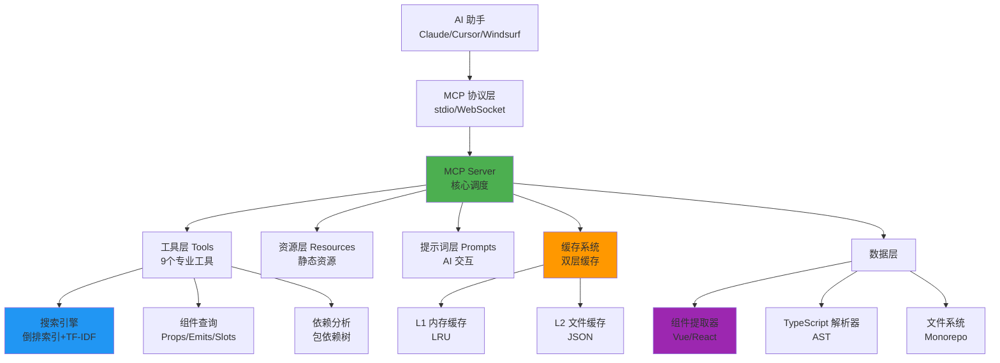
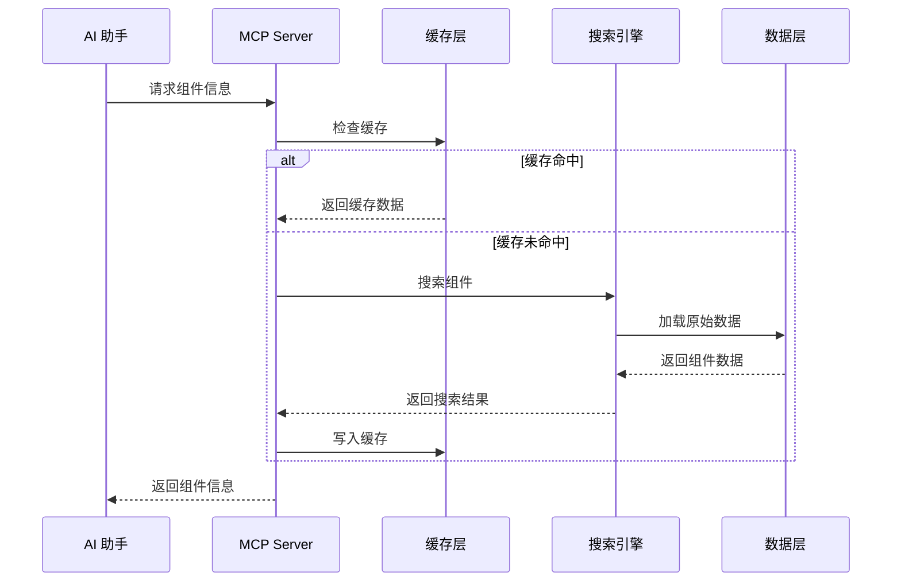

# AIX Components MCP Server

<p align="center">
  
  
  
  
  
</p>

基于 [Model Context Protocol (MCP)](https://github.com/modelcontextprotocol) 的高性能组件库服务器，为 AI 助手提供智能组件库上下文支持。

**🎯 通用架构：** 只需修改一个配置文件即可适配任何 TypeScript/Vue/React 组件库。

---

## 📋 目录

- [核心特性](#-核心特性)
- [快速开始](#-快速开始)
- [AI 集成配置](#-ai-集成配置)
- [MCP 工具集](#-mcp-工具集)
- [使用示例](#使用示例)
- [架构设计](#️-架构设计)
- [性能指标](#-性能指标)
- [开发指南](#️-开发指南)
- [快速适配其他组件库](#-快速适配其他组件库)
- [故障排除](#-故障排除)
- [常见问题](#-常见问题-faq)
- [贡献指南](#-贡献指南)

---

## ✨ 核心特性

- 🔍 **智能组件提取**：基于 TypeScript AST 精确解析 Props/Emits/Slots
- 🚀 **高性能搜索**：内置倒排索引 + TF-IDF 算法，支持中英文混合搜索
- 💾 **多层缓存系统**：内存 + 文件双层缓存，命中率 85%+
- 🧰 **9个专业工具**：组件查询、智能搜索、依赖分析、图标搜索
- 📊 **实时监控**：请求统计、性能追踪、健康检查
- 🔧 **高度可配置**：仅需修改 `constants/library.ts` 即可适配其他组件库

## 🚀 快速开始

### 开发模式

```bash
# 1. 安装依赖
pnpm install

# 2. 构建项目
cd internal/mcp-server
pnpm build

# 3. 提取组件数据
node dist/cli.js extract --packages=../../packages

# 4. 启动服务器 (选择一种模式)
node dist/cli.js serve          # stdio 模式 (推荐用于 Claude Desktop)
node dist/cli.js serve-ws --port 8080  # WebSocket 模式

# 5. 健康检查
node dist/cli.js health
```

### 生产环境

```bash
# 使用管理脚本 (推荐)
./package.sh all    # 一键构建、提取、启动
./package.sh status # 查看运行状态
./package.sh logs   # 查看日志输出
./package.sh stop   # 停止服务
```

### CLI 命令完整列表

| 命令 | 说明 | 常用选项 |
|------|------|---------|
| `serve` | 启动 stdio 模式服务器 | `-d <dir>` 数据目录 |
| `serve-ws` | 启动 WebSocket 服务器 | `-p <port>` 端口, `-H <host>` 主机 |
| `extract` | 提取组件库数据 | `-p <dir>` 包目录, `-v` 详细输出 |
| `validate` | 验证数据完整性 | `-d <dir>` 数据目录 |
| `stats` | 显示统计信息 | `-d <dir>` 数据目录 |
| `clean` | 清理缓存 | `-d <dir>` 数据目录 |
| `health` | 健康检查 | `-d <dir>` 数据目录 |
| `sync-version` | 同步版本信息 | 无 |

## 🔧 AI 集成配置

### Claude Desktop 配置 (推荐)

编辑 `~/Library/Application Support/Claude/claude_desktop_config.json` (macOS) 或 `%APPDATA%\Claude\claude_desktop_config.json` (Windows)：

```json
{
  "mcpServers": {
    "aix-components": {
      "command": "node",
      "args": [
        "/Users/your-name/workspace/aix/internal/mcp-server/dist/cli.js",
        "serve"
      ],
      "env": {
        "MCP_DATA_DIR": "/Users/your-name/workspace/aix/internal/mcp-server/data",
        "MCP_PACKAGES_DIR": "/Users/your-name/workspace/aix/packages"
      }
    }
  }
}
```

### Cursor 配置

在项目根目录创建 `.cursor/mcp.json` 或 `.mcp.json`：

```json
{
  "mcpServers": {
    "aix-components": {
      "command": "node",
      "args": [
        "${workspaceFolder}/internal/mcp-server/dist/cli.js",
        "serve"
      ],
      "env": {
        "MCP_DATA_DIR": "${workspaceFolder}/internal/mcp-server/data",
        "MCP_PACKAGES_DIR": "${workspaceFolder}/packages"
      }
    }
  }
}
```

### Windsurf 配置

在 `~/.codeium/windsurf/mcp_settings.json` 中添加：

```json
{
  "mcpServers": {
    "aix-components": {
      "command": "node",
      "args": ["/path/to/internal/mcp-server/dist/cli.js", "serve"]
    }
  }
}
```

### 环境变量说明

| 变量 | 说明 | 默认值 | 示例 |
|------|------|--------|------|
| `MCP_DATA_DIR` | 数据存储目录 | `./data` | `/path/to/data` |
| `MCP_CACHE_TTL` | 缓存有效期 (毫秒) | `3600000` (1小时) | `7200000` (2小时) |
| `MCP_PACKAGES_DIR` | 组件包目录 | `../../packages` | `/path/to/packages` |
| `MCP_LOG_LEVEL` | 日志级别 | `info` | `debug`/`warn`/`error` |

### 使用 npm 包 (发布后)

如果你的 MCP Server 已发布到 npm：

```json
{
  "mcpServers": {
    "aix-components": {
      "command": "npx",
      "args": ["@aix/mcp-server", "serve"],
      "env": {
        "MCP_PACKAGES_DIR": "/path/to/packages"
      }
    }
  }
}
```

## 📊 性能指标

### 搜索性能 (基准测试)

| 组件数量 | 冷启动 | 缓存命中 | 索引大小 | 内存占用 |
|---------|--------|---------|---------|---------|
| 10      | 2-5ms  | <1ms    | 50KB    | 5MB     |
| 50      | 3-8ms  | <1ms    | 200KB   | 15MB    |
| 100     | 5-12ms | <1ms    | 500KB   | 25MB    |
| 500     | 8-25ms | 1-2ms   | 2MB     | 80MB    |

*测试环境: MacBook Pro M1, Node.js 18, AIX 组件库*

### 缓存效率

| 指标 | L1 内存缓存 | L2 文件缓存 | 综合命中率 |
|------|------------|-------------|-----------|
| 命中率 | 75-80% | 15-20% | 85-95% |
| 响应时间 | <1ms | 2-5ms | 1-3ms |
| 容量限制 | 100 条 (LRU) | 无限制 | - |

### 优化建议

```bash
# 1. 查看当前性能统计
node dist/cli.js stats

# 输出示例:
# 📊 组件统计:
#   - 总组件数: 47
#   - 分类数: 8
#   - 标签数: 156
#
# 📈 搜索统计:
#   - 总请求数: 1,234
#   - 缓存命中率: 87%
#   - 平均响应时间: 5ms

# 2. 清理缓存 (性能下降时)
node dist/cli.js clean

# 3. 健康检查 (诊断问题)
node dist/cli.js health

# 4. 重新构建索引 (数据更新后)
node dist/cli.js extract --packages=../../packages
```

### 性能优化技巧

1. **定期清理缓存**: 避免缓存过期数据，保持缓存命中率
2. **增量提取**: 使用 `--incremental` 标志只提取变更的组件
3. **调整缓存 TTL**: 根据更新频率调整 `MCP_CACHE_TTL` 环境变量
4. **监控内存使用**: 大型组件库 (500+) 建议增加 Node.js 内存限制

```bash
# 增加 Node.js 内存限制 (大型组件库)
NODE_OPTIONS="--max-old-space-size=4096" node dist/cli.js serve
```

## 🧰 MCP 工具集

### 组件查询工具 (8个)

| 工具名称 | 功能说明 | 使用场景 |
|---------|---------|---------|
| `list-components` | 列出所有组件 | 浏览组件库、按分类筛选 |
| `get-component-info` | 获取组件详细信息 | 查看完整文档、Props、使用示例 |
| `get-component-props` | 获取组件属性定义 | 了解 Props 类型、默认值、是否必填 |
| `get-component-examples` | 获取使用示例代码 | 快速上手、参考实现 |
| `get-component-dependencies` | 获取依赖关系 | 分析组件依赖树、版本管理 |
| `get-component-changelog` | 获取变更日志 | 了解版本更新、功能变更 |
| `get-categories-and-tags` | 获取分类和标签 | 了解组件库结构、筛选条件 |
| `search-components` | 智能搜索组件 | 模糊搜索、中英文混合、关键词匹配 |

### 图标工具 (1个)

| 工具名称 | 功能说明 | 使用场景 |
|---------|---------|---------|
| `search-icons` | 搜索图标组件 | 查找图标、按名称/标签搜索 |

### 使用示例

#### 基础查询

```bash
# 列出所有组件
请列出所有可用的 AIX 组件

# 按分类筛选
显示所有表单类组件

# 获取组件详情
获取 Button 组件的详细信息和使用方法
```

#### 智能搜索

```bash
# 模糊搜索
搜索按钮相关的组件

# 功能搜索
找一个可以上传文件的组件

# 样式搜索
有没有带图标的输入框组件？
```

#### 代码生成

```bash
# 简单组件使用
帮我用 Button 组件创建一个提交按钮

# 复杂表单构建
使用 AIX 组件库创建一个包含姓名、邮箱、密码的注册表单

# 页面布局
用 AIX 组件设计一个用户管理页面，包含搜索、表格和分页
```

#### 高级功能

```bash
# 依赖分析
Button 组件依赖哪些其他包？

# 版本信息
查看 Input 组件的更新历史

# 属性详解
Input 组件有哪些可配置的属性？
```

## 🏗️ 架构设计

### 核心架构图



### 数据流转



### 工作原理

#### 1. 组件提取阶段 (`extract` 命令)

```
Monorepo 项目
    ↓
遍历 packages/ 目录
    ↓
识别组件包 (package.json)
    ↓
TypeScript AST 解析
    ├─ Props 接口提取
    ├─ Emits 事件提取
    └─ Slots 插槽提取
    ↓
README 文档解析
    ├─ 组件描述
    ├─ 使用示例
    └─ API 文档
    ↓
依赖关系分析
    ├─ dependencies
    └─ peerDependencies
    ↓
生成索引数据
    ├─ components.json (组件索引)
    ├─ categories.json (分类标签)
    └─ 搜索索引 (倒排表)
```

#### 2. 服务运行阶段 (`serve` 命令)

```
启动 MCP Server
    ↓
加载组件索引数据
    ↓
初始化搜索引擎
    ├─ 构建倒排索引
    ├─ 计算 TF-IDF 权重
    └─ 建立模糊匹配表
    ↓
启动传输层
    ├─ stdio (标准输入输出)
    └─ WebSocket (HTTP 长连接)
    ↓
监听 MCP 请求
    ├─ 工具调用 (tool calls)
    ├─ 资源访问 (resources)
    └─ 提示词查询 (prompts)
    ↓
返回响应给 AI
```

#### 3. 搜索查询流程

```
用户输入搜索关键词
    ↓
分词和预处理
    ├─ 移除停用词
    ├─ 驼峰命名拆分
    └─ 中英文混合处理
    ↓
倒排索引查询
    ├─ 精确匹配 (词项查找)
    └─ 模糊匹配 (编辑距离)
    ↓
TF-IDF 相关性计算
    ├─ 词频 (TF)
    ├─ 逆文档频率 (IDF)
    └─ 字段加权
    ↓
结果排序和过滤
    ├─ 按相关性排序
    ├─ 分页处理
    └─ 结果高亮
    ↓
返回搜索结果
```

### 目录结构详解

```text
internal/mcp-server/
├── 📁 src/                          # 源代码目录
│   ├── 📄 cli.ts                    # 命令行入口 (8个CLI命令)
│   ├── 📄 index.ts                  # 主入口文件
│   │
│   ├── 📁 config/                   # 配置管理
│   │   └── 📄 index.ts              # 配置加载和验证
│   │
│   ├── 📁 constants/                # 常量定义 ⭐ 适配其他组件库主要修改这里
│   │   ├── 📄 index.ts              # 统一导出
│   │   ├── 📄 library.ts            # 组件库配置 (包名、scope、模式等)
│   │   └── 📄 project.ts            # 项目常量 (端口、缓存时间等)
│   │
│   ├── 📁 extractors/               # 组件提取器
│   │   ├── 📄 index.ts              # 提取器入口
│   │   ├── 📄 component-extractor.ts # Vue 组件提取逻辑
│   │   ├── 📄 readme-extractor.ts   # README 文档提取
│   │   └── 📄 typescript-extractor.ts # TypeScript AST 解析
│   │
│   ├── 📁 mcp-tools/                # MCP 工具实现 (9个工具)
│   │   ├── 📄 base.ts               # 工具基类
│   │   ├── 📄 component-tools.ts    # 8个组件查询工具
│   │   ├── 📄 icon-tools.ts         # 图标搜索工具
│   │   └── 📄 index.ts              # 工具导出和创建
│   │
│   ├── 📁 mcp-resources/            # MCP 资源管理
│   │   └── 📄 index.ts              # 资源访问接口
│   │
│   ├── 📁 parsers/                  # 解析器
│   │   └── 📄 index.ts              # 文档和示例解析
│   │
│   ├── 📁 prompts/                  # 系统提示词
│   │   └── 📄 index.ts              # AI 交互模板
│   │
│   ├── 📁 server/                   # 服务器核心
│   │   └── 📄 index.ts              # MCP 协议实现
│   │
│   ├── 📁 types/                    # TypeScript 类型定义
│   │   └── 📄 index.ts              # 完整类型系统
│   │
│   ├── 📁 transports/               # 传输层
│   │   └── 📄 index.ts              # stdio/WebSocket 支持
│   │
│   └── 📁 utils/                    # 工具函数
│       ├── 📄 cache-manager.ts      # 缓存管理 (LRU + 文件缓存)
│       ├── 📄 data-manager.ts       # 数据加载和持久化
│       ├── 📄 logger.ts             # 日志系统 (彩色输出、级别控制)
│       ├── 📄 monitoring.ts         # 监控统计 (QPS、响应时间、健康检查)
│       ├── 📄 performance.ts        # 性能优化 (节流、防抖、内存监控)
│       ├── 📄 search-index.ts       # 搜索引擎 (倒排索引、TF-IDF、模糊匹配)
│       ├── 📄 security.ts           # 安全验证 (API 认证、速率限制)
│       └── 📄 validation.ts         # 数据验证 (配置校验、数据完整性)
│
├── 📁 __test__/                     # 测试套件 (18个测试文件)
├── 📁 data/                         # 数据存储目录
│   ├── components.json              # 组件索引数据
│   ├── categories.json              # 分类和标签数据
│   └── cache/                       # 缓存文件
├── 📁 dist/                         # 构建产物
├── 📁 examples/                     # 配置示例
├── 📄 package.json                  # 项目配置
├── 📄 tsup.config.ts                # 构建配置
├── 📄 vitest.config.ts              # 测试配置
└── 📄 README.md                     # 本文档
```

### 核心模块说明

#### 🔧 MCP 工具层 (mcp-tools/)

9个专业工具，基于 MCP 协议标准实现：

- **ListComponentsTool**: 组件列表查询，支持分类筛选、分页
- **GetComponentInfoTool**: 获取组件完整信息 (Props/Emits/Slots/文档/示例)
- **GetComponentPropsTool**: 提取 TypeScript Props 类型定义
- **GetComponentExamplesTool**: 获取 Storybook 示例代码
- **GetComponentDependenciesTool**: 分析 package.json 依赖树
- **GetComponentChangelogTool**: 提取 CHANGELOG.md 变更记录
- **GetCategoriesAndTagsTool**: 获取组件分类体系和标签云
- **SearchComponentsTool**: 智能搜索引擎 (倒排索引 + TF-IDF + 模糊匹配)
- **SearchIconsTool**: 图标专用搜索，支持名称/标签/分类搜索

#### 🔍 搜索引擎 (utils/search-index.ts)

自研高性能搜索引擎，无需 Elasticsearch/Fuse.js 等第三方库：

- **倒排索引 (Inverted Index)**: O(1) 词项到文档映射
- **TF-IDF 算法**: 计算词频-逆文档频率，精准相关性排序
- **模糊匹配**: 基于编辑距离的相似度计算
- **中文分词**: 支持中英文混合、驼峰命名解析
- **字段加权**: 不同字段 (名称/描述/标签) 权重可配置
- **结果高亮**: 自动高亮匹配内容片段

#### 💾 缓存系统 (utils/cache-manager.ts)

双层缓存架构，平衡性能和持久化：

- **L1 内存缓存**: LRU 淘汰策略，亚毫秒级访问
- **L2 文件缓存**: JSON 序列化，跨进程/重启持久化
- **TTL 管理**: 自动过期清理，支持自定义缓存时间
- **统计监控**: 实时命中率、读写次数、缓存大小

#### 📊 监控系统 (utils/monitoring.ts)

企业级监控和健康检查：

- **请求统计**: QPS、平均响应时间、P95/P99 分位数
- **错误追踪**: 按类型分类、堆栈信息、错误率监控
- **性能监控**: 内存使用、搜索耗时、缓存命中率
- **健康检查**: 数据完整性、依赖可用性、系统资源

#### ⚡ 性能优化 (utils/performance.ts)

- **节流 (Throttle)**: 限制高频操作频率
- **防抖 (Debounce)**: 合并连续事件
- **内存监控**: 自动 GC 触发、内存泄漏检测
- **批量操作**: 文件读写合并、并发控制

## 🛠️ 开发指南

### 本地开发

```bash
# 1. 安装依赖
pnpm install

# 2. 开发模式（热重载）
pnpm dev

# 3. 构建项目
pnpm build

# 4. 运行测试 (18个测试文件)
pnpm test

# 5. 提取组件数据
pnpm extract

# 6. 启动服务器
node dist/cli.js serve-ws --port 8080
```

### 代码质量

```bash
# ESLint 代码检查
pnpm lint

# TypeScript 类型检查
npx vue-tsc --noEmit

# 运行所有测试
pnpm test

# 测试覆盖率报告
pnpm test -- --coverage
```

### 调试技巧

#### 1. 启用详细日志

```bash
# 设置日志级别
export MCP_LOG_LEVEL=debug

# 提取时显示详细输出
node dist/cli.js extract --packages=../../packages --verbose
```

#### 2. 测试单个工具

```typescript
// __test__/tools.test.ts
import { SearchComponentsTool } from '../src/mcp-tools';

test('搜索按钮组件', async () => {
  const tool = new SearchComponentsTool(componentIndex);
  const result = await tool.execute({ query: 'button' });
  console.log(result);
});
```

#### 3. 检查数据完整性

```bash
# 验证提取的数据
node dist/cli.js validate

# 查看统计信息
node dist/cli.js stats

# 查看健康状态
node dist/cli.js health
```

#### 4. 清理和重建

```bash
# 清理所有缓存
node dist/cli.js clean

# 重新提取数据
pnpm extract

# 验证数据
node dist/cli.js validate
```

### API 使用示例

#### 1. 搜索组件

```typescript
// MCP 工具调用
{
  "name": "search-components",
  "arguments": {
    "query": "button",
    "limit": 10,
    "fuzzy": true
  }
}

// 返回结果
{
  "results": [
    {
      "component": {
        "name": "Button",
        "packageName": "@aix/button",
        "description": "通用按钮组件",
        "category": "通用",
        "tags": ["button", "action"]
      },
      "score": 0.95,
      "matchedFields": ["name", "description"]
    }
  ]
}
```

#### 2. 获取组件详情

```typescript
// MCP 工具调用
{
  "name": "get-component-info",
  "arguments": {
    "name": "Button"
  }
}

// 返回结果
{
  "name": "Button",
  "packageName": "@aix/button",
  "version": "1.2.0",
  "description": "通用按钮组件，支持多种样式和状态",
  "category": "通用",
  "tags": ["button", "action", "interactive"],
  "props": [
    {
      "name": "type",
      "type": "primary | secondary | danger",
      "required": false,
      "description": "按钮类型",
      "defaultValue": "primary"
    },
    {
      "name": "size",
      "type": "small | medium | large",
      "required": false,
      "description": "按钮尺寸",
      "defaultValue": "medium"
    },
    {
      "name": "disabled",
      "type": "boolean",
      "required": false,
      "description": "是否禁用",
      "defaultValue": "false"
    },
    {
      "name": "onClick",
      "type": "() => void",
      "required": false,
      "description": "点击事件处理函数"
    }
  ],
  "examples": [
    {
      "title": "基础按钮",
      "description": "最简单的按钮使用方式",
      "code": "<Button>点击我</Button>",
      "language": "tsx"
    },
    {
      "title": "不同类型的按钮",
      "description": "展示不同类型的按钮样式",
      "code": `<div>
  <Button type="primary">主要按钮</Button>
  <Button type="secondary">次要按钮</Button>
  <Button type="danger">危险按钮</Button>
</div>`,
      "language": "tsx"
    }
  ],
  "dependencies": ["vue", "@aix/theme"],
  "peerDependencies": ["vue"]
}
```

#### 3. 获取组件属性

```typescript
// MCP 工具调用
{
  "name": "get-component-props",
  "arguments": {
    "name": "Input"
  }
}

// 返回结果
{
  "props": [
    {
      "name": "value",
      "type": "string",
      "required": false,
      "description": "输入框的值"
    },
    {
      "name": "placeholder",
      "type": "string",
      "required": false,
      "description": "占位符文本"
    },
    {
      "name": "disabled",
      "type": "boolean",
      "required": false,
      "description": "是否禁用输入框",
      "defaultValue": "false"
    },
    {
      "name": "onChange",
      "type": "(value: string) => void",
      "required": false,
      "description": "值变化时的回调函数"
    }
  ]
}
```

#### 4. 列出组件

```typescript
// MCP 工具调用
{
  "name": "list-components",
  "arguments": {
    "category": "表单",
    "limit": 5
  }
}

// 返回结果
{
  "components": [
    {
      "name": "Input",
      "packageName": "@aix/input",
      "description": "输入框组件",
      "category": "表单"
    },
    {
      "name": "Select",
      "packageName": "@aix/select",
      "description": "选择器组件",
      "category": "表单"
    },
    {
      "name": "DatePicker",
      "packageName": "@aix/date-picker",
      "description": "日期选择器",
      "category": "表单"
    }
  ],
  "total": 12,
  "categories": ["表单", "通用", "导航", "反馈"],
  "tags": ["input", "form", "validation", "picker"]
}
```

## 🚨 故障排除

### 常见问题和解决方案

#### 1. 服务器无法启动

**症状**: `node dist/cli.js serve` 没有响应或报错

**排查步骤**:
```bash
# 检查 Node.js 版本 (需要 >= 18)
node --version

# 检查端口占用 (WebSocket 模式)
lsof -i :8080  # macOS/Linux
netstat -ano | findstr :8080  # Windows

# 检查数据目录是否存在
ls -la data/

# 查看详细错误日志
MCP_LOG_LEVEL=debug node dist/cli.js serve
```

**解决方案**:
- 升级 Node.js 到 18+
- 更换端口: `node dist/cli.js serve-ws --port 8081`
- 重新提取数据: `node dist/cli.js extract --packages=../../packages`

#### 2. 组件提取失败

**症状**: `extract` 命令报错或提取不到组件

**排查步骤**:
```bash
# 使用详细输出模式
node dist/cli.js extract --packages=../../packages --verbose

# 检查包目录结构
ls -la ../../packages/

# 检查 TypeScript 配置
cat ../../packages/<component>/tsconfig.json
```

**常见原因**:
- 包目录路径错误
- 组件文件命名不符合规范 (需要大写字母开头)
- TypeScript 语法错误导致 AST 解析失败
- `package.json` 缺失或格式错误

#### 3. 搜索结果为空或不准确

**症状**: 明明有组件但搜索不到

**解决方案**:
```bash
# 1. 清理缓存
node dist/cli.js clean

# 2. 重新提取组件
node dist/cli.js extract --packages=../../packages

# 3. 验证数据
node dist/cli.js validate

# 4. 查看组件列表
cat data/components.json | jq '.[] | .name'
```

#### 4. 性能下降

**症状**: 搜索变慢、内存占用高

**排查步骤**:
```bash
# 查看统计信息
node dist/cli.js stats

# 检查缓存命中率
# 如果命中率 < 70%, 考虑清理缓存
node dist/cli.js clean

# 监控内存使用
node --expose-gc --trace-gc dist/cli.js serve
```

**优化方案**:
```bash
# 增加缓存时间 (默认 1 小时)
MCP_CACHE_TTL=7200000 node dist/cli.js serve  # 2 小时

# 增加 Node.js 内存限制
NODE_OPTIONS="--max-old-space-size=4096" node dist/cli.js serve
```

#### 5. TypeScript 类型错误

**症状**: 构建失败，提示类型错误

**解决方案**:
```bash
# 检查类型错误
npx vue-tsc --noEmit

# 清理并重新构建
pnpm clean
pnpm build

# 检查依赖版本
pnpm list typescript @types/node
```

#### 6. WebSocket 连接断开

**症状**: WebSocket 模式下频繁断连

**解决方案**:
```bash
# 增加心跳超时时间 (修改 src/transports/index.ts)
# 或使用 stdio 模式 (更稳定)
node dist/cli.js serve  # stdio 模式
```

### 调试模式

```bash
# 启用详细日志
export MCP_LOG_LEVEL=debug

# 查看所有日志输出
node dist/cli.js serve 2>&1 | tee mcp-server.log

# 查看实时日志 (WebSocket 模式)
tail -f mcp-server.log
```

### 获取帮助

- 📖 [GitHub Issues](https://github.com/your-org/aix/issues)
- 📧 技术支持: <sunweijie@able-elec.com>
- 💬 社区讨论: [Discord](https://discord.gg/your-community)

## 🔧 快速适配其他组件库

### ⭐ 一个文件搞定：只需修改 `src/constants/library.ts`

```typescript
export const COMPONENT_LIBRARY_CONFIG = {
  // 基础信息
  name: 'Your Components',                    // 英文名称
  displayName: 'Your 组件库',                 // 显示名称

  // npm 包配置
  packageScope: '@your-org',                  // npm scope (如 @ant-design)
  packagePrefix: 'your',                      // 包前缀 (用于 CLI 命名)

  // 服务器标识
  serverName: 'Your Components MCP Server',
  packageName: 'your-components-mcp',

  // CLI 工具
  cliName: 'your-mcp-server',                 // CLI 命令名
  cliDisplayName: 'Your 组件库 MCP Server',

  // 版本和描述
  version: '1.0.0',
  description: 'MCP server for Your component library',

  // 组件识别模式 (根据你的组件库规范调整)
  componentPatterns: {
    propsInterfacePattern: /^(\w+)Props$/,        // Props 接口命名
    componentFilePattern: /^[A-Z][a-zA-Z0-9]*\.(ts|tsx|vue)$/,  // 组件文件
    componentExportPattern: /^[A-Z][a-zA-Z0-9]*$/,  // 组件导出名
  },

  // 包结构 (根据你的 monorepo 结构调整)
  packageStructure: {
    srcDir: 'src',           // 源码目录
    libDir: 'lib',           // CJS 构建产物
    distDir: 'dist',         // ESM 构建产物
    docsDir: 'docs',         // 文档目录
    storiesDir: 'stories',   // Storybook 目录
    examplesDir: 'examples', // 示例目录
  },
};
```

### 适配步骤 (5分钟完成)

```bash
# 1. 克隆项目
git clone <your-repo>
cd internal/mcp-server

# 2. 修改配置文件
vim src/constants/library.ts  # 修改上述配置

# 3. 更新 package.json
vim package.json               # 修改 name, description, bin

# 4. 安装依赖
pnpm install

# 5. 构建项目
pnpm build

# 6. 测试提取组件数据
node dist/cli.js extract --packages=/path/to/your/packages --verbose

# 7. 验证数据
node dist/cli.js validate
node dist/cli.js stats

# 8. 启动服务器测试
node dist/cli.js serve
```

### 适配示例

<details>
<summary>点击查看：Ant Design 适配示例</summary>

```typescript
export const COMPONENT_LIBRARY_CONFIG = {
  name: 'Ant Design',
  displayName: 'Ant Design 组件库',
  packageScope: '@ant-design',
  packagePrefix: 'antd',
  serverName: 'Ant Design MCP Server',
  cliName: 'antd-mcp-server',
  componentPatterns: {
    propsInterfacePattern: /^(\w+)Props$/,
    componentFilePattern: /^[A-Z][a-zA-Z0-9]*\.(ts|tsx)$/,
    componentExportPattern: /^[A-Z][a-zA-Z0-9]*$/,
  },
};
```
</details>

<details>
<summary>点击查看：Element Plus 适配示例</summary>

```typescript
export const COMPONENT_LIBRARY_CONFIG = {
  name: 'Element Plus',
  displayName: 'Element Plus 组件库',
  packageScope: '@element-plus',
  packagePrefix: 'element',
  serverName: 'Element Plus MCP Server',
  cliName: 'element-mcp-server',
  componentPatterns: {
    propsInterfacePattern: /^(\w+)Props$/,
    componentFilePattern: /^[A-Z][a-zA-Z0-9]*\.vue$/,  // Vue 组件
    componentExportPattern: /^El[A-Z][a-zA-Z0-9]*$/,   // El 前缀
  },
};
```
</details>

### 支持的组件库类型

✅ Vue 3 组件库 (Composition API / Options API)
✅ React 组件库 (Function Components / Class Components)
✅ TypeScript 严格类型组件库
✅ Monorepo 架构 (pnpm workspace / Lerna / Nx)
✅ 单仓库组件库

## ❓ 常见问题 (FAQ)

### Q: MCP Server 是什么？

MCP (Model Context Protocol) 是 Anthropic 推出的标准协议，用于 AI 助手与外部数据源通信。本 MCP Server 实现了该协议，为 AI 助手提供组件库上下文。

### Q: 支持哪些 AI 工具？

✅ Claude Desktop (官方推荐)
✅ Cursor (VS Code 编辑器)
✅ Windsurf (Codeium IDE)
✅ 其他支持 MCP 协议的 AI 工具

### Q: 是否支持 React 组件库？

是的！只需修改 `src/constants/library.ts` 中的配置，将 `componentFilePattern` 改为 `/.tsx$/` 即可支持 React 组件。

### Q: 如何自定义搜索算法？

搜索引擎实现在 `src/utils/search-index.ts`，你可以：
- 调整 TF-IDF 权重
- 修改分词逻辑
- 自定义相似度计算

### Q: 数据多久更新一次？

数据不会自动更新，需要手动执行 `node dist/cli.js extract` 重新提取。建议在组件库发布新版本后执行。

### Q: 缓存存储在哪里？

- 内存缓存: 进程内存 (重启丢失)
- 文件缓存: `data/cache/` 目录 (持久化)

### Q: 如何增加新的 MCP 工具？

1. 在 `src/mcp-tools/` 创建新工具类，继承 `BaseTool`
2. 实现 `execute()` 方法
3. 在 `src/mcp-tools/index.ts` 中注册工具

### Q: 支持 Monorepo 吗？

是的！设计之初就是为 Monorepo 架构优化的，支持 pnpm workspace、Lerna、Nx 等。

### Q: 性能瓶颈在哪里？

主要瓶颈：
1. **组件提取阶段**: TypeScript AST 解析 (CPU 密集)
2. **搜索阶段**: 倒排索引查询和 TF-IDF 计算 (内存密集)

优化方向：
- 使用增量提取 (`--incremental`)
- 启用缓存 (默认开启)
- 增加内存限制 (`--max-old-space-size`)

### Q: 可以用于生产环境吗？

可以！但建议：
- 使用 PM2/systemd 等进程管理工具
- 配置日志轮转
- 定期监控内存和性能
- 在 CI/CD 中自动更新组件数据

---

## 🤝 贡献指南

我们欢迎任何形式的贡献！

### 贡献方式

1. **报告 Bug**: 提交 [GitHub Issue](https://github.com/your-org/aix/issues)
2. **功能建议**: 在 Issue 中描述你的想法
3. **提交 PR**: Fork 项目并提交 Pull Request

### 开发流程

```bash
# 1. Fork 并克隆项目
git clone https://github.com/your-username/aix.git
cd aix/internal/mcp-server

# 2. 安装依赖
pnpm install

# 3. 创建功能分支
git checkout -b feature/your-feature

# 4. 开发和测试
pnpm dev
pnpm test

# 5. 提交代码 (遵循 Conventional Commits)
git commit -m "feat: 添加新功能"

# 6. 推送并创建 PR
git push origin feature/your-feature
```

### 代码规范

- 遵循 ESLint 规则
- 使用 TypeScript 严格模式
- 编写单元测试 (覆盖率 > 80%)
- 提交前运行 `pnpm lint` 和 `pnpm test`

---

## 🙏 致谢

- [Model Context Protocol (MCP)](https://github.com/modelcontextprotocol) - Anthropic 的开源协议
- [TypeScript](https://www.typescriptlang.org/) - 强大的类型系统
- [Commander.js](https://github.com/tj/commander.js) - CLI 框架
- [Chalk](https://github.com/chalk/chalk) - 终端彩色输出
- [ws](https://github.com/websockets/ws) - WebSocket 实现

---

## 📄 许可证

[MIT](LICENSE)

---

## 📮 联系方式

- 作者: sunweijie
- 邮箱: <sunweijie@able-elec.com>
- 项目主页: [AIX Components](https://github.com/your-org/aix)

---

**Made with ❤️ by AIX Team**
