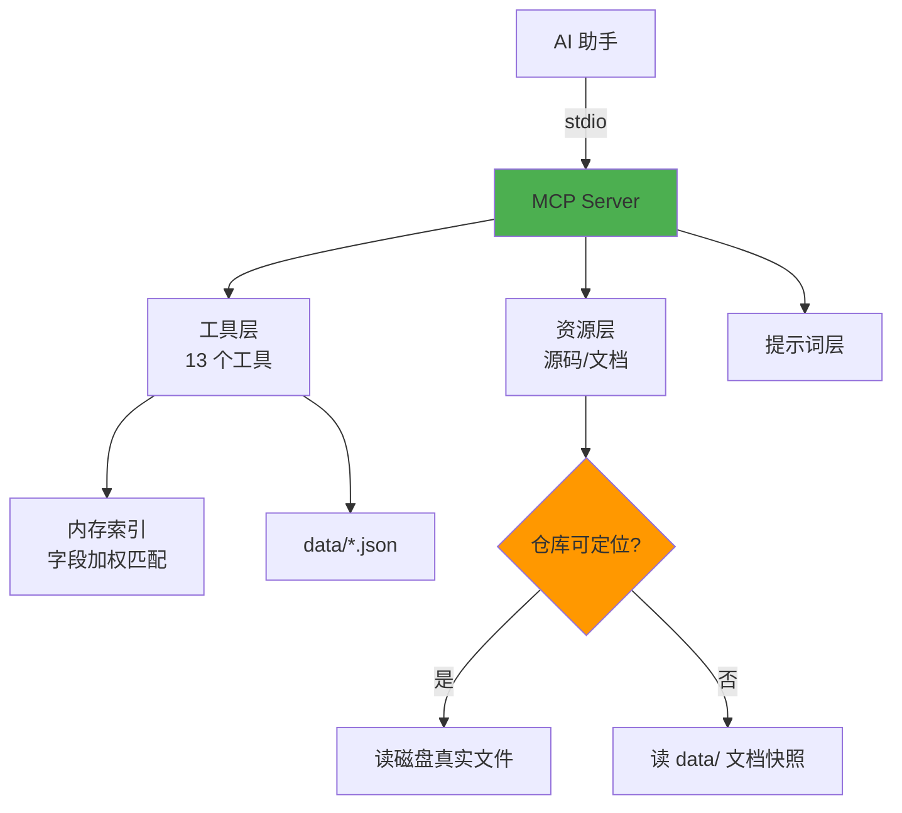

# @aix/mcp-server

<p align="center">
  
  
  
</p>

基于 [Model Context Protocol (MCP)](https://github.com/modelcontextprotocol) 的 AIX 组件库上下文服务，
把组件的 Props / Emits / Slots、示例、依赖、变更日志和图标提供给 AI 助手。

---

## 目录

- [特性](#特性)
- [快速开始](#快速开始)
- [AI 集成配置](#ai-集成配置)
- [MCP 工具集](#mcp-工具集)
- [MCP 资源](#mcp-资源)
- [架构设计](#架构设计)
- [数据文件](#数据文件)
- [CLI 命令](#cli-命令)
- [开发指南](#开发指南)
- [故障排除](#故障排除)
- [常见问题](#常见问题)

---

## 特性

- 📖 **从 README 提取 API**：按列名解析 markdown 表格，容忍多种列序，产出 Props / Emits / Slots
- 🔍 **中英文搜索**：组件按字段加权匹配；图标内置中文别名表，"用户""设置"等查询可直接命中
- 📦 **组件 + 工具包双索引**：同时覆盖 `packages/` 的组件和 `kit/` `internal/` 的工具包
- 🪶 **响应体裁剪**：列表和搜索只返回摘要，详情按需获取，避免一次调用灌爆上下文
- 📸 **文档快照**：README / CHANGELOG 随包发布，脱离仓库（npx 安装）也能查文档
- 🏥 **可用性自检**：`health` 命令实际校验索引文件是否可读、是否过期

## 快速开始

```bash
# 1. 安装依赖（仓库根目录）
pnpm install

# 2. 构建并提取数据（build 脚本内含 extract）
cd internal/mcp-server
pnpm build

# 3. 健康检查
node dist/cli.js health

# 4. 启动服务（stdio）
node dist/cli.js serve
```

## AI 集成配置

### 仓库内使用（推荐）

仓库根目录的 `.mcp.json` 已配置好，Claude Code / Cursor 打开仓库即可用。
手动配置时指向构建产物：

```json
{
  "mcpServers": {
    "aix": {
      "command": "node",
      "args": ["/path/to/aix/internal/mcp-server/dist/cli.js", "serve"]
    }
  }
}
```

### 独立安装

```json
{
  "mcpServers": {
    "aix": {
      "command": "npx",
      "args": ["@aix/mcp-server", "serve"]
    }
  }
}
```

包里自带 `data/` 数据快照，开箱即用。

### 两种运行模式的能力差异

服务启动时会向上查找 `pnpm-workspace.yaml` 定位组件库仓库（并用组件路径做校验，
避免误命中使用方自己的 workspace）：

| 能力 | 仓库内运行 | 独立安装（npx） |
|------|-----------|----------------|
| 组件 / 工具包查询、搜索、图标 | ✅ | ✅ |
| README、CHANGELOG | ✅ 读仓库最新文件 | ✅ 读 `data/` 内的快照 |
| 源码、Story 资源 | ✅ | ❌ 不登记（包里没有源码，登记了也读不到） |

### 环境变量

| 变量 | 说明 | 默认值 |
|------|------|--------|
| `MCP_REPO_ROOT` | 组件库仓库根目录，绕过自动探测 | 自动探测 |
| `MCP_DATA_DIR` | 数据目录 | 包内 `data/` |
| `MCP_PACKAGES_DIR` | 组件包目录（仅 extract 用） | `<repo>/packages` |
| `MCP_VERBOSE` | 设为 `true` 输出详细日志 | `false` |

优先级：CLI 参数 > 环境变量 > 默认值。日志统一走 stderr，不干扰 stdio 协议。

## MCP 工具集

### 组件查询（8 个）

| 工具 | 说明 |
|------|------|
| `list-components` | 列出组件摘要，可按 `category` / `tag` 过滤 |
| `get-component-info` | 组件完整信息（含 Props / Emits / Slots / 示例） |
| `get-component-props` | 只取 API 定义：Props、Emits、Slots |
| `get-component-examples` | 使用示例，可按 `language` 过滤 |
| `get-component-dependencies` | dependencies / peerDependencies |
| `get-component-changelog` | 变更日志，可按 `version` 过滤 |
| `get-categories-and-tags` | 全部分类和标签 |
| `search-components` | 按关键词搜索，返回摘要 + 匹配字段 + 分数 |

### 工具包查询（3 个）

| 工具 | 说明 |
|------|------|
| `list-packages` | 列出 `kit/` 和 `internal/` 下的工具包，可按 `category` / `scope` 过滤 |
| `get-package-info` | 工具包详情。默认只返回 API 章节目录，传 `section` 展开正文 |
| `search-packages` | 按名称、描述、标签、特性搜索 |

### 图标（2 个）

| 工具 | 说明 |
|------|------|
| `search-icons` | 中英文关键词搜索，返回可直接使用的 `importStatement` |
| `get-icon-svg` | 取图标 SVG 源码，用于不装 `@aix/icons` 直接内联的场景 |

### 响应体约定

列表和搜索类工具**只返回摘要**（带 `propsCount` / `emitsCount` / `slotsCount` 等计数），
详情由 `get-component-info` / `get-component-props` 按需获取。
`get-package-info` 的 API 文档正文同理，默认只给目录。

这不是可有可无的优化：不裁剪时 `list-components` 单次返回 120KB+ JSON，
一次调用就会占掉大量上下文。

## MCP 资源

| URI 模式 | 内容 |
|----------|------|
| `component-source://<包名>/<相对 src 的路径>` | 组件源码文件 |
| `component-readme://<包名>/README.md` | 组件说明文档 |
| `component-story://<包名>/<文件名>` | Storybook Story |
| `component-changelog://<包名>/CHANGELOG.md` | 变更日志 |

源码 URI 用包内相对路径而非文件名——一个包里往往有多个 `index.ts`，
用文件名会导致 URI 冲突、部分文件永远读不到。

## 架构设计


```mermaid
graph TB
    A[AI 助手] -->|stdio| B[MCP Server]
    B --> C[工具层<br/>13 个工具]
    B --> D[资源层<br/>源码/文档]
    B --> E[提示词层]

    C --> F[内存索引<br/>字段加权匹配]
    C --> G[data/*.json]
    D --> H{仓库可定位?}
    H -->|是| I[读磁盘真实文件]
    H -->|否| J[读 data/ 文档快照]

    style B fill:#4CAF50
    style H fill:#FF9800
```

分两个阶段：

**提取阶段（`extract`）** — 离线跑，产出 `data/` 下的 JSON 快照

```
遍历 packages/ 与 kit/ internal/
    ↓
读 package.json（版本、依赖、作者）
    ↓
解析 README.md
    ├─ 扫描全文所有 markdown 表格
    ├─ 按列名识别 Props / Emits / Slots 表
    ├─ 记录每张表所属章节（区分同一包内的多个子组件）
    └─ 抽取代码示例、特性列表
    ↓
图标包单独处理（解析导出、抽 SVG、生成中英文关键词）
    ↓
路径相对化 + 文档正文抽到 docs-index.json
    ↓
落盘 data/*.json
```

**服务阶段（`serve`）** — 加载 JSON 到内存，按 MCP 协议应答

```
校验配置（错误中止，警告提示）
    ↓
读取 components-index.json / packages-index.json
    ↓
定位仓库根，决定源码类资源是否登记
    ↓
构建工具实例与内存搜索索引
    ↓
stdio 监听：tools / resources / prompts
```

搜索是**字段加权的关键词匹配**（名称 100、子组件名 80、包名 80、描述 60、分类 40、标签 30、props 20，
前缀匹配打五折），不是倒排索引或 TF-IDF——组件数量在百级，简单匹配足够且更好维护。

工具、提示词走 SDK 的高阶 `McpServer`：入参用 zod 声明，协议层自动校验并生成
JSON Schema，业务错误以 `isError` 返回而不是抛异常。资源是按组件动态生成的
（几百条 URI），不适合套 `ResourceTemplate`，继续用底层 list/read 处理器。

## 数据文件

`extract` 产出，随 npm 包一起发布：

| 文件 | 内容 | 谁在读 |
|------|------|--------|
| `components-index.json` | 组件结构化数据（不含文档正文） | 服务启动时全量加载 |
| `packages-index.json` | 工具包结构化数据 | 服务启动时全量加载 |
| `icons-index.json` | 图标检索索引 | `search-icons` 懒加载 |
| `icons-svg.json` | 图标 SVG 源码（已清洗成标准 SVG） | `get-icon-svg` 懒加载 |
| `docs-index.json` | README / CHANGELOG 正文快照 | 文档类工具和资源懒加载 |
| `metadata.json` | 提取时间、数量统计 | `health` 判断数据时效 |

体积大的内容一律拆出去按需加载，理由都一样：主索引会被完整读进内存，
且 `get-component-info` 直接返回整个对象——文档正文或 SVG 留在里面，
等于每次查询都多吐几十 KB。

## CLI 命令

| 命令 | 说明 | 常用选项 |
|------|------|---------|
| `serve` | 启动 MCP Server（stdio） | `-d <dir>` 数据目录 |
| `extract` | 提取组件库数据 | `-p <dir>` 组件包目录、`-k <dir>` kit 目录、`-i <dir>` internal 目录、`-v` 详细输出、`--incremental` 增量 |
| `validate` | 校验索引数据必填字段 | `-d <dir>` |
| `stats` | 输出组件、分类、Props、示例统计 | `-d <dir>` |
| `health` | 检查索引文件可读性与时效 | `-d <dir>` |
| `sync-version` | 从 package.json 同步组件版本号 | `-d <dir>`、`-p <dir>` |

`health` 退出码：0 健康、1 有失败项、2 有警告项，可直接用于 CI。

## 开发指南

```bash
pnpm dev            # tsx 直跑 src/cli.ts
pnpm build          # 构建 + 重新提取数据
pnpm test           # 单元测试 + CLI 集成测试
pnpm lint           # ESLint
pnpm type-check     # tsc --noEmit
```

### 目录结构

```text
src/
├── cli.ts                    # 命令行入口
├── index.ts                  # 库入口
├── config/                   # 服务配置（默认值、环境变量、校验）
├── constants/
│   ├── library.ts            # 组件库标识（名称、scope、版本）
│   └── project.ts            # 通用常量（MIME、忽略模式、工具名）
├── extractors/
│   ├── component-extractor.ts    # 组件包提取编排
│   ├── readme-extractor.ts       # README 表格与示例解析
│   ├── icons-extractor.ts        # 图标包提取
│   └── tool-package-extractor.ts # kit/ internal/ 工具包提取
├── parsers/                  # markdown / stories / JSDoc 解析
├── mcp-tools/                # 13 个工具 + 基类和入参归一
├── mcp-resources/            # 资源列举与读取
├── prompts/                  # 系统提示词
├── server/                   # MCP 协议实现
├── types/                    # 类型定义
└── utils/
    ├── data-manager.ts       # 数据落盘
    ├── logger.ts             # 日志（统一 stderr）
    ├── monitoring.ts         # 请求统计与健康检查
    ├── performance.ts        # 并发控制
    ├── repo-root.ts          # 仓库根定位与路径相对化
    ├── search-index.ts       # 内存搜索
    ├── search-scoring.ts     # 图标评分
    └── validation.ts         # 配置与数据校验
```

### 新增一个 MCP 工具

1. 在 `mcp-tools/` 下继承 `BaseTool`，实现 `name` / `description` / `inputSchema`（zod shape）/ `execute`
2. 入参再用 `requireString` / `clampLimit` 兜一层——协议层已由 zod 校验，
   但 `execute` 也会被直接调用（测试、内部复用），这层保证两条路径行为一致
3. 在 `constants/project.ts` 的 `MCP_TOOLS` 注册工具名
4. 在 `mcp-tools/index.ts` 的 `createTools` 中实例化
5. 返回值注意体积——列表类一律返回摘要

## 故障排除

**服务启动了但查不到组件**

```bash
node dist/cli.js health     # 先看索引是否可读
node dist/cli.js extract --packages=../../packages
```

**某个组件的 Props 是空的**

Props 来自 README 的 markdown 表格，需要满足：首列是属性名（`属性名` / `属性` / `参数` / `配置` / `选项` 等），
且至少有「类型」「默认值」「可选值」之一。缺类型列的纯说明表会被有意跳过，避免噪声。

**`component-source://` 资源读不到**

独立安装（npx）时源码类资源不会登记。需要源码请指定 `MCP_REPO_ROOT` 指向本地仓库。

**改了组件文档但 AI 拿到的还是旧的**

数据是 `extract` 时的快照，改完文档要重跑 `extract`；仓库内运行时 README / CHANGELOG 会直读磁盘最新内容。

## 常见问题

**Q: 支持哪些 AI 工具？**

任何支持 MCP 协议的客户端：Claude Code、Claude Desktop、Cursor、Windsurf 等。

**Q: 数据多久更新一次？**

不自动更新。`pnpm build` 会重跑 `extract`，发布时的数据即快照内容。`health` 会在数据超过 30 天时告警。

**Q: 一个包里有多个组件怎么办？**

一个包仍然产出一条 `ComponentInfo`，但会识别出包内的子组件名放进 `subComponents`
（如 `@aix/popper` → Popper / Tooltip / Popover / Dropdown / DropdownItem）：

- 搜 `tooltip` 能命中 `@aix/popper`
- `get-component-info Tooltip` 能直接寻址到所属包
- 每条 Prop / Emit / Slot 带 `group` 标注它属于哪个子组件

之所以不拆成独立的顶层组件：README 章节标题只有一部分是真组件名，
其余是 API 种类（`Props`）、函数名（`createLocale`）或说明性标题（`音频来源契约`），
照单拆分会造出一批不存在的"组件"。识别判据是「剥掉 Props/Events/Slots 后是 PascalCase 标识符」。

**Q: 图标的中文搜索覆盖到什么程度？**

内置英文词到中文的别名表覆盖常规图标词汇。本图标集里还有相当数量的拼音全称命名
（如 `BaoKongRenYuanJianKong`），这类只能用拼音或英文检索。

**Q: 为什么没有缓存？**

服务在启动时一次性把索引读进内存，进程生命周期内不再读盘，加缓存层不产生任何命中。

## 致谢

- [Model Context Protocol](https://github.com/modelcontextprotocol) - Anthropic 的开源协议
- [Commander.js](https://github.com/tj/commander.js) - CLI 框架
- [gray-matter](https://github.com/jonschlinkert/gray-matter) - Front matter 解析
- [Chalk](https://github.com/chalk/chalk) - 终端彩色输出
